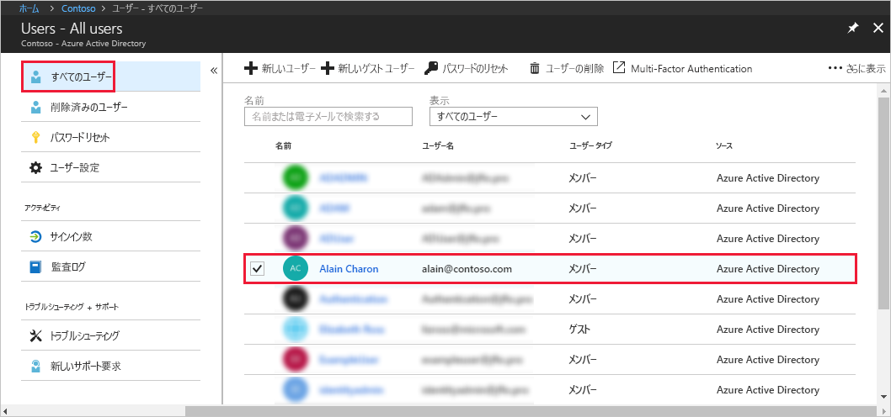
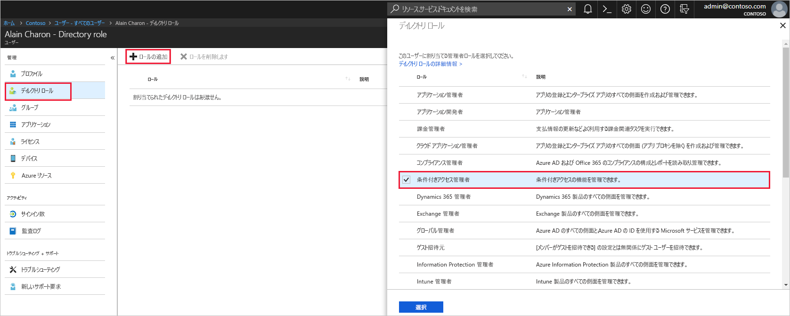

# Azure Active Directory でユーザーを管理者ロールに割り当てる
この記事では、Azure Active Directory (Azure AD) でユーザーに管理者ロールを割り当てる方法について説明します。 組織内の新しいユーザーの追加については、[Azure Active Directory への新しいユーザーの追加](../add-users-azure-active-directory.md)に関する記事をご覧ください。 既定では、追加されたユーザーに管理者のアクセス許可はありませんが、ロールはいつでも割り当てることができます。

## ユーザーにロールを割り当てる
1. ディレクトリの全体管理者または特権ロール管理者であるアカウントで [Azure portal](https://portal.azure.com) にサインインします。

2. **[Azure Active Directory]** を選択し、**[ユーザー]** を選択して、一覧から特定のユーザーを選択します。

    

3. 選択したユーザーに対して、**[ディレクトリ ロール]**、**[ロールの追加]** の順に選択し、**[ディレクトリ ロール]** の一覧から適切な管理者ロール (**[条件付きアクセス管理者]** など) を選択します。 管理ロールの詳細については、[Azure AD での管理者ロールの割り当て](../users-groups-roles/directory-assign-admin-roles.md)に関するページを参照してください。 

    

1. **[選択]** を押して保存します。

## 次の手順
* [クイックスタート : Azure Active Directory でのユーザーの追加または削除](add-users-azure-active-directory.md)
* [ユーザー プロファイルの管理](active-directory-users-profile-azure-portal.md)
* [別のディレクトリからのゲスト ユーザーの追加](../b2b/what-is-b2b.md) 
* [Azure AD でのロールへのユーザーの割り当て](active-directory-users-assign-role-azure-portal.md)
* [削除済みユーザーの復元](active-directory-users-restore.md)
