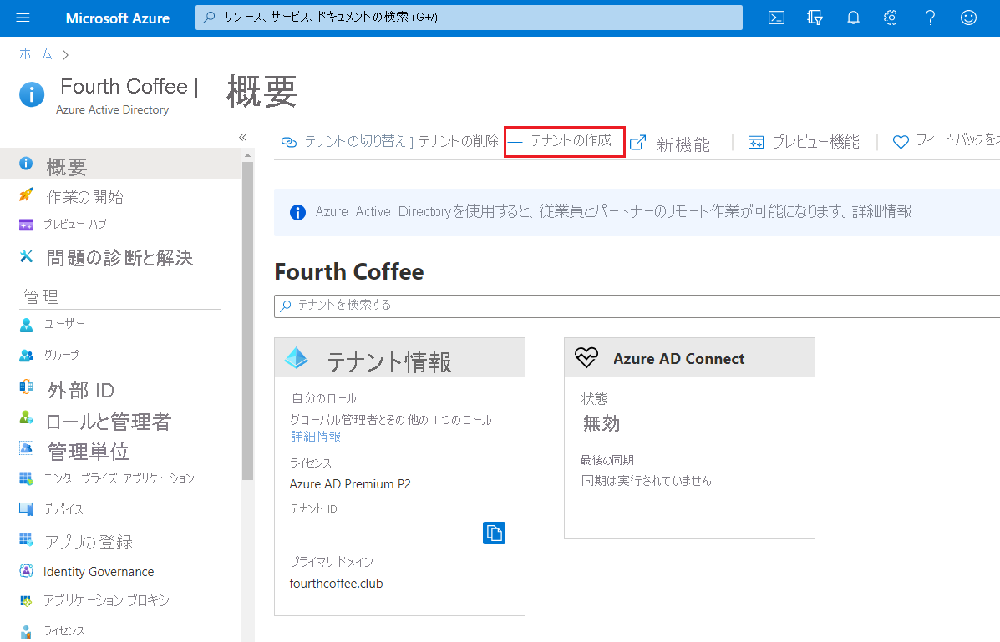

# Azure Active Directory ポータルを使用してカスタム ドメイン名を追加する
新しい Azure AD テナントにはすべて、*domainname*.onmicrosoft.com という初期ドメイン名が付いてきます。 初期ドメイン名を変更または削除することはできませんが、一覧に実際の組織の名前を追加することができます。 カスタム ドメイン名を追加すると、*alain\@contoso.com* など、ユーザーになじみのあるユーザー名を作成するのに役立ちます。

## 開始する前に
カスタム ドメイン名を追加する前に、ドメイン レジストラーでドメイン名を作成する必要があります。 認定ドメイン レジストラーについては、[ICANN 認定レジストラー](https://www.icann.org/registrar-reports/accredited-list.html)に関するページを参照してください。

## Azure AD ディレクトリを作成する
ドメイン名を取得したら、最初の Azure AD ディレクトリを作成できます。

1. サブスクリプションの**所有者**ロールを持つアカウントを使用して、お使いのディレクトリの [Azure portal](https://portal.azure.com/) にサインインし、 **[Azure Active Directory]** を選択します。 サブスクリプション ロールの詳細については、「[従来のサブスクリプション管理者ロール、Azure RBAC ロール、および Azure AD 管理者ロール](../../role-based-access-control/rbac-and-directory-admin-roles.md#azure-rbac-roles)」を参照してください。

    

    >[!TIP]
    > オンプレミスの Windows Server AD を Azure AD とフェデレーションする予定の場合は、ディレクトリを同期するために Azure AD Connect ツールを実行する際に **[このドメインを構成して、ローカル Active Directory にシングル サインオンします]** チェックボックスをオンにする必要があります。 また、ウィザードの **[Azure AD ドメイン]** の手順で、オンプレミスのディレクトリとフェデレーションするために選択したのと同じドメイン名を登録する必要があります。 ウィザードの手順の表示内容は [こちらの手順](../hybrid/how-to-connect-install-custom.md#verify-the-azure-ad-domain-selected-for-federation)で確認できます。 Azure AD Connect ツールをお持ちでない場合は、 [こちらからダウンロード](https://go.microsoft.com/fwlink/?LinkId=615771)できます。

2. [組織の新しいテナントを作成する](active-directory-access-create-new-tenant.md#create-a-new-tenant-for-your-organization)ことに関するページの手順に従って、新しいディレクトリを作成します。

    >[!Important]
    >テナントを作成する人が、自動的にそのテナントの全体管理者となります。 全体管理者は、テナントに他の管理者を追加できます。

## Azure AD にカスタム ドメイン名を追加する
ディレクトリを作成したら、カスタム ドメイン名を追加できます。

1. **[カスタム ドメイン名]** を選択し、 **[カスタム ドメインの追加]** を選択します。

    ![[カスタム ドメイン名] ページ。[カスタム ドメインの追加] が表示されている](media/add-custom-domain/add-custom-domain.png)

2. 組織の新しいドメイン名を **[カスタム ドメイン名]** ボックスに入力し (例: _contoso.com_)、 **[ドメインの追加]** を選択します。

    未検証のドメインが追加されて、DNS 情報を示す **[Contoso]** ページが表示されます。

    >[!Important]
    >これが正しく機能するためには、.com や .net などのトップ レベルの拡張子を含める必要があります。

    ![[カスタム ドメイン名] ページとカスタム ドメインの追加ページ](media/add-custom-domain/add-custom-domain-blade.png)

4. **[Contoso]** ページから DNS 情報をコピーします。 たとえば、MS=ms64983159 です。

    ![DNS エントリ情報を含む [Contoso] ページ](media/add-custom-domain/contoso-blade-with-dns-info.png)

## ドメイン レジストラーに DNS 情報を追加する
Azure AD にカスタム ドメイン名を追加したら、ドメイン レジストラーに戻り、コピーした TXT ファイルから Azure AD の DNS 情報を追加する必要があります。 ドメインのこの TXT レコードを作成することで、ドメイン名の所有権を "検証" します。

-  ドメイン レジストラーに戻り、コピーした DNS 情報に基づいてドメインの新しい TXT レコードを作成します。**TTL** (Time to Live) を 3600 秒 (60 分) に設定してから、情報を保存します。

    >[!Important]
    >必要な数のドメイン名を登録できます。 ただし、各ドメインは Azure AD から独自の TXT レコードを取得します。 ドメイン レジストラーで TXT ファイルの情報を入力するときには注意してください。 誤っていたり、重複していたりする情報を誤って入力すると、TTL のタイムアウト (60 分) まで待機してから再試行する必要があります。

## カスタム ドメイン名を検証する
カスタム ドメイン名を登録したら、Azure AD でその名前が有効であることを確認する必要があります。 ドメイン レジストラーから Azure AD への伝達は、即座に行われることも最大で数日かかることもあり、ドメイン レジストラーによって異なります。

### カスタム ドメイン名を検証するには
1. ディレクトリの全体管理者アカウントを使用して、[Azure portal](https://portal.azure.com/) にサインインします。

2. **[Azure Active Directory]** を選択し、 **[カスタム ドメイン名]** を選択します。

3. **[Fabrikam - カスタム ドメイン名]** ページで、カスタム ドメイン名の **[Contoso]** を選択します。

    ![[Fabrikam - カスタム ドメイン名] ページで [Contoso] が強調表示されている](media/add-custom-domain/custom-blade-with-contoso-highlighted.png)

4. **[Contoso]** ページで **[確認]** を選択し、カスタム ドメインが正しく登録されていて、Azure AD で有効であることを確認します。

    ![DNS エントリ情報と [確認] ボタンが表示された [Contoso] ページ](media/add-custom-domain/contoso-blade-with-dns-info-verify.png)

カスタム ドメイン名の検証後、検証の TXT または MX ファイルを削除できます。

## 検証のよくある問題
- Azure AD でカスタム ドメイン名を検証できない場合は、次の推奨事項を試してください。
  - **少なくとも 1 時間待機してから、もう一度試します**。 Azure AD がドメインを検証する前に DNS レコードが伝達されている必要があり、このプロセスは 1 時間以上かかる場合があります。

  - **DNS レコードが正しいことを確認します。** ドメイン名レジストラーのサイトに戻り、エントリがあること、およびそれが Azure AD によって提供される DNS エントリ情報と一致していることを確認します。

    レジストラー サイトでレコードを更新できない場合は、適切なアクセス許可を持つ誰かとエントリを共有し、エントリを追加してそれが正確であることを検証する必要があります。

- **そのドメイン名が、別のディレクトリで既に使用中でないことを確認します。** ドメイン名は、1 つのディレクトリでのみ検証できます。これは、ドメイン名が現在別のディレクトリで検証中である場合は、新しいディレクトリでは検証できないことも意味します。 この重複の問題を解決するには、古いディレクトリからそのドメイン名を削除する必要があります。 ドメイン名の削除に関する詳細については、[カスタム ドメイン名の管理](../users-groups-roles/domains-manage.md)に関するページを参照してください。

- **管理されていない Power BI テナントがないことを確認します。** ユーザーがセルフサービス サインアップから Power BI をアクティブ化し、組織に対して管理されていないテナントを作成した場合、PowerShell を使用して、内部管理者または外部管理者として管理を引き継ぐ必要があります。 非管理対象ディレクトリを引き継ぐ方法の詳細については、「[Azure Active Directory の非管理対象ディレクトリを管理者として引き継ぐ](../users-groups-roles/domains-admin-takeover.md)」を参照してください。

## 次の手順

- ディレクトリに別の全体管理者を追加します。 詳細については、[ロールと管理者を割り当てる方法](active-directory-users-assign-role-azure-portal.md)に関するページを参照してください。

- ドメインにユーザーを追加します。[ユーザーを追加または削除する方法](add-users-azure-active-directory.md)に関するページを参照してください。

- Azure AD でドメイン名の情報を管理します。 詳細については、[カスタム ドメイン名の管理](../users-groups-roles/domains-manage.md)に関するページを参照してください。

- Azure Active Directory と共に使用するつもりのオンプレミス バージョンの Windows Server がある場合は、「[オンプレミスのディレクトリと Azure Active Directory の統合](../connect/active-directory-aadconnect.md)」を参照してください。
