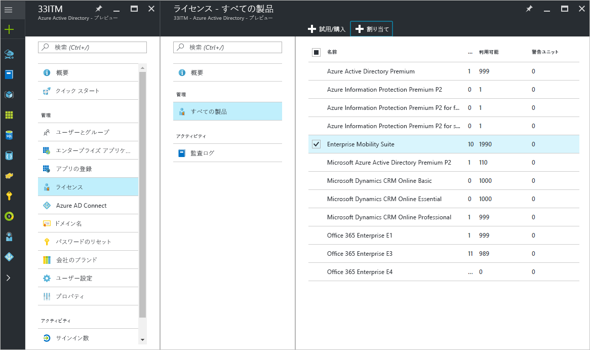
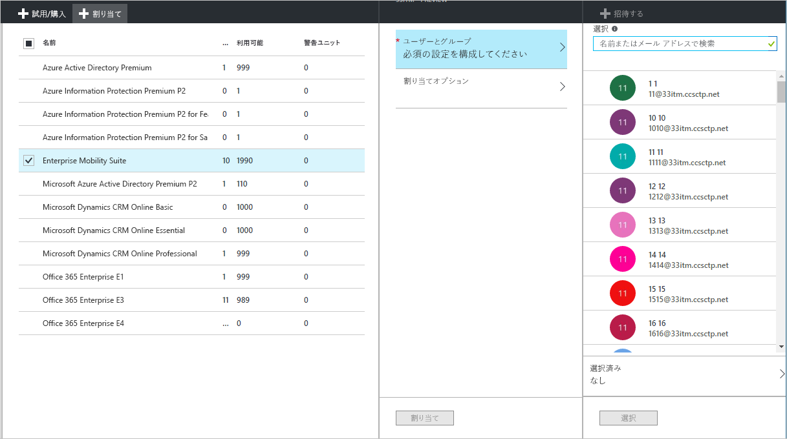
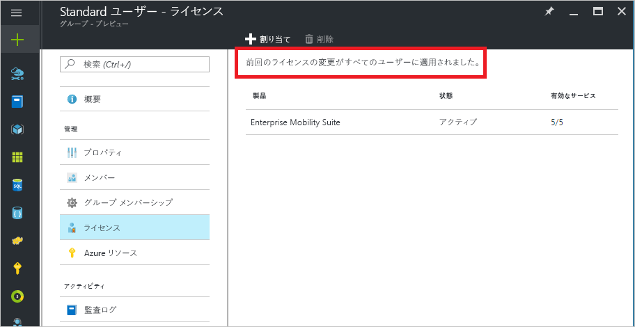
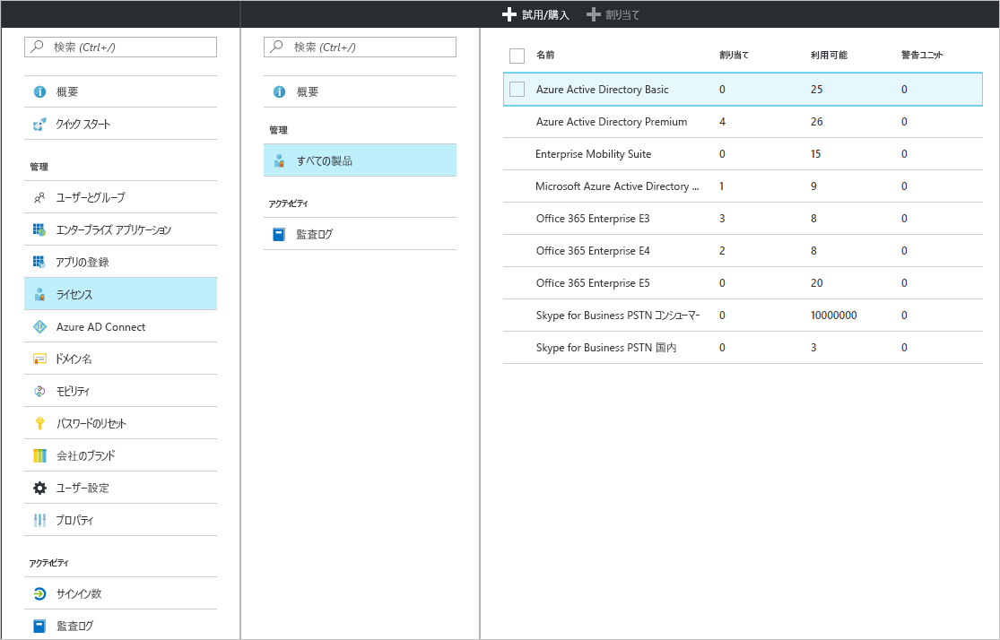
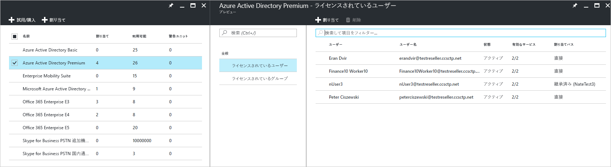
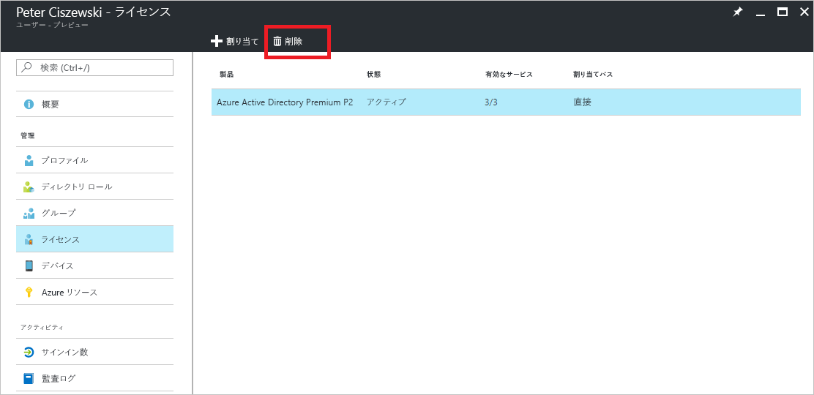

# クイックスタート: Azure Active Directory におけるライセンス ユーザー
ライセンス ベースの Azure AD サービスは、Azure テナントの Azure Active Directory (Azure AD) サブスクリプションをアクティブにすることで有効になります。 サブスクリプションがアクティブになると、サービスの機能は Azure AD 管理者が管理し、ライセンスを付与されたユーザーが使用できるようになります。 Enterprise Mobility + Security、Azure AD Premium、Azure AD Basic を購入すると、有効期間や前払いライセンスを含め、サブスクリプションでテナントが更新されます。 割り当てられているライセンスの数や使用可能なライセンスの数などのサブスクリプション情報は、Azure Portal で **Azure Active Directory** の **[ライセンス]** タイルを開いて確認できます。 **[ライセンス]** ブレードは、ライセンスの割り当ての管理にも最適です。

有料機能を構成するうえで必要なことはサブスクリプションの入手だけですが、さらにユーザーに有料 Azure AD の有料機能のライセンスを割り当てる必要があります。 Azure AD の有料機能へのアクセスが必要なユーザーや Azure AD の有料機能で管理されているユーザーには、ライセンスを割り当てる必要があります。 ライセンスの割り当てとは、ユーザーと、Azure AD Premium、Basic、Enterprise Mobility + Security などの購入済みのサービスとのマッピングです。

[グループベースのライセンス割り当て](active-directory-licensing-whatis-azure-portal.md)を使用して、次のような規則を設定することができます。
* ディレクトリ内のすべてのユーザーが自動的にライセンスを取得する
* 適切な役職を持つすべてのユーザーがライセンスを取得する
* 組織内の他の管理者に決定を委任することができる ([セルフサービス グループ](../users-groups-roles/groups-self-service-management.md)を使用)

> [!TIP]
> 高度なシナリオや Office 365 ライセンスのシナリオを含め、グループにライセンスを割り当てる方法の詳細については、「[Azure Active Directory でのユーザーのグループへのライセンスの割り当て](../users-groups-roles/licensing-groups-assign.md)」を参照してください。

## ユーザーとグループにライセンスを割り当てる
アクティブなサブスクリプションを使用して、最初に自分自身にライセンスを割り当て、ご使用のブラウザーを最新の情報に更新して、サブスクリプションに含まれている必要な機能がすべて表示されることを確認する必要があります。 次の手順では、Azure AD の有料機能へのアクセスが必要なユーザーにライセンスを割り当てます。 ライセンスを割り当てる簡単な方法は、個人ではなくユーザーのグループに割り当てることです。 ライセンスをグループに割り当てると、グループ メンバー全員にライセンスが割り当てられます。 グループに追加されたユーザーには該当するライセンスが自動的に割り当てられ、グループから削除されたユーザーからは該当するライセンスが自動的に削除されます。 

> [!NOTE]
> Microsoft サービスの中には、すべての場所では利用できないものもあります。 ライセンスをユーザーに割り当てる前に、管理者はユーザーの **[利用場所]** プロパティを指定しておく必要があります。 このプロパティは、Azure Portal の **[ユーザー]** &gt; **[プロファイル]** &gt; **[設定]** で設定できます。 グループ ライセンスの割り当てを使用するとき、利用場所が指定されていないユーザーは、ディレクトリの場所を継承します。

ライセンスを割り当てるには、**Azure Active Directory** &gt; **[ライセンス]** &gt; **[すべての製品]** で、1 つ以上の製品を選択し、コマンド バーの **[割り当て]** を選択します。

**[ユーザーとグループ]** ブレードを使用して、複数のユーザーまたはグループを選択したり、製品内のサービス プランを無効にしたりできます。 上部の検索ボックスを使用して、ユーザーやグループの名前を検索します。

ライセンスをグループに割り当てるとき、グループのサイズによっては、すべてのユーザーがライセンスを継承するまでに少し時間がかかることがあります。 処理の状態は、**[ライセンス]** タイルの下の **[グループ]** ブレードで確認できます。

Azure AD および Enterprise Mobility + Security 製品を管理しているとき、Azure AD ライセンスの割り当て中に割り当てエラーが発生する可能性がありますが、発生するのは比較的まれです。 割り当てで発生する可能性があるエラーは次の内容に限定されます。
- 割り当て競合: ユーザーが、現在のライセンスと互換性のないライセンスに以前から割り当てられている状況です。 この場合は、新しいライセンスを割り当てるために現在のライセンスを削除する必要があります。
- "利用可能なライセンス数の上限を超えました" は、割り当てられているグループ内のユーザーの数が利用可能なライセンスを超えたときに、ライセンスの不足のため、ユーザーの割り当ての状態に割り当ての失敗が反映されます。

### Azure AD B2B コラボレーションのライセンス

B2B コラボレーションでは、Azure AD テナントにゲスト ユーザーを招待して、Azure AD サービスおよび利用可能な Azure リソースへのアクセスを提供することができます。  

B2B ユーザーを招待し、Azure AD でアプリケーションに割り当てる際に料金は発生しません。 また、ゲスト ユーザーあたり最大 10 個のアプリと、3 つの基本レポートが、B2B コラボレーション ユーザーに対して無料となります。 パートナーの Azure AD テナントでゲスト ユーザーに適切なライセンスが割り当てられている場合は、ご使用のテナントでもライセンスが適用されます。

必須ではありませんが、Azure AD の有料機能へのアクセスを提供する場合は、それらの B2B ゲスト ユーザーは適切な Azure AD ライセンスを持っている必要があります。 Azure AD の有料ライセンスを持つ招待元のテナントは、そのテナントに招待された追加の 5 人のゲスト ユーザーに B2B コラボレーション ユーザーの権利を割り当てることができます。 シナリオおよび情報については、[B2B コラボレーションのライセンスに関するガイダンス](../b2b/licensing-guidance.md)を参照してください。

## 割り当てられたライセンスを表示する

割り当て済みライセンスと割り当て可能なライセンスの概要ビューが、**[Azure Active Directory]** &gt; **[ライセンス]** &gt; **[すべての製品]** に表示されます。

特定の製品を選択すると、割り当てられたユーザーとグループの詳しい一覧を表示できます。 **[ライセンスされているユーザー]** 一覧に、現在ライセンスを使用しているすべてのユーザーと、ライセンスがユーザーに直接割り当てられたかどうか、またはグループから継承されているかどうかが表示されます。

同様に、**[ライセンスされているグループ]** 一覧には、ライセンスが割り当てられているすべてのグループが表示されます。 ユーザーまたはグループを選択して、**[ライセンス]** ブレードを開くと、そのオブジェクトに割り当てられているすべてのライセンスが表示されます。

## ライセンスを削除する

ライセンスを削除するには、ユーザーまたはグループに移動して、**[ライセンス]** タイルを開きます。 ライセンスを選択し、**[削除]** をクリックします。

ユーザーがグループから継承したライセンスを直接削除することはできません。 代わりに、ライセンスを継承したグループからユーザーを削除します。

## 次の手順
このクイック スタートでは、Azure AD ディレクトリのユーザーとグループにライセンスを割り当てる方法を説明しました。 

次のリンクを使用して、Azure Portal から、Azure AD のサブスクリプション ライセンス割り当てを構成することができます。

> [!div class="nextstepaction"]
> [Azure AD のライセンスを割り当てる](https://aad.portal.azure.com/#blade/Microsoft_AAD_IAM/LicensesMenuBlade/Overview) 