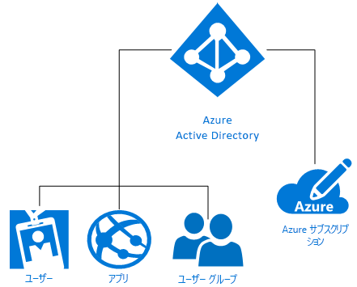

# Azure ID ソリューションについて
Microsoft Azure Active Directory (Azure AD) は、ディレクトリ サービス、ID ガバナンス、アプリケーション アクセス管理を提供する、ID およびアクセス管理クラウド ソリューションです。 Azure AD により、[Azure AD アプリケーション ギャラリー](https://azure.microsoft.com/marketplace/active-directory/all/)にある事前に統合された数千個の商用アプリやカスタム アプリへの[シングル サインオン (SSO)](https://docs.microsoft.com/azure/active-directory/active-directory-enterprise-apps-manage-sso) を簡単に実現できます。 Office 365、Salesforce.com、Box、ServiceNow、Workday など、これらのアプリの多くは既に使用されていると考えられます。

Azure サブスクリプションを作成すると、1 つの Azure AD ディレクトリがそのサブスクリプションに自動的に関連付けられます。 その後、Azure AD が、Azure の ID サービスとして、クラウドベースのリソースのすべての ID 管理機能とアクセス制御機能を提供します。 次の図に示すように、これらのリソースには、個々のテナント (組織) のユーザー、アプリ、グループを含めることができます。

Microsoft Azure には、複雑さのレベルがさまざまな IDaaS (Identity as a Service) を利用して個々の組織のニーズを満たすための方法がいくつか用意されています。 この記事の残りの部分では、Azure ID の基本的な用語と概念、および使用可能なオプションの中から最適なものを選択をするための推奨事項について説明します。

## 知っておくべき用語

組織の Azure ID ソリューションに関する決定を行うには、Azure ID サービスについて説明するときによく使用される用語の基本を理解しておく必要があります。

|知っておくべき用語| 説明|
|-----|-----|
|Azure サブスクリプション |サブスクリプションは、Azure クラウド サービスの支払いに使用され、通常はクレジット カードにリンクされます。 サブスクリプションを複数持つことはできるものの、サブスクリプション間でリソースを共有するのは難しい場合があります。|
|Azure テナント | Azure AD テナントは、1 つの組織を代表するものです。 テナントは、Azure AD の信頼された専用インスタンスであり、組織が Azure、Intune、Office 365 などの Microsoft クラウド サービスのサブスクリプションにサインアップしたときに自動的に作成されます。 テナントは、専用の環境 (シングル テナント) または他の組織との共有環境 (マルチテナント) でサービスにアクセスできます。|
|Azure AD ディレクトリ | それぞれの Azure テナントは、テナントのユーザー、グループ、およびアプリケーションが含まれる、信頼された専用 Azure AD ディレクトリを保持します。 これは、テナント リソースに対する ID およびアクセス管理機能を実行するために使用されます。 Azure、Microsoft Intune、Office 365 などの Microsoft クラウド サービスにサインアップすると、組織を表す一意の Azure AD ディレクトリが自動的にプロビジョニングされます。そのため、"*テナント*"、*Azure AD*、および "*Azure AD ディレクトリ*" の各用語が同じ意味で使用される場合があります。 |
|カスタム ドメイン | Microsoft クラウド サービスのサブスクリプションに最初にサインアップしたときに、テナント (組織) は *.onmicrosoft.com* ドメイン名を使用します。 ただし、ほとんどの組織では、ビジネス用のドメイン名やエンド ユーザーが会社のリソースへのアクセスに使用するドメイン名を 1 つ以上所有しています。 *alice@contoso.onmicrosoft.com* ではなく *alice@contoso.com* のような、ユーザーが見慣れたドメイン名にするために、Azure AD にカスタム ドメイン名を追加できます。 |
|Azure AD アカウント | Azure AD または他の Microsoft クラウド サービス (Office 365 など) を使用して作成される ID です。 このアカウントは Azure AD に保存され、組織のクラウド サービスのすべてのサブスクリプションにアクセスできます。 |
|Azure サブスクリプション管理者| アカウント管理者は、Azure サブスクリプションのサインアップまたは購入を行ったユーザーです。 アカウント管理者は、[アカウント センター](https://account.azure.com/Subscriptions)を使用して、サブスクリプションの作成、サブスクリプションの取り消し、サブスクリプションの課金の変更、サービス管理者の変更などのさまざまな管理タスクを実行できます。 |
|Azure AD 全体管理者 | Azure AD 全体管理者は、すべての Azure AD 管理機能を利用できます。 既定では、Microsoft クラウド サービス サブスクリプションにサインアップしたユーザーが自動的に全体管理者になります。 複数の全体管理者を置くこともできますが、[他の管理者ロール](https://docs.microsoft.com/azure/active-directory/active-directory-assign-admin-roles-azure-portal)をユーザーに割り当てることができるのは全体管理者に限られます。 |
|Microsoft アカウント | Microsoft アカウント (個人用) では、Outlook (Hotmail)、OneDrive、Xbox LIVE、Office 365 など、コンシューマー向け Microsoft 製品とクラウド サービスにアクセスできます。 これらの ID は、Microsoft が運営する Microsoft コンシューマー ID アカウント システムを使用して作成および保存されます。|
|職場または学校アカウント | 職場または学校アカウント (企業または教育機関で使用するために管理者が発行) は、Azure、Intune、Office 365 など、大規模企業向け Microsoft クラウド サービスへのアクセスを提供します。|

## 理解しておくべき概念

Azure ID の基本的な用語を把握したら、十分な情報に基づいて Azure ID サービスに関する決定を行うことができるように、次の Azure ID の概念を理解しておく必要があります。

|理解しておくべき概念 |説明|
|-----|-----|
|[Azure サブスクリプションを Azure Active Directory に関連付ける方法](https://docs.microsoft.com/azure/active-directory/active-directory-how-subscriptions-associated-directory) |すべての Azure サブスクリプションには、Azure AD ディレクトリとの間に、ユーザー、サービス、およびデバイスの認証を行うための信頼関係があります。 *複数のサブスクリプションが同じ Azure AD ディレクトリを信頼することはできますが、1 つのサブスクリプションが信頼できる Azure AD ディレクトリは 1 つに限られます*。 この信頼関係は、サブスクリプションと他の Azure リソース (Web サイト、データベースなど) の間の関係と異なります。後者は、サブスクリプションの子リソースにより近いものです。 サブスクリプションの有効期限が切れた場合、サブスクリプションに関連付けられている Azure AD 以外のリソースへのアクセスも停止します。 ただし、Azure AD ディレクトリは Azure 内に残るため、別のサブスクリプションをそのディレクトリと関連付けて、テナント リソースの管理を継続できます。|
|[Azure AD ライセンスのしくみ](https://docs.microsoft.com/azure/active-directory/active-directory-licensing-get-started-azure-portal) | Enterprise Mobility Suite、Azure AD Premium、Azure AD Basic を購入またはアクティブにすると、有効期間や前払いライセンスを含め、ディレクトリとサブスクリプションが更新されます。 サブスクリプションがアクティブになると、サービスは、Azure AD 全体管理者が管理し、ライセンスを付与されたユーザーが使用できるようになります。 割り当てられているライセンスの数や使用可能なライセンスの数などのサブスクリプション情報は、Azure Portal の **[Azure Active Directory]** > **[ライセンス]** ブレードで確認できます。 この場所は、ライセンスの割り当ての管理にも最適です。|
|[Azure Portal でのロールベースのアクセス制御](https://docs.microsoft.com/azure/role-based-access-control/overview)|Azure のロールベースのアクセス制御 (RBAC) を利用すれば、Azure リソースのアクセス権を詳細に管理できます。 アクセス許可が多すぎると、アカウントが攻撃者による悪用の対象になりかねません。 アクセス許可が少なすぎると、従業員が業務を効率的に遂行できなくなる可能性があります。 RBAC を使用すると、すべてのリソース グループに適用される 3 つの基本的なロール (所有者、共同作成者、閲覧者) に基づいて、必要かつ適切なアクセス許可を従業員に付与することができます。 また、特定のニーズを満たすために、最大 2,000 個の[カスタム RBAC ロール](https://docs.microsoft.com/azure/role-based-access-control/custom-roles)を独自に作成することもできます。 |
|[ハイブリッド ID](https://docs.microsoft.com/azure/active-directory/connect/active-directory-aadconnect)|ハイブリッド ID は、[Azure AD Connect](https://docs.microsoft.com/azure/active-directory/connect/active-directory-aadconnect) を使用してオンプレミスの Windows Server Active Directory (AD DS) と Azure AD を統合することで実現されます。 これにより、Azure AD と統合された Office 365、Azure、オンプレミスのアプリまたは SaaS アプリケーションのユーザーに、共通の ID を提供できます。 ハイブリッド ID を使用すると、オンプレミス環境の ID とアクセスに関する処理をクラウドに効果的に拡張できます。|

### Windows Server AD DS と Azure AD の違い
Azure Active Directory (Azure AD) とオンプレミスの Active Directory (Active Directory Domain Services or AD DS) は、両方ともディレクトリ データを格納し、ユーザーとリソース間の通信を管理するシステムであり、ユーザーのログイン プロセス、認証、およびディレクトリ検索を実行します。

Windows 2000 Server で初めて導入されたオンプレミスの Windows Server Active Directory Domain Services (AD DS) について理解している方であれば、おそらく ID サービスの基本概念を理解していることと思います。 ただし、Azure AD はクラウドの単なるドメイン コントローラーではないことを理解しておくことも重要です。 Azure AD は、Azure でサービスとしての ID (IDaaS) を提供するまったく新しい方法であり、クラウドベースの機能を完全に取り入れて最新の脅威から組織を保護するために、まったく新しい考え方が求められます。 

AD DS は、Windows Server 上のサーバー ロールであり、物理または仮想マシンに展開できます。 X.500 に基づく階層構造になっています。 オブジェクトの検索では DNS を使用し、LDAP を使用して対話でき、認証では主に Kerberos を使用します。 Active Directory では、ドメインにマシンを参加させるだけでなく、組織単位 (OU) とグループ ポリシー オブジェクト (GPO) を使用できます。ドメイン間に信頼関係が作成されます。

IT 部門では、セキュリティ境界を保護するために、長年 AD DS が使用されてきました。しかし、境界を持たない現代の大企業で従業員、顧客、パートナーの ID ニーズをサポートするには、新しいコントロール プレーンが必要です。 Azure AD がその ID コントロール プレーンです。 セキュリティは、企業のファイアウォールからクラウドに移行しました。クラウドでは、(オンプレミス ユーザーかクラウド ユーザーかを問わず) ユーザーに 1 つの共通の ID を提供することで、Azure AD が企業リソースとアクセスを保護します。 これにより、ユーザーは仕事に必要なアプリにほぼすべてのデバイスから安全にアクセスする柔軟性が得られます。 また、IT 部門が会社のデータを保護するために必要となる、機械学習機能と詳細なレポートに基づくシームレスなリスクベースのデータ保護コントロールも提供されます。

Azure AD は、複数の顧客向けのパブリック ディレクトリ サービスであり、クラウド サーバーのテナントと Office 365 などのアプリケーションを Azure AD 内に作成できます。 ユーザーとグループは、OU も GPO もないフラットな構造で作成されます。 認証は、SAML、WS-Federation、OAuth などのプロトコルを通して実行されます。 Azure AD のクエリを実行できますが、LDAP を使用する代わりに、AD Graph API と呼ばれる REST API を使用する必要があります。 これらのすべてが、HTTP と HTTPS 経由で機能します。

### Office 365 の管理およびセキュリティ機能の拡張
Office 365 は既にお使いですか。 Azure AD で Office 365 の組み込み機能を拡張してすべてのリソースをセキュリティで保護することで、デジタル変革を促進できます。これにより、従業員全体の生産性を確保できます。 Office 365 の機能に加え、Azure AD を使用すると、すべてのアプリのシングル サインオンを可能にする 1 つの ID でアプリケーション ポートフォリオ全体を保護できます。 デバイスの状態だけでなく、ユーザーや場所、アプリケーション、リスクにも基づいて、条件付きアクセス機能を拡張することができます。 Multi-Factor Authentication (MFA) 機能を使用すると、必要なときにさらに多くの保護が得られます。 ユーザー権限の管理機能が強化され、オンデマンドのジャストインタイム管理アクセスが提供されます。 パスワードを忘れた場合のリセット、アプリケーションへのアクセス要求、グループの作成と管理など、Azure AD に用意されているセルフサービス機能により、ユーザーの生産性が向上し、ヘルプデスク チケットを作成する機会が少なくなります。

> [!TIP]
> Azure AD ID 管理を Office 365 で使用する方法については、 [こちらの電子書籍を入手](https://info.microsoft.com/Extend-Office-365-security-with-EMS.html)してください。

## Microsoft Azure ID ソリューション

Microsoft Azure には、ユーザーの ID を管理するための方法がいくつか用意されています。その ID が完全にオンプレミスで管理されるか、クラウドでのみ管理されるか、その間のどこかで管理されるかは問いません。 これらのオプションには、Azure の自作 (DIY) AD DS、Azure Active Directory (Azure AD)、ハイブリッド ID、Azure AD Domain Services があります。

### 自作 (DIY) AD DS
クラウドで必要となるフットプリントが小さい企業の場合は、Azure の**自作 (DIY) AD DS** を使用できます。 このオプションは、Azure 上の仮想マシン (VM) としてのデプロイに適した多くの Windows Server AD DS シナリオに対応しています。 たとえば、リモート ネットワークに接続されている遠隔地のデータセンターで実行されているドメイン コントローラーとして Azure VM を作成できます。 そこで VM がリモート ユーザーからの認証要求をサポートすることで、認証のパフォーマンスを高めることができる場合があります。 このオプションは、Azure 上で少数のドメイン コントローラーと単一の仮想ネットワークをホストすることにより、コストのかかるディザスター リカバリー サイトに替わる比較的低コストの方法としても適しています。 最後に、Windows Server AD DS を必要とするものの、オンプレミス ネットワークや社内の Windows Server Active Directory には依存しないアプリケーション (SharePoint など) を Azure にデプロイすることが必要な場合があります。 そのようなケースでは、分離したフォレストを Azure にデプロイすることにより、SharePoint サーバー ファームの要件を満たすことができます。 また、オンプレミス ネットワークとオンプレミス Active Directory への接続を必要とするネットワーク アプリケーションのデプロイもサポートされています。

### Azure Active Directory (Azure AD)
**Azure AD スタンドアロン**は、完全にクラウドベースの IDaaS (Identity and access management as a Service) ソリューションです。 Azure AD は、ユーザーとグループを管理する堅牢な機能のセットを提供します。 オンプレミスとクラウドのアプリケーション (Office 365 のような Microsoft の Web サービスや、さまざまな Microsoft 以外のサービスとしてのソフトウェア (SaaS) アプリケーションなど) への安全なアクセスを支援します。 Azure AD には、Free、Basic、および Premium の 3 つのエディションが用意されています。 Azure AD は、組織の実効性を向上させるほか、セキュリティを、境界ファイアウォールを越えて、Azure 機械学習やその他の高度なセキュリティ機能によって保護された新しいコントロール プレーンに拡張します。

### ハイブリッド ID
先進的な考えを持つ多くの CIO や企業は、会社の長期的な方向性を見越したうえで、オンプレミスかクラウドベースの ID ソリューションかという二者択一ではなく、**ハイブリッド ID** ソリューションを介して自社のオンプレミスのディレクトリをクラウドに拡張しようとしています。 ハイブリッド ID を使用することで、ユーザーが業務を行うために必要なアプリケーションへの安全で生産性の高いアクセスを提供する、真にグローバルな ID およびアクセス管理ソリューションを実現できます。

> [!TIP]
> CIO たちがどのように Azure Active Directory を IT 戦略の中核に据えてきたかについては、[Azure Active Directory の CIO 向けガイド](https://aka.ms/AzureADCIOGuide)をダウンロードしてご確認ください。

### Azure AD Domain Services
**Azure AD Domain Services** は、AD DS を使用して Azure VM 構成の簡便な制御を実現するためのクラウドベースのオプションと、ネットワーク アプリケーションの開発とテストのためのオンプレミスの ID 要件を満たす方法を提供します。 Azure AD Domain Services の目的は、オンプレミスの AD DS インフラストラクチャを Azure AD Domain Services によって管理される Azure VM にリフトアンドシフトすることではありません。 AD DS の認証方法を必要とするオンプレミス アプリケーションの開発、テスト、クラウドへの移行をサポートするために、マネージド ドメイン内の Azure VM を使用する必要があります。

## 一般的なシナリオと推奨事項

以降では、ID とアクセスに関する一般的なシナリオをいくつか取り上げると共に、それぞれのシナリオで最適と思われる Azure ID オプションを紹介します。

|ID のシナリオ| 推奨|
|-----|-----|
|組織でオンプレミスの Windows Server Active Directory に多額の投資を行ってきたものの、ID をクラウドに拡張したいと考えている。| 最も広く使われている Azure ID ソリューションは、[ハイブリッド ID](https://docs.microsoft.com/azure/active-directory/active-directory-hybrid-identity-design-considerations-overview) です。 オンプレミスの AD DS に既に投資している場合は、Azure AD Connect を使用して ID を簡単にクラウドに拡張できます。|
|自社のビジネスはクラウドに基づいており、オンプレミスの ID ソリューションへの投資を行っていない。| オンプレミスへの投資のないクラウドのみのビジネスには、[Azure Active Directory](https://docs.microsoft.com/azure/active-directory/active-directory-whatis) が最適な選択肢です。|
|アプリの開発とテストのためのオンプレミスの ID 要件を満たすために、簡便な Azure VM 構成と制御を必要としている。|Azure VM 構成の簡便な制御を実現するために AD DS を使用する必要がある場合や、従来のディレクトリ対応のオンプレミス アプリケーションを開発したり、クラウドに移行したりする場合は、[Azure AD Domain Services](https://docs.microsoft.com/azure/active-directory-domain-services/active-directory-ds-overview) を選択することをお勧めします。|  
|Azure で少数の仮想マシンをサポートする必要があるが、会社ではまだオンプレミス Active Directory (AD DS) に多額の投資を行っている。|少数の仮想マシンをサポートする必要があり、オンプレミス AD DS への大規模な投資を行っている場合は、[DIY AD DS](https://docs.microsoft.com/azure/active-directory-domain-services/active-directory-ds-comparison#do-it-yourself-diy-ad-deployment-options) を使用して Azure VM を使用します。 |

## 詳細情報を得るには?
Azure AD について理解を深めていただけるよう、豊富なオンライン リソースをご用意しています。 理解を深めるのに適した優れた記事を以下にリストしましたので、ご活用ください。

* [Azure AD Connect によるディレクトリのハイブリッド管理を有効にする](../connect/active-directory-aadconnect.md)
* [多要素認証とは](../authentication/multi-factor-authentication.md)
* [Azure Active Directory による SaaS アプリへのユーザー プロビジョニングとプロビジョニング解除の自動化](../active-directory-saas-app-provisioning.md)
* [任意の場所からのパスワードの管理](../user-help/active-directory-passwords-update-your-own-password.md)
* [Azure Active Directory のアプリケーション アクセスとシングル サインオンとは](../manage-apps/what-is-single-sign-on.md)
* [Azure Active Directory による SaaS アプリへのユーザー プロビジョニングとプロビジョニング解除の自動化](../active-directory-saas-app-provisioning.md)
* [オンプレミス アプリケーションへの安全なリモート アクセスを実現する方法](../manage-apps/application-proxy.md)
* [Azure Active Directory グループによるリソースへのアクセス管理](active-directory-manage-groups.md)
* [Microsoft Azure Active Directory ライセンスとは](active-directory-licensing-whatis-azure-portal.md)
* [自分の組織内で使用される承認されていないクラウド アプリを検出する方法](../manage-apps/cloud-app-discovery.md)

## 次の手順

これで、Azure ID の概念と選べるオプションについて理解できました。次に、以下のリソースを利用して、選択したオプションの実装を開始できます。

[Azure ハイブリッド ID ソリューションの詳細を確認する](https://docs.microsoft.com/azure/active-directory/choose-hybrid-identity-solution)

[Azure の概念実証環境で詳しく学ぶ](https://aka.ms/aad-poc)
