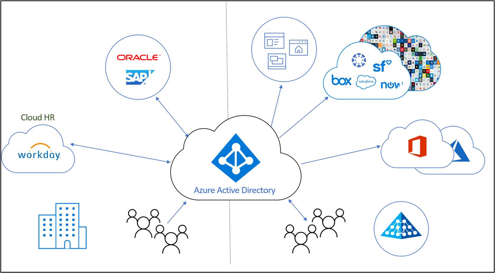

# ID ライフサイクル管理とは

Identity Governance により、組織は、生産性 (従業員が組織に加わったときなどに、必要なリソースへのアクセスできるようになるまでの時間) と セキュリティ (従業員の雇用形態の変更などによって、時間の経過に伴いアクセス権をどのように変更すべきか) とのバランスを取ることができます。

**ID ライフサイクル管理** は Identity Governance の基盤です。効果的なガバナンスを大規模に行うためには、アプリケーションの ID ライフサイクル管理インフラストラクチャの最新化が必要です。 ID ライフサイクル管理が目指すのは、デジタル ID のライフサイクル プロセス全体の自動化と管理です。 

## デジタル ID とは

デジタル ID とは、1 つ以上のコンピューティング リソース (オペレーティング システムやアプリケーション) によって使用されるエンティティについての情報です。 これらのエンティティは、人や組織、アプリケーション、デバイスを表す場合があります。  ID は通常、それに関連付けられている属性 (名前、識別子など) とプロパティ (アクセス管理に使用されるロールなど) によって表現されます。  これらの属性は、だれが何にアクセスできるかや、個々のシステムをだれが使用できるかなどをシステムで判定する際に役立てられます。  

## デジタル ID のライフサイクル管理

デジタル ID の管理は複雑な作業です。デジタルな表現に、対応する実世界の物事 (組織の従業員としての人と組織との関係など) を関連付けるとなればなおさらです。    小規模な組織では、ID を必要とする個人のデジタル表現が手作業によって管理されます。だれかが雇用されたり、契約社員が加わったりすれば、その人たち用のアカウントを IT スペシャリストがディレクトリに作成し、必要なアクセス権を割り当てることができます。  一方、中規模および大規模な組織では、自動化を使用することで、スケーリングの効果を高め、ID を正確に管理することができます。

組織で ID ライフサイクル管理を確立するためのプロセスでは、通常、次のステップに従います。

1. 既存の記録システム (組織で信頼できるとみなされているデータ ソース) があるかどうかを調べます。  たとえば、組織で人事システムとして Workday を利用している場合は、それが、従業員とそのプロパティ (従業員の名前や部署など) の最新リストを確認する際に信頼できるシステムになります。  また、従業員のメール アドレスであれば、Exchange Online などのメール システムが信頼できるシステムと言えるでしょう。

2. それらの記録システムを、アプリケーションによって使用されるディレクトリやデータベース (1 つまたは複数) に結び付けます。また、ディレクトリと記録システムとの間に不整合があれば解決します。 たとえばディレクトリには、不要になった古いデータ (退社した従業員のアカウントなど) が含まれることがあります。 

3. 記録システムが存在しない場合に、どのようなプロセスを使用すれば信頼できる情報を提供できるかを確認します。  たとえば、ビジター以外のデジタル ID は存在するものの、ビジターのためのデータベースが組織内にない場合、代わりとなる手段を見つけて、ビジターのデジタル ID が不要になるタイミングを把握する必要があります。

4. 更新が必要なそれぞれのディレクトリまたはデータベースに対し、記録システムや他のプロセスから変更がレプリケートされるように構成します。

## 従業員や組織と関係がある個人を表現するための ID ライフサイクル管理

従業員や組織と関係がある個人 (契約社員、学生など) のための ID ライフサイクル管理を計画するとき、多くの組織は "入社、異動、退社" のプロセスをモデル化します。  次のとおりです。
    
   - 入社 - アクセス権が必要な領域内に個人が立ち入るとき、それらの用途別に ID が必要となります。まだデジタル ID がなければ新たに作成する必要があります。
   - 異動 - 個人が境界を越えて移動するとき、新たなアクセス承認をデジタル ID に追加したり、そこから削除したりする必要があります。
   - 退社 - アクセス権が必要な領域から個人が離脱するときは、アクセス権を削除する必要があります。その後は、監査やフォレンジクス以外の用途で、その ID が必要となることはありません。

たとえば、ある人物が過去に所属したことのない組織に新しい従業員として入社したとします。その場合、その従業員には、Azure AD 内のユーザー アカウントとして表現された新しいデジタル ID が必要になります。  このアカウントの作成が "入社" プロセスに該当します。これは、新しい従業員の始業日時を指定できる記録システム (Workday など) があれば、自動化することができます。  その後、組織内で、ある従業員が営業からマーケティングに異動することになったとしましょう。これは "異動" プロセスに該当します。  この場合、営業部で割り当てられていたアクセス権が不要になったので削除し、マーケティング部で新たに必要なアクセス権を付与する必要があります。

## ゲストのための ID ライフサイクル管理

同様のプロセスは、ゲストなど他のユーザーにも必要になります。  Azure AD エンタイトルメント管理では、組織のリソースへのアクセス権を必要とする組織外のユーザーと共同作業を行うために必要なライフサイクル管理が、Azure AD 企業間 (B2B) を利用して実現されます。 Azure AD B2B では、外部ユーザーはユーザー自身のホーム ディレクトリで認証を行いますが、こちらのディレクトリにユーザーの表現が存在します。 こちらのディレクトリ内のその表現により、ユーザーにこちらのリソースへのアクセスを割り当てることができます。  組織に属していない個人は、エンタイトルメント管理を通じてアクセス権をリクエストし、必要に応じて自分のデジタル ID を作成することができます。 ユーザーがアクセス権を失ったとき、それらのデジタル ID は自動的に削除されます。  

## Azure AD による ID ライフサイクル管理の自動化

Azure AD では現在これらの機能を提供しています。

* Azure AD と Active Directory では、[人事主導のプロビジョニング](what-is-hr-driven-provisioning.md)を使用して、従業員を表すユーザーを自動的に作成、更新することができます。
* [ディレクトリ間のプロビジョニング](what-is-inter-directory-provisioning.md)を使用することで、Active Directory に既に存在するユーザーを Azure AD に自動的に作成して管理できます。
* [動的グループ](../external-identities/use-dynamic-groups.md#what-are-dynamic-groups)を使用すると、ユーザーをそのプロパティに基づき、自動的にグループに割り当てることができます。また、[エンタイトルメント管理](entitlement-management-scenarios.md)と [Privileged Identity Management](../privileged-identity-management/pim-configure.md) を使用すれば、リクエストに応じて、グループやチーム、Azure AD ロール、Azure リソース ロール、SharePoint Online サイトにユーザーを割り当てることができます。
* [アプリのプロビジョニング](what-is-app-provisioning.md)を使用すると、ユーザーに対する更新を他のアプリケーションに自動で送信することができます。

## 次のステップ 

- [プロビジョニングとは](what-is-provisioning.md)
- [Azure AD のエンタイトルメント管理で外部ユーザーのアクセスを管理する](./entitlement-management-external-users.md)
- [人事主導のプロビジョニングとは](what-is-hr-driven-provisioning.md)
- [アプリのプロビジョニングとは](what-is-app-provisioning.md)
- [ディレクトリ間のプロビジョニングとは](what-is-inter-directory-provisioning.md)