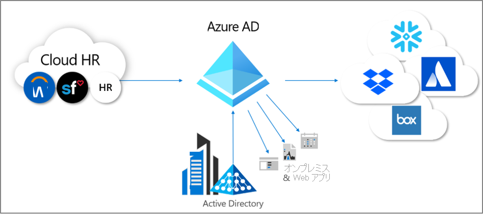
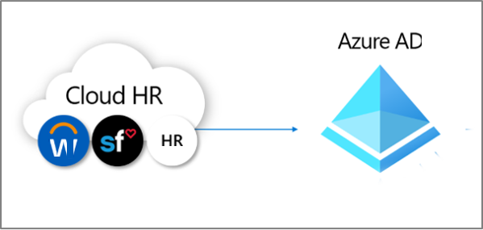
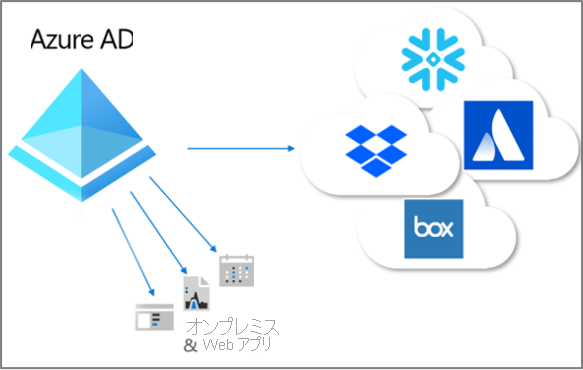

# プロビジョニングとは

プロビジョニングとプロビジョニング解除は、複数のシステム間でデジタル ID の一貫性を確保するプロセスです。  一般に、これらのプロセスは [ID ライフサイクル管理](what-is-identity-lifecycle-management.md)の一環として活用されます。

**プロビジョニング** は、特定の条件に基づいて、対象のシステムに ID を作成するプロセスです。  **プロビジョニング解除** は、条件を満たさなくなった ID を対象のシステムから削除するプロセスです。 **同期** は、ソース オブジェクトとターゲット オブジェクトがほぼ一致するように、プロビジョニングされたオブジェクトを最新の状態に維持するプロセスです。

たとえば、新しい従業員が組織に加わると、その従業員は人事システムに入力されます。  その時点で、人事 **から** Azure Active Directory (Azure AD) **への** プロビジョニングによって、対応するユーザー アカウントが Azure AD に作成されます。 その新しい従業員のアカウントは、Azure AD に対してクエリを実行するアプリケーションで確認できます。  Azure AD を使用しないアプリケーションがある場合、Azure AD **から** それらのアプリケーションのデータベース **に** プロビジョニングすることによって、ユーザーは、アクセス権が必要なすべてのアプリケーションにアクセスできるようになります。  このプロセスによって、ユーザーは出社したその日から仕事に着手し、必要なアプリケーションやシステムにアクセスすることができます。  同様に、人事システムでユーザーのプロパティ (部署、雇用状態など) に変更が生じた場合、それらの更新内容を人事システムから Azure AD、さらには、他のアプリケーション、ターゲット データベースに同期することで一貫性が確保されます。

プロビジョニングの自動化に関して、Azure AD には現在 3 つの領域が用意されています。  これらは次のとおりです。  

- ディレクトリを除く外部の信頼できる記録システムから Azure AD へのプロビジョニング ( **[人事主導のプロビジョニング](#hr-driven-provisioning)** を使用)  
- Azure AD からアプリケーションへのプロビジョニング ( **[アプリのプロビジョニング](#app-provisioning)** を使用)  
- Azure AD と Active Directory Domain Services の間のプロビジョニング ( **[ディレクトリ間のプロビジョニング](#inter-directory-provisioning)** を使用) 

## 人事主導のプロビジョニング

人事から Azure AD へのプロビジョニングには、人事システム内の情報に基づいてオブジェクトを作成することが含まれます。これは通常、各従業員を表すユーザー ID ですが、部署などの構造を表す別のオブジェクトである場合もあります。  

最も一般的なシナリオとして、新しく会社に加わった従業員の人事システムへの入力があります。  このとき、それらの従業員は新しいユーザーとして自動的に Azure AD にプロビジョニングされるので、新入社員ごとに管理者が作業を行う必要はありません。  一般に、人事からのプロビジョニングでは、次のシナリオに対応できます。

- **新しい従業員の雇用** - 人事システムに新しい従業員が追加されると、Active Directory や Azure AD のほか、必要に応じて、Azure AD でサポートされる他のアプリケーション用のディレクトリにユーザー アカウントが自動的に作成され、人事システムにメール アドレスが書き戻されます。
- **従業員の属性とプロファイルの更新** - 人事システムで従業員レコード (氏名、職名、管理者など) が更新されると、Active Directory や Azure AD (および必要に応じて Azure AD によってサポートされているその他のアプリケーション) でユーザー アカウントが自動的に更新されます。
- **従業員の退職** - 人事システムで従業員が退職状態になると自動的に、ユーザー アカウントがサインインできないようブロックされるか、Active Directory と Azure AD、およびその他のアプリケーションから削除されます。
- **従業員の再雇用** - クラウド人事システムで従業員が再雇用されると、(設定に応じて) 古いアカウントが自動的に再アクティブ化されるか、再プロビジョニングされます。

Azure AD を使用した人事主導のプロビジョニングには、3 つのデプロイ方法があります。

1. Workday または SuccessFactors の単一サブスクリプションを所有していて、Active Directory を使用しない組織向け
1. Workday または SuccessFactors の単一サブスクリプションを所有していて、Active Directory と Azure AD の両方を使用する組織向け
1. 複数の人事システムまたはオンプレミスの人事システム (SAP、Oracle eBusiness、PeopleSoft など) を所有する組織向け

詳細については、「[人事主導のプロビジョニングとは](what-is-hr-driven-provisioning.md)」を参照してください。

## アプリのプロビジョニング

Azure AD における **[アプリのプロビジョニング](../app-provisioning/user-provisioning.md)** という用語は、Azure AD や Active Directory とは異なる独自のデータ ストアを有するアプリケーションに関して、ユーザーがアクセスする必要のあるアプリケーションに、ユーザー ID のコピーを自動的に作成することを意味します。 アプリのプロビジョニングには、ユーザー ID の作成に加えて、ユーザーの状態または役割が変化したときに、ユーザー ID をメンテナンスしたりそれらのアプリから削除したりすることも含まれます。 一般的なシナリオとしては、[Dropbox](../saas-apps/dropboxforbusiness-provisioning-tutorial.md)、[Salesforce](../saas-apps/salesforce-provisioning-tutorial.md)、[ServiceNow](../saas-apps/servicenow-provisioning-tutorial.md) といったアプリケーションへの Azure AD ユーザーのプロビジョニングが挙げられます。これらのアプリケーションにはいずれも、Azure AD とは異なる独自のユーザー リポジトリがあります。

詳細については、「[アプリのプロビジョニングとは](what-is-app-provisioning.md)」を参照してください。

## ディレクトリ間のプロビジョニング

多くの組織は Active Directory と Azure AD の両方を利用していて、なおかつ、Active Directory に接続されたアプリケーション (オンプレミスのファイル サーバーなど) を所有している場合があります。

これまで、多くの組織では人事主導のプロビジョニングをオンプレミスでデプロイしているため、すべての従業員のユーザー ID が Active Directory に既に存在する可能性があります。   ディレクトリ間のプロビジョニングの最も一般的なシナリオは、Active Directory に既に存在するユーザーを Azure AD にプロビジョニングすることです。  このプロビジョニングは通常、Azure AD Connect 同期または Azure AD Connect クラウド プロビジョニングによって実現されます。 

また、組織が Azure AD からオンプレミスのシステムへのプロビジョニングを希望する場合もあります。  たとえば、組織が Azure AD ディレクトリにゲストを招待し、それらのゲストが、Windows 統合認証 (WIA) を利用するオンプレミスの Web アプリケーションにアプリケーション プロキシ経由でアクセスする必要が生じたとします。  この場合、Azure AD に存在するそれらのユーザーのために、オンプレミスの AD アカウントをプロビジョニングする必要があります。

詳細については、「[ディレクトリ間のプロビジョニングとは](what-is-inter-directory-provisioning.md)」を参照してください。

 
## 次のステップ 
- [ID ライフサイクル管理とは](what-is-identity-lifecycle-management.md)
- [人事主導のプロビジョニングとは](what-is-hr-driven-provisioning.md)
- [アプリのプロビジョニングとは](what-is-app-provisioning.md)
- [ディレクトリ間のプロビジョニングとは](what-is-inter-directory-provisioning.md)