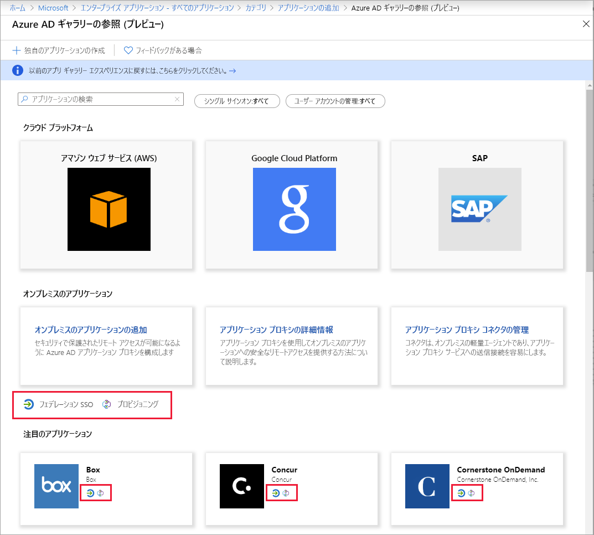
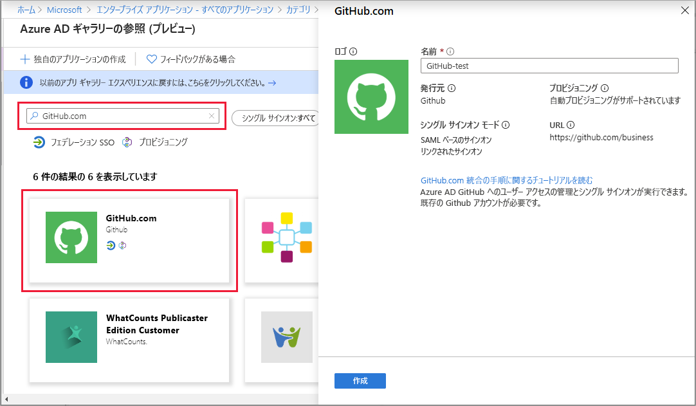

# クイック スタート:Azure Active Directory テナントにアプリケーションを追加する

Azure Active Directory (Azure AD) には、何千もの事前統合されたアプリケーションを含むギャラリーがあります。 組織で使用しているアプリケーションのいくつかは、おそらくギャラリーにあります。 このクイック スタートでは、Azure portal を使用して、Azure Active Directory (Azure AD) テナントにギャラリー アプリケーションを追加します。

アプリケーションを Azure AD テナントに追加すると、次のことが可能になります。

- 条件付きアクセス ポリシーを使用してアプリケーションへのユーザー アクセスを管理する。
- Azure AD アカウントを使用してアプリケーションにシングル サインオンするようにユーザーを構成する。

## 開始する前に

テナントにアプリケーションを追加するには、次のものが必要です。

- Azure AD サブスクリプション
- アプリケーション用のシングル サインオンが有効なサブスクリプション

Azure AD テナントの全体管理者、クラウド アプリケーション管理者、またはアプリケーション管理者として [Azure portal](https://portal.azure.com) にサインインします。

このチュートリアルの手順をテストするには、非運用環境を使用することをお勧めします。 Azure AD の非運用環境がない場合は、[1 か月の評価版を入手できます](https://azure.microsoft.com/pricing/free-trial/)。

## Azure AD テナントにアプリケーションを追加する

Azure AD テナントにギャラリー アプリケーションを追加するには:

1. [Azure portal](https://portal.azure.com) の左側のナビゲーション パネルで、 **[Azure Active Directory]** を選択します。

2. **[Azure Active Directory]** ウィンドウで、 **[エンタープライズ アプリケーション]** を選択します。 **[すべてのアプリケーション]** ウィンドウが開き、Azure AD テナントのアプリケーションのランダム サンプルが表示されます。

3. テナントにギャラリー アプリを追加するには、 **[新しいアプリケーション]** を選択します。 

    ![[新しいアプリケーション] を選択してテナントにギャラリー アプリケーションを追加](media/add-application-portal/new-application.png)

 4. 新しいギャラリー プレビュー エクスペリエンスに切り替えます。 **[アプリケーションの追加]** ページの上部にあるバナーで、 **[Click here to try out the new and improved app gallery] (改善された新しいアプリ ギャラリーを試すには、こちらをクリックしてください)** というリンクを選択します。

5. **[Azure AD ギャラリーの参照]** (プレビュー) ペインが開き、クラウド プラットフォーム、オンプレミス アプリケーション、および注目のアプリケーションのタイルが表示されます。 なお、 **[注目のアプリケーション]** セクションに一覧表示されているアプリケーションには、フェデレーション シングル サインオン (SSO) とプロビジョニングをサポートしているかどうかを示すアイコンがあります。

    

6. 追加するアプリケーションはギャラリーで参照できます。または、検索ボックスに名前を入力してアプリケーションを検索します。 次に、結果からアプリケーションを選択します。 フォームでは、組織のニーズに合わせてアプリケーションの名前を編集できます。 この例では、名前を **GitHub-test** に変更しました。

    

7. **［作成］** を選択します [作業の開始] ページが表示され、組織のアプリケーションを構成するためのオプションが表示されます。

アプリケーションの追加が完了しました。 次のセクションでは、アプリケーションのロゴを変更し、他のプロパティを編集する方法を示します。

## Azure AD テナント アプリケーションを検索する

いったんアプリケーションから離れ、後でアプリケーションの構成を続けると仮定します。 最初に行うのは、アプリケーションを見つけることです。

1. **[Azure portal](https://portal.azure.com)** の左側のナビゲーション パネルで、 **[Azure Active Directory]** を選択します。
1. **[Azure Active Directory]** ウィンドウで、 **[エンタープライズ アプリケーション]** を選択します。
1. **[アプリケーションの種類]** ドロップダウン メニューの **[すべてのアプリケーション]** を選択した後、 **[適用]** を選択します。 表示オプションの詳細については、[テナント アプリケーションの表示](view-applications-portal.md)に関するページを参照してください。
1. Azure AD テナント内のすべてのアプリケーションの一覧が表示されました。 一覧はランダム サンプルです。 他のアプリケーションを表示するには、 **[さらに表示]** を 1 回以上選択します。
1. テナント内のアプリケーションをすばやく見つけるには、検索ボックスにアプリケーション名を入力し、 **[適用]** を選択します。 この例では、以前に追加した GitHub-test アプリケーションを検索しています。

    

## ユーザーのサインイン プロパティを構成する

アプリケーションが見つかったら、アプリケーションを開いてアプリケーションのプロパティを構成できます。

アプリケーションのプロパティを編集するには:

1. アプリケーションを選択して開きます。
2. **[プロパティ]** を選択して、編集用のプロパティ ウィンドウを開きます。

    ![[プロパティ] 画面と編集可能なアプリのプロパティを示します](media/add-application-portal/edit-properties.png)

3. ここで、サインイン オプションについて理解しておきましょう。 そのオプションにより、アプリケーションに割り当てられているユーザーまたは割り当てられていないユーザーがアプリケーションにサインインする方法が決まります。 また、そのオプションでは、ユーザーのアクセス パネルにアプリケーションが表示されるかどうかも決まります。

    - **[ユーザーのサインインが有効になっていますか?]** は、アプリケーションに割り当てられているユーザーがサインインできるかどうかを決定します。
    - **[ユーザーの割り当てが必要ですか?]** は、アプリケーションに割り当てられていないユーザーがサインインできるかどうかを決定します。
    - **[ユーザーに表示しますか?]** は、アプリケーションに割り当てられているユーザーのアクセス パネルと O365 ランチャーにアプリケーションを表示するかどうかを決定します。

4. 次の表を参考にして、ニーズに最適なオプションを選択してください。

   - **割り当てられている**ユーザーの動作:

       | アプリケーション プロパティの設定 | | | 割り当てられているユーザーのエクスペリエンス | |
       |---|---|---|---|---|
       | ユーザーのサインインが有効になっていますか? | ユーザーの割り当てが必要ですか? | ユーザーに表示しますか? | 割り当てられているユーザーはサインインできますか? | 割り当てられているユーザーにアプリケーションが表示されますか?* |
       | はい | はい | はい | はい | はい  |
       | はい | はい | no  | はい | no   |
       | はい | no  | はい | はい | はい  |
       | はい | no  | no  | はい | no   |
       | no  | はい | はい | no  | no   |
       | no  | はい | no  | no  | no   |
       | no  | no  | はい | no  | no   |
       | no  | no  | no  | no  | no   |

   - **割り当てられていない**ユーザーの動作:

       | アプリケーション プロパティの設定 | | | 割り当てられていないユーザーのエクスペリエンス | |
       |---|---|---|---|---|
       | ユーザーのサインインが有効になっていますか? | ユーザーの割り当てが必要ですか? | ユーザーに表示しますか? | 割り当てられていないユーザーはサインインできますか? | 割り当てられていないユーザーにアプリケーションが表示されますか?* |
       | はい | はい | はい | no  | no   |
       | はい | はい | no  | no  | no   |
       | はい | no  | はい | はい | no   |
       | はい | no  | no  | はい | no   |
       | no  | はい | はい | no  | no   |
       | no  | はい | no  | no  | no   |
       | no  | no  | はい | no  | no   |
       | no  | no  | no  | no  | no   |

     \* ユーザーのアクセス パネルと Office 365 アプリ ランチャーにアプリケーションが表示されますか?

## カスタム ロゴを使用する

カスタム ロゴを使用するには:

1. 215 x 215 ピクセルのロゴを作成し、PNG 形式で保存します。
1. 既にアプリケーションを見つけているので、アプリケーションを選択します。
1. 左側のウィンドウで、 **[プロパティ]** を選択します。
1. ロゴをアップロードします。
1. 完了したら、 **[保存]** をクリックします。 

    ![アプリケーションの [プロパティ] ページからロゴを変更する方法を示します](media/add-application-portal/change-logo.png)

   > [!NOTE]
   > この **[プロパティ]** ペインに表示されるサムネイルは、すぐには更新されません。 プロパティを閉じて再度開くと、更新されたアイコンが表示されます。

## 次のステップ

Azure AD 組織にアプリケーションを追加したので、使用する[シングル サインオン方法を選択](what-is-single-sign-on.md#choosing-a-single-sign-on-method)し、次の該当する記事を参照します。

- [SAML ベースのシングル サインオンの構成](configure-single-sign-on-non-gallery-applications.md)
- [パスワード シングル サインオンの構成](configure-password-single-sign-on-non-gallery-applications.md)
- [リンクされたサインオンの構成](configure-linked-sign-on.md)
