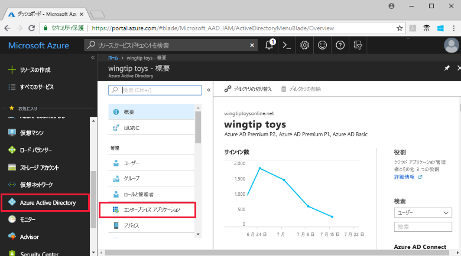
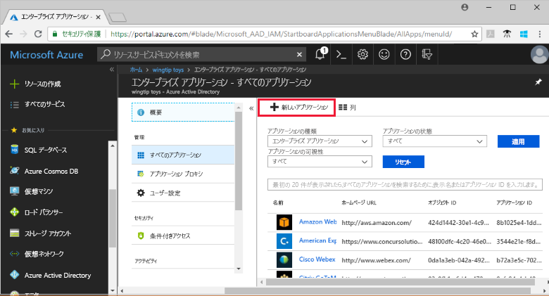
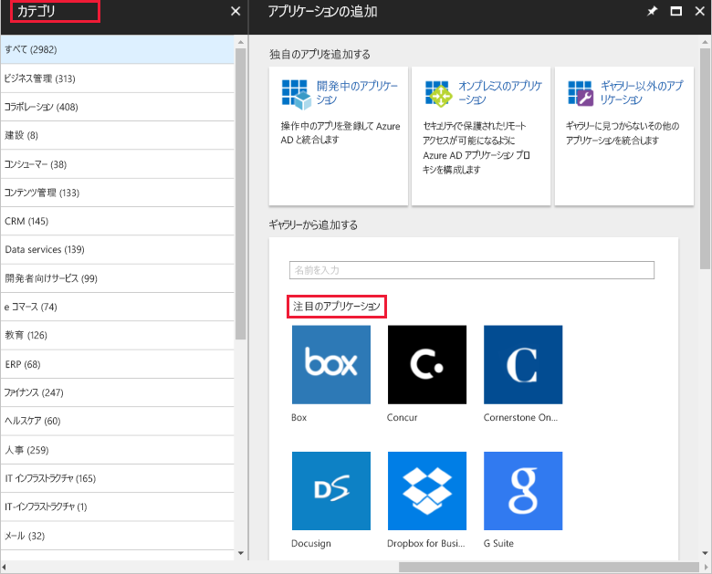
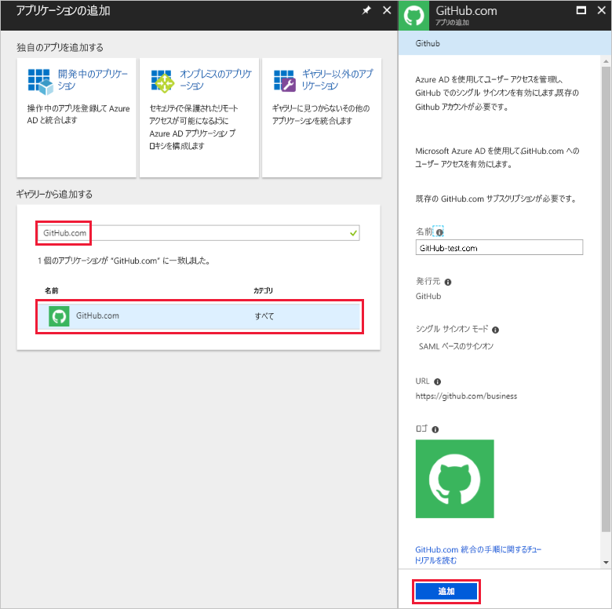
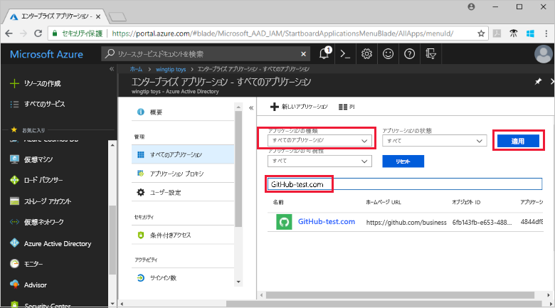
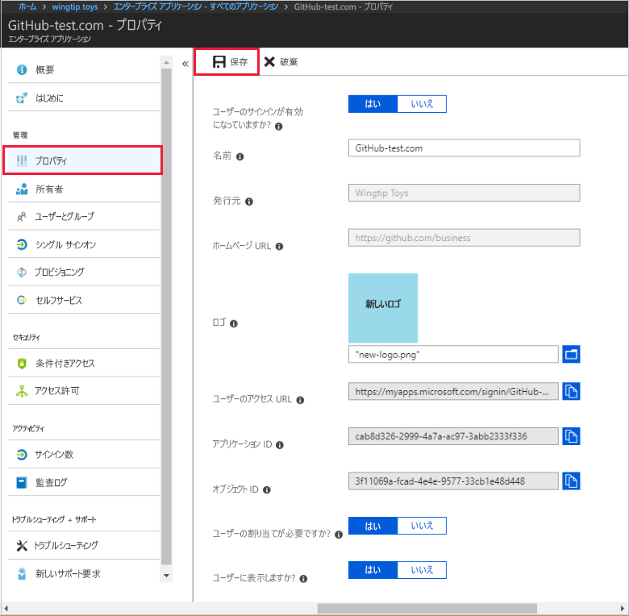
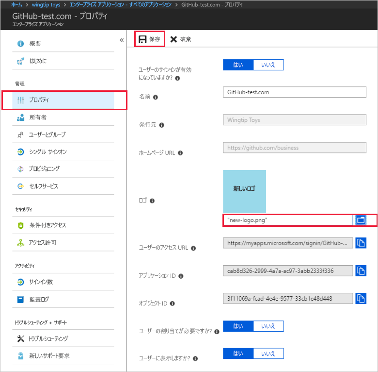

# クイック スタート: Azure Active Directory テナントにアプリケーションを追加する

Azure Active Directory (Azure AD) には、何千もの事前統合されたアプリケーションを含むギャラリーがあります。 組織で使用しているアプリケーションのいくつかは、おそらくギャラリーにあります。 このクイック スタートでは、Azure portal を使用して、Azure Active Directory (Azure AD) テナントにギャラリー アプリケーションを追加します。 
 
アプリケーションを Azure AD テナントに追加すると、次のことが可能になります。

- 条件付きアクセス ポリシーを使用してアプリケーションへのユーザー アクセスを管理する。
- Azure AD アカウントを使用してアプリケーションにシングル サインオンするようにユーザーを構成する。

## 開始する前に

テナントにアプリケーションを追加するには、次のものが必要です。

- Azure AD サブスクリプション
- アプリケーション用のシングル サインオンが有効なサブスクリプション

Azure AD テナントの全体管理者、クラウド アプリケーション管理者、またはアプリケーション管理者として [Azure portal](https://portal.azure.com) にサインインします。

このチュートリアルの手順をテストするには、非運用環境を使用することをお勧めします。 Azure AD の非運用環境がない場合は、[1 か月の評価版を入手できます](https://azure.microsoft.com/pricing/free-trial/)。

## Azure AD テナントにアプリケーションを追加する

Azure AD テナントにギャラリー アプリケーションを追加するには:

1. [Azure portal](https://portal.azure.com) の左側のナビゲーション パネルで、**[Azure Active Directory]** をクリックします。 

2. **[Azure Active Directory]** ブレードで、**[エンタープライズ アプリケーション]** をクリックします。 

    

3. **[すべてのアプリケーション]** ブレードが開き、Azure AD テナントのアプリケーションのランダム サンプルが表示されます。 

    ![[すべてのアプリケーション] ブレード](media/add-application-portal/applications-blade.png)

4. **[すべてのアプリケーション]** ブレードの上部の **[新しいアプリケーション]** をクリックします。

    

5. **[注目のアプリケーション]** の下のアイコンはギャラリー アプリケーションのランダム サンプルであるため、ギャラリー内のアプリケーションの一覧を表示するには **[カテゴリ]** を使用するのが最も簡単です。 

    

    他のアプリケーションを表示するには、**[さらに表示]** をクリックします。 ギャラリーには何千ものアプリケーションがあるので、この方法で検索することはお勧めしません。

6. アプリケーションを検索するには、**[ギャラリーから追加する]** の下のボックスに、追加するアプリケーションの名前を入力します。 結果からアプリケーションを選択し、**[追加]** をクリックします。 次の例は、GitHub.com を検索した後に表示された**アプリの追加**フォームを示しています。

    

6. アプリケーションに固有のフォームでは、プロパティ情報を変更できます。 たとえば、組織のニーズに合わせてアプリケーションの名前を編集できます。 この例では、**GitHub-test** という名前を使用しています。

8. プロパティの変更が完了したら、**[追加]** をクリックします。

9. [作業の開始] ページが表示され、組織のアプリケーションを構成するためのオプションが表示されます。 

    ![[作業の開始] のメニュー](media/add-application-portal/get-started.png)

アプリケーションの追加が完了しました。 ここでいったん休憩しましょう。  次のセクションでは、アプリケーションのロゴを変更し、他のプロパティを編集する方法を示します。

## Azure AD テナント アプリケーションを検索する

いったんアプリケーションから離れ、後でアプリケーションの構成を続けると仮定します。 最初に行う必要があることは、アプリケーションを見つけることです。

1. **[Azure portal](https://portal.azure.com)** の左側のナビゲーション パネルで、**[Azure Active Directory]** をクリックします。 

2. [Azure Active Directory] ブレードで、**[エンタープライズ アプリケーション]** をクリックします。 

3. **[アプリケーションの種類]** ドロップダウン メニューの **[すべてのアプリケーション]** を選択し、**[適用]** をクリックします。 表示オプションの詳細については、[テナント アプリケーションの表示](view-applications-portal.md)に関するページを参照してください。

4. Azure AD テナント内のすべてのアプリケーションの一覧が表示されました。  一覧はランダム サンプルです。 他のアプリケーションを表示するには、**[さらに表示]** を 1 回以上クリックします。 

5. テナント内のアプリケーションをすばやく見つけるには、検索ボックスにアプリケーション名を入力し、**[適用]** をクリックします。 この例では、以前に追加した GitHub-test アプリケーションを検索しています。

    

## ユーザーのサインイン プロパティを構成する

アプリケーションが見つかったら、アプリケーションを開いてアプリケーションのプロパティを構成できます。

アプリケーションのプロパティを編集するには

1. アプリケーションをクリックして開きます。
2. **[プロパティ]** をクリックして、編集用のプロパティ ブレードを開きます。

    

3. ここで、サインイン オプションについて理解しておきましょう。 **[ユーザーのサインインが有効になっていますか?]**、**[ユーザーの割り当てが必要ですか?]**、および **[ユーザーに表示しますか?]** の組み合わせにより、アプリケーションに割り当てられているユーザーおよび割り当てられていないユーザーがサインインできるかどうかが決まります。  また、ユーザーのアクセス パネルにアプリケーションが表示されるかどうかも決まります。 

    - **[ユーザーのサインインが有効になっていますか?]** は、アプリケーションに割り当てられているユーザーがサインインできるかどうかを決定します。
    - **[ユーザーの割り当てが必要ですか?]** は、アプリケーションに割り当てられていないユーザーがサインインできるかどうかを決定します。
    - **[ユーザーに表示しますか?]** は、アプリケーションに割り当てられているユーザーのアクセス パネルと O365 ランチャーにアプリケーションを表示するかどうかを決定します。 

4. 次の表を参考にして、ニーズに最適なオプションを選択してください。 

     - **割り当てられている**ユーザーの動作:

       | アプリケーション プロパティの設定 | | | 割り当てられているユーザーのエクスペリエンス | |
       |---|---|---|---|---|
       | ユーザーのサインインが有効になっていますか? | ユーザーの割り当てが必要ですか? | ユーザーに表示しますか? | 割り当てられているユーザーはサインインできますか? | 割り当てられているユーザーにアプリケーションが表示されますか?* |
       | はい | はい | はい | はい | はい  |
       | はい | はい | ×  | はい | ×   |
       | はい | ×  | はい | はい | はい  |
       | はい | ×  | ×  | はい | ×   |
       | ×  | はい | はい | ×  | ×   |
       | ×  | はい | ×  | ×  | ×   |
       | ×  | ×  | はい | ×  | ×   |
       | ×  | ×  | ×  | ×  | ×   |

     - **割り当てられていない**ユーザーの動作:
  
       | アプリケーション プロパティの設定 | | | 割り当てられていないユーザーのエクスペリエンス | |
       |---|---|---|---|---|
       | ユーザーのサインインが有効になっていますか? | ユーザーの割り当てが必要ですか? | ユーザーに表示しますか? | 割り当てられていないユーザーはサインインできますか? | 割り当てられていないユーザーにアプリケーションが表示されますか?* |
       | はい | はい | はい | ×  | ×   |
       | はい | はい | ×  | ×  | ×   |
       | はい | ×  | はい | はい | ×   |
       | はい | ×  | ×  | はい | ×   |
       | ×  | はい | はい | ×  | ×   |
       | ×  | はい | ×  | ×  | ×   |
       | ×  | ×  | はい | ×  | ×   |
       | ×  | ×  | ×  | ×  | ×   |

    * ユーザーのアクセス パネルと Office 365 アプリ ランチャーにアプリケーションが表示されますか?

## カスタム ロゴを使用する

カスタム ロゴを使用するには:

1. 215 x 215 ピクセルのロゴを作成し、PNG 形式で保存します。
2. 既にアプリケーションを見つけているので、アプリケーションをクリックします。
2. 左側のブレードで、**[プロパティ]** をクリックします。
4. ロゴをアップロードします。
5. 完了したら、**[保存]** をクリックします。

    

## 次の手順

このクイック スタートでは、Azure AD テナントにギャラリー アプリケーションを追加する方法について学習しました。 また、アプリケーションのプロパティを編集する方法も学習しました。 

これで、シングル サインオン用にアプリケーションを構成する準備が整いました。 

> [!div class="nextstepaction"]
> [シングル サインオンの構成](configure-single-sign-on-portal.md)

