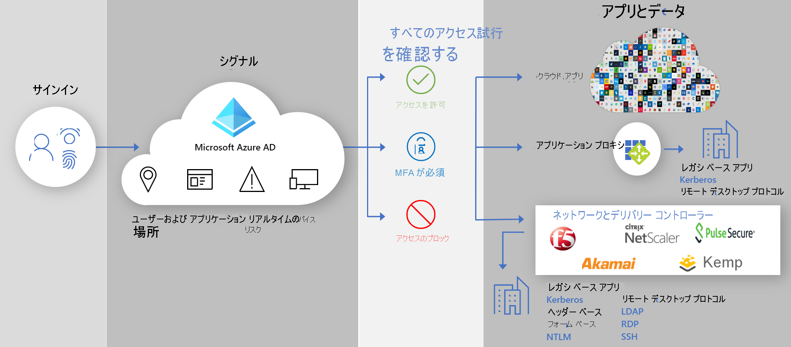

# 安全なハイブリッド アクセス:アプリ デリバリー コントローラーとネットワークを使用してレガシ アプリをセキュリティで保護する

オンプレミスやクラウドのレガシ認証アプリケーションを、既存のアプリケーション デリバリー コントローラーまたはネットワークによって Azure AD に接続することで、それらの認証アプリケーションを保護できるようになりました。 これにより、 Azure AD 条件付きアクセスや Azure AD Identity Protection Azure AD のような Azure AD 機能を使用して、すべてのアプリケーションにわたり、ギャップを埋めてセキュリティ体制を強化することができます。

ビジネス プロセスにとってまだ非常に重要であるのに、Azure AD を使用する前は保護できなかったレガシ アプリケーションを、既存のネットワークとデリバリー コントローラーを使用して容易に保護できます。 お客様はおそらく、これらのアプリケーションの保護を開始するために必要なものはすべて既に所有しています。

以下のベンダーが、Azure AD との統合のために事前に構築されたソリューションと詳細なガイダンスを提供しています。

* [Akamai Enterprise Application Access (EAA)](../saas-apps/akamai-tutorial.md)
* [Citrix アプリケーション デリバリー コントローラー (ADC)](../saas-apps/citrix-netscaler-tutorial.md)
* [F5 Big-IP APM](https://aka.ms/f5-hybridaccessguide)
* [Zscaler Private Access (ZPA)](https://aka.ms/zscaler-hybridaccessguide)
