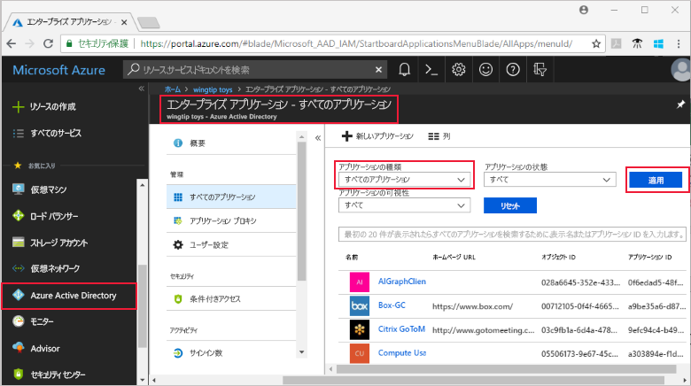
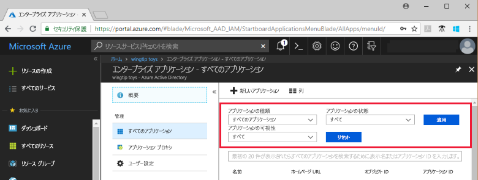
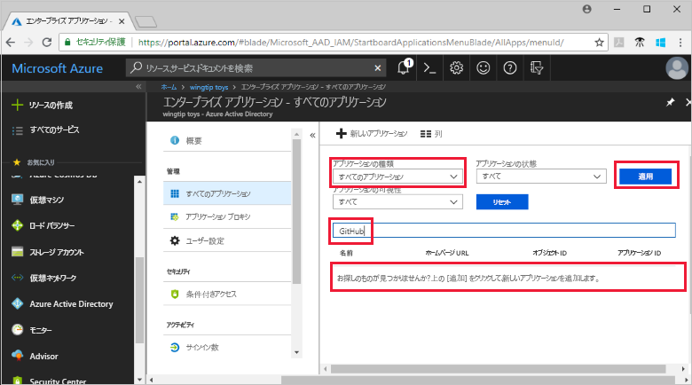
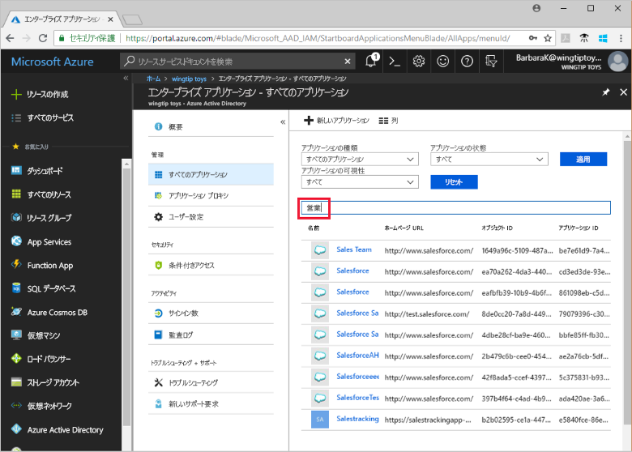

# Azure Active Directory テナントのアプリケーションの表示

このクイック スタートでは、Azure portal を使用して、Azure Active Directory (Azure AD) テナントのアプリケーションを表示します。

## 開始する前に

結果を表示するには、Azure AD テナントに少なくとも 1 つのアプリケーションが必要です。 アプリケーションを追加するには、[アプリケーションの追加](add-application-portal.md)に関するクイック スタートを参照してください。

Azure AD テナントの全体管理者、クラウド アプリケーション管理者、またはアプリケーション管理者として [Azure portal](https://portal.azure.com) にサインインします。

## テナント アプリケーションの一覧を表示する

Azure AD テナント アプリケーションは、Azure portal の **[エンタープライズ アプリ]** セクションで確認できます。

テナント アプリケーションを表示するには:

1. **[Azure portal](https://portal.azure.com)** の左側のナビゲーション パネルで、**[Azure Active Directory]** をクリックします。 

2. [Azure Active Directory] ブレードで、**[エンタープライズ アプリケーション]** をクリックします。 

3. **[アプリケーションの種類]** ドロップダウン メニューの **[すべてのアプリケーション]** を選択し、**[適用]** をクリックします。 テナント アプリケーションのランダム サンプルが表示されます。

    
   
4. 他のアプリケーションを表示するには、一覧の一番下にある **[さらに表示]** をクリックします。 テナント内のアプリケーションの数によっては、一覧をスクロールするよりも[特定のアプリケーションを検索する](#search-for-a-tenant-application)方が簡単な場合があります。

## 表示オプションを選択する

このセクションでは、探している内容に従ってオプションを選択します。

1. **[アプリケーションの種類]**、**[アプリケーションの状態]**、**[アプリケーションの可視性]** のオプションに従ってアプリケーションを表示できます。 

    

2. **[アプリケーションの種類]** で、次のいずれかのオプションを選択します。

    - **[エンタープライズ アプリケーション]** には、Microsoft 以外のアプリケーションが表示されます。
    - **[Microsoft アプリケーション]** には、Microsoft アプリケーションが表示されます。
    - **[すべてのアプリケーション]** には、Microsoft 以外のアプリケーションと Microsoft アプリケーションの両方が表示されます。

3. **[アプリケーションの状態]** で **[任意]**、**[無効]**、または **[有効]** を選択します。 **[任意]** オプションでは、無効なアプリケーションと有効なアプリケーションの両方が含まれます。

4. **[アプリケーションの可視性]** で、**[任意]** または **[非表示]** を選択します。 **[非表示]** オプションは、テナントに存在するにもかかわらずユーザーには表示されないアプリケーションを示します。

5. 必要なオプションを選択したら、**[適用]** をクリックします。
 

## テナント アプリケーションを検索する

特定のアプリケーションを検索するには:

1. **[アプリケーションの種類]** メニューの **[すべてのアプリケーション]** を選択し、**[適用]** をクリックします。

2. 検索するアプリケーションの名前を入力します。 アプリケーションが Azure AD テナントに追加されている場合は、検索結果に表示されます。 この例は、GitHub がテナント アプリケーションに追加されていないことを示しています。

    

3. アプリケーション名の最初の数文字を入力してください。  この例は、**Sales** で始まるすべてのアプリケーションを示しています。

    

## 次の手順

このクイック スタートでは、Azure AD テナントのアプリケーションを表示する方法と、アプリケーションの種類、状態、および可視性によってアプリケーションの一覧をフィルター処理する方法を学習しました。 また、特定のアプリケーションを検索する方法についても学習しました。

探していたアプリケーションを見つけたら、引き続き[他のアプリケーションをテナントに追加する](add-application-portal.md)か、アプリケーションをクリックしてプロパティと構成オプションを表示または編集することができます。 たとえば、シングル サインオンを構成できます。 

> [!div class="nextstepaction"]
> [シングル サインオンの構成](configure-single-sign-on-portal.md)

