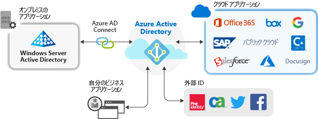

# Azure Active Directory によるアプリケーションの管理

Azure Active Directory (Azure AD) は、クラウドおよびオンプレミスのアプリのために単一の ID システムを提供することで、アプリケーションを管理する方法を簡素化します。 サービスとしてのソフトウェア (SaaS) アプリケーション、オンプレミス アプリケーション、および基幹業務アプリ (LOB) を Azure AD に追加できます。 その後ユーザーは 1 回サインインすることで、Office 365 や他の Microsoft のビジネス アプリケーションとともに、これらのアプリケーションに安全かつシームレスにアクセスできます。 [ユーザー プロビジョニングを自動化する](user-provisioning.md)ことで、管理コストを削減できます。 多要素認証と条件付きアクセス ポリシーを使用して、安全なアプリケーション アクセスを提供することもできます。

## クラウド ソリューションを使用してアプリケーションを管理する理由

組織には通常、ユーザーが業務を遂行するために使用している何百ものアプリケーションがあります。 ユーザーは、多数のデバイスおよび場所から、これらのアプリケーションにアクセスします。 毎日、新しいアプリケーションが追加、開発され、また、廃止されます。 非常に多くのアプリケーションとアクセス ポイントがあるため、クラウドベース ソリューションを使用してすべてのアプリケーションへのユーザー アクセスを管理することが、これまでよりも重要になります。

## Azure AD と統合できるアプリケーションの種類

**エンタープライズ アプリケーション**に追加して Azure AD で管理できるアプリケーションには主に以下の 4 種類があります。

- **Azure AD ギャラリー アプリケーション** – Azure AD には、Azure AD によるシングル サインオンのために事前に統合されている数千ものアプリケーションを含むギャラリーが用意されています。 組織で使用しているアプリケーションのいくつかは、おそらくギャラリーにあります。 [アプリの統合の計画に関する説明を参照](plan-an-application-integration.md)するか、[SaaS アプリケーションのチュートリアル](https://docs.microsoft.com/azure/active-directory/saas-apps/)で個別のアプリの詳細な統合手順を確認してください。

- **アプリケーション プロキシを使用するオンプレミスのアプリケーション** – Azure AD アプリケーション プロキシを使用すると、オンプレミスの Web アプリと Azure AD を統合してシングル サインオンをサポートできます。 その後ユーザーは、Office 365 や他の SaaS アプリをアクセスするのと同じ方法でオンプレミスのアプリにアクセスできます。 [アプリケーション プロキシを使用する理由とその動作のしくみ](what-is-application-proxy.md)をご覧ください。

- **カスタム開発アプリケーション** – 独自の基幹業務アプリケーションを構築するときに、それらを Azure AD と統合してシングル サインオンをサポートできます。 アプリケーションを Azure AD と統合すると、アプリケーションの認証ポリシーを管理できます。 詳細については、[開発者向けのガイダンス](developer-guidance-for-integrating-applications.md)を参照してください。

- **非ギャラリー アプリケーション** – ユーザー独自のアプリケーションを持ち込みます。 他のアプリを Azure AD に追加することで、それらのシングル サインオンをサポートします。 必要な Web リンク、またはユーザー名とパスワードのフィールドを表示するアプリケーションは、SAML または OpenID Connect プロトコルをサポートするアプリケーション、または SCIM をサポートするアプリケーションを統合できます。 詳しくは、[非ギャラリー アプリのシングル サインオンの構成](configure-single-sign-on-non-gallery-applications.md)に関する記事を参照してください。

## 条件付きアクセス ポリシーによるリスクの管理

[条件付きアクセス](https://docs.microsoft.com/azure/active-directory/conditional-access/overview)と Azure AD シングル サインオン (SSO) を組み合わせることで、アプリケーションにアクセスするための高度なセキュリティが提供されます。 セキュリティ機能には、クラウド規模の ID 保護、リスクベースのアクセス制御、ネイティブな多要素認証、および条件付きアクセス ポリシーが含まれます。 これらの機能では、さらに高度なセキュリティを必要とするアプリケーションまたはグループに基づいて、より詳細にポリシーを制御できます。

## シングル サインオンによる生産性の向上

複数のアプリケーションおよび Office 365 でシングル サインオン (SSO) を有効にすると、サインイン プロンプトを減らすかなくすことで、既存のユーザーにより優れたサインイン エクスペリエンスを提供できます。 ユーザーの環境がより総合的になったことを実感できると共に、複数のプロンプトを伴わず、また複数のパスワードを管理する必要もないため、注意を削がれる機会が少なくなります。 業務グループでは、セルフ サービスかつ動的なメンバーシップを利用して、アクセスを管理して承認できます。 その業務での適任者がアプリケーションへのアクセスを管理できるので、ID システムのセキュリティが向上します。

SSO によって、セキュリティが改善されます。 *シングル サインオン*を利用しない場合、管理者は個々のアプリケーションごとに、ユーザー アカウントを作成および更新する必要があります。これには、時間がかかります。 また、ユーザーは、複数の資格情報を追跡してアプリケーションにアクセスする必要があります。 その結果、ユーザーは自分のパスワードをメモしたり、他のパスワード管理のソリューションを使用したりすることになり、データ セキュリティ リスクが生じる傾向があります。 [シングル サインオンの詳細をご確認ください](what-is-single-sign-on.md)。

## ガバナンスとコンプライアンスへの対応

Azure AD では、セキュリティ情報とイベント管理 (SIEM) ツールを活用したレポート経由で、アプリケーション サインインを監視できます。 ポータルから、または API から、レポートにアクセスできます。 お使いのアプリケーションに誰がアクセスできるかをプログラムから監視して、アクセス レビュー経由で非アクティブなユーザーへのアクセスを削除します。

## コストを管理する

Azure AD に移行することで、コストを節約し、オンプレミス インフラストラクチャの管理における負担を除去できます。 また、Azure AD はアプリケーションにセルフ サービス アクセスを提供し、管理者とユーザーの両者が時間を節約できます。 シングル サインオンにより、アプリケーション固有のパスワードはなくなります。 この 1 回限りのサインオンにより、アプリケーションのパスワード リセットと、パスワードの取得時の生産性低下に関連するコストを削減できます。

## 次の手順

- [アプリケーション プロキシとは](what-is-application-proxy.md)
- [クイック スタート:Azure AD テナントにギャラリー アプリケーションを追加する](add-application-portal.md)
