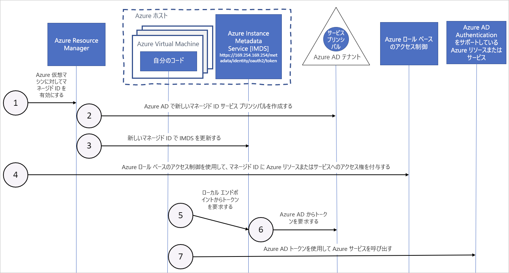

# Azure リソースのマネージド ID と Azure 仮想マシンの連携

Azure リソースのマネージド ID は、Azure Active Directory で自動的に管理される ID を Azure サービスに提供します。 この ID を使用して、コードに資格情報が含まれていなくても、Azure AD の認証をサポートする任意のサービスに認証することができます。

この記事では、マネージド ID が Azure 仮想マシン (VM) とどのように連携するかについて説明します。

## しくみ

内部的には、マネージド ID は特別な種類のサービス プリンシパルであり、Azure リソースとだけ使用できます。 マネージド ID が削除されると、対応するサービス プリンシパルが自動的に削除されます。
同様に、ユーザー割り当て ID またはシステム割り当て ID が作成されると、その ID に対し、マネージド ID リソースプロバイダー (MSRP) によって内部的に証明書が発行されます。 

Azure AD Authentication をサポートするサービスのアクセス トークンは、コードからマネージド ID を使用して要求できます。 Azure は、サービス インスタンスによって使用される資格情報のローリングを実行します。 

次の図は、マネージド サービス ID と Azure 仮想マシン (VM) が連携するようすを示したものです。

|  プロパティ    | システム割り当てマネージド ID | ユーザー割り当てマネージド ID |
|------|----------------------------------|--------------------------------|
| 作成 |  Azure リソース (たとえば、Azure 仮想マシンまたは Azure App Service) の一部として作成されます。 | スタンドアロンの Azure リソースとして作成されます。 |
| ライフ サイクル | マネージド ID の作成に使用された Azure リソースとの共有ライフ サイクル。   親リソースが削除されると、マネージド ID も削除されます。 | 独立したライフ サイクル。   明示的に削除する必要があります。 |
| Azure リソース間で共有されます | 共有できません。   1 つの Azure リソースにのみ関連付けることができます。 | 共有できます。   同じユーザー割り当てマネージド ID を、複数の Azure リソースに関連付けることができます。 |
| 一般的なユース ケース | 1 つの Azure リソース内に含まれるワークロード。   独立した ID が必要なワークロード。   たとえば、1 つの仮想マシンで実行されるアプリケーション | 複数のリソースで実行され、1 つの ID を共有できるワークロード。   プロビジョニング フローの一部として、セキュリティで保護されたリソースへの事前承認が必要なワークロード。   リソースが頻繁にリサイクルされるものの、アクセス許可は一貫性を保つ必要があるワークロード。   たとえば、複数の仮想マシンが同じリソースにアクセスする必要があるワークロード |

## システム割り当てマネージド ID

1. Azure Resource Manager は、VM 上でシステム割り当てマネージド ID を有効にするための要求を受け取ります。

2. Azure Resource Manager は、VM の ID を表すサービス プリンシパルを Azure AD に作成します。 このサブスクリプションによって信頼されている Azure AD テナントに、サービス プリンシパルが作成されます。

3. Azure Resource Manager では、Azure Instance Metadata Service の ID エンドポイントをサービス プリンシパルのクライアント ID と証明書を使用して更新することによって、VM 上に ID が構成されます。

4. VM に ID が設定された後、Azure リソースにアクセスする権利を VM に与えるには、そのサービス プリンシパル情報を使用します。 Azure Resource Manager を呼び出すには、Azure のロールベースのアクセス制御 (Azure RBAC) を使用して、VM のサービス プリンシパルに適切なロールを割り当てます。 Key Vault を呼び出すには、Key Vault 内の特定のシークレットまたは特定のキーにアクセスする権利をコードに与えます。

5. VM 上で実行されているコードは、VM 内からのみアクセスできる Azure Instance Metadata サービス エンドポイントにトークン (`http://169.254.169.254/metadata/identity/oauth2/token`) を要求できます。
    - リソース パラメーターは、トークンの送信先のサービスを指定します。 Azure Resource Manager に対して認証を行うには、`resource=https://management.azure.com/` を使用します。
    - API バージョン パラメーターは、IMDS バージョンを指定します。api-version=2018-02-01 以降を使用してください。

6. 手順 3. で構成したクライアント ID と証明書を使用して、手順 5. で指定したアクセス トークンを要求する呼び出しが Azure AD に対して行われます。 Azure AD は、JSON Web トークン (JWT) アクセス トークンを返します。

7. コードは、Azure AD 認証をサポートするサービスへの呼び出しでアクセス トークンを送信します。

## ユーザー割り当てマネージド ID

1. Azure Resource Manager が、ユーザー割り当てマネージド ID を作成するための要求を受け取ります。

2. Azure Resource Manager が、ユーザー割り当てマネージド ID を表すサービス プリンシパルを Azure AD に作成します。 このサブスクリプションによって信頼されている Azure AD テナントに、サービス プリンシパルが作成されます。

3. ユーザーが割り当てたマネージド ID を VM 上に構成する要求が Azure Resource Manager によって受信され、Azure Instance Metadata Service の ID エンドポイントがサービス プリンシパルのクライアント ID と証明書を使用して更新されます。

4. ユーザー割り当てマネージド ID が作成された後、Azure リソースにアクセスする権利をその ID に与えるには、そのサービス プリンシパル情報を使用します。 Azure Resource Manager を呼び出すには、Azure RBAC を使用して、ユーザー割り当て ID のサービス プリンシパルに適切なロールを割り当てます。 Key Vault を呼び出すには、Key Vault 内の特定のシークレットまたは特定のキーにアクセスする権利をコードに与えます。

   > [!Note]
   > この手順は、手順 3. の前に行ってもかまいません。

5. VM 上で実行されているコードは、VM 内からのみアクセスできる Azure Instance Metadata Service ID エンドポイントにトークン (`http://169.254.169.254/metadata/identity/oauth2/token`) を要求できます。
    - リソース パラメーターは、トークンの送信先のサービスを指定します。 Azure Resource Manager に対して認証を行うには、`resource=https://management.azure.com/` を使用します。
    - クライアント ID パラメーターは、トークンの要求先の ID を指定します。 この値は、1 つの VM 上に複数のユーザー割り当て ID がある場合に、あいまいさを解消するために必要です。
    - Azure Instance Metadata Service のバージョンは、API バージョン パラメーターで指定します。 `api-version=2018-02-01` 以降を使用してください。

6. 手順 3. で構成したクライアント ID と証明書を使用して、手順 5. で指定したアクセス トークンを要求する呼び出しが Azure AD に対して行われます。 Azure AD は、JSON Web トークン (JWT) アクセス トークンを返します。
7. コードは、Azure AD 認証をサポートするサービスへの呼び出しでアクセス トークンを送信します。

## 次のステップ

以下のクイック スタートを使用して、Azure リソースのマネージド ID 機能を使ってみましょう。

* [Windows VM のシステム割り当てマネージド ID を使用して Resource Manager にアクセスする](tutorial-windows-vm-access-arm.md)
* [Linux VM のシステム割り当てマネージド ID を使用して Resource Manager にアクセスする](tutorial-linux-vm-access-arm.md)
