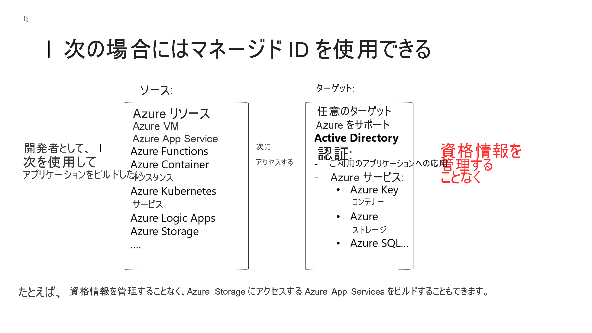

# Azure リソースのマネージド ID とは

ソリューションを構成するさまざまなコンポーネント間の通信のセキュリティを確保するために使用されるシークレットと資格情報の管理は、開発者にとって共通の課題です。 マネージド ID により、開発者は資格情報を管理する必要がなくなります。 マネージド ID は、Azure Active Directory (Azure AD) 認証をサポートするリソースに接続するときに使用する ID をアプリケーションに提供します。 アプリケーションは、マネージド ID を使用して Azure AD トークンを取得できます。 たとえば、アプリケーションはマネージド ID を使用することで、開発者が安全に資格情報を格納できる [Azure キー コンテナー](../../key-vault/general/overview.md)などのリソースにアクセスしたり、ストレージ アカウントにアクセスしたりできるようになります。

マネージド ID の用途 

> [!VIDEO https://www.youtube.com/embed/5lqayO_oeEo]

以下に、マネージド ID を使用する利点をいくつか紹介します。

- 資格情報を自ら管理する必要がない。 資格情報には、自分もアクセスできません。
- マネージド ID を使用すると、独自のアプリケーションを含む、[Azure Active Directory 認証](../authentication/overview-authentication.md)をサポートする任意のリソースに対して認証を行うことができます。
- マネージド ID の使用に関して追加コストは一切かからない。

> [!NOTE]
> Azure リソースのマネージド ID は、以前のマネージドサービス ID (MSI) の新しい名前です。

## マネージド ID の種類

マネージド ID には、次の 2 種類があります。

- **システム割り当て** Azure サービスによっては、サービス インスタンスに対して直接マネージド ID を有効にすることができます。 システム割り当てマネージド ID を有効にすると、そのサービス インスタンスのライフサイクルに関連付けられた ID が Azure AD に作成されます。 したがって、リソースが削除されると、その ID も Azure によって自動的に削除されます。 その ID を使用して Azure AD にトークンを要求できるのは、必然的に、その Azure リソースのみとなります。
- **ユーザー割り当て** スタンドアロンの Azure リソースとしてマネージド ID を自分で作成することもできます。 [ユーザー割り当てマネージド ID を作成](how-to-manage-ua-identity-portal.md)して、それを Azure サービスの 1 つまたは複数のインスタンスに割り当てることができます。 ユーザー割り当てマネージド ID の場合、ID は、それを使用するリソースとは別に管理されます。   

> [!VIDEO https://www.youtube.com/embed/OzqpxeD3fG0]

次の表は、2 種類のマネージド ID の違いを示しています。

|  プロパティ    | システム割り当てマネージド ID | ユーザー割り当てマネージド ID |
|------|----------------------------------|--------------------------------|
| 作成 |  Azure リソース (たとえば、Azure 仮想マシンまたは Azure App Service) の一部として作成されます | スタンドアロンの Azure リソースとして作成されます |
| ライフ サイクル | マネージド ID の作成に使用された Azure リソースとの共有ライフ サイクル。   親リソースが削除されると、マネージド ID も削除されます。 | 独立したライフ サイクル。   明示的に削除する必要があります。 |
| Azure リソース間で共有されます | 共有できません。   1 つの Azure リソースにのみ関連付けることができます。 | 共有できます   同じユーザー割り当てマネージド ID を、複数の Azure リソースに関連付けることができます。 |
| 一般的なユース ケース | 1 つの Azure リソース内に含まれるワークロード   独立した ID が必要なワークロード。   たとえば、1 つの仮想マシンで実行されるアプリケーション | 複数のリソースで実行され、1 つの ID を共有できるワークロード。   プロビジョニング フローの一部として、セキュリティで保護されたリソースへの事前承認が必要なワークロード。   リソースが頻繁にリサイクルされるものの、アクセス許可は一貫性を保つ必要があるワークロード。   たとえば、複数の仮想マシンが同じリソースにアクセスする必要があるワークロード |

> [!IMPORTANT]
> 選択した ID の種類に関係なく、マネージド ID は、Azure リソースでのみ使用できる特殊なタイプのサービス プリンシパルです。 マネージド ID が削除されると、対応するサービス プリンシパルが自動的に削除されます。

## Azure リソースのマネージド ID を使用する方法

## この機能をサポートする Azure サービスは?

Azure リソースのマネージド ID は、Azure AD 認証をサポートするサービスの認証に使用することができます。 Azure リソースのマネージド ID 機能をサポートする Azure サービスの一覧については、「[Services that support managed identities for Azure resources (Azure リソースのマネージド ID をサポートするサービス)](./services-support-managed-identities.md)」を参照してください。

## マネージド ID を使用して実行できる操作

システム割り当てマネージド ID をサポートするリソースでは、次のことが可能です。

- リソース レベルでマネージド ID を有効または無効にする。
- RBAC ロールを使用して[アクセス許可を付与する](howto-assign-access-portal.md)。
- [Azure アクティビティ ログ](../../azure-resource-manager/management/view-activity-logs.md)内の作成、読み取り、更新、削除 (CRUD) 操作を表示する。
- Azure AD [サインイン ログ](../reports-monitoring/concept-sign-ins.md)内のサインイン アクティビティを表示する。

代わりにユーザー割り当てマネージド ID を選択した場合:

- ID の[作成、読み取り、更新、削除](how-to-manage-ua-identity-portal.md)操作を実行できます。
- RBAC のロールの割り当てを使用して[アクセス許可を付与する](howto-assign-access-portal.md)ことができます。
- ユーザー割り当てマネージド ID は、複数のリソースで使用できます。
- CRUD 操作は、[Azure アクティビティ ログ](../../azure-resource-manager/management/view-activity-logs.md)内で確認できます。
- Azure AD [サインイン ログ](../reports-monitoring/concept-sign-ins.md)内のサインイン アクティビティを表示する。

マネージド ID に対する操作は、Azure Resource Manager (ARM) テンプレート、Azure portal、Azure CLI、PowerShell、および REST API シリーズを使用して実行できます。

## 次のステップ

* [Windows VM のシステム割り当てマネージド ID を使用して Resource Manager にアクセスする](tutorial-windows-vm-access-arm.md)
* [Linux VM のシステム割り当てマネージド ID を使用して Resource Manager にアクセスする](tutorial-linux-vm-access-arm.md)
* [App Service と Azure Functions でマネージド ID を使用する方法](../../app-service/overview-managed-identity.md)
* [Azure Container Instances でマネージド ID を使用する方法](../../container-instances/container-instances-managed-identity.md)
* [Microsoft Azure リソースにマネージド ID を導入する](https://www.pluralsight.com/courses/microsoft-azure-resources-managed-identities-implementing)
