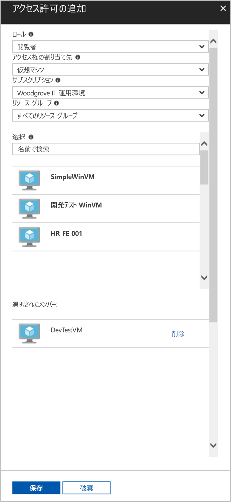

# <a name="use-a-linux-vm-system-assigned-managed-identity-to-access-azure-resource-manager"></a>Linux VM のシステム割り当てマネージド ID を使用して Azure Resource Manager にアクセスする

[!INCLUDE [preview-notice](../../../includes/active-directory-msi-preview-notice.md)]

このクイック スタートでは、Linux 仮想マシン (VM) のシステム割り当て ID を使用して Azure Resource Manager API にアクセスする方法について説明します。 Azure リソースのマネージド ID は Azure によって自動的に管理され、資格情報をコードに挿入しなくても、Azure AD 認証をサポートするサービスへの認証を有効にします。 学習内容は次のとおりです。

> [!div class="checklist"]
> * Azure Resource Manager で VM にリソース グループへのアクセスを許可する 
> * VM ID を使用してアクセス トークンを取得し、そのアクセス トークンを使用して Azure Resource Manager を呼び出す 

## <a name="prerequisites"></a>前提条件

[!INCLUDE [msi-tut-prereqs](../../../includes/active-directory-msi-tut-prereqs.md)]

## <a name="grant-your-vm-access-to-a-resource-group-in-azure-resource-manager"></a>Azure Resource Manager で VM にリソース グループへのアクセスを許可する 

Azure リソースのマネージド ID を使用すると、Azure AD 認証をサポートするリソースに対して認証するためのアクセス トークンをコードで取得できます。 Azure Resource Manager API は、Azure AD の認証をサポートします。 最初に、Azure Resource Manager のリソース (ここでは、VM が含まれているリソース グループ) へのアクセスをこの VM の ID に許可する必要があります。  

1. **リソース グループ**のタブに移動します。
2. 先ほど作成した特定の**リソース グループ**を選択します。
3. 左側のパネルの **[アクセス制御 (IAM)]** に移動します。
4. VM 用に新しいロールの割り当てを**追加**します。 **[閲覧者]** として **[ロール]** を選択します。
5. 次のドロップダウンで、**[アクセスの割り当て先]** として **[仮想マシン]** リソースを選択します。
6. 次に、**[サブスクリプション]** ドロップダウンに適切なサブスクリプションが表示されていることを確認します。 **[リソース グループ]** で **[すべてのリソース グループ]** を選択します。
7. 最後に、**[選択]** の一覧で、使用する Linux 仮想マシンを選択し、**[保存]** をクリックします。

    

## <a name="get-an-access-token-using-the-vms-system-assigned-managed-identity-and-use-it-to-call-resource-manager"></a>VM のシステム割り当てマネージド ID を使用してアクセス トークンを取得し、それを使用して Resource Manager を呼び出す 

これらの手順を完了するには、SSH クライアントが必要です。 Windows を使用している場合は、[Windows Subsystem for Linux](https://msdn.microsoft.com/commandline/wsl/about) で SSH クライアントを使用することができます。 SSH クライアント キーの構成について支援が必要な場合は、「[Azure 上の Windows で SSH キーを使用する方法](../../virtual-machines/linux/ssh-from-windows.md)」または「[Azure に Linux VM 用の SSH 公開キーと秘密キーのペアを作成して使用する方法](../../virtual-machines/linux/mac-create-ssh-keys.md)」をご覧ください。

1. ポータルで Linux VM に移動し、**[概要]** の **[接続]** をクリックします。  
2. 任意の SSH クライアントを使用して、VM に**接続**します。 
3. ターミナル ウィンドウで、CURL を使用して、Azure リソース エンドポイントのローカル マネージド ID に、Azure Resource Manager のアクセス トークンを取得するよう要求します。  
 
    アクセス トークンの CURL 要求を次に示します。  
    
    ```bash
    curl 'http://169.254.169.254/metadata/identity/oauth2/token?api-version=2018-02-01&resource=https%3A%2F%2Fmanagement.azure.com%2F' -H Metadata:true   
    ```
    
    > [!NOTE]
    > "resource"パラメーターの値は、Azure AD で予期される値と完全に一致している必要があります。  Resource Manager のリソース ID の場合は、URI の末尾にスラッシュを含める必要があります。 
    
    応答には、Azure Resource Manager へのアクセスに必要なアクセス トークンが含まれています。 
    
    応答:  

    ```bash
    {"access_token":"eyJ0eXAiOi...",
    "refresh_token":"",
    "expires_in":"3599",
    "expires_on":"1504130527",
    "not_before":"1504126627",
    "resource":"https://management.azure.com",
    "token_type":"Bearer"} 
    ```
    
    このアクセス トークンを使用して、Azure Resource Manager にアクセスし、たとえば、この VM アクセスを許可した Resource Group の詳細を確認することができます。 \<SUBSCRIPTION ID\>、\<RESOURCE GROUP\>、および \<ACCESS TOKEN\> の値を、以前に作成した値で置き換えます。 
    
    > [!NOTE]
    > URL では大文字小文字が区別されるため、リソース グループの命名時に以前使用したものと同じ大文字小文字が使用されていること、および "resourceGroup" で大文字の "G" が使用されていることを確認してください。  
    
    ```bash 
    curl https://management.azure.com/subscriptions/<SUBSCRIPTION ID>/resourceGroups/<RESOURCE GROUP>?api-version=2016-09-01 -H "Authorization: Bearer <ACCESS TOKEN>" 
    ```
    
    応答は、特定の Resource Group の情報とともに返されます。    
    ```bash
    {"id":"/subscriptions/98f51385-2edc-4b79-bed9-7718de4cb861/resourceGroups/DevTest","name":"DevTest","location":"westus","properties":{"provisioningState":"Succeeded"}} 
    ```

## <a name="next-steps"></a>次の手順

このクイック スタートでは、システム割り当て ID を使用して Azure Resource Manager API にアクセスする方法について説明しました。  Azure Resource Manager の詳細については、以下を参照してください。

> [!div class="nextstepaction"]
>[Azure Resource Manager](/azure/azure-resource-manager/resource-group-overview)
