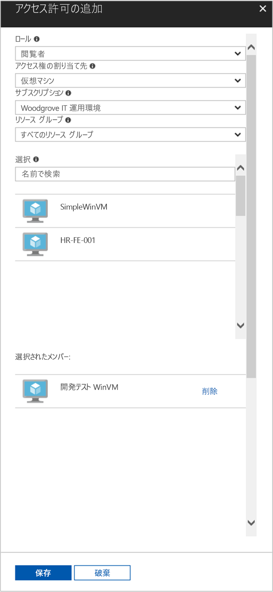

# <a name="use-a-windows-vm-system-assigned-managed-identity-to-access-resource-manager"></a>Windows VM のシステム割り当てマネージド ID を使用して Resource Manager にアクセスする

[!INCLUDE [preview-notice](../../../includes/active-directory-msi-preview-notice.md)]

このクイック スタートでは、システム割り当てマネージド ID を有効にした Windows 仮想マシンを使用して Azure Resource Manager API にアクセスする方法について説明します。 Azure リソースのマネージド ID は Azure によって自動的に管理され、資格情報をコードに挿入しなくても、Azure AD 認証をサポートするサービスへの認証を有効にします。 学習内容は次のとおりです。

> [!div class="checklist"] 
> * Azure Resource Manager で VM にリソース グループへのアクセスを許可する 
> * VM ID を使用してアクセス トークンを取得し、そのアクセス トークンを使用して Azure Resource Manager を呼び出す

## <a name="prerequisites"></a>前提条件

[!INCLUDE [msi-tut-prereqs](../../../includes/active-directory-msi-tut-prereqs.md)]

## <a name="grant-your-vm-access-to-a-resource-group-in-resource-manager"></a>Resource Manager で VM にリソース グループへのアクセスを許可する
Azure リソースのマネージド ID を使用すると、Azure AD 認証をサポートするリソースに対して認証するためのアクセス トークンをコードで取得できます。  Azure Resource Manager は、Azure AD の認証をサポートします。  最初に、Resource Manager のリソース (ここでは、VM が含まれているリソース グループ) へのアクセスをこの VM のシステム割り当てマネージド ID に許可する必要があります。  

1.  **リソース グループ**のタブに移動します。 
2.  **Windows VM** 用に作成した特定の**リソース グループ**を選択します。 
3.  左側のパネルの **[アクセス制御 (IAM)]** に移動します。 
4.  **Windows VM** 用の新しいロールの割り当てについて **[ロール割り当ての追加]** を実行します。  **[閲覧者]** として **[ロール]** を選択します。 
5.  次のドロップダウンで、 **[アクセスの割り当て先]** として **[仮想マシン]** リソースを選択します。 
6.  次に、 **[サブスクリプション]** ドロップダウンに適切なサブスクリプションが表示されていることを確認します。 **[リソース グループ]** で **[すべてのリソース グループ]** を選択します。 
7.  最後に、 **[選択]** の一覧で使用する Windows VM を選択し、 **[保存]** をクリックします。

    

## <a name="get-an-access-token-using-the-vms-system-assigned-managed-identity-and-use-it-to-call-azure-resource-manager"></a>VM のシステム割り当てマネージド ID を使用してアクセス トークンを取得し、それを使用して Azure Resource Manager を呼び出す 

ここでは、**PowerShell** を使用する必要があります。  **PowerShell** をインストールしていない場合は、[ここ](https://docs.microsoft.com/powershell/azure/overview)からダウンロードします。 

1.  ポータルで **[Virtual Machines]** にナビゲートして Windows 仮想マシンに移動し、 **[概要]** の **[接続]** をクリックします。 
2.  Windows VM を作成したときに追加した**ユーザー名**と**パスワード**を入力します。 
3.  これで、仮想マシンを使用する**リモート デスクトップ接続**が作成されました。リモート セッションで **PowerShell** を開きます。 
4.  Invoke-WebRequest コマンドレットを使用して、Azure リソース エンドポイントのローカル マネージド ID に、Azure Resource Manager のアクセス トークンを取得するよう要求します。

    ```powershell
       $response = Invoke-WebRequest -Uri 'http://169.254.169.254/metadata/identity/oauth2/token?api-version=2018-02-01&resource=https://management.azure.com/' -Method GET -Headers @{Metadata="true"}
    ```
    
    > [!NOTE]
    > "resource"パラメーターの値は、Azure AD で予期される値と完全に一致している必要があります。 Azure Resource Manager のリソース ID を使用する場合は、URI の末尾にスラッシュを含める必要があります。
    
    次に、$response オブジェクト内で JavaScript オブジェクト表記 (JSON) 形式の文字列として格納されている完全な応答を抽出します。 
    
    ```powershell
    $content = $response.Content | ConvertFrom-Json
    ```
    次に、アクセス トークンを応答から抽出します。
    
    ```powershell
    $ArmToken = $content.access_token
    ```
    
    最後に、アクセス トークンを使用して Azure Resource Manager を呼び出します。 さらに、この例では、Invoke-WebRequest コマンドレットを使用して、Azure Resource Manager への呼び出しを行い、Authorization ヘッダーにアクセス トークンを含めます。
    
    ```powershell
    (Invoke-WebRequest -Uri https://management.azure.com/subscriptions/<SUBSCRIPTION ID>/resourceGroups/<RESOURCE GROUP>?api-version=2016-06-01 -Method GET -ContentType "application/json" -Headers @{ Authorization ="Bearer $ArmToken"}).content
    ```
    > [!NOTE] 
    > URL では大文字小文字が区別されるため、リソース グループの命名時に以前使用したものと同じ大文字小文字が使用されていること、および "resourceGroups" で大文字の "G" が使用されていることを確認してください。
        
    次のコマンドは、リソース グループの詳細を返します。

    ```powershell
    {"id":"/subscriptions/98f51385-2edc-4b79-bed9-7718de4cb861/resourceGroups/DevTest","name":"DevTest","location":"westus","properties":{"provisioningState":"Succeeded"}}
    ```

## <a name="next-steps"></a>次のステップ

このクイック スタートでは、システム割り当て ID を使用して Azure Resource Manager API にアクセスする方法について説明しました。  Azure Resource Manager の詳細については、以下を参照してください。

> [!div class="nextstepaction"]
>[Azure Resource Manager](/azure/azure-resource-manager/resource-group-overview)

