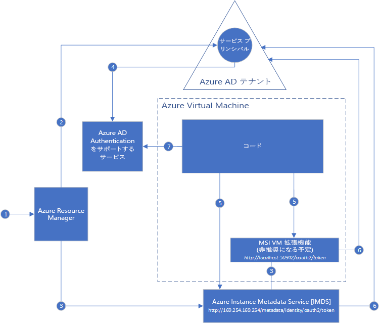

#  Azure リソースのマネージド サービス ID とは

[!INCLUDE[preview-notice](../../../includes/active-directory-msi-preview-notice.md)]

クラウド アプリケーションの構築時における一般的な課題は、クラウド サービスへの認証用のコードに必要な資格情報を管理する方法です。 これらの資格情報を安全に保つことは重要なタスクです。 こうした資格情報が開発者ワークステーションに表示されず、ソース管理で検査されないことが理想的です。 Azure Key Vault は、資格情報およびその他のキーやシークレットを安全に保管する方法を提供しますが、コードは Key Vault に認証してそれらを取得する必要があります。 マネージド サービス ID は、Azure Active Directory (Azure AD) で自動的に管理されている ID を Azure サービスに付与することで、この問題を簡単に解決します。 この ID を使用して、コードに資格情報が含まれていなくても、Key Vault を含む Azure AD の認証をサポートする任意のサービスに認証することができます。

マネージド サービス ID は、Azure サブスクリプションの既定値である Azure Active Directory Free に付属しています。 マネージド サービス ID のための追加コストはありません。

## それはどのように機能しますか?

マネージド サービス ID には、**システム割り当て**と**ユーザー割り当て**の 2 種類があります。

- **システム割り当て ID** は、Azure サービス インスタンス上で直接有効にされます。 有効にすると、サービス インスタンスのサブスクリプションによって信頼されている Azure AD テナントに、Azure がサービス インスタンスの ID を作成します。 ID が作成されると、その資格情報がサービス インスタンスにプロビジョニングされます。 システム割り当て ID のライフ サイクルは、その ID が有効にされた Azure サービス インスタンスに直接関連付けられます。 サービス インスタンスが削除された場合、Azure は Azure AD の資格情報および ID を自動的にクリーンアップします。
- **ユーザー割り当て ID** は、スタンドアロン Azure リソースとして作成されます。 作成プロセスで、使用されているサブスクリプションによって信頼されている Azure AD テナントに、Azure が ID を作成します。 ID が作成された後、1 つまたは複数の Azure サービス インスタンスに割り当てできます。 ユーザー割り当て ID のライフ サイクルは、その ID が割り当てられている Azure サービス インスタンスのライフ サイクルとは個別に管理されます。

そのため、コードはシステム割り当て ID とユーザー割り当て ID のいずれかを使用して、Azure AD 認証をサポートするサービスのアクセス トークンを要求することができます。 その間、Azure は、サービス インスタンスによって使用される資格情報のローリングを実行します。

次の例は、Azure Virtual Machines でシステム割り当て ID がどのように動作するかを示しています。

1. Azure Resource Manager は、VM でシステム割り当て ID を有効にするための要求を受け取ります。
2. Azure Resource Manager は、Azure AD で VM の ID を表すサービス プリンシパルを作成します。 このサブスクリプションによって信頼されている Azure AD テナントで、サービス プリンシパルが作成されます。
3. Azure Resource Manager が、VM 上で ID を構成します。
    - Azure Instance Metadata Service の ID エンドポイントを、サービス プリンシパルのクライアント ID と証明書で更新します。
    - VM 拡張機能をプロビジョニングし、サービス プリンシパルのクライアント ID と証明書を追加します  (廃止予定)。
4. VM に ID が設定されたので、そのサービス プリンシパル情報を使用して、VM に Azure リソースへのアクセスを許可します。 たとえば、コードが Azure Resource Manager を呼び出す必要がある場合、Azure AD でロールベースのアクセス制御 (RBAC) を使用して、VM のサービス プリンシパルに適切な役割を割り当てることができます。 コードが Key Vault を呼び出す必要がある場合、Key Vault 内の特定のシークレットまたはキーへのアクセスをコードに付与します。
5. VM 上で実行されているコードは、VM 内からのみアクセス可能な次の 2 つのエンドポイントにトークンを要求できます。

    - Azure Instance Metadata Service (IMDS) の ID エンドポイント: http://169.254.169.254/metadata/identity/oauth2/token (推奨)
        - リソース パラメーターは、トークンの送信先のサービスを指定します。 たとえば、Azure Resource Manager に認証するようにコードを設定する場合は、resource=https://management.azure.com/ を使用します。
        - API バージョン パラメーターは、IMDS バージョンを指定します。api-version=2018-02-01 以降を使用してください。
    - VM 拡張機能エンドポイント: http://localhost:50342/oauth2/token (廃止予定)
        - リソース パラメーターは、トークンの送信先のサービスを指定します。 たとえば、Azure Resource Manager に認証するようにコードを設定する場合は、resource=https://management.azure.com/ を使用します。

6. 手順 3. で構成したクライアント ID と証明書を使用して、手順 5. で指定したアクセス トークンを要求する呼び出しが Azure AD に対して行われます。 Azure AD は、JSON Web トークン (JWT) アクセス トークンを返します。
7. コードは、Azure AD 認証をサポートするサービスへの呼び出しでアクセス トークンを送信します。

同じダイアグラムを使用して、Azure Virtual Machines でのユーザー割り当ての操作方法の例を次に示します。

1. Azure Resource Manager が、ユーザー割り当て ID を作成するための要求を受け取ります。
2. Azure Resource Manager が、Azure AD でユーザー割り当て ID を表すサービス プリンシパルを作成します。 このサブスクリプションによって信頼されている Azure AD テナントで、サービス プリンシパルが作成されます。
3. Azure Resource Manager が、VM 上でユーザー割り当て ID を構成するための要求を受け取ります。
    - Azure Instance Metadata Service の ID エンドポイントを、ユーザー割り当て ID のサービス プリンシパルのクライアント ID と証明書で更新します。
    - VM 拡張機能をプロビジョニングし、ユーザー割り当て ID のサービス プリンシパルのクライアント ID と証明書を追加します (廃止予定)。
4. ユーザー割り当て ID が作成されたので、そのサービス プリンシパル情報を使用して、ID に Azure リソースへのアクセスを許可します。 たとえば、コードが Azure Resource Manager を呼び出す必要がある場合、Azure AD でロールベースのアクセス制御 (RBAC) を使用して、ユーザー割り当て ID のサービス プリンシパルに適切なロールを割り当てます。 コードが Key Vault を呼び出す必要がある場合、Key Vault 内の特定のシークレットまたはキーへのアクセスをコードに付与します。 注: この手順は、手順 3. の前に行うこともできます。
5. VM 上で実行されているコードは、VM 内からのみアクセス可能な次の 2 つのエンドポイントにトークンを要求できます。

    - Azure Instance Metadata Service (IMDS) の ID エンドポイント: http://169.254.169.254/metadata/identity/oauth2/token (推奨)
        - リソース パラメーターは、トークンの送信先のサービスを指定します。 たとえば、Azure Resource Manager に認証するようにコードを設定する場合は、resource=https://management.azure.com/ を使用します。
        - クライアント ID パラメーターは、トークンの要求先の ID を指定します。 これは、1 つの VM 上に複数のユーザー割り当て ID がある場合に、あいまいさを解消するために必要です。
        - API バージョン パラメーターは、IMDS バージョンを指定します。api-version=2018-02-01 以降を使用してください。

    - VM 拡張機能エンドポイント: http://localhost:50342/oauth2/token (廃止予定)
        - リソース パラメーターは、トークンの送信先のサービスを指定します。 たとえば、Azure Resource Manager に認証するようにコードを設定する場合は、resource=https://management.azure.com/ を使用します。
        - クライアント ID パラメーターは、トークンの要求先の ID を指定します。 これは、1 つの VM 上に複数のユーザー割り当て ID がある場合に、あいまいさを解消するために必要です。
6. 手順 3. で構成したクライアント ID と証明書を使用して、手順 5. で指定したアクセス トークンを要求する呼び出しが Azure AD に対して行われます。 Azure AD は、JSON Web トークン (JWT) アクセス トークンを返します。
7. コードは、Azure AD 認証をサポートするサービスへの呼び出しでアクセス トークンを送信します。
     
## マネージド サービス ID を試す

さまざまな Azure リソースにアクセスするためのエンド ツー エンドのシナリオについては、マネージド サービス ID のチュートリアルを試してください。
  
| マネージド ID 対応のリソース | 説明内容 |
| ------- | -------- |
| Azure VM (Windows) | [Windows VM マネージド サービス ID (MSI) を使用して Azure Data Lake Store にアクセスする](tutorial-windows-vm-access-datalake.md) |
|                    | [Windows VM マネージド サービス ID (MSI) を使用して Azure Resource Manager にアクセスする](tutorial-windows-vm-access-arm.md) |
|                    | [Windows VM マネージド サービス ID を使用して Azure SQL にアクセスする](tutorial-windows-vm-access-sql.md) |
|                    | [Windows VM マネージド サービス ID を使用してアクセス キーで Azure Storage にアクセスする](tutorial-windows-vm-access-storage.md) |
|                    | [Windows VM マネージド サービス ID を使用して SAS で Azure Storage にアクセスする](tutorial-windows-vm-access-storage-sas.md) |
|                    | [Windows VM マネージド サービス ID (MSI) および Azure Key Vault を使用して Azure AD 以外のリソースにアクセスする](tutorial-windows-vm-access-nonaad.md) |
| Azure VM (Linux)   | [Linux VM マネージド サービス ID (MSI) を使用して Azure Data Lake Store にアクセスする](tutorial-linux-vm-access-datalake.md) |
|                    | [Linux VM マネージド サービス ID (MSI) を使用して Azure Resource Manager にアクセスする](tutorial-linux-vm-access-arm.md) |
|                    | [Linux VM マネージド サービス ID を使用してアクセス キーで Azure Storage にアクセスする](tutorial-linux-vm-access-storage.md) |
|                    | [Linux VM マネージド サービス ID を使用して SAS で Azure Storage にアクセスする](tutorial-linux-vm-access-storage-sas.md) |
|                    | [Linux VM マネージド サービス ID と Azure Key Vault を使用して Azure AD 以外のリソースにアクセスする](tutorial-linux-vm-access-nonaad.md) |
| Azure App Service  | [Azure App Service または Azure Functions で マネージド サービス ID を使用する](/azure/app-service/app-service-managed-service-identity) |
| Azure Functions    | [Azure App Service または Azure Functions で マネージド サービス ID を使用する](/azure/app-service/app-service-managed-service-identity) |
| Azure Service Bus  | [Azure Service Bus で マネージド サービス ID を使用する](../../service-bus-messaging/service-bus-managed-service-identity.md) |
| Azure Event Hubs   | [Azure Event Hubs で マネージド サービス ID を使用する](../../event-hubs/event-hubs-managed-service-identity.md) |

## どの Azure サービスがマネージド サービス ID をサポートしていますか。

マネージド ID は、Azure AD 認証をサポートするサービスの認証に使用することができます。 マネージド サービス ID をサポートしている Azure サービスの一覧については、次の記事を参照してください。
- [マネージド サービス ID をサポートするサービス](services-support-msi.md)

## 次の手順

以下のクイック スタートで、Azure マネージド サービス ID を使用してみます。

* [Windows VM マネージド サービス ID を使用してリソース マネージャーにアクセスする - Windows VM](tutorial-windows-vm-access-arm.md)
* [Linux VM マネージド サービス ID を使用して Azure Resource Manager にアクセスする - Linux VM](tutorial-linux-vm-access-arm.md)
