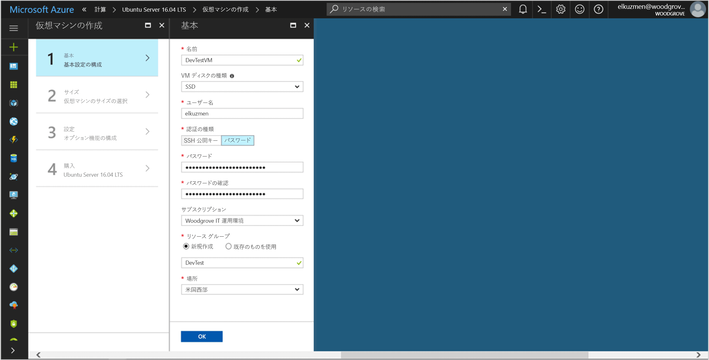

# <a name="use-a-linux-vm-managed-service-identity-to-access-azure-resource-manager"></a>Linux VM マネージド サービス ID を使用して Azure Resource Manager にアクセスする

[!INCLUDE[preview-notice](../../../includes/active-directory-msi-preview-notice.md)]

このチュートリアルでは、Linux 仮想マシンのマネージド サービス ID を有効にし、その ID を使用して Azure Resource Manager API にアクセスする方法について説明します。 管理対象のサービス ID は Azure によって自動的に管理され、資格情報をコードに挿入しなくても、Azure AD の認証をサポートするサービスへの認証を有効にします。 学習内容は次のとおりです。

> [!div class="checklist"]
> * Linux 仮想マシンでマネージド サービス ID を有効にする 
> * Azure Resource Manager で VM にリソース グループへのアクセスを許可する 
> * VM ID を使用してアクセス トークンを取得し、そのアクセス トークンを使用して Azure Resource Manager を呼び出す 

## <a name="prerequisites"></a>前提条件

[!INCLUDE [msi-qs-configure-prereqs](../../../includes/active-directory-msi-qs-configure-prereqs.md)]

[!INCLUDE [msi-tut-prereqs](../../../includes/active-directory-msi-tut-prereqs.md)]

## <a name="sign-in-to-azure"></a>Azure へのサインイン

Azure Portal ([https://portal.azure.com](https://portal.azure.com)) にサインインします。

## <a name="create-a-linux-virtual-machine-in-a-new-resource-group"></a>新しいリソース グループに Linux 仮想マシンを作成する

このチュートリアルでは、新しい Linux VM を作成します。 既存の VM でマネージド サービス ID を有効にすることもできます。

1. Azure Portal の左上隅にある **[リソースの作成]** ボタンをクリックします。
2. **[コンピューティング]**、**[Ubuntu Server 16.04 LTS]** の順に選択します。
3. 仮想マシンの情報を入力します。 **[認証の種類]** で、**[SSH 公開キー]** または **[パスワード]** を選択します。 作成した資格情報を使用して VM にログインできます。

    

4. ドロップダウンで仮想マシンの**サブスクリプション**を選択します。
5. 仮想マシンを作成する新しい**リソース グループ**を選択するには、**[新規作成]** を選択します。 完了したら、**[OK]** をクリックします。
6. VM のサイズを選択します。 その他のサイズも表示するには、**[すべて表示]** を選択するか、[サポートされるディスクの種類] フィルターを変更します。 設定ブレードで、既定値のまま **[OK]** をクリックします。

## <a name="enable-managed-service-identity-on-your-vm"></a>VM でマネージド サービス ID を有効にする

仮想マシンのマネージド サービス ID を使用すると、コードに資格情報を挿入しなくても、Azure AD からアクセス トークンを取得できます。 VM でマネージド サービス ID を有効にすると、VM が Azure Active Directory に登録されて、そのマネージド ID が作成され、VM で ID が構成されます。

1. マネージド サービス ID を有効にする**仮想マシン**を選択します。
2. 左側のナビゲーション バーで、**[構成]** をクリックします。
3. **管理対象のサービス ID** が表示されます。 マネージド サービス ID を登録して有効にする場合は **[はい]** を選択し、無効にする場合は [いいえ] を選択します。
4. **[保存]** をクリックして構成を保存します。

    

## <a name="grant-your-vm-access-to-a-resource-group-in-azure-resource-manager"></a>Azure Resource Manager で VM にリソース グループへのアクセスを許可する 

マネージド サービス ID を使用すると、Azure AD 認証をサポートするリソースに対して認証するためのアクセス トークンをコードで取得できます。 Azure Resource Manager API は、Azure AD の認証をサポートします。 最初に、Azure Resource Manager のリソース (ここでは、VM が含まれているリソース グループ) へのアクセスをこの VM の ID に許可する必要があります。  

1. **リソース グループ**のタブに移動します。
2. 先ほど作成した特定の**リソース グループ**を選択します。
3. 左側のパネルの **[アクセス制御 (IAM)]** に移動します。
4. VM 用に新しいロールの割り当てを**追加**します。 **[閲覧者]** として **[ロール]** を選択します。
5. 次のドロップダウンで、**[アクセスの割り当て先]** として **[仮想マシン]** リソースを選択します。
6. 次に、**[サブスクリプション]** ドロップダウンに適切なサブスクリプションが表示されていることを確認します。 **[リソース グループ]** で **[すべてのリソース グループ]** を選択します。
7. 最後に、**[選択]** の一覧で、使用する Linux 仮想マシンを選択し、**[保存]** をクリックします。

    

## <a name="get-an-access-token-using-the-vms-identity-and-use-it-to-call-resource-manager"></a>VM の ID を使用してアクセス トークンを取得し、このトークンを使用して Resource Manager を呼び出す 

これらの手順を完了するには、SSH クライアントが必要です。 Windows を使用している場合は、[Windows Subsystem for Linux](https://msdn.microsoft.com/commandline/wsl/about) で SSH クライアントを使用することができます。 SSH クライアント キーの構成について支援が必要な場合は、「[Azure 上の Windows で SSH キーを使用する方法](../../virtual-machines/linux/ssh-from-windows.md)」または「[Azure に Linux VM 用の SSH 公開キーと秘密キーのペアを作成して使用する方法](../../virtual-machines/linux/mac-create-ssh-keys.md)」をご覧ください。

1. ポータルで Linux VM に移動し、**[概要]** の **[接続]** をクリックします。  
2. 任意の SSH クライアントを使用して、VM に**接続**します。 
3. ターミナル ウィンドウで、CURL を使用して、ローカルのマネージド サービス ID エンドポイントに対して Azure Resource Manager のアクセス トークンを取得するよう要求します。  
 
    アクセス トークンの CURL 要求を次に示します。  
    
    ```bash
    curl 'http://169.254.169.254/metadata/identity/oauth2/token?api-version=2018-02-01&resource=https%3A%2F%2Fmanagement.azure.com%2F' -H Metadata:true   
    ```
    
    > [!NOTE]
    > "resource"パラメーターの値は、Azure AD で予期される値と完全に一致している必要があります。  Resource Manager のリソース ID の場合は、URI の末尾にスラッシュを含める必要があります。 
    
    応答には、Azure Resource Manager へのアクセスに必要なアクセス トークンが含まれています。 
    
    応答:  

    ```bash
    {"access_token":"eyJ0eXAiOi...",
    "refresh_token":"",
    "expires_in":"3599",
    "expires_on":"1504130527",
    "not_before":"1504126627",
    "resource":"https://management.azure.com",
    "token_type":"Bearer"} 
    ```
    
    このアクセス トークンを使用して、Azure Resource Manager にアクセスし、たとえば、この VM アクセスを許可した Resource Group の詳細を確認することができます。 \<SUBSCRIPTION ID\>、\<RESOURCE GROUP\>、および \<ACCESS TOKEN\> の値を、以前に作成した値で置き換えます。 
    
    > [!NOTE]
    > URL では大文字小文字が区別されるため、リソース グループの命名時に以前使用したものと同じ大文字小文字が使用されていること、および "resourceGroup" で大文字の "G" が使用されていることを確認してください。  
    
    ```bash 
    curl https://management.azure.com/subscriptions/<SUBSCRIPTION ID>/resourceGroups/<RESOURCE GROUP>?api-version=2016-09-01 -H "Authorization: Bearer <ACCESS TOKEN>" 
    ```
    
    応答は、特定の Resource Group の情報とともに返されます。 
     
    ```bash
    {"id":"/subscriptions/98f51385-2edc-4b79-bed9-7718de4cb861/resourceGroups/DevTest","name":"DevTest","location":"westus","properties":{"provisioningState":"Succeeded"}} 
    ```     

## <a name="next-steps"></a>次の手順

このチュートリアルでは、Azure Resource Manager API にアクセスするために、ユーザー割り当て ID を作成して、それを Azure Virtual Machine に添付する方法について学習しました。  Azure Resource Manager の詳細については、以下を参照してください。

> [!div class="nextstepaction"]
>[Azure Resource Manager](/azure/azure-resource-manager/resource-group-overview)