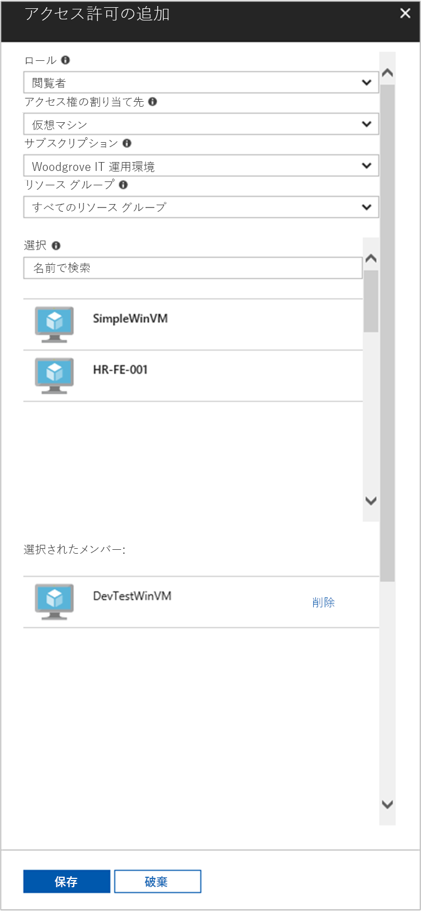

# <a name="use-a-windows-vm-managed-service-identity-to-access-resource-manager"></a>Windows VM のマネージド サービス ID を使用してリソース マネージャーにアクセスする

[!INCLUDE[preview-notice](../../../includes/active-directory-msi-preview-notice.md)]

このチュートリアルでは、Windows 仮想マシン (VM) に対してマネージド サービス ID を有効にする方法について説明します。 この ID を使用して、Azure Resource Manager API にアクセスできます。 管理対象のサービス ID は Azure によって自動的に管理され、資格情報をコードに挿入しなくても、Azure AD の認証をサポートするサービスへの認証を有効にします。 学習内容は次のとおりです。

> [!div class="checklist"]
> * Windows VM でマネージド サービス ID を有効にする 
> * Azure Resource Manager で VM にリソース グループへのアクセスを許可する 
> * VM ID を使用してアクセス トークンを取得し、そのアクセス トークンを使用して Azure Resource Manager を呼び出す

## <a name="prerequisites"></a>前提条件

[!INCLUDE [msi-qs-configure-prereqs](../../../includes/active-directory-msi-qs-configure-prereqs.md)]

[!INCLUDE [msi-tut-prereqs](../../../includes/active-directory-msi-tut-prereqs.md)]

## <a name="sign-in-to-azure"></a>Azure へのサインイン
Azure Portal ([https://portal.azure.com](https://portal.azure.com)) にサインインします。

## <a name="create-a-windows-virtual-machine-in-a-new-resource-group"></a>新しいリソース グループに Windows 仮想マシンを作成する

このチュートリアルでは、新しい Windows VM を作成します。  既存の VM でマネージド サービス ID を有効にすることもできます。

1.  Azure Portal の左上隅にある **[リソースの作成]** ボタンをクリックします。
2.  **[コンピューティング]**、**[Windows Server 2016 Datacenter]** の順に選択します。 
3.  仮想マシンの情報を入力します。 ここで作成した**ユーザー名**と**パスワード**は、仮想マシンへのログインに使用する資格情報になります。
4.  ドロップダウンで仮想マシンの適切な**サブスクリプション**を選択します。
5.  仮想マシンを作成する新しい**リソース グループ**を選択するには、**[新規作成]** を選択します。 完了したら、**[OK]** をクリックします。
6.  VM のサイズを選択します。 その他のサイズも表示するには、**[すべて表示]** を選択するか、**[Supported disk type (サポートされているディスクの種類)]** フィルターを変更します。 設定ページで、既定値のまま **[OK]** をクリックします。

    

## <a name="enable-managed-service-identity-on-your-vm"></a>VM でマネージド サービス ID を有効にする 

VM のマネージド サービス ID を使用すると、コードに資格情報を挿入しなくても、Azure AD からアクセス トークンを取得できます。 VM でマネージド サービス ID を有効にすると、VM が Azure Active Directory に登録されて、そのマネージド ID が作成され、VM で ID が構成されます。

1.  マネージド サービス ID を有効にする**仮想マシン**を選択します。  
2.  左側のナビゲーション バーで、**[構成]** をクリックします。 
3.  **管理対象のサービス ID** が表示されます。 マネージド サービス ID を登録して有効にする場合は **[はい]** を選択し、無効にする場合は [いいえ] を選択します。 
4.  **[保存]** をクリックして構成を保存します。  
    

## <a name="grant-your-vm-access-to-a-resource-group-in-resource-manager"></a>Resource Manager で VM にリソース グループへのアクセスを許可する
マネージド サービス ID を使用すると、Azure AD 認証をサポートするリソースに対して認証するためのアクセス トークンをコードで取得できます。  Azure Resource Manager は、Azure AD の認証をサポートします。  最初に、リソース マネージャーのリソース (ここでは、VM が含まれているリソース グループ) へのアクセスをこの VM の ID に許可する必要があります。  

1.  **リソース グループ**のタブに移動します。 
2.  **Windows VM** 用に作成した特定の**リソース グループ**を選択します。 
3.  左側のパネルの **[アクセス制御 (IAM)]** に移動します。 
4.  **Windows VM** 用に新しいロールの割り当てを**追加**します。  **[閲覧者]** として **[ロール]** を選択します。 
5.  次のドロップダウンで、**[アクセスの割り当て先]** として **[仮想マシン]** リソースを選択します。 
6.  次に、**[サブスクリプション]** ドロップダウンに適切なサブスクリプションが表示されていることを確認します。 **[リソース グループ]** で **[すべてのリソース グループ]** を選択します。 
7.  最後に、**[選択]** の一覧で使用する Windows VM を選択し、**[保存]** をクリックします。

    

## <a name="get-an-access-token-using-the-vm-identity-and-use-it-to-call-azure-resource-manager"></a>VM ID を使用してアクセス トークンを取得し、そのアクセス トークンを使用して Azure Resource Manager を呼び出す 

ここでは、**PowerShell** を使用する必要があります。  インストールしていない場合は、[ここから](https://docs.microsoft.com/powershell/azure/overview?view=azurermps-4.3.1)ダウンロードします。 

1.  ポータルで **[Virtual Machines]** にナビゲートして Windows 仮想マシンに移動し、**[概要]** の **[接続]** をクリックします。 
2.  Windows VM を作成したときに追加した**ユーザー名**と**パスワード**を入力します。 
3.  これで、仮想マシンを使用する**リモート デスクトップ接続**が作成されました。リモート セッションで **PowerShell** を開きます。 
4.  Powershell の Invoke-WebRequest を使用して、ローカルのマネージド サービス ID エンドポイントに対して Azure Resource Manager のアクセス トークンを取得するよう要求します。

    ```powershell
       $response = Invoke-WebRequest -Uri 'http://169.254.169.254/metadata/identity/oauth2/token?api-version=2018-02-01&resource=https%3A%2F%2Fmanagement.azure.com%2F' -Method GET -Headers @{Metadata="true"}
    ```
    
    > [!NOTE]
    > "resource"パラメーターの値は、Azure AD で予期される値と完全に一致している必要があります。 Azure Resource Manager のリソース ID を使用する場合は、URI の末尾にスラッシュを含める必要があります。
    
    次に、$response オブジェクト内で JavaScript オブジェクト表記 (JSON) 形式の文字列として格納されている完全な応答を抽出します。 
    
    ```powershell
    $content = $response.Content | ConvertFrom-Json
    ```
    次に、アクセス トークンを応答から抽出します。
    
    ```powershell
    $ArmToken = $content.access_token
    ```
    
    最後に、アクセス トークンを使用して Azure Resource Manager を呼び出します。 さらに、この例では、PowerShell の Invoke-WebRequest を使用して、Azure Resource Manager への呼び出しを行い、Authorization ヘッダーにアクセス トークンを含めます。
    
    ```powershell
    (Invoke-WebRequest -Uri https://management.azure.com/subscriptions/<SUBSCRIPTION ID>/resourceGroups/<RESOURCE GROUP>?api-version=2016-06-01 -Method GET -ContentType "application/json" -Headers @{ Authorization ="Bearer $ArmToken"}).content
    ```
    > [!NOTE] 
    > URL では大文字小文字が区別されるため、リソース グループの命名時に以前使用したものと同じ大文字小文字が使用されていること、および "resourceGroups" で大文字の "G" が使用されていることを確認してください。
        
    次のコマンドは、リソース グループの詳細を返します。

    ```powershell
    {"id":"/subscriptions/98f51385-2edc-4b79-bed9-7718de4cb861/resourceGroups/DevTest","name":"DevTest","location":"westus","properties":{"provisioningState":"Succeeded"}}
    ```

## <a name="next-steps"></a>次の手順

このチュートリアルでは、Azure Resource Manager API にアクセスするために、ユーザー割り当て ID を作成して、それを Azure Virtual Machine に添付する方法について学習しました。  Azure Resource Manager の詳細については、以下を参照してください。

> [!div class="nextstepaction"]
>[Azure Resource Manager](/azure/azure-resource-manager/resource-group-overview)

