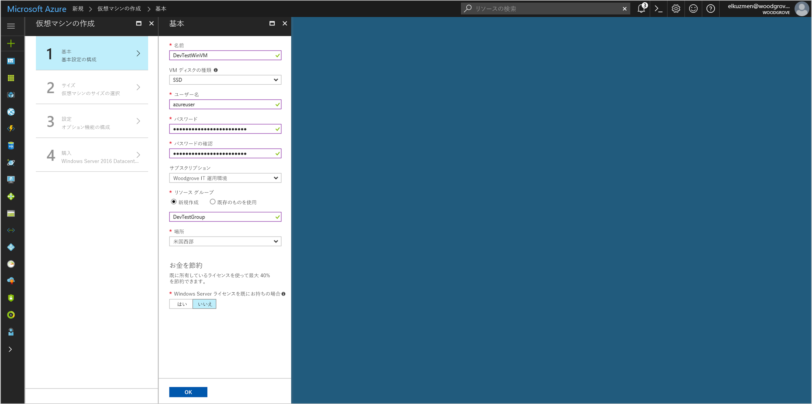
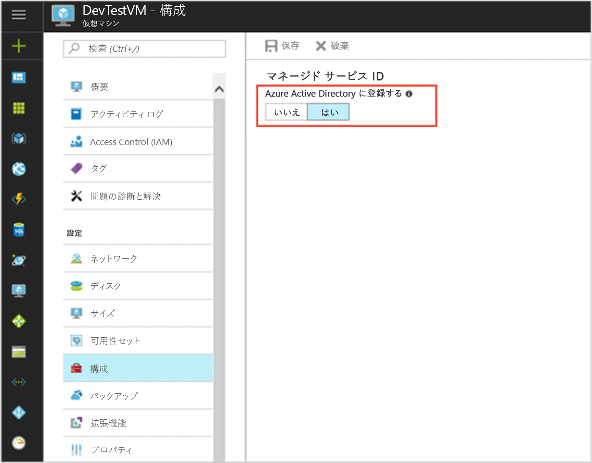

# <a name="tutorial-use-a-windows-vm-managed-service-identity-to-access-azure-sql"></a>チュートリアル: Windows VM マネージド サービス ID を使用して Azure SQL にアクセスする

[!INCLUDE[preview-notice](../../../includes/active-directory-msi-preview-notice.md)]

このチュートリアルでは、Windows 仮想マシン (VM) のマネージド サービス ID を使用して、Azure SQL サーバーにアクセスする方法について説明します。 管理対象サービス ID は Azure によって自動的に管理され、資格情報をコードに挿入しなくても、Azure AD 認証をサポートするサービスへの認証を有効にします。 学習内容は次のとおりです。

> [!div class="checklist"]
> * Windows VM でマネージド サービス ID を有効にする 
> * VM に Azure SQL サーバーへのアクセスを許可します。
> * VM ID を使用してアクセス トークンを取得し、それを使用して Azure SQL サーバーにクエリを実行する

## <a name="prerequisites"></a>前提条件

[!INCLUDE [msi-qs-configure-prereqs](../../../includes/active-directory-msi-qs-configure-prereqs.md)]

[!INCLUDE [msi-tut-prereqs](../../../includes/active-directory-msi-tut-prereqs.md)]

## <a name="sign-in-to-azure"></a>Azure へのサインイン

Azure Portal ([https://portal.azure.com](https://portal.azure.com)) にサインインします。

## <a name="create-a-windows-virtual-machine-in-a-new-resource-group"></a>新しいリソース グループに Windows 仮想マシンを作成する

このチュートリアルでは、新しい Windows VM を作成します。  既存の VM 上でマネージド サービス ID を有効にすることもできます。

1.  Azure Portal の左上隅にある **[リソースの作成]** ボタンをクリックします。
2.  **[コンピューティング]**、**[Windows Server 2016 Datacenter]** の順に選択します。 
3.  仮想マシンの情報を入力します。 ここで作成した**ユーザー名**と**パスワード**は、仮想マシンへのログインに使用する資格情報になります。
4.  ドロップダウンで仮想マシンの適切な**サブスクリプション**を選択します。
5.  仮想マシンを作成する新しい**リソース グループ**を選択するには、**[新規作成]** を選択します。 完了したら、**[OK]** をクリックします。
6.  VM のサイズを選択します。 その他のサイズも表示するには、**[すべて表示]** を選択するか、**[Supported disk type (サポートされているディスクの種類)]** フィルターを変更します。 設定ページで、既定値のまま **[OK]** をクリックします。

    

## <a name="enable-managed-service-identity-on-your-vm"></a>VM 上でマネージド サービス ID を有効にする 

VM のマネージド サービス ID を使用すると、コードに資格情報を挿入しなくても、Azure AD からアクセス トークンを取得できます。 マネージド サービス ID を有効にすると、VM のマネージド ID を作成するよう Azure に指示が出されます。 マネージド サービス ID を有効にすると、内部では VM が Azure Active Directory に登録されて、そのマネージド ID が作成され、VM で ID が構成されます。

1.  マネージド サービス ID を有効にする**仮想マシン**を選択します。  
2.  左側のナビゲーション バーで、**[構成]** をクリックします。 
3.  **管理対象のサービス ID** が表示されます。 マネージド サービス ID を登録して有効にする場合は **[はい]** を選択し、無効にする場合は [いいえ] を選択します。 
4.  **[保存]** をクリックして構成を保存します。  
    

## <a name="grant-your-vm-access-to-a-database-in-an-azure-sql-server"></a>VM に Azure SQL サーバー内のデータベースへのアクセス権を付与する

VM に Azure SQL サーバー内のデータベースへのアクセス権を付与できます。  この手順では、既存の SQL サーバーを使用するか、新しいサーバーを作成できます。  Azure ポータルを使用して新しいサーバーとデータベースを作成するには、[Azure SQL のクイック スタート](https://docs.microsoft.com/azure/sql-database/sql-database-get-started-portal)に従います。 [Azure SQL のドキュメント](https://docs.microsoft.com/azure/sql-database/)に、Azure CLI と Azure PowerShell を使用するクイックスタートも用意されています。

VM にデータベースへのアクセス権を付与するには次の 3 つの手順があります。
1.  Azure AD にグループを作成し、VM のマネージド サービス ID をそのグループのメンバーにします。
2.  SQL サーバーに対する Azure AD 認証を有効にします。
3.  Azure AD グループを表すデータベース内に**包含ユーザー**を作成します。

> [!NOTE]
> 通常は、VM のマネージド サービス ID に直接マップされる包含ユーザーを作成します。  現時点では、Azure SQL では、包含ユーザーにマップされる VM のマネージド サービス ID を表す Azure AD サービス プリンシパルは許可されていません。  サポートされている回避策として、VM のマネージド サービス ID を Azure AD グループのメンバーにした後、そのグループを表すデータベース内に包含ユーザーを作成します。


### <a name="create-a-group-in-azure-ad-and-make-the-vm-managed-service-identity-a-member-of-the-group"></a>Azure AD にグループを作成し、VM のマネージド サービス ID をそのグループのメンバーにする

既存の Azure AD グループを使用するか、Azure AD PowerShell を使用して新しいグループを作成できます。  

最初に、[Azure AD PowerShell](https://docs.microsoft.com/powershell/azure/active-directory/install-adv2) モジュールをインストールします。 次に、`Connect-AzureAD` を使用してサインインし、次のコマンドを実行してグループを作成し、それを変数に保存します。

```powershell
$Group = New-AzureADGroup -DisplayName "VM Managed Service Identity access to SQL" -MailEnabled $false -SecurityEnabled $true -MailNickName "NotSet"
```

出力は次のようになります。これは変数の値も調べます。

```powershell
$Group = New-AzureADGroup -DisplayName "VM Managed Service Identity access to SQL" -MailEnabled $false -SecurityEnabled $true -MailNickName "NotSet"
$Group
ObjectId                             DisplayName          Description
--------                             -----------          -----------
6de75f3c-8b2f-4bf4-b9f8-78cc60a18050 VM Managed Service Identity access to SQL
```

次に、グループに VM のマネージド サービス ID を追加します。  マネージド サービス ID の **ObjectId** が必要です。これは Azure PowerShell を使用して取得できます。  最初に、[Azure PowerShell](https://docs.microsoft.com/powershell/azure/install-azurerm-ps) をダウンロードします。 次に、`Connect-AzureRmAccount` を使用してサインインし、次のコマンドを実行して以下を行います。
- セッション コンテキストが目的の Azure サブスクリプションに設定されていることを確認します (複数のサブスクリプションがある場合)。
- Azure サブスクリプションで使用可能なリソースを一覧表示して、リソース グループと VM の名前が適切であることを確認します。
- `<RESOURCE-GROUP>` と `<VM-NAME>` の適切な値を使用して、マネージド サービス ID の VM のプロパティを取得します。

```powershell
Set-AzureRMContext -subscription "bdc79274-6bb9-48a8-bfd8-00c140fxxxx"
Get-AzureRmResource
$VM = Get-AzureRmVm -ResourceGroup <RESOURCE-GROUP> -Name <VM-NAME>
```

出力は次のようになります。これは、VM のマネージド サービス ID のサービス プリンシパル オブジェクト ID も調べます。
```powershell
$VM = Get-AzureRmVm -ResourceGroup DevTestGroup -Name DevTestWinVM
$VM.Identity.PrincipalId
b83305de-f496-49ca-9427-e77512f6cc64
```

これで、グループに VM のマネージド サービス ID を追加します。  グループへのサービス プリンシパルの追加は、Azure AD PowerShell でのみ実行できます。  次のコマンドを実行します。
```powershell
Add-AzureAdGroupMember -ObjectId $Group.ObjectId -RefObjectId $VM.Identity.PrincipalId
```

後でグループ メンバーシップの確認も行う場合、出力は次のようになります。

```powershell
Add-AzureAdGroupMember -ObjectId $Group.ObjectId -RefObjectId $VM.Identity.PrincipalId
Get-AzureAdGroupMember -ObjectId $Group.ObjectId

ObjectId                             AppId                                DisplayName
--------                             -----                                -----------
b83305de-f496-49ca-9427-e77512f6cc64 0b67a6d6-6090-4ab4-b423-d6edda8e5d9f DevTestWinVM
```

### <a name="enable-azure-ad-authentication-for-the-sql-server"></a>SQL サーバーに対する Azure AD 認証を有効にする

グループを作成し、メンバーシップに VM のマネージド サービス ID を追加したので、次の手順に従って [SQL サーバー用の Azure AD 認証を構成する](/azure/sql-database/sql-database-aad-authentication-configure#provision-an-azure-active-directory-administrator-for-your-azure-sql-server)ことができます。

1.  Azure ポータルで、左側のナビゲーションから **[SQL サーバー]** を選択します。
2.  Azure AD 認証で有効にする SQL サーバーをクリックします。
3.  ブレードの **[設定]** セクションで **[Active Directory 管理者]** をクリックします。
4.  コマンド バーで、**[管理者の設定]** をクリックします。
5.  サーバーの管理者になる Azure AD ユーザー アカウントを選択し、**[選択]** をクリックします。
6.  コマンド バーで、**[保存]** をクリックします。

### <a name="create-a-contained-user-in-the-database-that-represents-the-azure-ad-group"></a>Azure AD グループを表すデータベース内に包含ユーザーを作成する

この次の手順では、[Microsoft SQL Server Management Studio](https://docs.microsoft.com/sql/ssms/download-sql-server-management-studio-ssms) (SSMS) が必要になります。 始める前に、Azure AD 統合の背景について次の記事で確認しておくことも有益です。

- [SQL Database と SQL Data Warehouse でのユニバーサル認証 (MFA 対応の SSMS サポート)](/azure/sql-database/sql-database-ssms-mfa-authentication)
- [SQL Database または SQL Data Warehouse で Azure Active Directory 認証を構成して管理する](/azure/sql-database/sql-database-aad-authentication-configure)

1.  SQL Server Management Studio を起動します。
2.  **[サーバーに接続]** ダイアログで、**[サーバー名]** フィールドに SQL サーバーの名前を入力します。
3.  **[認証]** フィールドで、**[Active Directory - MFA サポートで汎用]** を選択します。
4.  **[ユーザー名]** フィールドに、サーバー管理者として設定した Azure AD アカウントの名前を入力します (例: helen@woodgroveonline.com)。
5.  **[オプション]** をクリックします。
6.  **[データベースに接続]** フィールドに、構成する非システム データベースの名前を入力します。
7.  **[接続]** をクリックします。  サインイン プロセスを完了します。
8.  **オブジェクト エクスプローラー**で、**[データベース]** フォルダーを展開します。
9.  ユーザー データベースを右クリックし、**[新しいクエリ]** をクリックします。
10.  クエリ ウィンドウで、次の行を入力し、ツールバーの **[実行]** をリックします。
    
     ```
     CREATE USER [VM Managed Service Identity access to SQL] FROM EXTERNAL PROVIDER
     ```
    
     コマンドは正常に完了し、グループの包含ユーザーが作成されます。
11.  クエリ ウィンドウをクリアし、次の行を入力し、ツールバーの **[実行]** をリックします。
     
     ```
     ALTER ROLE db_datareader ADD MEMBER [VM Managed Service Identity access to SQL]
     ```

     コマンドは正常に完了し、包含ユーザーにデータベース全体を読み取る権限が与えられます。

これで、VM で実行されるコードは、マネージド サービス ID からトークンを取得し、そのトークンを使用して SQL サーバーへの認証を行うようになりました。

## <a name="get-an-access-token-using-the-vm-identity-and-use-it-to-call-azure-sql"></a>VM ID を使用してアクセス トークンを取得し、それを使用して Azure SQL を呼び出す 

Azure SQL は Azure AD 認証をネイティブにサポートするため、マネージド サービス ID を使用して取得されたアクセス トークンを直接受け入れることができます。  SQL への接続を作成する**アクセス トークン** メソッドを使用します。  これは Azure SQL の Azure AD との統合の一部であり、接続文字列に資格情報を提供することとは異なります。

アクセス トークンを使用して SQL への接続を開く .Net のコード例を次に示します。  このコードは、VM のマネージド サービス ID エンドポイントにアクセスできる VM で実行する必要があります。  アクセス トークン メソッドを使用するには、**.Net Framework 4.6** 以降が必要です。  AZURE-SQL-SERVERNAME と DATABASE の値を適切な値に置き換えます。  Azure SQL のリソース ID が "https://database.windows.net/" であることにご注意ください。

```csharp
using System.Net;
using System.IO;
using System.Data.SqlClient;
using System.Web.Script.Serialization;

//
// Get an access token for SQL.
//
HttpWebRequest request = (HttpWebRequest)WebRequest.Create("http://169.254.169.254/metadata/identity/oauth2/token?api-version=2018-02-01&resource=https://database.windows.net/");
request.Headers["Metadata"] = "true";
request.Method = "GET";
string accessToken = null;

try
{
    // Call Managed Service Identity endpoint.
    HttpWebResponse response = (HttpWebResponse)request.GetResponse();

    // Pipe response Stream to a StreamReader and extract access token.
    StreamReader streamResponse = new StreamReader(response.GetResponseStream()); 
    string stringResponse = streamResponse.ReadToEnd();
    JavaScriptSerializer j = new JavaScriptSerializer();
    Dictionary<string, string> list = (Dictionary<string, string>) j.Deserialize(stringResponse, typeof(Dictionary<string, string>));
    accessToken = list["access_token"];
}
catch (Exception e)
{
    string errorText = String.Format("{0} \n\n{1}", e.Message, e.InnerException != null ? e.InnerException.Message : "Acquire token failed");
}

//
// Open a connection to the SQL server using the access token.
//
if (accessToken != null) {
    string connectionString = "Data Source=<AZURE-SQL-SERVERNAME>; Initial Catalog=<DATABASE>;";
    SqlConnection conn = new SqlConnection(connectionString);
    conn.AccessToken = accessToken;
    conn.Open();
}
```

または、アプリの記述と VM へのデプロイなしでエンド ツー エンドの設定をテストする簡単な方法は、PowerShell を使用することです。

1.  ポータルで **[Virtual Machines]** にナビゲートして Windows 仮想マシンに移動し、**[概要]** の **[接続]** をクリックします。 
2.  Windows VM を作成したときに追加した**ユーザー名**と**パスワード**を入力します。 
3.  これで、仮想マシンを使用する**リモート デスクトップ接続**が作成されました。リモート セッションで **PowerShell** を開きます。 
4.  Powershell の `Invoke-WebRequest` を使用して、ローカルの マネージド サービス ID エンドポイントに対して Azure SQL のアクセス トークンを取得するよう要求します。

    ```powershell
       $response = Invoke-WebRequest -Uri 'http://169.254.169.254/metadata/identity/oauth2/token?api-version=2018-02-01&resource=https%3A%2F%2Fdatabase.windows.net%2F' -Method GET -Headers @{Metadata="true"}
    ```
    
    応答を JSON オブジェクトから PowerShell オブジェクトに変換します。 
    
    ```powershell
    $content = $response.Content | ConvertFrom-Json
    ```

    応答からアクセス トークンを抽出します。
    
    ```powershell
    $AccessToken = $content.access_token
    ```

5.  SQL サーバーへの接続を開きます。 AZURE-SQL-SERVERNAME と DATABASE の値を置き換えることを忘れないでください。
    
    ```powershell
    $SqlConnection = New-Object System.Data.SqlClient.SqlConnection
    $SqlConnection.ConnectionString = "Data Source = <AZURE-SQL-SERVERNAME>; Initial Catalog = <DATABASE>"
    $SqlConnection.AccessToken = $AccessToken
    $SqlConnection.Open()
    ```

    次に、クエリを作成してサーバーに送信します。  TABLE の値を必ず置き換えてください。

    ```powershell
    $SqlCmd = New-Object System.Data.SqlClient.SqlCommand
    $SqlCmd.CommandText = "SELECT * from <TABLE>;"
    $SqlCmd.Connection = $SqlConnection
    $SqlAdapter = New-Object System.Data.SqlClient.SqlDataAdapter
    $SqlAdapter.SelectCommand = $SqlCmd
    $DataSet = New-Object System.Data.DataSet
    $SqlAdapter.Fill($DataSet)
    ```

`$DataSet.Tables[0]` の値を調べて、クエリの結果を確認します。  お疲れさまでした。VM のマネージド サービス ID を使用して、資格情報の指定なしでデータベースに対するクエリを実行できました。

## <a name="next-steps"></a>次の手順

このチュートリアルでは、Azure SQL Server にアクセスするためのマネージド サービス ID の作成方法について説明します。  Azure SQL Server の詳細については、以下を参照してください。

> [!div class="nextstepaction"]
>[Azure SQL Database サービス](/azure/sql-database/sql-database-technical-overview)
