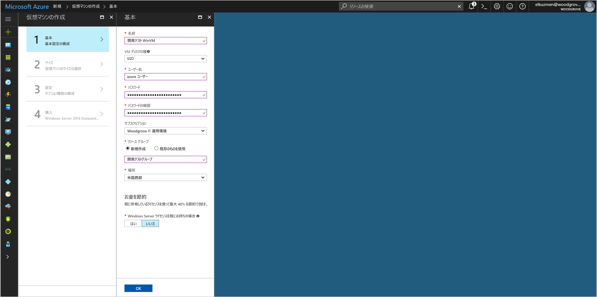

# <a name="use-managed-service-identity-msi-with-a-windows-vm-to-access-azure-key-vault"></a>Windows VM 管理対象サービス ID (MSI) を使用した Azure Key Vault へのアクセス 

[!INCLUDE[preview-notice](../../includes/active-directory-msi-preview-notice.md)]

このチュートリアルでは、Linux 仮想マシンの管理対象サービス ID (MSI) を有効にし、その ID を使用して Azure Key Vault にアクセスする方法について説明します。 管理対象のサービス ID は Azure によって自動的に管理され、資格情報をコードに挿入しなくても、Azure AD の認証をサポートするサービスへの認証を有効にします。 学習内容:


> [!div class="checklist"]
> * Windows 仮想マシンで管理対象サービス ID を有効にする 
> * Key Vault に格納されているシークレットへ VM のアクセスを許可する 
> * VM ID を使用してアクセス トークンを取得して、Key Vault からシークレットを取得する 


Azure サブスクリプションをお持ちでない場合は、開始する前に [無料アカウント](https://azure.microsoft.com/free/?WT.mc_id=A261C142F) を作成してください。

## <a name="sign-in-to-azure"></a>Azure へのサインイン

Azure Portal ([https://portal.azure.com](https://portal.azure.com)) にサインインします。

## <a name="create-a-windows-virtual-machine-in-a-new-resource-group"></a>新しいリソース グループに Windows 仮想マシンを作成する

このチュートリアルでは、新しい Windows VM を作成します。 既存の VM で MSI を有効にすることもできます。

1.  Azure Portal の左上にある **[新規]** ボタンをクリックします。
2.  **[コンピューティング]**、**[Windows Server 2016 Datacenter]** の順に選択します。 
3.  仮想マシンの情報を入力します。 ここで作成した**ユーザー名**と**パスワード**は、仮想マシンへのログインに使用する資格情報になります。
4.  ドロップダウンで仮想マシンの適切な**サブスクリプション**を選択します。
5.  仮想マシンを作成する新しい**リソース グループ**を選択するには、**[新規作成]** を選択します。 完了したら、**[OK]** をクリックします。
6.  VM のサイズを選択します。 その他のサイズも表示するには、**[すべて表示]** を選択するか、**[Supported disk type (サポートされているディスクの種類)]** フィルターを変更します。 設定ブレードで、既定値のまま **[OK]** をクリックします。

    

## <a name="enable-msi-on-your-vm"></a>VM で MSI を有効にする 

仮想マシンの MSI を使用すると、コードに資格情報を挿入しなくても、Azure AD からアクセス トークンを取得できます。 MSI を有効にすると、仮想マシンの管理対象 ID を作成するよう Azure に指示が出されます。 内部的には、MSI を有効にすると、VM に MSI VM 拡張機能がインストールされ、Azure Resource Manager で MSI が有効化されます。

1.  MSI を有効にする**仮想マシン**を選択します。  
2.  左側のナビゲーション バーで、**[構成]** をクリックします。 
3.  **管理対象のサービス ID** が表示されます。 MSI を登録して有効にする場合は **[はい]** を選択し、無効にする場合は [いいえ] を選択します。 
4.  **[保存]** をクリックして構成を保存します。  

    

5. この VM で有効になっている拡張機能を確認して検証する場合は、**[拡張機能]** をクリックします。 MSI が有効になっている場合、**ManagedIdentityExtensionforWindows** が一覧に表示されます。

    

## <a name="grant-your-vm-access-to-a-secret-stored-in-a-key-vault"></a>Key Vault に格納されているシークレットへ VM のアクセスを許可する 
 
MSI を使用すると、Azure AD 認証をサポートするリソースに対して認証するためのアクセス トークンをコードで取得できます。  ただし、すべての Azure サービスが Azure AD 認証をサポートしているわけではありません。 Azure AD 認証をサポートしていないサービスで MSI を使用する場合、これらのサービスで必要な資格情報を Azure Key Vault に格納し、MSI を使用して Key Vault に認証して資格情報を取得することができます。 

まず、Key Vault を作成し、VM の ID に Key Vault へのアクセスを許可する必要があります。   

1. 左側のナビゲーション バーの上部で、**[+ 新規]**、**[セキュリティ + ID]**、**[Key Vault]** の順に選択します。  
2. 新しい Key Vault の**名前**を入力します。 
3. 以前に作成した VM と同じサブスクリプションおよびリソース グループで、Key Vault を見つけます。 
4. **[アクセス ポリシー]** を選択して **[新規追加]** ボタンをクリックします。 
5. テンプレートの [構成] で、**[シークレットの管理]** を選択します。 
6. **[プリンシパルの選択]** を選択し、検索フィールドに以前に作成した VM の名前を入力します。  結果一覧で VM を選択し、**[選択]** をクリックします。 
7. **[OK]** をクリックして新しいアクセス ポリシーの追加を終了し、**[OK]** をクリックしてアクセス ポリシーの選択を完了します。 
8. **[作成]** をクリックして Key Vault の作成を完了します。 

    


次に、Key Vault にシークレットを追加して、後で VM で実行されているコードを使用して、シークレットを取得できるようにします。 

1. **[すべてのリソース]** を選択し、作成したばかりの Key Vault を検索して選択します。 
2. **[シークレット]** を選択し、**[追加]** をクリックします。 
3. **アップロード オプション**から **[手動]** を選択します。 
4. シークレットの名前と値を指定します。  値は任意のものを指定できます。 
5. アクティブ化した日付と有効期限の日付をクリアのままにし、**[有効]** を **[はい]** のままにします。 
6. **[作成]** をクリックしてシークレットを作成します。 
 
## <a name="get-an-access-token-using-the-vm-identity-and-use-it-retrieve-the-secret-from-the-key-vault"></a>VM ID を使用してアクセス トークンを取得して、Key Vault からシークレットを取得する  

これで、シークレットが作成され、Key Vault に格納され、Key Vault へのアクセスが VM MSI に許可されたため、実行時にシークレットを取得するコードを作成することができます。  この例を簡単に示すため、PowerShell を使用して単純な REST 呼び出しを使用します。  PowerShell をインストールしていない場合は、[ここから](https://docs.microsoft.com/powershell/azure/overview?view=azurermps-4.3.1)ダウンロードします。

最初に、VM の MSI を使用して Key Vault に認証するためのアクセス トークンを取得します。
 
1. ポータルで **[Virtual Machines]** にナビゲートして Windows 仮想マシンに移動し、**[概要]** の **[接続]** をクリックします。
2. **Windows VM** を作成したときに追加した**ユーザー名**と**パスワード**を入力します。  
3. これで、仮想マシンを使用する**リモート デスクトップ接続**が作成されました。リモート セッションで PowerShell を開きます。  
4. PowerShell では、テナント上で Web 要求を呼び出し、VM の特定のポートでローカル ホストのトークンを取得します。  

    PowerShell は次のものを要求します。
    
    ```powershell
    PS C:\> $response = Invoke-WebRequest -Uri http://localhost:50342/oauth2/token -Method GET -Body @{resource="https://vault.azure.net"} -Headers @{Metadata="true"} 
    ```
    
    次に、$response オブジェクト内で JavaScript オブジェクト表記 (JSON) 形式の文字列として格納されている完全な応答を抽出します。  
    
    ```powershell
    PS C:\> $content = $response.Content | ConvertFrom-Json 
    ```
    
    次に、アクセス トークンを応答から抽出します。  
    
    ```powershell
    PS C:\> $KeyVaultToken = $content.access_token 
    ```
    
    最後に、PowerShell の Invoke-WebRequest コマンドを使用して、Key Vault で以前に作成したシークレットを取得し、Authorization ヘッダーにアクセス トークンを渡します。  Key Vault の **[概要]** ページの **[要点]** セクションにある Key Vault の URL が必要です。  
    
    ```powershell
    PS C:\> (Invoke-WebRequest -Uri https://<your-key-vault-URL>/secrets/<secret-name>?api-version=2016-10-01 -Method GET -Headers @{Authorization="Bearer $KeyVaultToken"}).content 
    ```
    
    応答は次のようになります。 
    
    ```powershell
    {"value":"p@ssw0rd!","id":"https://mytestkeyvault.vault.azure.net/secrets/MyTestSecret/7c2204c6093c4d859bc5b9eff8f29050","attributes":{"enabled":true,"created":1505088747,"updated":1505088747,"recoveryLevel":"Purgeable"}} 
    ```
    
Key Vault からシークレットを取得した後は、名前とパスワードを必要とするサービスへの認証にそのシークレットを使用できます。 

## <a name="related-content"></a>関連コンテンツ

- MSI の概要については、[管理対象サービス ID の概要](../active-directory/msi-overview.md)に関する記事をご覧ください。

Microsoft のコンテンツ改善のため、次のコメント セクションよりご意見をお寄せください。
