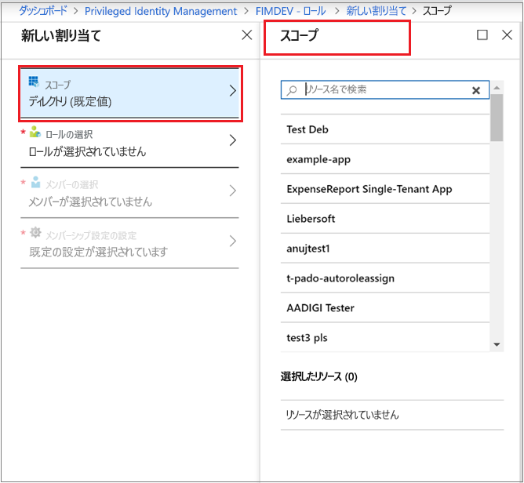
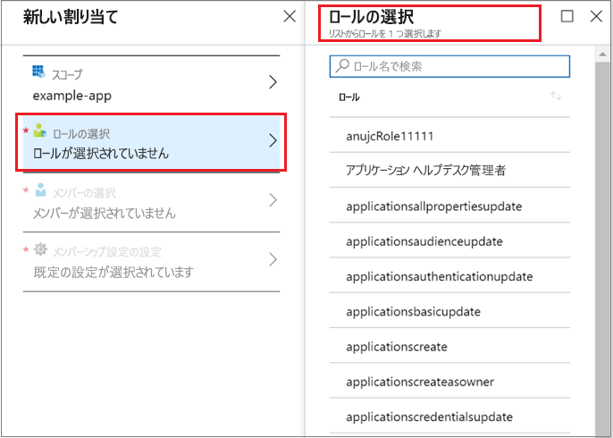
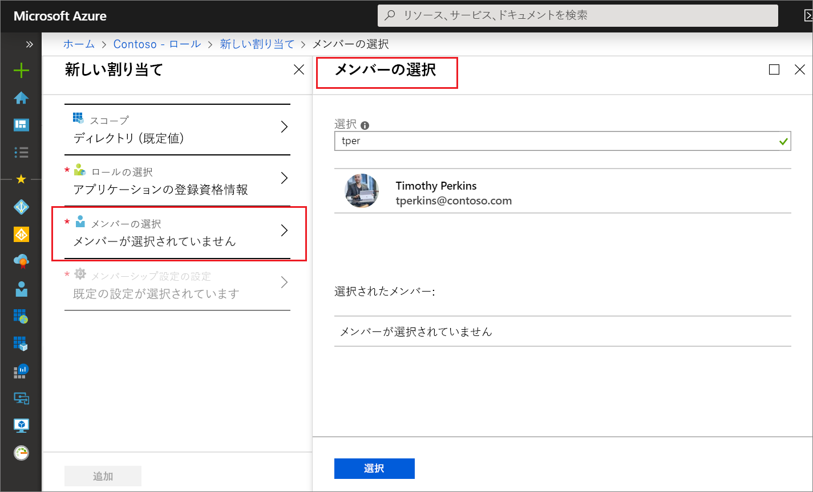
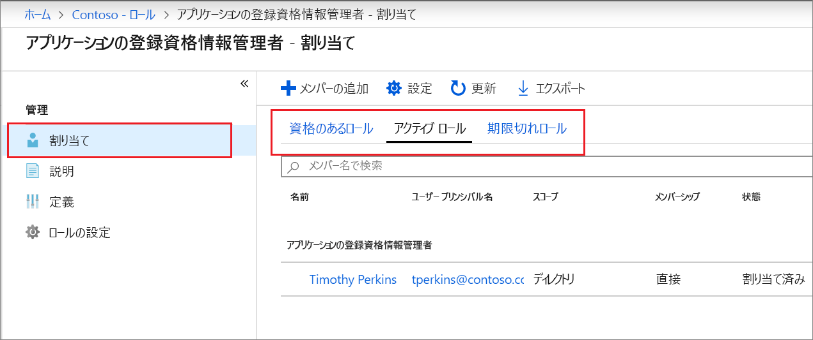

# Privileged Identity Management (PIM) で Azure AD のカスタム ロールを割り当てる

この記事では、Privileged Identity Management (PIM) を使用して Just-In-Time の割り当てと期間限定の割り当てを作成する方法について説明します。Azure Active Directory (Azure AD) の管理エクスペリエンスから、アプリケーション管理用に作成されたカスタム ロールへの割り当てを必要なときに作成したり期間限定で作成したりすることができます。

- Azure AD でカスタム ロールを作成してアプリケーション管理を委任する方法について詳しくは、「[Azure Active Directory でのカスタム管理者ロール (プレビュー)](../users-groups-roles/roles-custom-overview.md)」を参照してください。
- まだ Privileged Identity Management を使用したことがない方は、[Privileged Identity Management の使用を開始する](pim-getting-started.md)方法に関するページで詳しい情報をご覧いただけます。
- Privileged Identity Management を管理するためのアクセス権を別の管理者に付与する方法については、「[Privileged Identity Management を管理する他の管理者にアクセス権を付与する](pim-how-to-give-access-to-pim.md)」を参照してください。

> [!NOTE]
> プレビュー段階では、Azure AD のカスタム ロールがビルトイン ディレクトリ ロールと連携していません。 その機能の一般提供が開始されれば、ビルトイン ロールのエクスペリエンスでロールの管理が行えるようになります。 次のバナーが表示される場合は、これらのロールは[組み込みロールのエクスペリエンスで](pim-how-to-activate-role.md)管理する必要があり、この記事は適用されません。
>
> 

## ロールの割り当て

Azure Active Directory (Azure AD) のアプリケーション管理で作成できるカスタム ロールは、Privileged Identity Management で管理することができます。  カスタム ディレクトリ ロールに対する "資格のある割り当て" を作成するには、次の手順に従います。

1. 特権ロール管理者のロールに割り当てられたユーザー アカウントで、Azure portal の [Privileged Identity Management](https://portal.azure.com/?Microsoft_AAD_IAM_enableCustomRoleManagement=true&Microsoft_AAD_IAM_enableCustomRoleAssignment=true&feature.rbacv2roles=true&feature.rbacv2=true&Microsoft_AAD_RegisteredApps=demo#blade/Microsoft_Azure_PIMCommon/CommonMenuBlade/quickStart) にサインインします。
1. **[Azure AD カスタム ロール (プレビュー)]** を選択します。

    ![[Azure AD カスタム ロール (プレビュー)] を選択して資格のあるロールの割り当てを表示する](./media/azure-ad-custom-roles-assign/view-custom.png)

1. **[ロール]** を選択して、Azure AD アプリケーションのカスタム ロールを一覧表示します。

    ![[ロール] を選択して資格のあるロールの割り当てを一覧表示する](./media/azure-ad-custom-roles-assign/view-roles.png)

1. **[メンバーの追加]** を選択して割り当てページを開きます。
1. ロールの割り当てのスコープを 1 つのアプリケーションに限定する場合は、 **[スコープ]** を選択してアプリケーション スコープを指定します。

    

1. **[ロールを選択]** を選択して **[ロールを選択]** リストを開きます。

    

1. 割り当てるロールを選択し、 **[選択]** をクリックします。 **[メンバーの選択]** リストが表示されます。

    

1. ロールに割り当てるユーザーを選び、 **[選択]** をクリックします。 **[メンバーシップ設定]** リストが表示されます。

    ![ロールの割り当ての種類を [対象] または [アクティブ] に設定する](./media/azure-ad-custom-roles-assign/membership-settings.png)

1. **[メンバーシップ設定]** ページで **[対象]** または **[アクティブ]** を選択します。

    - **[対象]** 割り当ての場合、ロールに割り当てられたユーザーがそのロールを使用するためには、あらかじめアクションを実行する必要があります。 要求されるアクションには、多要素認証チェックの成功、業務上の妥当性の指定、指定された承認者に対する承認要求などがあります。
    - **[アクティブ]** 割り当ての場合、割り当てられたユーザーは、一切アクションを実行せずにロールを使用することができます。 アクティブ ユーザーは、ロールに割り当てられた特権を常に有します。

1. **[永続]** チェック ボックスが存在していて選択可能である場合 (ロールの設定により異なります)、割り当てを永続的なものにするかどうかを指定できます。 割り当てを永続的に有資格の状態にするか、永続的に割り当てられた状態にする場合は、チェック ボックスをオンにしてください。 割り当ての期間を指定する場合は、チェック ボックスをオフにします。
1. 新しいロールの割り当てを作成するには、 **[保存]** をクリックし、 **[追加]** をクリックします。 割り当てプロセスの状態通知が表示されます。

ロールの割り当てを確認するには、開いているロールで **[割り当て]**  >  **[割り当て]** の順に選択し、ロールの割り当てが "対象" または "アクティブ" として適切に識別されていることを確認します。

 

## 次のステップ

- [Azure AD のカスタム ロールをアクティブ化する](azure-ad-custom-roles-assign.md)
- [Azure AD のカスタム ロールの割り当てを削除または更新する](azure-ad-custom-roles-update-remove.md)
- [Azure AD のカスタム ロールの割り当てを構成する](azure-ad-custom-roles-configure.md)
- [Azure AD のロールの定義](../users-groups-roles/directory-assign-admin-roles.md)
