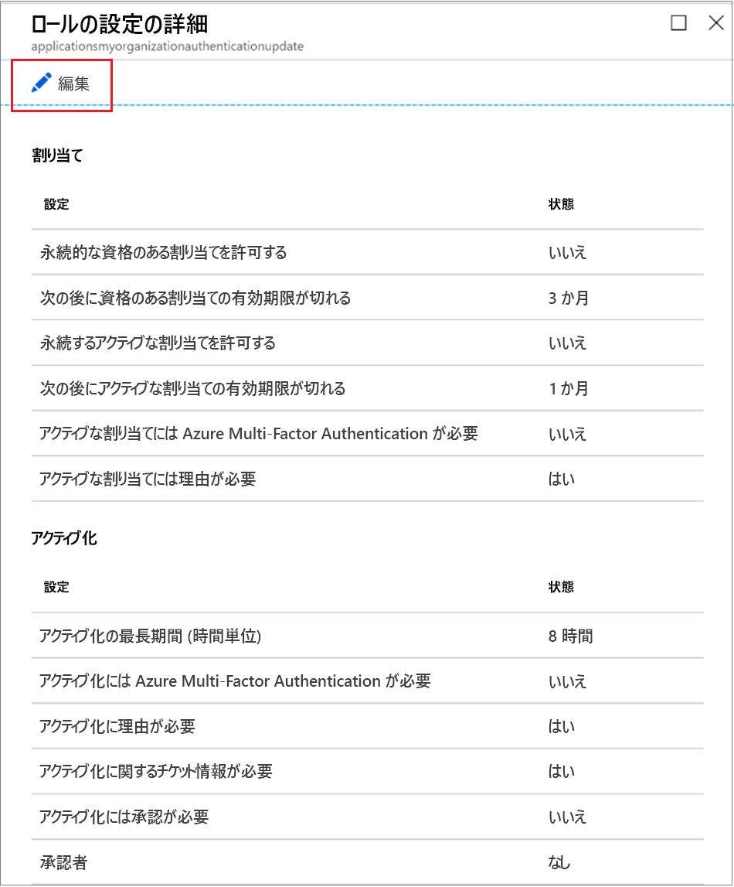
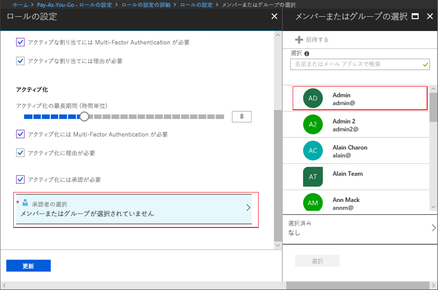

# Privileged Identity Management で Azure AD のカスタム ロールを構成する

特権ロール管理者は、ユーザーがカスタム ロールに対する自身の割り当てをアクティブ化したときに適用されるロールの設定を変更したり、カスタム ロールを割り当てる側の他のアプリケーション管理者のロールの設定を変更したりすることができます。

## ロールの設定を開く

次の手順を実行して、Azure AD ロールの設定を開きます。

1. 特権ロール管理者のロールに割り当てられたユーザー アカウントで、Azure portal の [Privileged Identity Management](https://portal.azure.com/?Microsoft_AAD_IAM_enableCustomRoleManagement=true&Microsoft_AAD_IAM_enableCustomRoleAssignment=true&feature.rbacv2roles=true&feature.rbacv2=true&Microsoft_AAD_RegisteredApps=demo#blade/Microsoft_Azure_PIMCommon/CommonMenuBlade/quickStart) にサインインします。
1. **[Azure AD カスタム ロール (プレビュー)]** を選択します。

    ![[Azure AD カスタム ロール (プレビュー)] を選択して資格のあるロールの割り当てを表示する](./media/azure-ad-custom-roles-configure/settings-list.png)

1. **[設定]** を選択して **[設定]** ページを開きます。 設定を構成したいロールを選択します。
1. **[編集]** を選択して **[ロールの設定]** ページを開きます。

    

## ロールの設定

構成できる設定はいくつか存在します。

### 割り当て期間

ロールの設定を構成するときに、割り当ての種類 (対象とアクティブ) ごとに 2 とおりの割り当て期間を選択できます。 これらのオプションは、Privileged Identity Management でメンバーがロールに割り当てられるときの既定の最大期間になります。

"*資格のある*" 割り当ての期間について、次のいずれかのオプションを選択できます。

- **永続的に資格のある割り当てを許可する**: 管理者は、永続的に資格のあるメンバーシップを割り当てることができます。
- **資格のある割り当てが次の期間後に期限切れになる**: 管理者は、すべての資格のある割り当てに、開始日と終了日の指定を必須にすることができます。

また、"*アクティブな*" 割り当ての期間については、次のいずれかのオプションを選択できます。

- **永続するアクティブな割り当てを許可する**: 管理者は、永続的にアクティブなメンバーシップを割り当てることができます。
- **アクティブな割り当てが次の期間後に期限切れになる**: 管理者は、すべてのアクティブな割り当てに、開始日と終了日の指定を必須にすることができます。

### Azure Multi-Factor Authentication を必須とする

Privileged Identity Management では、2 つの異なるシナリオで、必要に応じて Azure Multi-factor Authentication を強制できます。

- **アクティブな割り当てに多要素認証が必要**

  ロールにメンバーを割り当てるべき期間が短い場合 (たとえば 1 日)、時間がかかりすぎて、その割り当て対象のメンバーにアクティブ化を要求させることができない場合があります。 このシナリオでは、ユーザーは割り当てられた瞬間からそのロールでアクティブになるため、各自がそのロールの割り当てをアクティブ化するときに、Privileged Identity Management で Multi-Factor Authentication を強制することができません。 割り当てを実行する管理者が本人であることを保証するためには、 **[アクティブな割り当てに多要素認証が必要]** ボックスを選択します。

- **アクティブ化に Azure Multi-Factor Authentication を必要とする**

  ロールへの割り当て資格のあるユーザーが、アクティブ化を行うための条件として、Azure Multi-Factor Authentication への登録を必須とすることができます。 このプロセスにより、アクティブ化を要求しているユーザーが、確かに本人が言うような人物であることが合理的かつ確実に保証されます。 このオプションを強制すると、ユーザー アカウントが侵害された可能性がある状況で、重要なロールが保護されます。 資格のあるメンバーに対して、アクティブ化の前に Azure Multi-Factor Authentication の実行を必須にするには、 **[アクティブ化には Multi-Factor Authentication が必要です]** チェックボックスをオンにします。

詳細については、[Multi-Factor Authentication と Privileged Identity Management](pim-how-to-require-mfa.md) に関するページを参照してください。

### アクティブ化の最大期間

**[アクティブ化の最大期間]** スライダーを使用して、ロールの有効期限が切れるまでの最大時間 (時間単位) を設定します。 1 から 24 時間の範囲の値を指定できます。

### 理由を必須にする

アクティブな割り当てに対して、またはアクティブ化するときに、メンバーに理由の入力を必須にすることができます。 理由を必須にするには、 **[アクティブな割り当てに理由が必要]** チェック ボックスまたは **[アクティブ化に理由が必要]** ボックスをオンにします。

### アクティブ化の承認を必須にする

ロールをアクティブ化するには承認を必須にする場合は、次の手順を実行します。

1. **[アクティブにするには承認が必要です]** チェックボックスをオンにします。
1. **[承認者の選択]** を選択して **[メンバーまたはグループの選択]** リストを開きます。

    

1. 少なくとも 1 つのメンバーまたはグループを選択し、 **[選択]** をクリックします。 少なくとも 1 人の承認者を選択する必要があります。 既定の承認者はいません。 選択した承認者の一覧に選択内容が表示されます。
1. ロール設定を指定したら、 **[更新]** を選択して変更を保存します。

## 次のステップ

- [Azure AD のカスタム ロールをアクティブ化する](azure-ad-custom-roles-assign.md)
- [Azure AD のカスタム ロールを割り当てる](azure-ad-custom-roles-assign.md)
- [Azure AD のカスタム ロールの割り当てを削除または更新する](azure-ad-custom-roles-update-remove.md)
- [Azure AD のロールの定義](../users-groups-roles/directory-assign-admin-roles.md)
