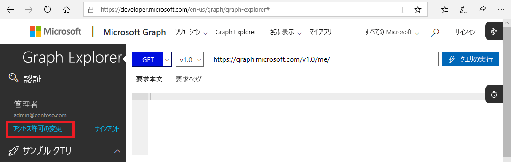
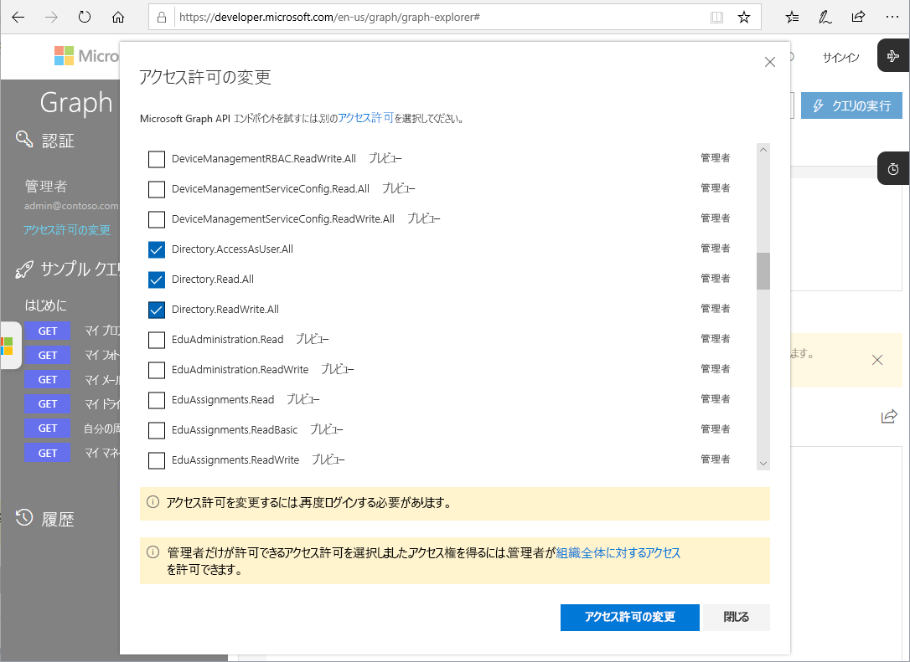

# Privileged Identity Management 向けの Microsoft Graph API (プレビュー)

Azure Active Directory の [Microsoft Graph API](https://developer.microsoft.com/graph/docs/concepts/overview) を使用して、Privileged Identity Management タスクを実行できます。 この記事では、Privileged Identity Management 向けの Microsoft Graph API シリーズを使用するための重要な概念について説明します。

Microsoft Graph API の詳細については、[Azure AD Privileged Identity Management API のリファレンス](https://developer.microsoft.com/graph/docs/api-reference/beta/resources/privilegedidentitymanagement_root)に関するページをご確認ください。

> [!IMPORTANT]
> Microsoft Graph でベータ版の API はプレビュー段階であり、変更されることがあります。 実稼働アプリケーションにおけるこれらの API の使用はサポートされていません。

## 必要なアクセス許可

Privileged Identity Management 向けの Microsoft Graph API シリーズを呼び出すには、以下のアクセス許可が **1 つまたは複数**必要です。

- `Directory.AccessAsUser.All`
- `Directory.Read.All`
- `Directory.ReadWrite.All`
- `PrivilegedAccess.ReadWrite.AzureAD`

### アクセス許可を設定する

アプリケーションが Privileged Identity Management 向けの Microsoft Graph API シリーズを呼び出すには、それらが必要なアクセス許可を備えていなければなりません。 必要なアクセス許可を指定する最も簡単な方法は、[Azure AD 同意フレームワーク](../develop/consent-framework.md)を使用することです。

### Graph エクスプローラーでアクセス許可を設定する

ご自分の呼び出しをテストするために Graph エクスプローラーを使用している場合は、お客様はツール内でアクセス許可を指定できます。

1. グローバル管理者として [Graph エクスプローラー](https://developer.microsoft.com/graph/graph-explorer)にサインインします。

1. **[アクセス許可の変更]** をクリックします。

    

1. 含めたいアクセス許可の横にあるチェック ボックスをオンにします。 `PrivilegedAccess.ReadWrite.AzureAD` は、Graph エクスプローラーではまだ使用できません。

    

1. **[アクセス許可の変更]** をクリックして、アクセス許可の変更を適用します。

## 次のステップ

- [Azure AD Privileged Identity Management API のリファレンス](https://developer.microsoft.com/graph/docs/api-reference/beta/resources/privilegedidentitymanagement_root)
