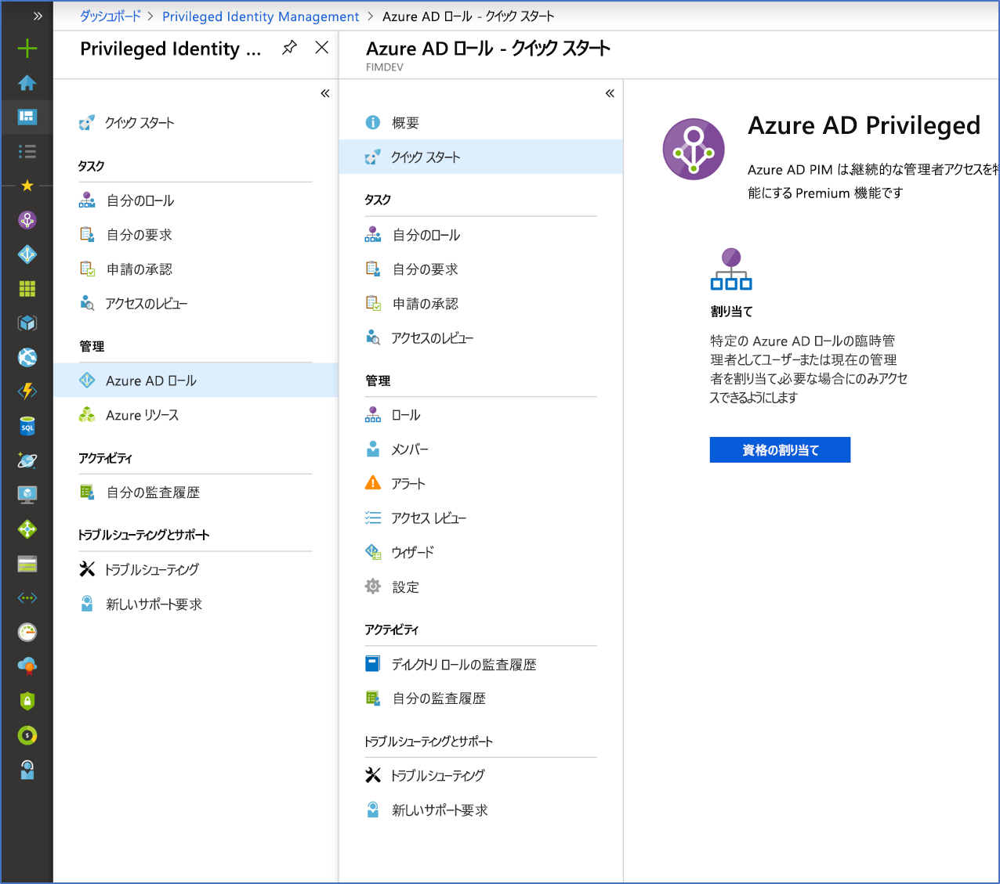

# Azure AD Privileged Identity Management とは

Azure Active Directory (Azure AD) Privileged Identity Management (PIM) は、お客様の組織内の重要なリソースへのアクセスを管理、制御、監視することができるサービスです。 その対象には、Azure AD や Azure リソースをはじめとする各種 Microsoft Online Services (Office 365、Microsoft Intune など) 内のリソースへのアクセスが含まれます。

## PIM を使用すべき理由

組織では、セキュリティで保護された情報またはリソースへのアクセス権を持つユーザーの数を最小限に抑える必要があります。そうすることで、悪意のあるアクターがこのようなアクセス権を手にしたり、許可されているユーザーの不注意で機密性の高いリソースに影響が及んだりする可能性が抑えられるためです。 しかし一方で、ユーザーは Azure AD、Azure、Office 365、または SaaS アプリケーションで特権操作を実行する必要があります。 組織は、Azure リソースおよび Azure AD への Just-In-Time (JIT) の特権アクセスをユーザーに付与できます。 そこで、そうしたユーザーが管理者特権で何をしているかについて監視することが必要となります。 PIM は、アクセス権の過剰、無駄、乱用に伴うリスクを軽減するのに役立ちます。

## PIM でできること

PIM の基本的な機能は、重要なリソースについて、"だれが、何を、いつ、どこで、なぜ" を管理することです。 以下に、PIM の主な機能をいくつか示します。

- Azure AD と Azure のリソースに対する **Just-In-Time** の特権アクセスを提供する
- 開始日と終了日を使用した**期限付き**アクセス権をリソースに割り当てる
- 特権ロールをアクティブ化するために**承認**を要求する
- ロールをアクティブ化するために**多要素認証**を強制する
- なぜユーザーをアクティブ化するのかを把握するために**理由**を使用する
- 特権ロールがアクティブ化されたときに**通知**を受ける
- 継続してユーザーにロールが必要であることを確認するために**アクセス レビュー**を実施する
- 社内監査または外部監査に使用する**監査履歴**をダウンロードする

## 前提条件

PIM を使用するには、次のいずれかの有料ライセンスまたは試用版ライセンスが必要です。 詳細については、「[Azure Active Directory とは](../fundamentals/active-directory-whatis.md)」を参照してください。

- Azure AD Premium P2
- Enterprise Mobility + Security (EMS) E5

ユーザーのライセンスについては、「[PIM を使用するためのライセンスの要件](subscription-requirements.md)」を参照してください。

## 用語集

PIM とそのドキュメントについてより深く理解するためには、次の用語をご確認いただく必要があります。

| 用語または概念 | ロールの割り当てのカテゴリ | 説明 |
| --- | --- | --- |
| 有資格 | Type | ロールを使用するためにユーザーが少なくとも 1 つのアクションを実行する必要があるロールの割り当て。 あるロールに対して資格があるとは、特権タスクを実行する必要が生じたときに、ユーザーがそのロールをアクティブ化できることを意味します。 ロールへの永続的な割り当てと、ロールの候補としての割り当てに、アクセスの違いはありません。 常時のアクセスを必要としないユーザーがいる、というのが唯一の違いです。 |
| active | Type | ロールを使用するためにユーザーが何のアクションも実行する必要がないロールの割り当て。 アクティブとして割り当てられたユーザーは、そのロールに割り当てられた特権を持ちます。 |
| アクティブ化 |  | ユーザーに資格のあるロールを使用するために、1 つまたは複数のアクションを実行するプロセス。 要求されるアクションには、多要素認証 (MFA) チェックの実行、業務上の妥当性の指定、指定された承認者に対する承認要求などがあります。 |
| 割り当て済み | 状態 | アクティブなロールの割り当てを持つユーザー。 |
| アクティブ化済み | 状態 | ロールの割り当ての資格を持ち、ロールをアクティブ化するためのアクションを実行して、アクティブになったユーザー。  アクティブになったユーザーは、事前構成済みの期間、そのロールを使用することができ、その期間の経過後は再度アクティブ化する必要があります。 |
| 永続的に有資格 | Duration | ロールをアクティブ化する資格が常にユーザーにあるロールの割り当て。 |
| 永続的にアクティブ | Duration | 何もアクションを実行しなくても、ユーザーがロールを常に使用できるロールの割り当て。 |
| 有効期限付きの有資格 | Duration | ユーザーに、指定された開始日と終了日の範囲内でロールをアクティブ化する資格があるロールの割り当て。 |
| 有効期限付きアクティブ | Duration | 指定された開始日と終了日の範囲内であれば、何もアクションを実行しなくてもユーザーがロールを使用できるロールの割り当て。 |
| Just-In-Time (JIT) アクセス |  | 悪意のあるユーザーまたは未承認ユーザーがアクセス許可の期限が切れた後にアクセスできないように、ユーザーに特権タスクを実行する一時的なアクセス許可を与えるモデル。 ユーザーが必要な場合にのみ、アクセスが許可されます。 |
| 最小特権アクセスの原則 |  | すべてのユーザーに、実行権限があるタスクを実行するのに必要な最小特権のみを与える、推奨されるセキュリティ プラクティス。 このプラクティスではグローバル管理者の数を最小限にし、代わりに、特定のシナリオで特定の管理者ロールが使用されます。 |

## 実際の PIM の画面

PIM を設定すると、左側のナビゲーション メニューに **[タスク]**、**[管理]**、**[アクティビティ]** の各オプションが表示されます。 お客様は管理者として、**Azure AD ロール**と **Azure リソース** ロールのどちらかを選択することになります。 管理するロールの種類を選択すると、そのロールの種類に関して同様のオプション一式が表示されます。

## PIM でだれが何をできるか

PIM を使用する最初のユーザーには、そのディレクトリの[セキュリティ管理者](../users-groups-roles/directory-assign-admin-roles.md#security-administrator)ロールと[特権ロール管理者](../users-groups-roles/directory-assign-admin-roles.md#privileged-role-administrator)ロールが自動的に割り当てられます。

Azure AD ロールについては、PIM で他の管理者の割り当てを管理できるのは、特権ロール管理者ロールに属しているユーザーだけです。 [PIM を管理する他の管理者にアクセス権を付与する](pim-how-to-give-access-to-pim.md)ことができます。 グローバル管理者、セキュリティ管理者、セキュリティ閲覧者は、PIM における Azure AD ロールへの割り当てを閲覧することができます。

Azure リソースのロールについては、サブスクリプション管理者、リソース所有者、リソース ユーザー アクセス管理者だけが、他の管理者の割り当てを PIM で管理することができます。 既定では、特権ロール管理者、セキュリティ管理者、セキュリティ閲覧者であるユーザーが、Azure リソースのロールへの割り当てを PIM で閲覧することはできません。

## シナリオ

PIM は、次のシナリオをサポートしています。

**特権ロール管理者として、次の操作を実行できます。**

- 特定のロールの承認を有効化する
- 要求を承認するユーザーまたはグループ (あるいは両方) を指定する
- すべての特権ロールの要求と承認の履歴を表示する

**承認者として、次の操作を実行できます。**

- 保留中の承認 (要求) を表示する
- ロールの昇格の要求を承認または拒否する (単独および一括)
- 自分の承認/却下の理由を説明する 

**有資格のロール ユーザーとして、次の操作を実行できます。**

- 承認が必要なロールのアクティブ化を要求する
- アクティブ化要求の状態を表示する
- アクティブ化が承認された場合に Azure AD でタスクを完了する

## 次の手順

- [PIM を使用するためのライセンスの要件](subscription-requirements.md)
- [Azure AD でのハイブリッドおよびクラウド デプロイ用の特権アクセスをセキュリティで保護する](../users-groups-roles/directory-admin-roles-secure.md?toc=%2fazure%2factive-directory%2fprivileged-identity-management%2ftoc.json)
- [PIM をデプロイする](pim-deployment-plan.md)
