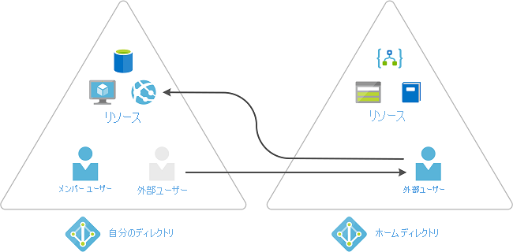

# Azure AD Privileged Identity Management とは

 Privileged Identity Management (PIM) は、お客様の組織内の重要なリソースへのアクセスを管理、制御、監視することができる、Azure Active Directory (Azure AD) のサービスです。 これらのリソースには、Azure AD、Azure、他の Microsoft Online Services (Microsoft 365 や Microsoft Intune など) 内のリソースが含まれます。 次のビデオでは、PIM の重要な概念と機能を紹介しています。
  

> [!VIDEO https://www.youtube.com/embed/f-0K7mRUPpQ]

## 使用する理由

組織では、セキュリティで保護された情報やリソースへのアクセス権を持つユーザーの数を最小限に抑える必要があります。そうすることにより、次の可能性を軽減できます。

- 悪意のあるアクターによるアクセス権の取得
- 許可されているユーザーによる機密リソースの誤操作

ただし、ユーザーは、Azure AD、Azure、Microsoft 365、または SaaS アプリで特権操作を実行する必要があります。 組織は、Azure および Azure AD リソースに対する Just-In-Time 特権アクセスをユーザーに付与することができ、それらのユーザーが与えられた特権アクセスでどんな操作を実行しているかを監視することもできます。

## ライセンスの要件

[!INCLUDE [Azure AD Premium P2 license](../../../includes/active-directory-p2-license.md)]

ユーザーのライセンスについては、「[Privileged Identity Management を使用するためのライセンスの要件](subscription-requirements.md)」を参照してください。

## 内容

Privileged Identity Management では、時間ベースおよび承認ベースのロールのアクティブ化を提供して、対象リソースに対する過剰、不要、または誤用であるアクセス許可のリスクを軽減します。 以下に、Privileged Identity Management の主な機能をいくつか示します。

- Azure AD と Azure のリソースに対する **Just-In-Time** の特権アクセスを提供する
- 開始日と終了日を使用した **期限付き** アクセス権をリソースに割り当てる
- 特権ロールをアクティブ化するために **承認** を要求する
- ロールをアクティブ化するために **多要素認証** を強制する
- なぜユーザーをアクティブ化するのかを把握するために **理由** を使用する
- 特権ロールがアクティブ化されたときに **通知** を受ける
- 継続してユーザーにロールが必要であることを確認するために **アクセス レビュー** を実施する
- 社内監査または外部監査に使用する **監査履歴** をダウンロードする
- **最後にアクティブだった全体管理者** のロールの割り当てが削除されないようにする

## これによってできること

Privileged Identity Management を設定すると、左側のナビゲーション メニューに **[タスク]** 、 **[管理]** 、 **[アクティビティ]** の各オプションが表示されます。 お客様は管理者として、**Azure AD ロール** の管理、**Azure リソース** ロールの管理、特権アクセス グループなどのオプションを選択することになります。 管理対象を選択すると、そのオプションに対する適切な一連のオプションが表示されます。

## だれが何をできるか

Privileged Identity Management での Azure AD ロールの場合、他の管理者の割り当てを管理できるのは、特権ロール管理者またはグローバル管理者ロールに属しているユーザーだけです。 グローバル管理者、セキュリティ管理者、グローバル閲覧者、およびセキュリティ閲覧者も、Privileged Identity Management における Azure AD ロールへの割り当てを表示することができます。

Privileged Identity Management での Azure リソースのロールの場合、サブスクリプション管理者、リソース所有者、またはリソース ユーザー アクセス管理者だけが、他の管理者の割り当てを管理できます。 既定では、特権ロール管理者、セキュリティ管理者、またはセキュリティ閲覧者であるユーザーは、Privileged Identity Management での Azure リソースのロールへの割り当てを表示することはできません。

## 用語

Privileged Identity Management とそのドキュメントについてより深く理解するために、次の用語を確認してください。

| 用語または概念 | ロールの割り当てのカテゴリ | 説明 |
| --- | --- | --- |
| 有資格 | Type | ロールを使用するためにユーザーが少なくとも 1 つのアクションを実行する必要があるロールの割り当て。 あるロールに対して資格があるとは、特権タスクを実行する必要が生じたときに、ユーザーがそのロールをアクティブ化できることを意味します。 ロールへの永続的な割り当てと、ロールの候補としての割り当てに、アクセスの違いはありません。 常時のアクセスを必要としないユーザーがいる、というのが唯一の違いです。 |
| active | Type | ロールを使用するためにユーザーが何のアクションも実行する必要がないロールの割り当て。 アクティブとして割り当てられたユーザーは、そのロールに割り当てられた特権を持ちます。 |
| アクティブ化 |  | ユーザーに資格のあるロールを使用するために、1 つまたは複数のアクションを実行するプロセス。 要求されるアクションには、多要素認証 (MFA) チェックの実行、業務上の妥当性の指定、指定された承認者に対する承認要求などがあります。 |
| 割り当て済み | State | アクティブなロールの割り当てを持つユーザー。 |
| アクティブ化済み | State | ロールの割り当ての資格を持ち、ロールをアクティブ化するためのアクションを実行して、アクティブになったユーザー。 アクティブになったユーザーは、事前に構成された期間、そのロールを使用することができ、その期間の経過後は再度アクティブ化する必要があります。 |
| 永続的に有資格 | Duration | ロールをアクティブ化する資格が常にユーザーにあるロールの割り当て。 |
| 永続的にアクティブ | Duration | 何もアクションを実行しなくても、ユーザーがロールを常に使用できるロールの割り当て。 |
| 期限付きで有資格 | Duration | ユーザーに、開始日から終了日の間だけロールをアクティブ化する資格があるロールの割り当て。 |
| 期限付きでアクティブ | Duration | ユーザーが、開始日から終了日の間だけロールを使用できるロールの割り当て。 |
| Just-In-Time (JIT) アクセス |  | 悪意のあるユーザーまたは未承認ユーザーがアクセス許可の期限が切れた後にアクセスできないように、ユーザーに特権タスクを実行する一時的なアクセス許可を与えるモデル。 ユーザーが必要な場合にのみ、アクセスが許可されます。 |
| 最小特権アクセスの原則 |  | すべてのユーザーに、実行権限があるタスクを実行するのに必要な最小特権のみを与える、推奨されるセキュリティ プラクティス。 このプラクティスではグローバル管理者の数を最小限にし、代わりに特定のシナリオで特定の管理者ロールが使用されます。 |

## 割り当ての延長と更新

所有者またはメンバーの期限付き割り当てを設定するときにまず疑問に思うのは、割り当ての期限が切れるとどうなるかということです。 この新しいバージョンでは、このシナリオに対して 2 つの選択肢があります。

- 延長 - ロールの割り当ての期限が近付くと、ユーザーは Privileged Identity Management を使用してそのロールの割り当ての延長を要求できます
- 更新 - ロールの割り当ての期限が既に切れた場合、ユーザーは Privileged Identity Management を使用してそのロールの割り当ての更新を要求できます

ユーザーが開始するどちらのアクションにも、グローバル管理者または特権ロール管理者からの承認が必要です。 管理者は、割り当ての有効期限を管理する担当者である必要はありません。 ユーザーは、延長要求または更新要求が許可されるか拒否されるのをただ待つだけですみます。

## シナリオ

Privileged Identity Management では、次のシナリオがサポートされています。

### 特権ロール管理者のアクセス許可

- 特定のロールの承認を有効化する
- 要求を承認するユーザーまたはグループを指定する
- すべての特権ロールの要求と承認の履歴を表示する

### 承認者のアクセス許可

- 保留中の承認 (要求) を表示する
- ロールの昇格の要求を承認または拒否する (単独および一括)
- 自分の承認または却下の理由を説明する

### 有資格のロール ユーザーのアクセス許可

- 承認が必要なロールのアクティブ化を要求する
- アクティブ化要求の状態を表示する
- アクティブ化が承認された場合に Azure AD でタスクを完了する

## 特権アクセス Azure AD グループの管理 (プレビュー)

Privileged Identity Management (PIM) では、特権アクセス グループのメンバーシップまたは所有権の資格を割り当てることができるようになりました。 このプレビュー以降、Azure Active Directory (Azure AD) の組み込みロールをクラウド グループに割り当て、PIM を使用してグループのメンバーと所有者の資格とアクティブ化を管理できます。 Azure AD でのロール割り当て可能グループの詳細については、「[Azure AD グループを使用してロールの割り当てを管理する](../roles/groups-concept.md)」を参照してください。

>[!Important]
> Exchange、セキュリティ/コンプライアンス センター、または SharePoint への管理アクセス用のロールに特権アクセス グループを割り当てるには、[特権アクセス グループ] エクスペリエンスではなく、Azure AD ポータルの **[ロールと管理者]** エクスペリエンスを使用して、そのグループに、アクティブ化の候補となるユーザーまたはグループを含めるようにします。

### グループごとに異なる Just-In-Time ポリシー

組織によっては、Azure AD 企業間 (B2B) コラボレーションなどのツールを使用して、パートナーを Azure AD 組織にゲストとして招待することがあります。 特権ロールへのすべての割り当てに対して単一の Just-In-Time ポリシーを使用するのではなく、独自のポリシーを持つ 2 つの異なる特権アクセス グループを作成できます。 信頼できる従業員に対してはそれほど厳格でない要件を適用し、パートナーが割り当てられたグループでのアクティブ化を要求するときは、承認ワークフローのような厳しい要件を適用できます。

### 1 つの要求で複数のロールの割り当てをアクティブ化する

特権アクセス グループ (プレビュー) を使用すると、ワークロード固有の管理者に対して、単一の Just-In-Time 要求で複数のロールへのクイック アクセスを付与できます。 たとえば、階層 3 の Office 管理者が、毎日インシデントを徹底的に調査するために、Exchange 管理者、Office アプリ管理者、Teams 管理者、および Search 管理者のロールに対する Just-In-Time アクセスを必要とするものとします。 これまでであれば、4 つの連続した要求が必要であり、これは時間がかかるプロセスです。 代わりに、"Tier 3 Office Admins" という名前のロール割り当て可能グループを作成し、前述の 4 つのロール (または任意の Azure AD 組み込みロール) にそれを割り当てて、グループの [アクティビティ] セクションで特権アクセスを有効にすることができます。 特権アクセスを有効にすると、グループのメンバーに対して Just-In-Time の設定を構成し、管理者と所有者を適格として割り当てることができます。 管理者がグループに昇格すると、4 つの Azure AD ロールすべてのメンバーになります。

## Privileged Identity Management でゲスト ユーザーを招待して Azure リソース ロールを割り当てる

Azure Active Directory (Azure AD) ゲスト ユーザーは Azure AD 内の企業間 (B2B) コラボレーション機能の一部であるため、外部のゲスト ユーザーとベンダーを Azure AD でゲストとして管理することができます。 たとえば、特定の Azure リソースへのアクセスの割り当て、割り当て期間と終了日の指定、アクティブな割り当てまたはアクティブ化での 2 段階認証の要求など、ゲストを含む Azure ID タスクに対してこれらの Privileged Identity Management 機能を使用できます。 組織にゲストを招待し、ゲストのアクセスを管理する方法の詳細については、[Azure AD portal で B2B コラボレーション ユーザーを追加する](../external-identities/add-users-administrator.md)方法に関する記事を参照してください。

### いつゲストを招待しますか?

ゲストを組織に招待する場合の例を次にいくつか示します。

- プロジェクトの Azure リソースにアクセスするために、電子メール アカウントしか持っていない外部の自営仕入先を許可します。
- オンプレミスの Active Directory フェデレーション サービスを使用する大規模な組織で、経費アプリケーションにアクセスすることを外部のパートナーを許可します。
- 組織外のサポート エンジニア (Microsoft サポートなど) に、問題をトラブルシューティングしてもらうために Azure リソースに一時的にアクセスすることを許可します。

### B2B ゲストを使用するコラボレーションのしくみはどのようなものですか?

B2B コラボレーションを使用する場合は、外部ユーザーをゲストとして貴社の組織に招待することができます。 ゲストは貴社の組織内のユーザーとして管理できますが、ゲストの認証は Azure AD 組織ではなく、ゲスト自身のホーム組織で行う必要があります。 つまり、ゲストは自分のホーム組織へのアクセス権を失った場合、貴社の組織へのアクセス権も失うことになります。 たとえば、ゲストが所属する組織を離れた場合、貴社が何もしなくても、ゲストは Azure AD 内で貴社と共有しているリソースへのアクセス権を自動的に失います。 B2B コラボレーションの詳細については、「[Azure Active Directory B2B のゲスト ユーザー アクセスとは](../external-identities/what-is-b2b.md)」を参照してください。

## 次のステップ

- [Privileged Identity Management を使用するためのライセンスの要件](subscription-requirements.md)
- [Azure AD でのハイブリッドおよびクラウド デプロイ用の特権アクセスをセキュリティで保護する](../roles/security-planning.md?toc=%2fazure%2factive-directory%2fprivileged-identity-management%2ftoc.json)
- [Privileged Identity Management をデプロイする](pim-deployment-plan.md)
