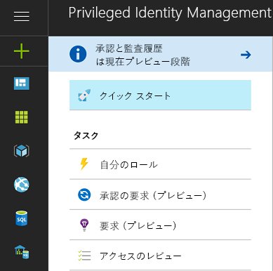
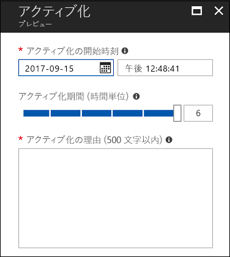
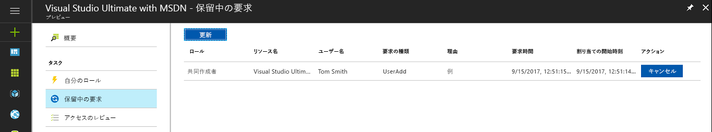
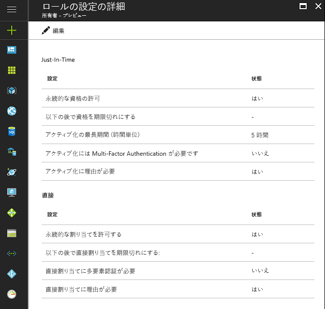

# Azure AD Privileged Identity Management とは

組織内のアクセス権は、Azure Active Directory (AD) Privileged Identity Management で管理、制御、監視することができます。 その対象には、Azure AD や Azure リソース (プレビュー) をはじめとする各種 Microsoft Online Services (Office 365、Microsoft Intune など) 内のリソースへのアクセスが含まれます。

> [!NOTE]
> テナントの Privileged Identity Management を有効にすると、サービスを使用するユーザーまたはサービスから利益を受けるユーザーごとに、有効な Azure AD Premium P2 または Enterprise Mobility および Security E5 の有料または試用版のライセンスが必要になります。 例には、以下のユーザーまたはグループ内のユーザーが含まれます。
>
>- 特権ロール管理者のロールに割り当て済み 
>- PIM を介して管理可能な他のディレクトリ ロールの対象として割り当て済み 
>- PIM で要求を承認または却下できる 
>- Just In Time 割り当てまたは直接割り当て (時間ベース) を使用して Azure リソース ロールに割り当て済み  
>- アクセス レビューに割り当て済み
>
>詳細については、「 [Azure Active Directory のエディション](../fundamentals/active-directory-whatis.md)」をご覧ください。

組織では、セキュリティで保護された情報またはリソースへのアクセス権を持つユーザーの数を最小限に抑える必要があります。こうすることで、悪意のあるユーザーがこのようなアクセス権を手にしたり、権限のあるユーザーの不注意で機微なリソースのセキュリティが損なわれたりする可能性が抑えられるためです。  しかし一方で、ユーザーは Azure AD、Azure、Office 365、または SaaS アプリケーションで特権操作を実行する必要があります。 組織は、サブスクリプションや Azure AD など、各種 Azure リソースへの特権アクセスをユーザーに付与する場合があります。 そこで、そうしたユーザーが管理特権で何をしているかについて監視することが必要となります。 Azure AD Privileged Identity Management は、アクセス権の過剰、無駄、乱用に伴うリスクを軽減するうえで役に立ちます。

Azure AD Privileged Identity Management は組織が次の作業を行うのに役立ちます。

- Azure リソース (プレビュー) を管理するための特権ロールがどのユーザーに割り当てられているかや、Azure AD の管理者ロールがどのユーザーに割り当てられているかを確認する
- Office 365 や Intune などの Microsoft Online Services のほか、サブスクリプション、リソース グループ、個々のリソース (Virtual Machines など) といった Azure リソース (プレビュー) へのオンデマンドの "ジャスト イン タイム" な管理アクセスを有効にする 
-   管理者によるアクティブ化の履歴 (Azure リソース (プレビュー) に対して管理者が行った変更を含む) を確認する
- 管理者の割り当てに生じた変更についてのアラートを受け取る
- Azure AD の特権管理者ロール (プレビュー) をアクティブにするための承認を要求する。 
- 管理者ロールのメンバーシップをレビューしたり、メンバーシップの継続についてその正当性を説明するようユーザーに要求したりする。

Azure AD では、組織の組み込みロール (グローバル管理者など) に割り当てられているユーザーを Azure AD Privileged Identity Management で管理することができます。 Azure では、所有者や共同作成者など、Azure RBAC ロールを介して割り当てられているユーザーとグループを Azure AD Privileged Identity Management で管理することができます。

## ジャスト イン タイム管理者アクセス

従来、管理者ロールへのユーザーの割り当てには、Azure Portal、その他の Microsoft Online Services ポータル、または Windows PowerShell の Azure AD コマンドレットが使用されていました。 その結果、そのユーザーは**永続的な管理者**になり、割り当てられたロールが常に有効になっています。 Azure AD Privileged Identity Management では、**管理者候補**という概念が導入されています。管理者候補とは、毎日朝から晩までではなく時折特権アクセスを必要とするユーザーのことです。 このロールは、このユーザーがアクセス権を必要とするまで非アクティブ化されています。そして、ユーザーがアクティブ化プロセスを完了すると、所定の時間の間だけ有効な管理者になります。 このアプローチによって特権ロールへの "無期限の管理者アクセス" を減らすか完全になくそうという動きが企業の間で広がっています。

## ディレクトリで Privileged Identity Management を有効にする

Azure AD Privileged Identity Management の使用は、 [Azure Portal](https://portal.azure.com/) で開始できます。

> [!NOTE]
> ディレクトリで Azure AD Privileged Identity Management を有効にする操作は、Microsoft アカウント (例: @outlook.com) ではなく組織アカウント (例: @yourdomain.com) を持つグローバル管理者が行う必要があります。

1. ディレクトリのグローバル管理者として [Azure ポータル](https://portal.azure.com/) にサインインします。
2. 組織に複数のディレクトリがある場合は、Azure Portal の右上隅に表示されているユーザー名を選択し、 Azure AD Privileged Identity Management を使用するディレクトリを選択します。
3. **[すべてのサービス]** を選択し、[フィルター] ボックスを使用して **Azure AD Privileged Identity Management** を検索します。
4. **[ダッシュボードにピン留めする]** チェック ボックスをオンにし、**[作成]** をクリックします。 Privileged Identity Management アプリケーションが起動します。

ディレクトリ内で Azure AD Privileged Identity Management を最初に使用したユーザーが、Azure AD ディレクトリ ロールに移動すると、初回割り当て操作を案内する[セキュリティ ウィザード](pim-security-wizard.md)の画面が表示されます。 手順を実行した後、ディレクトリの最初の**セキュリティ管理者**と**特権ロール管理者**に自動的に設定されます。

Azure AD ロールについては、Azure AD PIM で他の管理者の割り当てを管理できるのは、特権ロール管理者ロールに属しているユーザーだけです。 [PIM でディレクトリ ロールを管理する権限を他のユーザーに付与する](pim-how-to-give-access-to-pim.md)ことができます。 グローバル管理者、セキュリティ管理者、セキュリティ閲覧者は、Azure AD PIM における Azure AD ロールへの割り当てを閲覧することができます。
Azure RBAC ロールについては、サブスクリプション管理者、リソース所有者、リソース ユーザー アクセス管理者だけが、他の管理者の割り当てを Azure AD PIM で管理することができます。  既定では、特権ロール管理者、セキュリティ管理者、セキュリティ閲覧者であるユーザーが、Azure RBAC ロールへの割り当てを Azure AD PIM で閲覧することはできません。

## Privileged Identity Management の概要 (エントリ ポイント)

Azure AD Privileged Identity Management は、Azure AD ディレクトリのロールおよび Azure リソース (プレビュー) のロールの管理を支援します。 Azure リソースに使用されるロールの機能は、Azure AD における管理者ロールとは異なります。 Azure リソース ロールでは、その割り当て先となるリソースとその階層におけるすべての下位リソース (継承) を対象とした、きめ細かなアクセス許可が得られます。 RBAC、リソース階層、継承について詳しくは[こちら](../../role-based-access-control/role-assignments-portal.md)を参照してください。 Azure AD ディレクトリ ロールと Azure リソース (プレビュー) のどちらについても、PIM の管理は、エントリ ポイント (PIM の概要) の左側のナビゲーション メニューにある [管理] セクションで適切なリンクにアクセスして行います。

PIM はロールのアクティブ化、保留中のアクティブ化/要求の表示、保留中の承認 (Azure AD ディレクトリ ロールの場合) の表示のためのアクセスを簡単にし、左側のナビゲーション メニューの [タスク] セクションの応答に対する保留をレビューします。

概要のエントリ ポイントから [タスク] メニュー項目のいずれかにアクセスして表示されるビューには、Azure AD ディレクトリ ロールと Azure リソース ロール (プレビュー) の両方の結果が含まれています。

[自分のロール] には、Azure AD ディレクトリ ロールと Azure リソース ロール (プレビュー) に関して、アクティブで資格のあるロールの割り当てが一覧表示されます。 資格のあるロールの割り当てのアクティブ化について詳しくは、[こちら](pim-how-to-activate-role.md)を参照してください。

Azure リソース (プレビュー) のロールをアクティブにすると、適格なロール メンバーが将来の日付/時刻でアクティブ化をスケジュールしたり、特定の (管理者によって許可された) アクティブ化最大期間を選択できるようになります。

スケジュールされているアクティブ化が不要になった場合、ユーザーは、左側のナビゲーション メニューから保留中の要求に移動し、対応する [キャンセル] ボタンをクリックすることで、その保留中の要求を取り消すことができます。

## Privileged Identity Management 管理ダッシュボード

Azure AD Privileged Identity Manager には、次のような重要な情報を提供する管理ダッシュボードがあります。

* セキュリティ強化の機会を知らせるアラート
* 各特権ロールに割り当てられているユーザーの数  
* 管理者候補および永続的管理者の数
* ディレクトリの特権ロール アクティブ化のグラフ
*   Azure リソース ロール (プレビュー) のジャストインタイム、期限付き、および永続の割り当ての数
*   過去 30 日に新たにロールが割り当てられたユーザーとグループ (Azure リソース ロール)

## 特権ロールの管理

Azure AD Privileged Identity Management では、Azure AD ディレクトリ ロールの各ロールに永続的管理者または管理者候補を追加または削除することによって、管理者を管理できます。 テナント内のサブスクリプション管理に対応した所有者、ユーザー アクセス管理者、グローバル管理者は、Azure リソース (プレビュー) の PIM を使用して、ジャストインタイム アクセス (候補)、開始/終了日時が指定された期限付き (アクティブ化不要) アクセス、永続 (ロールの設定で有効になっている場合) のいずれかとして、ユーザーまたはグループを Azure リソース ロールに割り当てることができます。

## ロール アクティブ化設定の構成

Azure AD ディレクトリ ロールには、[ロールの設定](pim-how-to-change-default-settings.md)を使用して、次のような候補ロールのアクティブ化プロパティを構成できます。

* ロールのアクティブ化の期間
* ロールのアクティブ化の通知
* ロール アクティブ化プロセス中にユーザーが提供する必要のある情報
* サービス チケットまたはインシデントの番号
* [承認ワークフロー要件 - プレビュー](./azure-ad-pim-approval-workflow.md)

上図で、 **多要素認証** のボタンが無効化されていることに注意してください。 特定の高い特権を持つロールでは、MFA を使用して保護を強化する必要があります。

Azure リソース ロール (プレビュー) のロール設定では、ジャストインタイム割り当て設定と直接割り当て設定に関して、管理者が次の構成を実行できます。

- ロールに対してユーザーまたはグループを無期限に割り当てること (永続的な割り当て) の可否
- 既定の割り当て期間 (永続的な割り当てを行わない場合)
- アクティブ化の最長期間 (資格のあるロールのメンバーがアクティブにされたとき)
- ロールのアクティブ化 (ジャストインタイム割り当て) または割り当てプロセス (直接割り当て) 時にユーザーに求める情報

## ロールのアクティブ化

[ロールをアクティブ化する](pim-how-to-activate-role.md)には、管理者候補は、ロールに対する時間制限付きの "アクティブ化" を要求します。 アクティブ化の要求は、Azure AD Privileged Identity Management の **[ロールのアクティブ化]** オプションを使用して行うことができます。

ロールのアクティブ化を要求する管理者は、Azure Portal で Azure AD Privileged Identity Management を初期化する必要があります。

ロールのアクティブ化は、カスタマイズできます。 PIM の設定では、アクティブ化の期間だけでなく、ロールをアクティブ化するために管理者が指定する必要がある情報を設定できます。

## ロール アクティビティの確認

従業員および管理者がどのように特権ロールを使用しているかを追跡するには、2 つの方法があります。 1 つ目の方法は、[ディレクトリ ロール監査履歴](pim-how-to-use-audit-log.md)を使用する方法です。 監査履歴ログは、特権ロールの割り当てとロールのアクティブ化の履歴における変更、および Azure リソース ロール (プレビュー) の設定に対する変更を追跡します。 

2 番目の方法は、標準的な [アクセス レビュー](pim-how-to-start-security-review.md)を設定する方法です。 これらのアクセス レビューは、割り当てられたレビュー担当者 (たとえば、チーム マネージャー) によって実行することも、従業員が自分自身の確認を行うこともできます。 これは、アクセスを必要としているユーザーとアクセスを必要としなくなったユーザーを監視するための最善の方法です。

## Azure AD PIM のサブスクリプションの有効期限

Azure AD PIM を使用するためには、あらかじめテナントに、Azure AD Premium P2 (または EMS E5) 試用版サブスクリプションまたは有料サブスクリプションが必要です。  また、テナントの管理者にライセンスが割り当てられている必要があります。  具体的には、Azure AD PIM で管理される Azure AD ロールの管理者、Azure AD PIM で管理される Azure RBAC ロールの管理者、アクセス レビューを実行する非管理者ユーザーにライセンスの割り当てが必要となります。
Azure AD Premium P2 を更新していない場合や試用版の有効期限が切れている場合、ご利用のテナントでは、Azure AD PIM 機能は利用できなくなります。資格のあるロールの割り当ては削除され、ユーザーがロールをアクティブにすることもできません。 詳しくは、[Azure AD PIM サブスクリプションの要件](./subscription-requirements.md)に関するページを参照してください。

## 次の手順

[!INCLUDE [active-directory-privileged-identity-management-toc](../../../includes/active-directory-privileged-identity-management-toc.md)]
