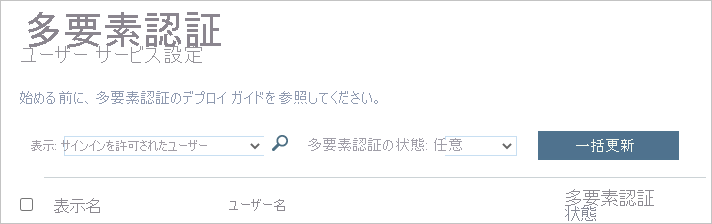

# Azure AD シナリオのサインイン診断

Azure AD のサインイン診断を使用して、サインイン試行中に何が起きたかを分析すると、Microsoft のサポートを求める必要なく問題を解決するためのレコメンデーションを確認できます。  

この記事では、このツールを使用するときに特定および解決できるシナリオの種類について概要を説明します。

## サポートされるシナリオ

Azure AD のサインイン診断には、次のシナリオがサポートされています。

- **条件付きアクセス**

    - 条件付きアクセスによってブロック  

    - 条件付きアクセスに失敗  

    - 条件付きアクセスからの多要素認証 (MFA)  

    - 条件付きアクセスが原因でブロックされた B2B サインイン 

- **多要素認証 (MFA)**  

    - その他の要件からの MFA  

    - MFA プルーフアップが必要  

    - MFA プルーフアップが必要 (危険なサインイン場所)  

- **資格情報の一致および不一致**  

    - サインインに成功  

    - アカウントがロック済み  

    - 無効なユーザー名またはパスワード  

- **エンタープライズ アプリ**  

    - エンタープライズ アプリ サービス プロバイダー  

    - エンタープライズ アプリの構成  

- **その他のシナリオ**   

    - セキュリティの既定値  
    
    - エラー コードの分析情報  

    - レガシ認証  
    
    - 条件付きアクセスが原因でブロックされた B2B サインイン

    - リスク ポリシーによるブロック 
    
    - パススルー認証
    
    - シームレスなシングル サインオン

## 条件付きアクセス  

### 条件付きアクセスによってブロック 

このシナリオでは、サインイン試行が条件付きアクセス ポリシーによってブロックされています。 

![[アクセスのブロック] が選択された状態のアクセス構成を示すスクリーンショット。](./media/concept-sign-in-diagnostics-scenarios/block-access.png)

このシナリオの診断セクションには、ユーザーのサインイン イベントと適用されているポリシーに関する詳細が表示されます。 

 

### 条件付きアクセスに失敗 

このシナリオは、通常、条件付きアクセス ポリシーの要件が満たされなかったことが原因で失敗したサインイン試行の結果です。 一般的な例を次に示します。 

![一般的なポリシーの例と [アクセス権の付与] が選択された状態のアクセス構成を示すスクリーンショット。](./media/concept-sign-in-diagnostics-scenarios/require-controls.png)

- ハイブリッド Azure AD 参加済みのデバイスを必要とする 

- 承認済みクライアント アプリを必須にする 

- アプリの保護ポリシーを必須にする 

このシナリオの診断セクションには、ユーザーのサインイン試行と適用されているポリシーに関する詳細が表示されます。 

 

### 条件付きアクセスからの MFA 

このシナリオでは、設定された多要素認証を使用してサインインするという要件が条件付きアクセス ポリシーにあります。 

![[多要素認証が必要] が選択された状態のアクセス構成を示すスクリーンショット。](./media/concept-sign-in-diagnostics-scenarios/require-mfa.png)

このシナリオの診断セクションには、ユーザーのサインイン試行と適用されているポリシーに関する詳細が表示されます。 

 

 

## 多要素認証  

### その他の要件からの MFA 

このシナリオでは、多要素認証の要件が条件付きアクセス ポリシーによって強制されていません。 たとえば、多要素認証はユーザーごとになっています。 

 

この診断シナリオの目的は、以下に関する詳細情報をさらに提供することです。 

- 中断された多要素認証のソース 

- クライアントとの対話の結果 

ユーザーのサインイン試行の詳細をすべて表示することもできます。 

 

### MFA プルーフアップが必要 

このシナリオでは、サインイン試行が、多要素認証を設定する要求によって割り込まれています。 この設定はプルーフアップとも呼ばれます。 

 

多要素認証のプルーフアップは、ユーザーが多要素認証を使用するよう要求されているにもかかわらず、まだそれを構成していないか、管理者がその構成をユーザーに要求している場合に発生します。 

 

この診断シナリオの目的は、多要素認証の割り込みが、ユーザーの構成の不足に起因することを明らかにすることです。 推奨される解決策は、ユーザーによるプルーフアップの完了です。 

 

### MFA プルーフアップが必要 (危険なサインイン場所) 

このシナリオでは、サインイン試行が、危険なサインイン場所からの多要素認証を設定する要求によって割り込まれています。 

 

この診断シナリオの目的は、多要素認証の割り込みが、ユーザーの構成の不足に起因することを明らかにすることです。 推奨される解決策は、ユーザーによるプルーフアップの完了です。具体的には、安全と思われるネットワークの場所からプルーフアップを実行します。 

 

このシナリオの例として、ポリシーでは、ユーザーは信頼されたネットワークの場所からのみ MFA を設定する必要がありますが、ユーザーが信頼されていないネットワークの場所からサインインしている場合があります。 

 

## 資格情報の一致および不一致

### サインインに成功 

このシナリオでは、サインイン イベントの条件付きアクセスまたは多要素認証による割り込みはありません。  

 

この診断シナリオでは、条件付きアクセス ポリシーまたは多要素認証による割り込みが予期されていたユーザー サインイン イベントの詳細情報が表示されます。 

 

### アカウントがロック済み 

このシナリオでは、ユーザーが何度も誤った資格情報でサインインしています。 このシナリオは、誤った資格情報でパスワードベースのサインインを何度も試行した場合に発生します。 この診断シナリオでは、試行の発信元と、正当なユーザーのサインイン試行であるかどうかを管理者が判断するための情報を表示します。 

 

この診断シナリオでは、アプリ、試行回数、使用されたデバイス、オペレーティング システム、IP アドレスに関する詳細が提供されます。 

 

このトピックの詳細については、Azure AD Smart Lockout に関するドキュメントを参照してください。 

 

 

### 無効なユーザー名またはパスワード 

このシナリオでは、ユーザーが無効なユーザー名またはパスワードを使用してサインインを試みています。 この診断では、誤った資格情報を入力したユーザーに問題があるのか、または使用していないパスワードをキャッシュして再送信しているクライアントやアプリケーションに問題があるのか、管理者が特定できるようにすることを目的としています。 

 

この診断シナリオでは、アプリ、試行回数、使用されたデバイス、オペレーティング システム、IP アドレスに関する詳細が提供されます。 

 

## エンタープライズ アプリ 

エンタープライズ アプリケーションでは、次の 2 つの点で問題が発生する可能性があります。 

- ID プロバイダー (Azure AD) アプリケーションの構成 
- サービス プロバイダー (アプリケーション サービス、SaaS アプリケーションとも呼ばれます) 側

 

これらの問題の診断では、解決のために問題のどの点に目を向け、どう対処するのかを説明します。 

 

### エンタープライズ アプリ サービス プロバイダー 

このシナリオでは、ユーザーがアプリケーションにサインインを試みています。 サインイン フローのアプリケーション (サービス プロバイダーとも呼ばれます) 側に問題があるため、サインインに失敗しました。 この診断によって検出された問題は、通常、構成を変更するか、アプリケーション サービスの問題を修正して解決する必要があります。  

このシナリオの解決方法は、他のサービスにサインインし、診断ガイダンスに従って構成を一部変更することです。 

 

### エンタープライズ アプリの構成 

このシナリオでは、アプリケーションの Azure AD 側のアプリケーション構成に問題があるため、サインインに失敗しました。 

 

このシナリオの解決方法として、アプリケーションのエンタープライズ アプリケーション ブレード エントリでアプリケーションの構成を確認および更新する必要があります。 

 

## その他のシナリオ 

### セキュリティの既定値 

このシナリオでは、セキュリティの既定の設定によってユーザーのサインインが中断されたサインイン イベントについて説明します。 セキュリティの既定値では、組織にベスト プラクティスのセキュリティが適用され、多くのシナリオで多要素認証 (MFA) の構成と使用が要求されています。これにより、パスワード スプレー、リプレイ攻撃、フィッシングの試行が成功するのを防ぐことができます。 

詳細については、「[セキュリティの既定値群とは](../fundamentals/concept-fundamentals-security-defaults.md)」を参照してください。 

### エラー コードの分析情報 

サインイン診断でイベントにコンテキスト分析が含まれていない場合、更新されたエラー コードの説明と関連する内容が表示されることがあります。 エラー コードの分析情報には、シナリオに関する詳しいテキスト、問題の修復方法、問題に関するコンテンツなどが含まれています。 

### レガシ認証 

この診断シナリオでは、クライアントが基本 (レガシとも呼ばれます) 認証の使用を試みて、ブロックまたは中断されたサインイン イベントを診断します。 

セキュリティのベスト プラクティスとして、レガシ認証によるサインインは避けることをお勧めします。 POP、SMTP、IMAP、MAPI などのレガシ認証プロトコルでは、多要素認証 (MFA) を適用することができず、敵対者による組織の攻撃において恰好のエントリ ポイントになります。 

詳細については、[条件付きアクセスを使用して Azure AD へのレガシ認証をブロックする方法](../conditional-access/block-legacy-authentication.md)に関する記事をご覧ください。 

### 条件付きアクセスが原因でブロックされた B2B サインイン 

この診断シナリオでは、ユーザーによる別の組織からの B2B サインインが原因でブロックまたは中断されたサインインを検出します。この場合、条件付きアクセス ポリシーでは、クライアントのデバイスがリソース テナントに参加している必要があります。 

詳細については、「[B2B コラボレーション ユーザーの条件付きアクセス](../external-identities/conditional-access.md)」を参照してください。 

### リスク ポリシーによるブロック 

このシナリオでは、Identity Protection ポリシーによって、サインイン試行が危険と識別された結果、サインインの試行がブロックされます。 

詳細については、[リスク ポリシーを構成して有効にする方法](../identity-protection/howto-identity-protection-configure-risk-policies.md)に関するページを参照してください。 

### パススルー認証 

パススルー認証はオンプレミスとクラウド認証テクノロジを統合したものであるため、問題がある場所を特定するのが困難な場合があります。 この診断は、これらのシナリオを簡単に診断して解決できるようにすることを目的としています。 

この診断シナリオでは、使用されている認証方法がパススルー認証 (PTA) であり、PTA 固有のエラーがある場合に、ユーザー固有のサインインの問題を識別します。 他の問題が原因のエラー (PTA 認証が使用されている場合でも) も正しく診断されます。 

診断には、エラーとユーザーのサインインに関するコンテキスト情報、サインインに失敗した理由、および問題を解決するために管理者が実行できる推奨アクションが表示されます。 詳細については、[Azure AD Connect: パススルー認証のトラブルシューティング](../hybrid/tshoot-connect-pass-through-authentication.md)に関するページを参照してください。 

### シームレスなシングル サインオン

シームレスなシングル サインオンでは、Kerberos 認証とクラウド認証が統合されます。 このシナリオには 2 つの認証プロトコルが関与するため、サインインの問題が発生したときに、障害点の把握が困難な場合があります。 この診断は、これらのシナリオを簡単に診断して解決できるようにすることを目的としています。
 
この診断シナリオでは、サインインに失敗したコンテキストと具体的な失敗原因、サインインの試行に関するコンテキスト情報、および問題を解決するために管理者がオンプレミスまたはクラウド上で取ることができる推奨されるアクションを調べます。 詳しくは、「[Azure Active Directory シームレス シングル サインオンのトラブルシューティングを行う](../hybrid/tshoot-connect-sso.md)」をご覧ください。 
 

## 次のステップ

- [Azure AD におけるサインイン診断とは](overview-sign-in-diagnostics.md)
