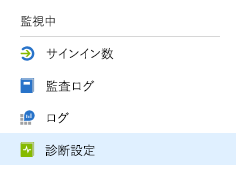
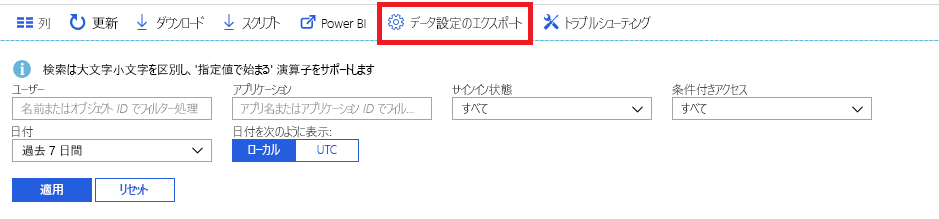

# Azure Active Directory 監視とは

Azure Active Directory (Azure AD) 監視を使用すると、Azure AD のアクティビティ ログを別のエンドポイントにルーティングできるようになります。 その後、それを長期的な使用のために保持したり、サードパーティのセキュリティ情報およびイベント管理 (SIEM) ツールと統合して環境の分析情報を取得したりすることができます。

現時点では、以下のものにログをルーティングすることができます。

- Azure ストレージ アカウント。
- Azure イベント ハブ。Splunk および Sumologic のインスタンスと統合することができます。
- Azure Log Analytics ワークスペース。このワークスペースで、データの分析や、特定のイベントのダッシュボードとアラートの作成を行うことができます。

> [!VIDEO https://www.youtube.com/embed/syT-9KNfug8]

[!INCLUDE [azure-monitor-log-analytics-rebrand](../../../includes/azure-monitor-log-analytics-rebrand.md)]

## 診断設定を構成する

Azure AD アクティビティ ログの監視設定を構成するには、まず、[Azure portal](https://portal.azure.com) にサインインし、次に **Azure Active Directory** を選択します。 ここからは、次の 2 つの方法で診断設定の構成のページにアクセスすることができます。

* **[監視]** セクションの **[診断設定]** を選択します。

    
    
* **[監査ログ]** または **[サインイン]** を選択し、 **[設定のエクスポート]** を選択します。 

    

## ストレージ アカウントへのログのルーティング

ログを Azure ストレージ アカウントにルーティングすると、[保持ポリシー](reference-reports-data-retention.md)で規定されている既定の保持期間より長くログを保持できます。 データをストレージ アカウントにルーティングする方法については、[こちら](quickstart-azure-monitor-route-logs-to-storage-account.md)を参照してください。

## ログをイベント ハブにストリーミングする

ログを Azure イベント ハブにルーティングすることで、Sumologic や Splunk などのサードパーティの SIEM ツールと統合することができます。 この統合によって、Azure AD のアクティビティ ログ データと、SIEM によって管理されている他のデータを組み合わせ、より豊富な環境分析情報を提供することができます。 ログをイベント ハブにストリーム配信する方法については、[こちら](tutorial-azure-monitor-stream-logs-to-event-hub.md)を参照してください。

## Azure Monitor ログへのログの送信

[Azure Monitor ログ](https://docs.microsoft.com/azure/log-analytics/log-analytics-overview)は、さまざまなソースからの監視データを統合し、アプリケーションとリソースの操作に関する分析情報を取得するためのクエリ言語と分析エンジンを提供するソリューションです。 Azure AD のアクティビティ ログを Azure Monitor ログに送信することで、収集したデータに対する迅速な取得、監視、およびアラートを行うことができます。 [Azure Monitor ログにデータを送信する](howto-integrate-activity-logs-with-log-analytics.md)方法を学習してください。

Azure AD のアクティビティ ログ用の既製のビューをインストールして、サインインと監査イベントを含む一般的なシナリオを監視することもできます。 [Azure AD のアクティビティ ログ用の Log Analytics ビューをインストールして使用する](howto-install-use-log-analytics-views.md)方法を学習してください。

## 次のステップ

* [Azure Monitor でのアクティビティ ログ](concept-activity-logs-azure-monitor.md)
* [ログをイベント ハブにストリーム配信する](tutorial-azure-monitor-stream-logs-to-event-hub.md)
* [Azure Monitor ログにログを送信する](howto-integrate-activity-logs-with-log-analytics.md)