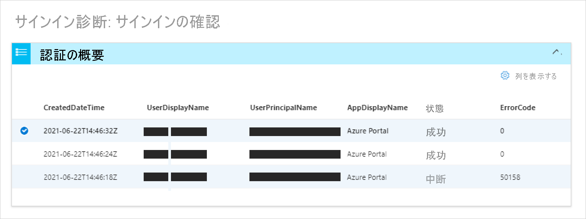
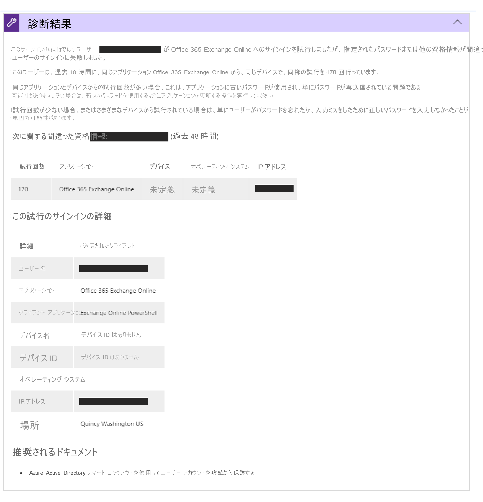
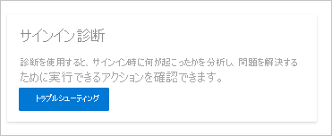
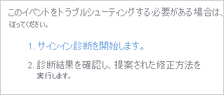

# Azure AD におけるサインイン診断とは

失敗したサインインの理由を特定することは、たちまち難しい作業になるおそれがあります。 サインインの試行中に何が起こったかを分析し、問題を解決するために利用できる推奨事項を調査する必要があります。 Microsoft サポートなどの他者を関与させずに問題を解決するのが理想的です。 このような状況では、Azure AD のサインイン診断を使用できます。このツールは、Azure AD でのサインインの調査に役立ちます。 

この記事では、診断の概要と、それを使用してサインインに関連したエラーのトラブルシューティングを行う方法について説明します。 

## しくみ  

Azure AD の場合、サインインの試行は次によって制御されます。

- **ユーザー** - サインインを実行しようとしているユーザー。
- **方法** - サインインの試行がどのように実行されたか。

たとえば、管理者が企業ネットワークからのサインイン時にテナントのすべての側面を構成することを可能にする条件付きアクセス ポリシーを構成できます。 ただし、同じユーザーでも、信頼されていないネットワークから同じアカウントを使用してサインインした場合はブロックされることがあります。 

サインインの試行に応答するシステムの柔軟性が高いことから、最終的に、サインインのトラブルシューティングが必要なシナリオに行き着く場合があります。サインイン診断とは、次によってサインインの問題を自己診断できるようにするために設計されたツールです。  

- サインイン イベントのデータを分析する。  

- 発生したことに関する情報を表示する。  

- 問題を解決するための推奨事項を示す。  

診断プロセスを開始し、完了するには、以下のことを行う必要があります。   

1. **イベントの識別**  - 診断を開始し、ユーザーが支援を求めているフラグ付きイベントを確認します。または、調査するサインイン イベントに関する情報を入力します。 

2. **イベントの選択**  - 共有されている情報に基づいてイベントを選択します。 

3. **アクションの実行**  - 診断結果を確認して、手順を実行します。 

### イベントの識別 

診断では、次の 2 つの方法で、調査するイベントを検索できます。  

- ユーザーが[支援を求めてフラグを設定](overview-flagged-sign-ins.md)したサインインの失敗。 
- ユーザーと追加条件によって、特定のイベントを検索する。 

フラグ付きのサインインは、最大 100 件の一覧に自動的に表示されます。 イベントをクリックすると、その診断をすぐに実行できます。  

フラグ付きサインインが存在する場合でも、検索タブを選択して、特定のイベントを検索できます。 特定のイベントを検索する際、次のオプションに基づいてフィルター処理できます。 

- ユーザーの名前 

- Application 

- 関連付け ID または要求 ID 

- 日付と時刻 

### イベントの選択  

フラグ付きサインインの場合、または検索が完了すると、一致するすべてのサインイン イベントが Azure AD によって取得され、認証の概要一覧ビューに表示されます。 

列に表示されるコンテンツは、ユーザーの好みに応じて変更できます。 次に例をいくつか示します。

- リスクの詳細
- 条件付きアクセスの状態
- Location
- Resource ID
- ユーザー タイプ
- 認証の詳細

### アクションの実行

選択したサインイン イベントについて、診断結果が表示されます。 結果に目を通し、問題を解決するために実行できるアクションを識別します。 これらの結果には、推奨される手順が追加され、関連するポリシー、サインインの詳細、対応するドキュメントなどの関連情報が表示されます。 必ずしも追加の支援なしで問題を解決できるとは限らないため、サポート チケットを開くことが推奨される場合もあります。 

## アクセス方法

診断を使用するには、グローバル管理者またはグローバル閲覧者としてテナントにサインインしている必要があります。 このレベルのアクセス権がない場合は、[Privileged Identity Management (PIM)](../privileged-identity-management/pim-resource-roles-activate-your-roles.md) を使用して、アクセス権をテナント内のグローバル管理者または閲覧者に昇格します。 これにより、診断に一時的にアクセスできるようになります。  

正しいアクセス レベルを使用すると、さまざまな場所で診断を見つけることができます。 

**オプション A**: 問題の診断と解決 

1. **Azure Active Directory AAD または Azure AD 条件付きアクセス** を開きます。 

2. メイン メニューで、 **[問題の診断と解決]** をクリックします。  

3. **[トラブルシューティング ツール]** にサインイン診断タイルがあります。 

4. **[トラブルシューティング]** ボタンをクリックします。  

 

 

**オプション B**: サインイン イベント 

1. Azure Active Directory を開きます。 

2. メイン メニューの **[監視]** セクションで、 **[サインイン]** を選択します。 

3. サインインの一覧から、 **[失敗]** 状態のサインインを選択します。 状態で一覧をフィルター処理して、失敗したサインインを簡単に見つけられるようにすることができます。 

4. 選択したサインインの **[アクティビティの詳細: サインイン]** タブが開きます。 その他のメニュー アイコンを表示するには、点線アイコンをクリックします。 **[トラブルシューティングとサポート]** タブを選択します。 

5. **サインイン診断の起動** リンクをクリックします。 

 

**オプション C**: サポート デース 

診断は、サポート ケースを作成するときにも検出されます。これにより、ケースを送信する前に自己診断を行うことができます。 

## 次のステップ

- [Azure AD シナリオのサインイン診断](concept-sign-in-diagnostics-scenarios.md)
