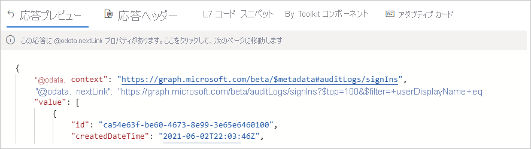

# クイック スタート: Microsoft Azure AD API を使用して Azure AD ログにアクセスする 

Azure AD のサインイン ログの情報を使用すると、ユーザーのサインインが失敗した場合に何が起こったかを把握することができます。 このクイックスタートでは、Graph API を使用してサインイン ログにアクセスする方法を示します。

## 前提条件

このクイック スタートのシナリオを完了するための要件を次に示します。

- **Azure AD テナントへのアクセス** - Azure AD テナントにアクセスできない場合は、「[Azure の無料アカウントを今すぐ作成しましょう](https://azure.microsoft.com/free/?WT.mc_id=A261C142F)」を参照してください。 
- **Isabella Simonsen というテスト アカウント** - テスト アカウントの作成方法がわからない場合は、「[クラウド ベースのユーザーを追加する](../fundamentals/add-users-azure-active-directory.md#add-a-new-user)」を参照してください。

## 失敗したサインインを実行する

この手順の目的は、Azure AD のサインイン ログに失敗したサインインの記録を作成することです。

**この手順を完了するには:**

1. 間違ったパスワードを使用して、Isabella Simonsen として [Azure portal](https://portal.azure.com/) にサインインします。

2. サインイン ログでサインインの記録を確認できるように、5 分間待ちます。 詳細については、「[アクティビティ レポート](reference-reports-latencies.md#activity-reports)」を参照してください。

## 失敗したサインインを見つける

このセクションでは、Graph API を使用してサインインに関する情報を取得する手順について説明します。

    

**失敗したサインインを確認するには:**

1. [Microsoft Graph Explorer](https://developer.microsoft.com/en-us/graph/graph-explorer) に移動します。

2. グローバル管理者としてテナントにサインインします。

       

3. **HTTP 動詞ドロップダウン リスト** で **[GET]** を選択します。

4. **API バージョン ドロップダウン リスト** で **[beta]** を選択します。

5. **クエリ要求アドレス バー** に「`https://graph.microsoft.com/beta/auditLogs/signIns?$top=100&$filter=userDisplayName eq 'Isabella Simonsen'`」を入力します。
 
6. **[クエリの実行]** をクリックします。

クエリの結果を確認します。

    

## リソースをクリーンアップする

不要になったら、テスト ユーザーを削除します。 Azure AD ユーザーの削除方法がわからない場合は、「[Azure AD からユーザーを削除する](../fundamentals/add-users-azure-active-directory.md#delete-a-user)」を参照してください。

## 次のステップ

> [!div class="nextstepaction"]
> [Azure Active Directory レポートの概要](overview-reports.md)
