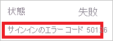
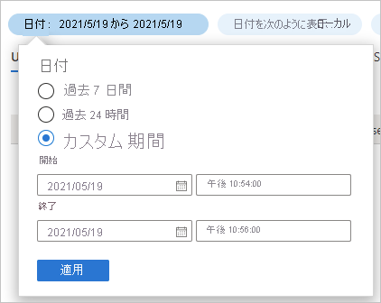
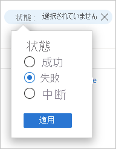

# クイックスタート: Azure AD のサインイン ログを使用してサインインを分析する 

Azure AD のサインイン ログの情報を使用すると、ユーザーのサインインが失敗した場合に何が起こったかを把握することができます。 このクイックスタートでは、サインイン ログを使用して失敗したサインインを見つける方法について説明します。

## 前提条件

このクイック スタートのシナリオを完了するための要件を次に示します。

- **Azure AD テナントへのアクセス** - Azure AD テナントにアクセスできない場合は、「[Azure の無料アカウントを今すぐ作成しましょう](https://azure.microsoft.com/free/?WT.mc_id=A261C142F)」を参照してください。 
- **Isabella Simonsen というテスト アカウント** - テスト アカウントの作成方法がわからない場合は、「[クラウド ベースのユーザーを追加する](../fundamentals/add-users-azure-active-directory.md#add-a-new-user)」を参照してください。

## 失敗したサインインを実行する

この手順の目的は、Azure AD のサインイン ログに失敗したサインインの記録を作成することです。

**この手順を完了するには:**

1. 間違ったパスワードを使用して、Isabella Simonsen として [Azure portal](https://portal.azure.com/) にサインインします。

2. サインイン ログでサインインの記録を確認できるように、5 分間待ちます。 詳細については、「[アクティビティ レポート](reference-reports-latencies.md#activity-reports)」を参照してください。

## 失敗したサインインを見つける

このセクションでは、失敗したサインインを分析する手順について説明します。

- **サインインをフィルター処理する**: 分析に関係のないレコードをすべて削除します。 たとえば、特定のユーザーのレコードのみを表示するようにフィルターを設定します。
- **追加のエラー情報を検索する**: サインイン ログで見つけられる情報に加えて、[サインイン エラー検索ツール](https://login.microsoftonline.com/error)を使用してエラーを検索することもできます。 このツールを使用すると、サインイン エラーの追加情報が表示されることがあります。 

**失敗したサインインを確認するには:**

1. [サインイン ログ](https://portal.azure.com/#blade/Microsoft_AAD_IAM/ActiveDirectoryMenuBlade/SignIns)に移動します。

2. Isabella Simonsen のレコードのみを一覧表示するには:

    a. ツール バーの **[フィルターの追加]** をクリックします。
    
       

    b. **[フィールドの選択]** リストで **[ユーザー]** を選択し、 **[適用]** をクリックします。

    c. **[ユーザー名]** テキストボックスに「**Isabella Simonsen**」と入力し、 **[適用]** をクリックします。

    d. ツール バーの **[最新の情報に更新]** をクリックします。

3. 問題を分析するには、 **[トラブルシューティングとサポート]** をクリックします。

    ![[フィルターの追加]](./media/quickstart-analyze-sign-in/troubleshooting-and-support.png)   

4. **[サインインのエラー コード]** をコピーします。

       

5. [サインイン エラー検索ツール](https://login.microsoftonline.com/error)のテキストボックスにエラー コードを貼り付け、 **[Submit]\(送信\)** をクリックします。

ツールの結果を確認し、追加情報が表示されているかどうかを判断します。

## その他のテスト

サインイン ログのエントリを名前で検索する方法がわかったら、次のフィルターを使用してレコードを検索してみてください。

- **[日付]** - **[開始]** と **[終了]** を使用して Isabella を見つけてください。

    

- **[状態]** - **[失敗] の [状態]** を使用して Isabella を見つけてください。

    

## リソースをクリーンアップする

不要になったら、テスト ユーザーを削除します。 Azure AD ユーザーの削除方法がわからない場合は、「[Azure AD からユーザーを削除する](../fundamentals/add-users-azure-active-directory.md#delete-a-user)」を参照してください。

## 次のステップ

> [!div class="nextstepaction"]
> [Azure Active Directory レポートの概要](overview-reports.md)
