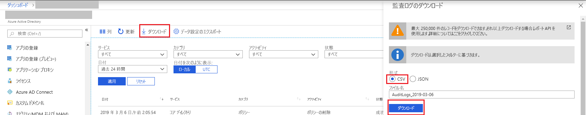

# クイック スタート: Azure portal を使用して監査レポートをダウンロードする

このクイック スタートでは、過去 24 時間のテナントに関する監査ログをダウンロードする方法について説明します。

## 前提条件

必要なもの:

* Azure Active Directory テナント。 
* テナントのセキュリティ管理者、セキュリティ閲覧者、グローバル管理者のいずれかのロールであるユーザー。 さらに、テナントのすべてのユーザーは自分の監査ログにアクセスできます。

## クイック スタート: 監査レポートをダウンロードする

1. [Azure Portal](https://portal.azure.com) に移動します。
2. 左側のナビゲーション ウィンドウで **[Azure Active Directory]** を選択し、**[ディレクトリの切り替え]** ボタンを使用して目的の Active Directory を選択します。
3. ダッシュボードから **[Azure Active Directory]** を選択し、**[監査ログ]** を選択します。 
4. **[日付の範囲]** フィルター ドロップダウンで **[過去 24 時間]** を選択し、**[適用]** を選択して過去 24 時間の監査ログを表示します。 
5. **[ダウンロード]** ボタンを選択して、フィルター処理したレコードを含む CSV ファイルをダウンロードします。 

## 次の手順

* [Azure Active Directory ポータルのサインイン アクティビティ レポート](concept-sign-ins.md)
* [Azure Active Directory レポートの保持期間](reference-reports-data-retention.md)
* [Azure Active Directory レポートの待機時間](reference-reports-latencies.md)
