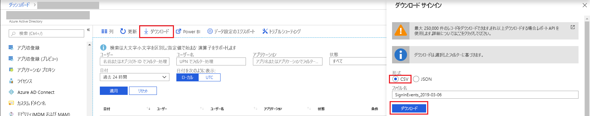

# クイック スタート:Azure portal を使用してサインイン レポートをダウンロードする

このクイック スタートでは、過去 24 時間のテナントに関するサインイン データをダウンロードする方法について説明します。

## 前提条件

必要なもの:

* Premium ライセンスを使用してサインイン アクティビティ レポートを表示する Azure Active Directory テナント。 Azure Active Directory エディションにアップグレードするには、「[Azure Active Directory Premium の概要](../fundamentals/active-directory-get-started-premium.md)」を参照してください。
* テナントの**セキュリティ管理者**、**セキュリティ閲覧者**、**レポート閲覧者**、**グローバル管理者**のいずれかのロールであるユーザー。 さらに、テナントのすべてのユーザーは自分のサインインにアクセスできます。

## クイック スタート:サインイン レポートのダウンロード

1. [Azure Portal](https://portal.azure.com) に移動します。
2. 左側のナビゲーション ウィンドウで **[Azure Active Directory]** を選択し、**[ディレクトリの切り替え]** ボタンを使用して目的の Active Directory を選択します。
3. ダッシュボードから **[Azure Active Directory]** を選択し、**[サインイン]** を選択します。 
4. **[日付]** フィルター ドロップダウンで **[過去 24 時間]** を選択し、**[適用]** を選択して過去 24 時間のサインインを表示します。 
5. **[ダウンロード]** ボタンを選択して、フィルター処理したレコードを含む CSV ファイルをダウンロードします。 

## 次の手順

* [Azure Active Directory ポータルのサインイン アクティビティ レポート](concept-sign-ins.md)
* [Azure Active Directory レポートの保持期間](reference-reports-data-retention.md)
* [Azure Active Directory レポートの待機時間](reference-reports-latencies.md)
