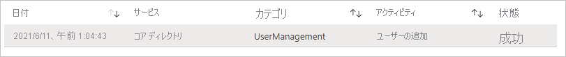
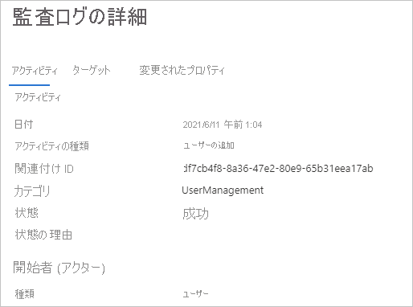

# クイックスタート: Azure AD 監査ログをフィルター処理する 

Azure AD 監査ログの情報を使用すると、コンプライアンスのためのシステム アクティビティのレコードにアクセスできます。 このクイックスタートでは、監査ログで新しく作成されたユーザー アカウントを見つける方法について説明します。

## 前提条件

このクイック スタートのシナリオを完了するための要件を次に示します。

- **Azure AD テナントへのアクセス** - Azure AD テナントにアクセスできない場合は、「[Azure の無料アカウントを今すぐ作成しましょう](https://azure.microsoft.com/free/?WT.mc_id=A261C142F)」を参照してください。 
- **Isabella Simonsen というテスト アカウント** - テスト アカウントの作成方法がわからない場合は、「[クラウド ベースのユーザーを追加する](../fundamentals/add-users-azure-active-directory.md#add-a-new-user)」を参照してください。

## 新しいユーザー アカウントを見つける

このセクションでは、監査ログをフィルター処理する手順について説明します。

**新しいユーザーを見つけるには:**

1. [監査ログ](https://portal.azure.com/#blade/Microsoft_AAD_IAM/ActiveDirectoryMenuBlade/Audit)に移動します。

2. Isabella Simonsen のレコードのみを一覧表示するには:

    a. ツール バーの **[フィルターの追加]** をクリックします。
    
       

    b. **[フィールドの選択]** リストで **[ターゲット]** を選択し、 **[適用]** をクリックします。

    c. **[ターゲット]** テキストボックスに「**Isabella Simonsen**」という **[ユーザー プリンシパル名]** を入力し、 **[適用]** をクリックします。

3. フィルター処理された項目をクリックします。

      

4.  **[Audit Log Details]\(監査ログの詳細\)** を確認します。
 
      
 
  

## リソースをクリーンアップする

不要になったら、テスト ユーザーを削除します。 Azure AD ユーザーの削除方法がわからない場合は、「[Azure AD からユーザーを削除する](../fundamentals/add-users-azure-active-directory.md#delete-a-user)」を参照してください。

## 次のステップ

> [!div class="nextstepaction"]
> [Azure Active Directory レポートの概要](overview-reports.md)
