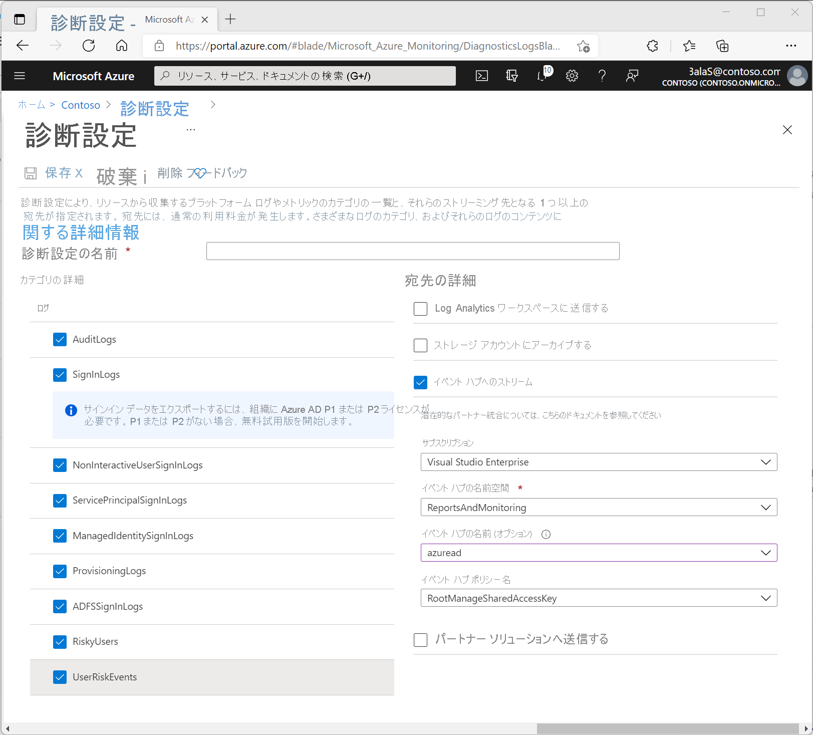

# チュートリアル:Azure Active Directory ログを Azure イベント ハブにストリーム配信する

このチュートリアルでは、Azure Active Directory (Azure AD) のログを Azure イベント ハブにストリーム配信するよう Azure Monitor の診断設定をセットアップする方法について説明します。 このメカニズムを使用して、Splunk や QRadar といったサードパーティのセキュリティ情報イベント管理 (SIEM) ツールにログを統合します。

## 前提条件 

この機能を使用するには、次が必要です。

* Azure サブスクリプション。 Azure サブスクリプションを持っていない場合は、[無料試用版にサインアップ](https://azure.microsoft.com/free/)できます。
* Azure AD テナント。
* Azure AD テナントの "*グローバル管理者*" または "*セキュリティ管理者*" であるユーザー。
* Azure サブスクリプション内の Event Hubs 名前空間とイベント ハブ。 [イベント ハブの作成](../../event-hubs/event-hubs-create.md)方法に関するページを参照してください。

## イベント ハブにログをストリーム配信する

1. [Azure portal](https://portal.azure.com) にサインインします。 

1. **[Azure Active Directory]**  >  **[監査ログ]** の順に選択します。 

1. **[データ設定のエクスポート]** を選択します。  
    
1. **[診断設定]** ウィンドウで、次のいずれかの操作を実行します。
    * 既存の設定を変更するには、 **[設定の編集]** を選択します。
    * 新しい設定を追加するには、 **[診断の設定の追加]** を選択します。  
      最大で 3 つの設定を作成できます。

1. **[Stream to an event hub]\(イベント ハブにストリーム\)** チェックボックスをオンにし、 **[Event Hub/Configure]\(イベント ハブ/構成\)** を選択します。

   
   
   1. ログのルーティング先となる Azure サブスクリプションと Event Hubs 名前空間を選択します。  
    サブスクリプションと Event Hubs 名前空間は、両方ともログのストリーム元である Azure AD テナントと関連付けられている必要があります。 Event Hubs 名前空間内にログの送信先となるイベント ハブを指定することもできます。 イベント ハブを指定しない場合、イベント ハブは名前空間内に既定の名前 **insights-logs-audit** で作成されます。

   1. 次の項目を任意に組み合わせて選択します。
       - 監査ログをイベント ハブに送信するには、 **[AuditLogs]** チェック ボックスをオンにします。 
       - 対話型ユーザー サインイン ログをイベント ハブに送信するには、 **[SignInLogs]** チェック ボックスをオンにします。
       - 非対話型ユーザー サインイン ログをイベント ハブに送信するには、 **[NonInteractiveUserSignInLogs]** チェック ボックスをオンにします。 
       - サービス プリンシパルのサインイン ログをイベント ハブに送信するには、 **[ServicePrincipalSignInLogs]** チェック ボックスをオンにします。
       - マネージド ID のサインイン ログをイベント ハブに送信するには、 **[ManagedIdentitySignInLogs]** チェック ボックスをオンにします。
       - プロビジョニング ログをイベント ハブに送信するには、 **[ProvisioningLogs]** チェック ボックスをオンにします。
       - AD FS Connect Health エージェントが Azure AD に送信したサインインを送信するには、 **[ADFSSignInLogs]** チェック ボックスをオンにします。
       - 危険なユーザー情報を送信するには、 **[RiskyUsers]** チェック ボックスをオンにします。
       - ユーザー リスク イベント情報を送信するには、 **[UserRiskEvents]** チェック ボックスをオンにします。 

       > [!NOTE]
       > 一部のサインイン カテゴリには、テナントの構成に応じて大量のログ データが含まれています。 一般的に、非対話型のユーザー サインインとサービス プリンシパルのサインインは、対話型のユーザー サインインの 5 倍から 10 倍の大きさになることがあります。

   1. **[保存]** を選択して設定を保存します。

1. 約 15 分後にイベントがイベント ハブに表示されることを確認します。 これを行うには、ポータルからイベント ハブに移動し、**受信メッセージ** の数がゼロより大きい値になっていることを確認します。 

    

## イベント ハブからデータにアクセスする

イベント ハブにデータが表示されたら、次の 2 つの方法でデータにアクセスして読み取ることができます。

* **サポートされている SIEM ツールを構成する**。 ほとんどのツールは、イベント ハブからデータを読み取るために、イベント ハブ接続文字列と、Azure サブスクリプションへの特定のアクセス許可が必要です。 以下に示したのは、Azure Monitor との統合に対応したサードパーティ ツールの例です。
    
    * **ArcSight**: Azure AD のログと ArcSight の統合の詳細については、「[Azure Monitor を使用して Azure Active Directory のログを ArcSight と統合する](howto-integrate-activity-logs-with-arcsight.md)」を参照してください。
    
    * **Splunk**: Azure AD のログと Splunk の統合の詳細については、[Azure Monitor を使用した Azure AD のログと Splunk の統合](./howto-integrate-activity-logs-with-splunk.md)に関するページを参照してください。
    
    * **IBM QRadar**: DSM および Azure Event Hub Protocol は、[IBM サポート](https://www.ibm.com/support)からダウンロードすることができます。 Azure との統合について詳しくは、[IBM QRadar Security Intelligence Platform 7.3.0](https://www.ibm.com/support/knowledgecenter/SS42VS_DSM/c_dsm_guide_microsoft_azure_overview.html?cp=SS42VS_7.3.0) のサイトをご覧ください。
    
    * **Sumo Logic**: イベント ハブのデータを使用するように Sumo Logic を設定するには、「[Install the Azure AD app and view the dashboards (Azure AD アプリをインストールし、ダッシュボードを表示する)](https://help.sumologic.com/Send-Data/Applications-and-Other-Data-Sources/Azure_Active_Directory/Install_the_Azure_Active_Directory_App_and_View_the_Dashboards)」を参照してください。 

* **カスタム ツールを設定する**。 現在お使いの SIEM がまだ Azure Monitor 診断でサポートされていない場合は、Event Hubs API を使用してカスタム ツールを設定できます。 詳しくは、[イベント ハブからメッセージ受信を開始する](../../event-hubs/event-hubs-dotnet-standard-getstarted-send.md)方法に関するページをご覧ください。

## 次のステップ

* [プラットフォーム ログとメトリックを異なる宛先に送信するための診断設定を作成する](../../azure-monitor/essentials/diagnostic-settings.md)
* [Azure Monitor を使用して Azure Active Directory のログを ArcSight と統合する](howto-integrate-activity-logs-with-arcsight.md)
* [Azure Monitor を使用して Azure AD のログを Splunk と統合する](./howto-integrate-activity-logs-with-splunk.md)
* [Azure Monitor を使用して Azure AD のログを SumoLogic と統合する](howto-integrate-activity-logs-with-sumologic.md)
* [イベントハブを使用して Azure AD のログを Elastic と統合する](https://github.com/Microsoft/azure-docs/blob/master/articles/active-directory/reports-monitoring/tutorial-azure-monitor-stream-logs-to-event-hub.md)
* [Azure Monitor で監査ログのスキーマを解釈する](./overview-reports.md)
* [Azure Monitor でサインイン ログのスキーマを解釈する](reference-azure-monitor-sign-ins-log-schema.md)
