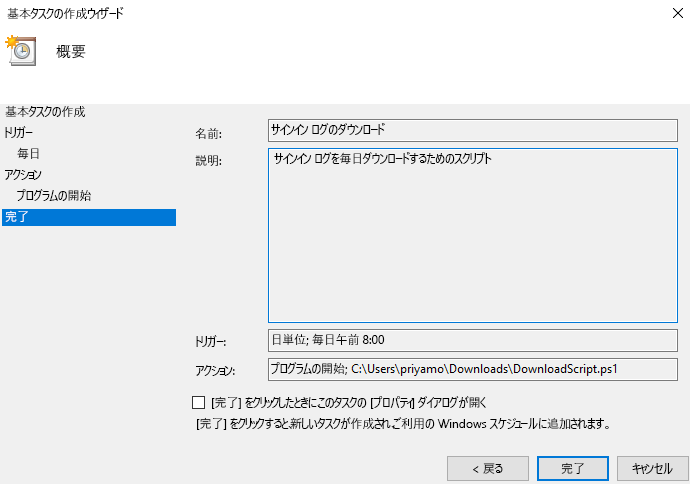

# チュートリアル: サインイン ログにアクセスするためにスクリプトをダウンロードして使用する方法

サインイン アクティビティ データを Azure portal の外部で操作する場合は、ダウンロードすることができます。 Azure portal の **[ダウンロード]** オプションでは、最新の 5,000 レコードの CSV ファイルが作成されます。 より柔軟性が必要な場合 (たとえば、一度に 5,000 件を超えるレコードをダウンロードする場合や、スケジュールされた間隔でログをダウンロードする場合など) は、**[スクリプト]** ボタンを使用して、データをダウンロードする PowerShell スクリプトを生成できます。

このチュートリアルでは、過去 24 時間のすべてのサインイン ログをダウンロードするスクリプトを生成し、それを毎日実行するようにスケジュールする方法について説明します。 

## 前提条件

以下のものが必要です。

* プレミアム (P1/P2) ライセンスがある Azure Active Directory テナント。 
* テナントの**グローバル管理者**、**セキュリティ管理者****セキュリティ閲覧者**、または**レポート閲覧者**ロールに含まれているユーザー。 また、すべてのユーザーは自分のサインインにアクセスできます。 
* ダウンロードしたスクリプトを Windows 10 マシンで実行するには、[AzureRM モジュールを設定し、実行ポリシーを設定](concept-sign-ins.md#running-the-script-on-a-windows-10-machine)します。

## チュートリアル

1. [Azure portal](https://portal.azure.com) に移動し、自分のディレクトリを選択します。
2. **[Azure Active Directory]** を選択し、**[監視]** セクションの **[サインイン]** を選択します。 
3. **[Date Range]\(日付範囲\)** フィルター ドロップダウンを使用して **[24 時間]** を選択し、過去 24 時間のデータを取得します。 
4. **[適用]** を選択し、期待どおりにフィルターが適用されたことを確認します。 
5. 上部のメニューの **[スクリプト]** を選択して、適用されたフィルターの Powershell スクリプトをダウンロードします。

     
     
6. Windows マシンで**タスク スケジューラ** アプリケーションを開き、**[基本タスクの作成]** を選択します。
7. タスクの名前と説明を入力し、**[次へ]** をクリックします。
8. **[毎日]** ラジオ ボタンを選択して、タスクが毎日実行されるようにし、開始日と時刻を入力します。
9. アクション メニューで **[プログラムを起動する]** を選択し、ダウンロードしたスクリプトを選択して、**[次へ]** を選択します。 
10. スケジュールされたタスクを確認し、**[完了]** を選択してタスクを作成します。

     

これで、タスクが毎日実行され、過去 24 時間のサインイン レコードが **AAD_SignInReport_YYYYMMDD_HHMMSS.csv** という形式のファイルに保存されます。 また、ダウンロードした PowerShell スクリプトを編集して、別のファイル名で保存されるようにしたり、ダウンロードされるレコード数を変更したりすることもできます。 

## 次の手順

* [Azure Active Directory レポートの保持ポリシー](reference-reports-data-retention.md)
* [Azure Active Directory Reporting API の概要](concept-reporting-api.md)
* [証明書によるレポート API へのアクセス](tutorial-access-api-with-certificates.md)
