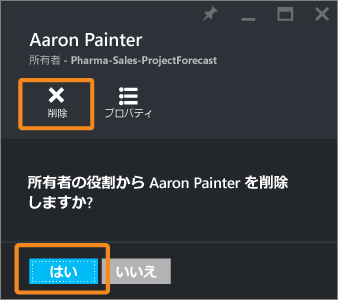

<properties
	pageTitle="Azure Active Directory の AD ロール ベースのアクセス制御 | Microsoft Azure"
	description="この記事では、Azure のロール ベースのアクセス制御について説明します。"
	services="active-directory"
	documentationCenter=""
	authors="IHenkel"
	manager="stevenpo"
	editor=""/>

<tags
	ms.service="active-directory"
	ms.devlang="na"
	ms.topic="article"
	ms.tgt_pltfrm="na"
	ms.workload="identity"
	ms.date="10/12/2015"
	ms.author="inhenk"/>

# Azure Active Directory のロール ベースのアクセス制御

## ロール ベースのアクセス制御
Azure のロール ベースのアクセス制御 (RBAC) では、Azure のアクセス権の詳細な管理を実現します。RBAC を使用して、開発チーム内で職務を分離し、職務に必要なアクセス権のみを付与します。

### Azure でのアクセス管理の基礎
各 Azure サブスクリプションは Azure Active Directory にあります。そのディレクトリからのユーザー、グループ、およびアプリケーションのみが、Azure 管理ポータル、Azure コマンドライン ツール、および Azure 管理 API を使用して、Azure のサブスクリプションでリソースを管理するためのアクセス権を付与されます。

正しいスコープで、ユーザー、グループ、およびアプリケーションに適切な RBAC ロールを割り当てることで、アクセスが許可されます。サブスクリプション全体へのアクセスを許可するには、サブスクリプションのスコープでロールを割り当てます。サブスクリプション内の特定のリソース グループへのアクセスを許可するには、リソース グループのスコープでロールを割り当てます。Web サイト、仮想マシン、およびサブネットのように、リソースのみにアクセスを許可するよう、特定のリソースでロールを割り当てる場合もあります。

ユーザー、グループ、およびアプリケーションに割り当てる RBAC ロールでは、そのスコープ内でユーザー (またはアプリケーション) が管理できるリソースを決定します。

### Azure RBAC の組み込みのロール
Azure RBAC には、すべてのリソース タイプに適用される 3 つの基本的なロール(所有者、投稿者、および閲覧者) があります。所有者は、他のユーザーへアクセス権を委任する権限を含め、すべてのリソースへのフル アクセス権を持ちます。投稿者は、Azure リソースのすべてのタイプを作成および管理できますが、他のユーザーへアクセス権を付与することはできません。閲覧者は、既存の Azure リソースのみを表示できます。残りの Azure RBAC ロールでは、特定の Azure リソースの管理が許可されます。たとえば、仮想マシンの寄稿者ロールでは、仮想マシンの作成と管理は許可されますが、仮想マシンが接続する仮想ネットワークまたはサブネットの管理は許可されません。

[RBAC の組み込みのロール](role-based-access-built-in-roles.md)は、Azure で使用できる組み込みの RBAC ロールの一覧を表示します。各ロールに対しては、組み込みのロールがアクセスを許可する操作を指定します。

### Azure のリソース階層とアクセスの継承
Azure の各サブスクリプションは、1 つのディレクトリのみに属しており、各リソース グループは 1 つのサブスクリプションのみに属します。さらに、各リソースは、1 つのリソース グループにのみ属しています。親スコープで許可されたアクセスは、子スコープに継承されます。閲覧者のロールをサブスクリプションのスコープで、Azure AD グループに付与すると、そのグループのメンバーは、サブスクリプション内のすべてのリソース グループとすべてのリソースを表示することができるようになります。リソース グループのスコープで、アプリケーションに寄稿者のロールを付与すると、そのアプリケーションは、そのリソース グループのすべてのタイプのリソースを管理することができるようになりますが、サブスクリプション内の他のリソース グループは管理できません。

### Azure RBAC と従来のサブスクリプションの管理者と共同管理者の比較
従来のサブスクリプションの管理者と共同管理者は、Azure サブスクリプションへのフル アクセス権を持ちます。従来のポータル (https://manage.windowsazure.com)、および Azure Service Manager API の両方に加えて、新しい管理ポータル (https://portal.azure.com)、および新しい Azure Resource Manager API を利用してリソースを管理できます。RBAC モデルで、従来の管理者は、サブスクリプション スコープで所有者ロールを割り当てられます。

Azure の詳細な承認モデル (Azure RBAC) は、新しい管理ポータル (https://portal.azure.com) と Azure Resource Manager API でのみサポートされます。RBAC ロールを (サブスクリプション、リソース グループ、リソース スコープで) 割り当てられているユーザーとアプリケーションは、従来の管理ポータル (http://manage.windowsazure.com) と Azure Service Management API を使用できません。

### 管理用の承認とデータ操作
Azure の詳細な承認モデル (Azure RBAC) は、Azure ポータルと Azure Resource Manager API における Azure リソースの管理操作専用です。RBAC による Azure リソースのデータ レベルの操作の中には、許可されていないものもあります。たとえば、ストレージ アカウントの作成/読み取り/更新/削除は RBAC によって制御できますが、ストレージ アカウント内の BLOB やテーブルの作成/読み取り/更新/削除は現時点では RBAC によって制御できません。同様に、SQL DB の作成/読み取り/更新/削除は RBAC によって制御できますが、DB 内の SQL テーブルの作成/読み取り/更新/削除は現時点では RBAC によって制御できません。

## Azure 管理ポータルを使用したアクセス権の管理
### アクセス許可の表示
リソース グループ ブレードの [essentials] セクションでは、[access settings] を選択します。**[ユーザー]** ブレードには、リソース グループへのアクセス権が付与されたすべてのユーザー、グループ、およびアプリケーションが一覧表示されます。アクセス権は、リソース グループに割り当てられているか、親のサブスクリプションへの割り当てから継承されています。

> [AZURE.NOTE]従来のサブスクリプションの管理者と共同管理者は、新しい RBAC モデルのサブスクリプションの有効な所有者です。

### アクセス権の追加
1. **[追加]** アイコンを **[ユーザー]** ブレードでクリックします。 
2. 割り当てるロールを選択します。
3. アクセス許可を付与するユーザー、グループ、またはアプリケーションを検索して、選択します。
4. ユーザー、グループ、およびアプリケーションのディレクトリを表示名、電子メール アドレス、およびオブジェクト識別子を使用して検索します。

### アクセス権の削除
1. **[ユーザー]** ブレードで、削除するロールの割り当てを選択します。
2. [割り当ての詳細] ブレードで、**[削除]** アイコンをクリックします。
3. **[はい]** をクリックして削除を確定します。

> [AZURE.NOTE]継承された割り当ては、子スコープから削除できません。親スコープへ移動し、割り当てを削除します。

## Azure PowerShell を使用したアクセス権の管理
アクセス権は、Azure PowerShell ツールで Azure RBAC コマンドを使用することで管理できます。

-	割り当てることができる RBAC のロールを表示したり、アクセス権が付与されている操作を調べたりするには、`Get-AzureRoleDefinition` を使用します。

-	指定したサブスクリプション、リソース グループ、またはリソースで有効な RBAC のアクセス権の割り当てを表示するには、`Get-AzureRoleAssignment` を使用します。指定したユーザーと、そのユーザーが属するグループへのアクセス権の割り当てを表示するには、`ExpandPrincipalGroups` パラメーターを使用します。従来のサブスクリプションの管理者と共同管理者の一覧も表示するには、`IncludeClassicAdministrators` パラメーターを使用します。

-	ユーザー、グループ、およびアプリケーションにアクセス権を付与するには、`New-AzureRoleAssignment` を使用します。

-	アクセス権を削除するには、`Remove-AzureRoleAssignment` を使用します。

Azure PowerShell を使用したアクセス権の管理のより詳細な例を確認するには、「[Azure PowerShell を使用したアクセス権の管理](role-based-access-control-manage-access-powershell.md)」を参照してください。

## Azure コマンドライン インターフェイスを使用したアクセス権の管理
アクセス権は、Azure コマンドライン インターフェイスで、Azure RBAC コマンドを使用することで管理できます。

-	割り当てに使用できる RBAC ロールを一覧表示するには、`azure role list` を使用します。アクセス権を付与する操作を調査するには、[azure role show] を使用します。

-	指定したサブスクリプション、リソース グループ、またはリソースで有効な RBAC のアクセス権の割り当てを表示するには、`azure role assignment list` を使用します。指定したユーザーと、そのユーザーが属するグループへのアクセス権の割り当てを表示するには、`expandPrincipalGroups` オプションを使用します。従来のサブスクリプションの管理者と共同管理者の一覧を表示するには、`includeClassicAdministrators` パラメーターを使用します。

-	ユーザー、グループ、およびアプリケーションにアクセス権を付与するには、`azure role assignment create` を使用します。

-	アクセス権を削除するには、`azure role assignment delete` を使用します。

Azure CLI を使用したアクセス権の管理のより詳細な例を確認するには、「[Azure CLI を使用したアクセス権の管理](role-based-access-control-manage-access-azure-cli.md)」を参照してください。

## アクセス変更履歴レポートの使用
Azure サブスクリプションで発生したすべてのアクセス変更は、Azure イベントに記録されます。

### Azure PowerShell を使用したレポートの作成
Azure サブスクリプションで、誰が、どのような種類のアクセス権を、どこから、どこへ、どのスコープで許可または破棄したかといったレポートを作成するには、以下の PowerShell コマンドを使用します。

    Get-AzureAuthorizationChangeLog

### Azure CLI を使用したレポートの作成
Azure サブスクリプションで、誰が、どのような種類のアクセス権を、どこから、どこへ、どのスコープで許可または破棄したかといったレポートを作成するには、以下の Azure コマンドライン インターフェイス (CLI) コマンドを使用します。

    azure authorization changelog

> [AZURE.NOTE]アクセス変更は、過去 90 日間に対し、(15 日分を) 照会することができます。

次の例では、サブスクリプションで過去 7 日間のアクセス変更をすべて一覧表示します。

### スプレッドシートへのアクセス変更のエクスポート
確認のためにスプレッドシートへアクセス変更の内容をエクスポートすると便利です。

<!---HONumber=Oct15_HO3-->