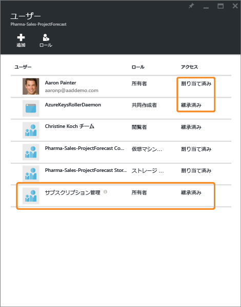
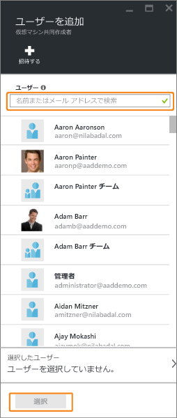
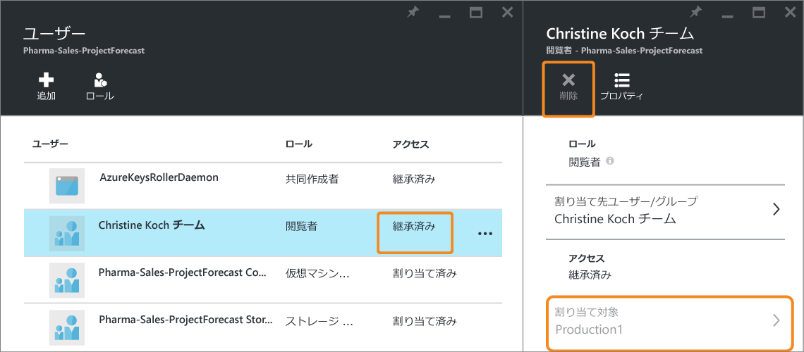

# ロールベースのアクセス制御を使用して Azure サブスクリプション リソースへのアクセスを管理する
> [!div class="op_single_selector"]
> * [ユーザーまたはグループによるアクセスの管理](role-based-access-control-manage-assignments.md)
> * [リソースによるアクセスの管理](role-based-access-control-configure.md)

Azure のロールベースのアクセス制御 (RBAC) では、Azure のアクセス権の詳細な管理を実現します。 RBAC を使用すると、職務に必要な範囲のアクセス権だけをユーザーに付与することができます。 この記事では、Azure ポータルにおける RBAC の基本的な使い方について説明しています。 RBAC を使用した高度なアクセス管理については、「 [What is Role-Based Access Control (ロールベースのアクセス制御とは)](role-based-access-control-what-is.md)」を参照してください。

各サブスクリプション内では、最大 2,000 のロールの割り当てを許可できます。 

## アクセス許可の表示
[Azure ポータル](https://portal.azure.com)のメイン ブレードで、リソース、リソース グループ、またはサブスクリプションへのアクセス権が付与されているユーザーを確認できます。 たとえば、リソース グループのいずれかへのアクセス権があるユーザーを確認する場合は、次の手順を実行します。

1. 左側にあるナビゲーション バーで、 **[リソース グループ]** アイコンをクリックします。  
    
2. **[リソース グループ]** ブレードからリソース グループの名前を選択します。
3. 左側のメニューから **[アクセス制御 (IAM)]** を選択します。  
4. アクセス制御ブレードに、リソース グループへのアクセス権が付与されたすべてのユーザー、グループ、およびアプリケーションが一覧表示されます。  
   
    

ロールには、スコープが **[このリソース]** に設定されているものもあれば、別のスコープから **[継承]** に設定されているものもあることに注目してください。 アクセス権は、リソース グループに明示的に割り当てられる場合と、親サブスクリプションへの割り当てから継承される場合があります。

> [!NOTE]
> 従来のサブスクリプションの管理者と共同管理者は、新しい RBAC モデルではサブスクリプションの所有者と見なされます。

## アクセス権の追加
アクセス権は、リソース内、リソース グループ内、またはサブスクリプション内から付与します。これは、ロール割り当てのスコープになります。

1. アクセス制御ブレードで **[追加]** を選択します。  
2. **[役割を選択]** ブレードから割り当てる役割を選択します。
3. ディレクトリで、アクセス権を付与するユーザー、グループ、またはアプリケーションを選択します。 ディレクトリは、表示名、電子メール アドレス、およびオブジェクト識別子を使用して検索できます。  
   
    
4. **[OK]** を選択して割り当てを作成します。 **[ユーザーを追加中]** ポップアップに進行状況が表示されます。  
    ![[ユーザーを追加中] 進捗状況バー - スクリーンショット](./media/role-based-access-control-configure/addinguser_popup.png)

ロールの割り当てが正常に追加されると、 **[ユーザー]** ブレードに表示されます。

## アクセス権の削除
1. 削除したい割り当ての名前にカーソルを合わせます。 名前の横にチェック ボックスが表示されます。
2. チェック ボックスを使用して、ロールの割り当てを 1 つまたは複数選択します。
2. **[削除]** を選択します。  
3. **[はい]** を選択して削除を確定します。

継承された割り当ては削除できません。 継承された割り当てを削除する必要がある場合は、ロールの割り当てが作成されたスコープで削除する必要があります。 **[スコープ]** 列の **[継承済み]** の横に、このロールが割り当てられているリソースへのリンクが表示されています。 そこにリストされているリソースにアクセスして、ロールの割り当てを削除してください。

## その他のアクセス管理ツール
Azure ポータル以外のツールでも Azure RBAC コマンドを使用したアクセス管理とロールの割り当てを実行できます。  次のリンクをクリックして、前提条件の詳細と、Azure RBAC コマンドの使用方法について確認できます。

* [Azure PowerShell](role-based-access-control-manage-access-powershell.md)
* [Azure コマンド ライン インターフェイス](role-based-access-control-manage-access-azure-cli.md)
* [REST API](role-based-access-control-manage-access-rest.md)

## 次のステップ
* [アクセス変更履歴レポートの作成](role-based-access-control-access-change-history-report.md)
* [RBAC の組み込みロール](role-based-access-built-in-roles.md)
* 独自の [Azure RBAC でカスタム ロール](role-based-access-control-custom-roles.md)

