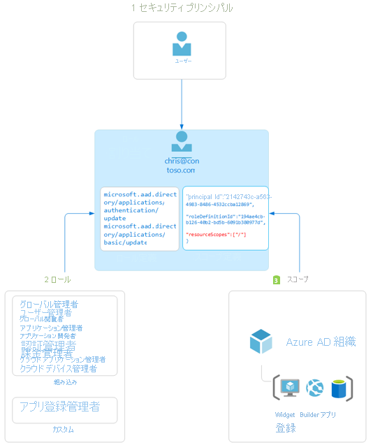

# Azure Active Directory のロールベースのアクセス制御の概要

この記事では、Azure Active Directory (Azure AD) のロールベースのアクセス制御について説明します。 Azure AD ロールを使用すると、最小限の特権の原則に従って、管理者に詳細なアクセス許可を付与できます。 Azure AD の組み込みロールとカスタム ロールは、[Azure リソースのロールベースのアクセス制御システム](../../role-based-access-control/overview.md) (Azure ロール) と同様の概念で動作します。 [この 2 つのロールベースのアクセス制御システムの違い](../../role-based-access-control/rbac-and-directory-admin-roles.md)は次のとおりです。

- Azure AD ロールでは、Graph API を使用して、ユーザー、グループ、アプリケーションなどの Azure AD リソースへのアクセスを制御します
- Azure ロールでは、Azure Resource Management を使用して、仮想マシンやストレージなどの Azure リソースへのアクセスを制御します

どちらのシステムにも、同様に使用されるロールの定義とロールの割り当ての概念が含まれています。 ただし、Azure AD ロールのアクセス許可を Azure カスタム ロールで使用することはできません。その逆も同様です。

## Azure AD のロールベースのアクセス制御を理解する
Azure AD では、2 種類のロールの定義がサポートされています。 
* [組み込みのロール](./permissions-reference.md)
* [カスタム ロール](./custom-create.md)

組み込みロールは、一連のアクセス許可が固定された、すぐに使えるロールです。 これらのロールの定義は変更できません。 Azure AD では多数の[組み込みロール](./permissions-reference.md)がサポートされており、その数は増え続けています。 柔軟性を高め、高度な要件を満たすために、Azure AD では[カスタム ロール](./custom-create.md)もサポートされています。 カスタム Azure AD ロールを使用したアクセス許可の付与は、カスタム ロール定義の作成と、ロールの割り当てを使用した割り当てという 2 ステップのプロセスです。 カスタム ロールの定義は、プリセットの一覧から追加するアクセス許可のコレクションです。 これらのアクセス許可は、組み込みロールで使用されるものと同じアクセス許可です。  

カスタム ロールの定義を作成したら (または組み込みロールを使用する場合)、ロールの割り当てを作成することによって、ユーザーに割り当てることができます。 ロールの割り当てにより、指定したスコープでロール定義に含まれるアクセス許可がユーザーに付与されます。 この 2 ステップのプロセスにより、1 つのロール定義を作成し、異なるスコープで何度もそれを割り当てることができます。 スコープでは、ロール メンバーがアクセスできる Azure AD リソースのセットを定義します。 最も一般的なスコープは、組織全体 (org-wide) のスコープです。 カスタム ロールは、組織全体のスコープで割り当てることができます。つまり、ロール メンバーには組織内のすべてのリソースに対してロールのアクセス許可が付与されます。 カスタム ロールは、オブジェクトのスコープで割り当てることもできます。 オブジェクト スコープの例は単一のアプリケーションです。 同じロールを、あるユーザーに対しては組織内のすべてのアプリケーションについて割り当て、別のユーザーに対しては Contoso Expense Reports アプリだけのスコープで割り当てる、といったことができます。  

Azure AD の組み込みロールとカスタム ロールは、[Azure のロールベースのアクセス制御 (Azure RBAC)](../develop/access-tokens.md#payload-claims) と同様の概念で動作します。 [これら 2 つのロールベースのアクセス制御システムの違い](../../role-based-access-control/rbac-and-directory-admin-roles.md)は、Azure RBAC では Azure Resource Management を使用して仮想マシンやストレージなどの Azure リソースへのアクセスが制御されるのに対し、Azure AD カスタム ロールでは Graph API を使用して Azure AD リソースへのアクセスが制御されることです。 どちらのシステムにも、ロールの定義とロールの割り当ての概念が利用されています。 Azure AD RBAC のアクセス許可を Azure ロールに含めることはできません。また、その逆もできません。

### ユーザーがリソースへのアクセス権を持っているどうかを Azure AD が特定する方法

管理リソースへのアクセス権をユーザーが持っているかどうかを判断するために Azure AD が使用する手順の概要を次に示します。 この情報を使用して、アクセスに関する問題のトラブルシューティングを行います。

1. ユーザー (またはサービス プリンシパル) が、Microsoft Graph または Azure AD Graph エンドポイントへのトークンを取得します。
1. ユーザーは、発行されたトークンを使用して Microsoft Graph または Azure AD Graph 経由で Azure Active Directory (Azure AD) に対する API 呼び出しを行います。
1. 状況に応じて、Azure AD は次のいずれかのアクションを実行します。
   - ユーザーのアクセス トークン内の [wids 要求](../../active-directory-b2c/access-tokens.md)に基づいて、ユーザーのロール メンバーシップを評価します。
   - アクションが実行されるリソースに対して直接またはグループ メンバーシップを介してユーザーに適用されるすべてのロールの割り当てを取得します。
1. Azure AD は、API 呼び出しでのアクションが、このリソースに対してユーザーが持っているロールに含まれるかどうかを判別します。
1. 要求されたスコープでのアクションを含むロールをユーザーが持っていない場合、アクセスは許可されません。 それ以外の場合、アクセスは許可されます。

## ロール割り当て

ロールの割り当ては、Azure AD リソースへのアクセスを許可するために、特定の "*スコープ*" で "*ユーザー*" に "*ロールの定義*" を関連付ける Azure AD リソースです。 アクセスは、ロールの割り当てを作成することによって許可され、ロールの割り当てを削除することによって取り消されます。 ロールの割り当ての核心は、次の 3 つの要素で構成されます。

- Azure AD ユーザー
- ロール定義
- リソースのスコープ

[ロールの割り当ての作成](custom-create.md)は、Azure portal、Azure AD PowerShell、または Graph API を使って行うことができます。 また、[ロールの割り当てを一覧表示](view-assignments.md)することもできます。

次の図では、ロールの割り当ての例を示します。 この例では、Contoso Widget Builder アプリ登録のスコープで、Chris Green にアプリ登録管理者のカスタム ロールが割り当てられています。 割り当てにより、Chris には、この特定のアプリ登録に対してのみ、アプリ登録管理者ロールのアクセス許可が付与されます。

### セキュリティ プリンシパル

セキュリティ プリンシパルとは、Azure AD リソースへのアクセスが割り当てられるユーザーまたはサービス プリンシパルを表します。 "ユーザー" は、Azure Active Directory 内にプロファイルを持つ個人です。

### Role

ロール定義またはロールは、アクセス許可のコレクションです。 ロール定義には、Azure AD リソースに対して実行できる操作 (作成、読み取り、更新、削除など) が列記されています。 Azure AD には 2 種類のロールがあります。

- Microsoft によって作成されて変更できない組み込みロール。
- 組織によって作成および管理されるカスタム ロール。

### Scope

スコープとは、ロールの割り当ての一部として特定の Azure AD リソースに対して許可されるアクションの制限です。 ロールを割り当てるときに、特定のリソースに対する管理者のアクセスを制限するスコープを指定できます。 たとえば、開発者にカスタム ロールを付与し、特定のアプリケーション登録の管理だけを許可したい場合は、ロールの割り当てでスコープとして特定のアプリケーション登録を含めることができます。

## 必要とされるライセンス プラン

Azure AD の組み込みロールは無料で使用できますが、カスタム ロールには Azure AD Premium P1 ライセンスが必要です。 要件に対する適切なライセンスを確認するには、「[Free、Basic、および Premium エディションの一般公開されている機能の比較](https://azure.microsoft.com/pricing/details/active-directory)」をご覧ください。

## 次のステップ

- [Azure AD ロールを理解する](concept-understand-roles.md)
- [Azure portal、Azure AD PowerShell、および Graph API](custom-create.md) を使用して、カスタム ロールの割り当てを作成する
- [ロールの割り当てを一覧表示する](view-assignments.md)