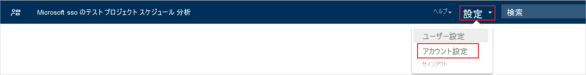
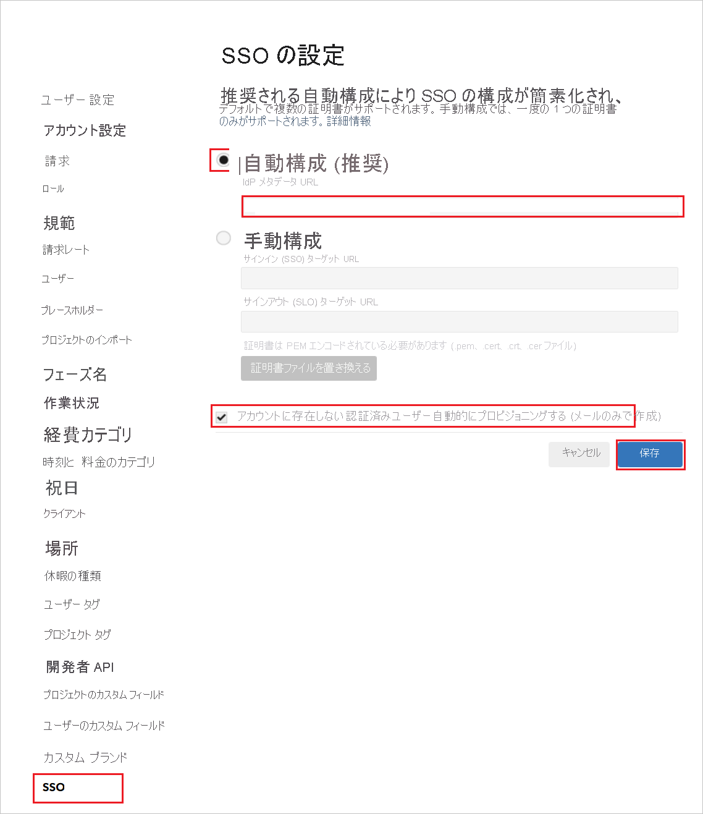

# チュートリアル: Azure AD SSO と 10,000ft Plans の統合

このチュートリアルでは、10,000ft Plans と Azure Active Directory (Azure AD) を統合する方法について説明します。 Azure AD と 10,000ft Plans を統合すると、次のことが可能になります。

* 10,000ft Plans にアクセスできるユーザーを Azure AD で制御できます。
* ユーザーが自分の Azure AD アカウントを使用して 10,000ft Plans に自動的にサインインできるように設定できます。
* 1 つの中央サイト (Azure Portal) で自分のアカウントを管理します。

## 前提条件

10,000ft Plans と Azure AD の統合を構成するには、次のものが必要です。

* Azure AD サブスクリプション。 Azure AD の環境がない場合は、[無料アカウント](https://azure.microsoft.com/free/)を取得できます。
* 10,000ft Plans でのシングル サインオンが有効なサブスクリプション。

## シナリオの説明

このチュートリアルでは、テスト環境で Azure AD のシングル サインオンを構成してテストします。

* 10,000ft Plans では、**SP** Initiated SSO がサポートされます。
* 10,000ft Plans では、**Just-In-Time** ユーザー プロビジョニングがサポートされます。

## ギャラリーからの 10,000ft Plans の追加

Azure AD への 10,000ft Plans の統合を構成するには、ギャラリーから管理対象 SaaS アプリの一覧に 10,000ft Plans を追加する必要があります。

1. 職場または学校アカウントか、個人の Microsoft アカウントを使用して、Azure portal にサインインします。
1. 左のナビゲーション ウィンドウで **[Azure Active Directory]** サービスを選択します。
1. **[エンタープライズ アプリケーション]** に移動し、 **[すべてのアプリケーション]** を選択します。
1. 新しいアプリケーションを追加するには、 **[新しいアプリケーション]** を選択します。
1. **[ギャラリーから追加する]** セクションで、検索ボックスに「**10,000ft Plans**」と入力します。
1. 結果のパネルから **[10,000ft Plans]** を選択し、アプリを追加します。 お使いのテナントにアプリが追加されるのを数秒待機します。

## 10,000ft Plans の Azure AD SSO の構成とテスト

**B.Simon** というテスト ユーザーを使用して、10,000ft Plans に対する Azure AD SSO を構成してテストします。 SSO が機能するためには、Azure AD ユーザーと 10,000ft Plans の関連ユーザーとの間にリンク関係を確立する必要があります。

10,000ft Plans に対して Azure AD SSO を構成してテストするには、次の手順を実行します。

1. **[Azure AD SSO の構成](#configure-azure-ad-sso)** - ユーザーがこの機能を使用できるようにします。
    1. **[Azure AD のテスト ユーザーの作成](#create-an-azure-ad-test-user)** - B.Simon で Azure AD のシングル サインオンをテストします。
    1. **[Azure AD テスト ユーザーの割り当て](#assign-the-azure-ad-test-user)** - B.Simon が Azure AD シングル サインオンを使用できるようにします。
1. **[10,000ft Plans の SSO の構成](#configure-10000ft-plans-sso)** - アプリケーション側でシングル サインオン設定を構成します。
    1. **[10,000ft Plans のテスト ユーザーの作成](#create-10000ft-plans-test-user)** - 10,000ft Plans で B.Simon に対応するユーザーを作成し、Azure AD の B.Simon にリンクさせます。
1. **[SSO のテスト](#test-sso)** - 構成が機能するかどうかを確認します。

## Azure AD SSO の構成

これらの手順に従って、Azure portal で Azure AD SSO を有効にします。

1. Azure portal の **10,000ft Plans** アプリケーション統合ページで、 **[管理]** セクションを見つけて、 **[シングル サインオン]** を選択します。
1. **[シングル サインオン方式の選択]** ページで、 **[SAML]** を選択します。
1. **[SAML によるシングル サインオンのセットアップ]** ページで、 **[基本的な SAML 構成]** の鉛筆アイコンをクリックして設定を編集します。

   

4. **[基本的な SAML 構成]** セクションで、次の手順を実行します。

    a. **[識別子 (エンティティ ID)]** ボックスに `https://rm.smartsheet.com/saml/metadata` という URL を入力します。

    b. **[応答 URL]** ボックスに、URL として「`https://rm.smartsheet.com/saml/acs`」と入力します。
    
    c. **[サインオン URL]** テキスト ボックスに、URL として「` https://rm.smartsheet.com`」と入力します。

    > [!NOTE]
    > カスタム ドメインがある場合は、 **[識別子]** の値が異なります。 この値を取得するには、[10,000ft Plans クライアント サポート チーム](https://www.10000ft.com/plans/support)に問い合わせてください。 Azure portal の **[基本的な SAML 構成]** セクションに示されているパターンを参照することもできます。

1. **[SAML でシングル サインオンをセットアップします]** ページの **[SAML 署名証明書]** セクションで、コピー アイコンを選択して **[アプリのフェデレーション メタデータ URL]** をコピーします。 それを自分のコンピューターに保存します。

    ![コピー アイコンが強調表示された [SAML 署名証明書] セクションのスクリーンショット](common/copy-metadataurl.png)

### Azure AD のテスト ユーザーの作成

このセクションでは、Azure portal 内で B.Simon というテスト ユーザーを作成します。

1. Azure portal の **[Azure サービス]** ペインで、 **[ユーザー]** 、 **[すべてのユーザー]** の順に選択します。
1. 画面の上部にある **[新しいユーザー]** を選択します。
1. **[ユーザー]** プロパティで、以下の手順を実行します。
   1. **[名前]** フィールドに「`B.Simon`」と入力します。  
   1. **[ユーザー名]** フィールドに「username@companydomain.extension」と入力します。 たとえば、「 `B.Simon@contoso.com` 」のように入力します。
   1. **[パスワードを表示]** チェック ボックスをオンにし、 **[パスワード]** ボックスに表示された値を書き留めます。
   1. **Create** をクリックしてください。

### Azure AD テスト ユーザーの割り当て

このセクションでは、B.Simon に 10,000ft Plans へのアクセスを許可することで、このユーザーが Azure シングル サインオンを使用できるようにします。

1. Azure portal で **[エンタープライズ アプリケーション]** を選択し、 **[すべてのアプリケーション]** を選択します。
1. アプリケーションの一覧で **[10,000ft Plans]** を選択します。
1. アプリの概要ページで、 **[管理]** セクションを見つけて、 **[ユーザーとグループ]** を選択します。
1. **[ユーザーまたはグループの追加]** を選択し、 **[割り当ての追加]** ダイアログで **[ユーザーとグループ]** を選択します。
1. **[ユーザーとグループ]** ダイアログの [ユーザー] の一覧から **[B.Simon]** を選択し、画面の下部にある **[選択]** ボタンをクリックします。
1. ユーザーにロールが割り当てられることが想定される場合は、 **[ロールの選択]** ドロップダウンからそれを選択できます。 このアプリに対してロールが設定されていない場合は、[既定のアクセス] ロールが選択されていることを確認します。
1. **[割り当ての追加]** ダイアログで、 **[割り当て]** をクリックします。

## 10,000ft Plans の SSO の構成

1. 10000ft Plans の Web サイトに管理者としてサインインします。

1. **[設定]** をクリックし、ドロップダウンから **[アカウント設定]** を選択します。

    

1. 左側のメニューで **[SSO]** をクリックし、次の手順を実行します。

    

    a. [SSO の設定]セクションで、 **[自動構成]** を選択します。

    b. **[IdP メタデータ URL]** テキスト ボックスに、Azure portal からコピーした **アプリのフェデレーション メタデータ URL** の値を入力します。

    c. **[アカウントにない認証されたユーザーを自動プロビジョニングする]** チェックボックスをオンにします。

    d. **[保存]** をクリックします。

### 10000ft Plans のテスト ユーザーの作成

このセクションでは、Britta Simon というユーザーを 10,000ft Plans に作成します。 10,000ft Plans では、Just-In-Time ユーザー プロビジョニングがサポートされています。この設定は既定で有効になっています。 このセクションでは、ユーザー側で必要な操作はありません。 10,000ft Plans にユーザーがまだ存在していない場合は、認証後に新規に作成されます。

> [!NOTE]
> ユーザーを手動で作成する必要がある場合は、[10,000ft Plans のクライアント サポート チーム](https://www.10000ft.com/plans/support)にお問い合わせください。

## SSO のテスト

このセクションでは、次のオプションを使用して Azure AD のシングル サインオン構成をテストします。 

* Azure portal で **[このアプリケーションをテストします]** をクリックします。 これにより、ログイン フローを開始できる 10,000ft Plans のサインオン URL にリダイレクトされます。 

* 10,000ft Plans のサインオン URL に直接移動し、そこからログイン フローを開始します。

* Microsoft マイ アプリを使用することができます。 マイ アプリで [10,000ft Plans] タイルをクリックすると、10,000ft Plans のサインオン URL にリダイレクトされます。 マイ アプリの詳細については、[マイ アプリの概要](https://support.microsoft.com/account-billing/sign-in-and-start-apps-from-the-my-apps-portal-2f3b1bae-0e5a-4a86-a33e-876fbd2a4510)に関するページを参照してください。

## 次のステップ

10,000ft Plans を構成したら、組織の機密データを流出と侵入からリアルタイムで保護するセッション制御を適用することができます。 セッション制御は、条件付きアクセスを拡張したものです。 [Microsoft Defender for Cloud Apps でセッション制御を強制する方法](/cloud-app-security/proxy-deployment-any-app)をご覧ください。
