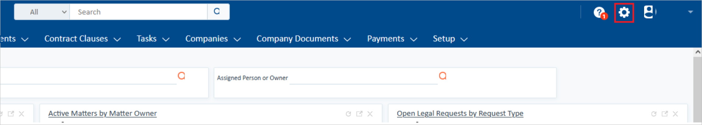

# チュートリアル: Azure Active Directory と Agiloft Contract Management Suite の統合

このチュートリアルでは、Agiloft Contract Management Suite と Azure Active Directory (Azure AD) を統合する方法について説明します。 Agiloft Contract Management Suite を Azure AD と統合すると、次のことができるようになります。

* Agiloft Contract Management Suite にアクセスできるユーザーを Azure AD で制御できます。
* ユーザーが自分の Azure AD アカウントを使用して Agiloft Contract Management Suite に自動的にサインインできるように設定できます。
* 1 つの中央サイト (Azure Portal) で自分のアカウントを管理します。

## 前提条件

開始するには、次が必要です。

* Azure AD サブスクリプション。 サブスクリプションがない場合は、[無料アカウント](https://azure.microsoft.com/free/)を取得できます。
* Agiloft Contract Management Suite でのシングル サインオン (SSO) が有効なサブスクリプション。

## シナリオの説明

このチュートリアルでは、テスト環境で Azure AD のシングル サインオンを構成してテストします。

* Agiloft Contract Management Suite では、**SP と IDP** によって開始される SSO がサポートされます。
* Agiloft Contract Management Suite では、**Just In Time** ユーザー プロビジョニングがサポートされます。

## ギャラリーから Agiloft Contract Management Suite を追加する

Azure AD への Agiloft Contract Management Suite の統合を構成するには、ギャラリーから管理対象 SaaS アプリの一覧に Agiloft Contract Management Suite を追加する必要があります。

1. 職場または学校アカウントか、個人の Microsoft アカウントを使用して、Azure portal にサインインします。
1. 左のナビゲーション ウィンドウで **[Azure Active Directory]** サービスを選択します。
1. **[エンタープライズ アプリケーション]** に移動し、 **[すべてのアプリケーション]** を選択します。
1. 新しいアプリケーションを追加するには、 **[新しいアプリケーション]** を選択します。
1. **[ギャラリーから追加する]** セクションで、検索ボックスに「**Agiloft Contract Management Suite**」と入力します。
1. 結果のパネルから **[Agiloft Contract Management Suite]** を選択し、アプリを追加します。 お使いのテナントにアプリが追加されるのを数秒待機します。

## Agiloft Contract Management Suite の Azure AD SSO の構成とテスト

**B.Simon** というテスト ユーザーを使用して、Agiloft Contract Management Suite に対する Azure AD SSO を構成してテストします。 SSO を機能させるためには、Azure AD ユーザーと Agiloft Contract Management Suite の関連ユーザーとの間にリンク関係を確立する必要があります。

Agiloft Contract Management Suite に対する Azure AD SSO を構成してテストするには、次の手順を実行します。

1. **[Azure AD SSO の構成](#configure-azure-ad-sso)** - ユーザーがこの機能を使用できるようにします。
    1. **[Azure AD のテスト ユーザーの作成](#create-an-azure-ad-test-user)** - B.Simon で Azure AD のシングル サインオンをテストします。
    1. **[Azure AD テスト ユーザーの割り当て](#assign-the-azure-ad-test-user)** - B.Simon が Azure AD シングル サインオンを使用できるようにします。
1. **[Agiloft Contract Management Suite SSO の構成](#configure-agiloft-contract-management-suite-sso)** - アプリケーション側でシングル サインオン設定を構成します。
    1. **[Agiloft Contract Management Suite テスト ユーザーの作成](#create-agiloft-contract-management-suite-test-user)** - Azure AD の B.Simon にリンクさせるために、対応するユーザーを Agiloft Contract Management Suite で作成します。
1. **[SSO のテスト](#test-sso)** - 構成が機能するかどうかを確認します。

## Azure AD SSO の構成

これらの手順に従って、Azure portal で Azure AD SSO を有効にします。

1. Azure portal の **Agiloft Contract Management Suite** アプリケーション統合ページで、 **[管理]** セクションを探して、 **[シングル サインオン]** を選択します。
1. **[シングル サインオン方式の選択]** ページで、 **[SAML]** を選択します。
1. **[SAML によるシングル サインオンのセットアップ]** ページで、 **[基本的な SAML 構成]** の鉛筆アイコンをクリックして設定を編集します。

   

4. **[基本的な SAML 構成]** セクションで、アプリケーションを **IDP** 開始モードで構成する場合は、次の手順を実行します。

    a. **[識別子]** ボックスに、`https://<SUBDOMAIN>.agiloft.com/<KB_NAME>` の形式で URL を入力します。

    b. **[応答 URL]** ボックスに、`https://<SUBDOMAIN>.agiloft.com:443/gui2/spsamlsso?project=<KB_NAME>` のパターンを使用して URL を入力します

5. アプリケーションを **SP** 開始モードで構成する場合は、 **[追加の URL を設定します]** をクリックして次の手順を実行します。

    **[サインオン URL]** ボックスに、`https://<SUBDOMAIN>.agiloft.com/gui2/samlssologin.jsp?project=<KB_NAME>` という形式で URL を入力します。

    > [!NOTE]
    > これらは実際の値ではありません。 実際の識別子、応答 URL、サインオン URL でこれらの値を更新します。 値を取得するには、[Agiloft Contract Management Suite クライアント サポート チーム](https://www.agiloft.com/support-login.htm)に問い合わせてください。 Azure portal の **[基本的な SAML 構成]** セクションに示されているパターンを参照することもできます。

6. **[SAML でシングル サインオンをセットアップします]** ページの **[SAML 署名証明書]** セクションで、 **[ダウンロード]** をクリックして要件のとおりに指定したオプションからの **証明書 (Base64)** をダウンロードして、お使いのコンピューターに保存します。

    

7. **[Agiloft Contract Management Suite のセットアップ]** セクションで、要件に従って適切な URL をコピーします。

    

### Azure AD のテスト ユーザーの作成

このセクションでは、Azure portal 内で B.Simon というテスト ユーザーを作成します。

1. Azure portal の左側のウィンドウから、 **[Azure Active Directory]** 、 **[ユーザー]** 、 **[すべてのユーザー]** の順に選択します。
1. 画面の上部にある **[新しいユーザー]** を選択します。
1. **[ユーザー]** プロパティで、以下の手順を実行します。
   1. **[名前]** フィールドに「`B.Simon`」と入力します。  
   1. **[ユーザー名]** フィールドに「username@companydomain.extension」と入力します。 たとえば、「 `B.Simon@contoso.com` 」のように入力します。
   1. **[パスワードを表示]** チェック ボックスをオンにし、 **[パスワード]** ボックスに表示された値を書き留めます。
   1. **Create** をクリックしてください。

### Azure AD テスト ユーザーの割り当て

このセクションでは、Agiloft Contract Management Suite へのアクセス権を付与することによって、B.Simon が Azure シングル サインオンを使用できるようにします。

1. Azure portal で **[エンタープライズ アプリケーション]** を選択し、 **[すべてのアプリケーション]** を選択します。
1. アプリケーションの一覧で **[Agiloft Contract Management Suite]** を選択します。
1. アプリの概要ページで、 **[管理]** セクションを見つけて、 **[ユーザーとグループ]** を選択します。
1. **[ユーザーの追加]** を選択し、 **[割り当ての追加]** ダイアログで **[ユーザーとグループ]** を選択します。
1. **[ユーザーとグループ]** ダイアログの [ユーザー] の一覧から **[B.Simon]** を選択し、画面の下部にある **[選択]** ボタンをクリックします。
1. ユーザーにロールが割り当てられることが想定される場合は、 **[ロールの選択]** ドロップダウンからそれを選択できます。 このアプリに対してロールが設定されていない場合は、[既定のアクセス] ロールが選択されていることを確認します。
1. **[割り当ての追加]** ダイアログで、 **[割り当て]** をクリックします。

## Agiloft Contract Management Suite SSO を構成する

1. 別の Web ブラウザー ウィンドウで、Agiloft Contract Management Suite 企業サイトに管理者としてログインします。

2. ページの右上隅の **設定** アイコンをクリックします。

    

3. **[アクセス]** を選択します。

    ![[アクセス] 領域が強調表示されたスクリーンショット](./media/agiloft-tutorial/access.png)

4. **[Configure SAML 2.0 Single Sign-On]\(SAML 2.0 シングル サインオンの構成\)** ボタンをクリックします。

    ![[Configure SAML 2.0 Single Sign-On]\(SAML 2.0 シングル サインオンの構成\) ボタンが強調表示されているスクリーンショット。](./media/agiloft-tutorial/setup.png)

5. ウィザード ダイアログが表示されます。 ダイアログで、 **[Identity Provider Details]\(ID プロバイダーの詳細\)** をクリックし、次のフィールドを入力します。  

    

    a. **[IdP Entity Id / Issuer]\(IdP エンティティ ID/発行者\)** ボックスに、Azure portal からコピーした **Azure AD 識別子** の値を貼り付けます。

    b. **[IdP Login URL]\(IdP ログイン URL\)** ボックスに、Azure portal からコピーした **ログイン URL** の値を貼り付けます。

    c. **[IdP Logout URL]\(IdP ログアウト URL\)** ボックスに、Azure portal からコピーした **ログアウト URL** の値を貼り付けます。

    d. Azure ポータルからダウンロードした **Base-64 でエンコードされた証明書** をメモ帳で開き、その内容をクリップボードにコピーしてから、それを **[IdP Provided X.509 certificate contents]\(IdP によって提供される X.509 証明書の内容\)** ボックスに貼り付けます。

    e. **[完了]** をクリックします。

### Agiloft Contract Management Suite のテスト ユーザーの作成

このセクションでは、Britta Simon というユーザーを Agiloft Contract Management Suite に作成します。 Agiloft Contract Management Suite では、Just-In-Time ユーザー プロビジョニングがサポートされています。この設定は既定で有効になっています。 このセクションでは、ユーザー側で必要な操作はありません。 Agiloft Contract Management Suite にユーザーがまだ存在していない場合は、認証後に新規に作成されます。

## SSO のテスト

このセクションでは、次のオプションを使用して Azure AD のシングル サインオン構成をテストします。 

#### SP Initiated:

* Azure portal で **[このアプリケーションをテストします]** をクリックします。 これにより、ログイン フローを開始できる Agiloft Contract Management Suite のサインオン URL にリダイレクトされます。  

* Agiloft Contract Management Suite のサインオン URL に直接移動し、そこからログイン フローを開始します。

#### IDP Initiated:

* Azure portal で **[このアプリケーションをテストします]** をクリックすると、SSO を設定した Agiloft Contract Management Suite に自動的にサインインされます。 

また、Microsoft マイ アプリを使用して、任意のモードでアプリケーションをテストすることもできます。 マイ アプリで [Agiloft Contract Management Suite] タイルをクリックすると、SP モードで構成されている場合は、ログイン フローを開始するためのアプリケーション サインオン ページにリダイレクトされます。IDP モードで構成されている場合は、SSO を設定した Agiloft Contract Management Suite に自動的にサインインされます。 マイ アプリの詳細については、[マイ アプリの概要](https://support.microsoft.com/account-billing/sign-in-and-start-apps-from-the-my-apps-portal-2f3b1bae-0e5a-4a86-a33e-876fbd2a4510)に関するページを参照してください。

## 次のステップ

Agiloft Contract Management Suite を構成したら、組織の機密データを流出と侵入からリアルタイムで保護するセッション制御を適用できます。 セッション制御は、条件付きアクセスを拡張したものです。 [Microsoft Defender for Cloud Apps でセッション制御を強制する方法](/cloud-app-security/proxy-deployment-aad)をご覧ください。
