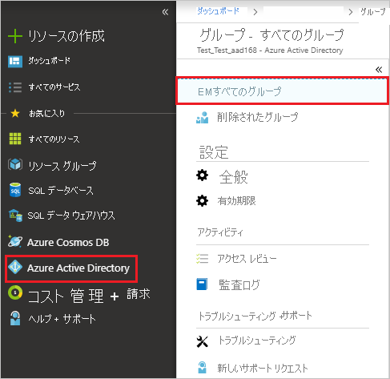

# チュートリアル:Amazon ビジネスと Azure Active Directory の統合

このチュートリアルでは、Amazon ビジネスと Azure Active Directory (Azure AD) を統合する方法について説明します。 [Amazon ビジネス](https://www.amazon.com/b2b/info/amazon-business?layout=landing)を Azure AD に統合すると、次のことができます。

* Amazon ビジネスにアクセスできるユーザーを Azure AD で制御できます。
* ユーザーが自分の Azure AD アカウントを使用して Amazon ビジネスに自動的にサインインできるように設定できます。
* 1 つの中央サイト (Azure Portal) で自分のアカウントを管理できます。

SaaS アプリと Azure AD の統合の詳細については、「[Azure Active Directory でのアプリケーションへのシングル サインオン](https://docs.microsoft.com/azure/active-directory/active-directory-appssoaccess-whatis)」を参照してください。

## 前提条件

開始するには、次が必要です。

* Azure AD サブスクリプション。 サブスクリプションをお持ちでない場合は、[ここ](https://azure.microsoft.com/pricing/free-trial/)から 1 か月間の無料試用版を入手できます。
* Amazon ビジネスでのシングル サインオン (SSO) が有効なサブスクリプション。 [Amazon ビジネス](https://www.amazon.com/business/register/org/landing?ref_=ab_reg_mlp)のページに移動して、Amazon ビジネス アカウントを作成します。

## シナリオの説明

このチュートリアルでは、既存の Amazon ビジネス アカウント内で Azure AD SSO を構成してテストします。

* Amazon ビジネスでは、**SP および IDP** Initiated SSO がサポートされます
* Amazon ビジネスでは、**Just-In-Time** ユーザー プロビジョニングがサポートされます

## ギャラリーからの Amazon ビジネスの追加

Azure AD への Amazon ビジネスの統合を構成するには、ギャラリーからご自分のマネージド SaaS アプリの一覧に Amazon ビジネスを追加する必要があります。

1. 職場または学校アカウントか、個人の Microsoft アカウントを使用して、[Azure portal](https://portal.azure.com) にサインインします。
1. 左のナビゲーション ウィンドウで **[Azure Active Directory]** サービスを選択します。
1. **[エンタープライズ アプリケーション]** に移動し、 **[すべてのアプリケーション]** を選択します。
1. 新しいアプリケーションを追加するには、 **[新しいアプリケーション]** を選択します。
1. **[ギャラリーから追加する]** セクションで、検索ボックスに、「**Amazon Business**」と入力します。
1. 結果ウィンドウで **[Amazon Business]** を選択し、アプリを追加します。 お使いのテナントにアプリが追加されるのを数秒待機します。

## Azure AD シングル サインオンの構成とテスト

**B.Simon** というテスト ユーザーを使用して、Amazon ビジネスに対する Azure AD SSO を構成してテストします。

Amazon ビジネスで Azure AD SSO を構成してテストするには、次の構成手順を完了します。

1. **[Azure AD SSO の構成](#configure-azure-ad-sso)** - ユーザーがこの機能を使用できるようにします。
2. **[Amazon ビジネス SSO の構成](#configure-amazon-business-sso)** - アプリケーション側でシングル サインオン設定を構成します。
3. **[Azure AD のテスト ユーザーの作成](#create-an-azure-ad-test-user)** - B.Simon で Azure AD のシングル サインオンをテストします。
4. **[Azure AD テスト ユーザーの割り当て](#assign-the-azure-ad-test-user)** - B.Simon が Azure AD シングル サインオンを使用できるようにします。
5. **[Amazon ビジネスのテスト ユーザーの作成](#create-amazon-business-test-user)** - Amazon ビジネスで B.Simon に対応するユーザーを作成し、Azure AD の B.Simon にリンクさせます。
6. **[SSO のテスト](#test-sso)** - 構成が機能するかどうかを確認します。

### Azure AD SSO の構成

これらの手順に従って、Azure portal で Azure AD SSO を有効にします。

1. [Azure portal](https://portal.azure.com/) の **Amazon ビジネス** アプリケーション統合ページで、 **[管理]** セクションを見つけて、 **[シングル サインオン]** を選択します。
1. **[シングル サインオン方式の選択]** ページで、 **[SAML]** を選択します。
1. **[SAML でシングル サインオンをセットアップします]** ページで、 **[基本的な SAML 構成]** の編集/ペン アイコンをクリックして設定を編集します。

   

1. **[基本的な SAML 構成]** セクションで、**IDP** Initiated モードで構成する場合は、次の手順を実行します。

    1. **[識別子 (エンティティ ID)]** ボックスに、次のいずれかのパターンを使用して URL を入力します。
    
       | | |
       |-|-|
       | `https://www.amazon.com`|
       | `https://www.amazon.co.jp`|
       | `https://www.amazon.de`|

    1. **[応答 URL]** ボックスに、次のいずれかのパターンを使用して URL を入力します。
    
       | | |
       |-|-|
       | `https://www.amazon.com/bb/feature/sso/action/3p_redirect?idpid={idpid}`|
       | `https://www.amazon.co.jp/bb/feature/sso/action/3p_redirect?idpid={idpid}`|
       | `https://www.amazon.de/bb/feature/sso/action/3p_redirect?idpid={idpid}`|

       > [!NOTE]
       > 応答 URL 値は、実際の値ではありません。 実際の応答 URL でこの値を更新します。 `<idpid>` の値は、このチュートリアルで後述する「Amazon ビジネス SSO の構成」セクションで得られます。 Azure portal の **[基本的な SAML 構成]** セクションに示されているパターンを参照することもできます。

1. アプリケーションを **SP** 開始モードで構成する場合は、 **[追加の URL を設定します]** をクリックして次の手順を実行します。

    **[サインオン URL]** テキスト ボックスに URL として「`https://www.amazon.com/`」と入力します。

1. 次のスクリーンショットには、既定の属性一覧が示されています。 **[ユーザー属性と要求]** セクションで、 **[編集]** アイコンをクリックして、属性を編集します。

    

1. 属性を編集し、これらの属性の**名前空間**の値をメモ帳にコピーします。

    

1. その他に、Amazon ビジネス アプリケーションでは、いくつかの属性が SAML 応答で返されることが想定されています。 **[グループ要求]** ダイアログの **[ユーザー属性と要求]** セクションで、次の手順を実行します。

    a. **[Groups returned in claim]\(要求で返されるグループ\)** の横にある**ペン**をクリックします。

    

    

    b. ラジオ ボタンのリストから **[すべてのグループ]** を選択します。

    c. **[ソース属性]** として **[グループ ID]** を選択します。

    d. **[グループ要求の名前をカスタマイズする]** チェック ボックスをオンにし、ご自分の組織の要件に従ってグループ名を入力します。

    e. **[Save]** をクリックします。

1. **[SAML でシングル サインオンをセットアップします]** ページの **[SAML 署名証明書]** セクションで、 **[メタデータ XML]** を探して **[ダウンロード]** を選択し、証明書をダウンロードしてコンピューターに保存します。

    

1. **[Amazon Business のセットアップ]** セクションで、各自の要件に基づいて適切な URL をコピーします。

    

### Amazon ビジネス SSO の構成

1. 別の Web ブラウザー ウィンドウで、ご使用の Amazon ビジネス企業サイトに管理者としてサインインします。

1. **ユーザー プロファイル**をクリックし、 **[Business Settings]\(ビジネス設定\)** を選択します。

    

1. **System integrations (システム統合)** ウィザードで、 **[Single Sign-On (SSO)]\(シングルサインオン (SSO)\)** を選択します。

    

1. **Set up SSO (SSO の設定)** ウィザードで、ご自分の組織の要件に従ってプロバイダーを選択し、 **[Next]\(次へ\)** をクリックします。

    

1. **New user account defaults (新しいユーザー アカウントの既定値)** ウィザードで、 **[Default Group]\(既定のグループ\)** を選択し、ご自分の組織内のユーザー ロールに従って **[Default Buying Role]\(既定の購入ロール\)** を選択し、 **[Next]\(次へ\)** をクリックします。

    

1. **Upload your metadata file (メタデータ ファイルのアップロード)** ウィザードで、 **[Browse]\(参照\)** をクリックして、Azure portal からダウンロードした**メタデータ XML** ファイルをアップロードします。 **[Upload]\(アップロード\)** をクリックします。

    

1. ダウンロードしたメタデータ ファイルをアップロードすると、 **[Connection data]\(接続データ\)** セクション内のフィールドが自動的に設定されます。 その後、 **[Next]\(次へ\)** をクリックします。

    

1. **Upload your Attribute statement (属性のアップロード)** ウィザードで、 **[Skip]\(スキップ\)** をクリックします。

    

1. **Attribute mapping (属性マッピング)** ウィザードで **[+ Add a field]\(+ フィールドの追加\)** オプションをクリックして、要件フィールドを追加します。 Azure portal の **[ユーザー属性と要求]** セクションからコピーした、名前空間を含む属性値を **[SAML AttributeName]** フィールドに追加し、 **[Next]\(次へ\)** をクリックします。

    

1. **Amazon connection data (Amazon 接続データ)** ウィザードで、 **[Next]\(次へ\)** をクリックします。

    

1. 構成されている手順の **[Status]\(状態\)** を確認し、 **[Start testing]\(テストの開始\)** をクリックします。

    

1. **Test SSO Connection (SSO 接続のテスト)** ウィザードで、 **[Test]\(テスト\)** をクリックします。

    

1. **IDP initiated URL** ウィザードで、 **[Activate]\(アクティブ化\)** をクリックする前に、**idpid** に割り当てられている値をコピーし、Azure portal の **[基本的な SAML 構成]** セクションにある **[応答 URL]** の **idpid** パラメーターに貼り付けます。

    

1. **Are you ready to switch to active SSO? (アクティブな SSO に切り替える準備ができましたか?)** ウィザードで、 **[I have fully tested SSO and am ready to go live]\(SSO は完全にテスト済みで、ライブにする準備ができている\)** チェック ボックスをオンにし、 **[Switch to active]\(アクティブに切り替える\)** をクリックします。

    

1. 最後に、 **[SSO Connection details]\(SSO 接続の詳細\)** セクションで、 **[Status]\(状態\)** が **[Active]\(アクティブ\)** として表示されます。

    

### Azure AD のテスト ユーザーの作成

このセクションでは、Azure portal 内で B.Simon というテスト ユーザーを作成します。

> [!NOTE]
> 管理者は、必要に応じて、ご自分のテナント内にテスト ユーザーを作成する必要があります。 次の手順は、テスト ユーザーを作成する方法を示しています。

1. Azure portal の左側のウィンドウから、 **[Azure Active Directory]** 、 **[ユーザー]** 、 **[すべてのユーザー]** の順に選択します。
1. 画面の上部にある **[新しいユーザー]** を選択します。
1. **[ユーザー]** プロパティで、以下の手順を実行します。
   1. **[名前]** フィールドに「`B.Simon`」と入力します。  
   1. **[ユーザー名]** フィールドに「username@companydomain.extension」と入力します。 たとえば、「 `B.Simon@contoso.com` 」のように入力します。
   1. **[パスワードを表示]** チェック ボックスをオンにし、 **[パスワード]** ボックスに表示された値を書き留めます。
   1. **Create** をクリックしてください。

### Azure portal で Azure AD セキュリティ グループを作成する

1. **[Azure Active Directory] > [すべてのグループ]** をクリックします。

    

1. **[新しいグループ]** をクリックします。

    

1. **[グループの種類]** 、 **[グループ名]** 、 **[グループの説明]** 、 **[メンバーシップの種類]** を入力します。 矢印をクリックしてメンバーを選択し、グループに追加するメンバーを検索またはクリックします。 **[選択]** をクリックして選択したメンバーを追加した後、 **[作成]** をクリックします。

    

### Azure AD テスト ユーザーの割り当て

このセクションでは、B.Simon に Amazon ビジネスへのアクセスを許可することで、このユーザーが Azure シングル サインオンを使用できるようにします。

1. Azure portal で **[エンタープライズ アプリケーション]** を選択し、 **[すべてのアプリケーション]** を選択します。
1. アプリケーションの一覧で、 **[Amazon Business]** を選択します。
1. アプリの概要ページで、 **[管理]** セクションを見つけて、 **[ユーザーとグループ]** を選択します。

   ![[ユーザーとグループ] リンク](common/users-groups-blade.png)

1. **[ユーザーの追加]** を選択し、 **[割り当ての追加]** ダイアログで **[ユーザーとグループ]** を選択します。

    ![[ユーザーの追加] リンク](common/add-assign-user.png)

1. **[ユーザーとグループ]** ダイアログの [ユーザー] の一覧から **[B.Simon]** を選択し、画面の下部にある **[選択]** ボタンをクリックします。
1. SAML アサーション内に任意のロール値が必要な場合、 **[ロールの選択]** ダイアログでユーザーに適したロールを一覧から選択し、画面の下部にある **[選択]** をクリックします。
1. **[割り当ての追加]** ダイアログで、 **[割り当て]** をクリックします。

    >[!NOTE]
    > Azure AD 内でユーザーを割り当てないと、次のエラーが表示されます。

    ![[ユーザーの追加] リンク](media/amazon-business-tutorial/assign-user.png)

### Azure portal で Azure AD セキュリティ グループを割り当てる

1. Azure portal で **[エンタープライズ アプリケーション]** を選択し、 **[すべてのアプリケーション]** 、 **[Amazon Business]** の順に選択します。

    ![[エンタープライズ アプリケーション] ブレード](common/enterprise-applications.png)

2. アプリケーションの一覧で、「**Amazon Business**」と入力し、選択します。

    ![アプリケーションの一覧の [Amazon Business] リンク](common/all-applications.png)

3. 左側のメニューで **[ユーザーとグループ]** を選びます。

    ![[ユーザーとグループ] リンク](common/users-groups-blade.png)

4. **[ユーザーの追加]** をクリックします。

    ![[割り当ての追加] ウィンドウ](common/add-assign-user.png)

5. 使用するセキュリティ グループを検索してから、グループをクリックして [メンバーの選択] セクションに追加します。 **[選択]** をクリックし、 **[割り当て]** をクリックします。

    

    > [!NOTE]
    > メニュー バーの通知で、グループが Azure portal のエンタープライズ アプリケーションに正常に割り当てられたことを確認します。

### Amazon ビジネスのテスト ユーザーの作成

このセクションでは、B. Simon というユーザーを Amazon ビジネス内に作成します。 Amazon ビジネスでは、Just-In-Time ユーザー プロビジョニングがサポートされています。これは既定で有効になっています。 このセクションでは、ユーザー側で必要な操作はありません。 Amazon ビジネス内にユーザーがまだ存在していない場合は、認証後に新規に作成されます。

### SSO のテスト

このセクションでは、アクセス パネルを使用して Azure AD のシングル サインオン構成をテストします。

アクセス パネル上で [Amazon Business] タイルをクリックすると、SSO を設定した Amazon ビジネスに自動的にサインインします。 アクセス パネルの詳細については、[アクセス パネルの概要](https://docs.microsoft.com/azure/active-directory/active-directory-saas-access-panel-introduction)に関する記事を参照してください。

## その他のリソース

- [SaaS アプリと Azure Active Directory を統合する方法に関するチュートリアルの一覧](https://docs.microsoft.com/azure/active-directory/active-directory-saas-tutorial-list)

- [Azure Active Directory でのアプリケーション アクセスとシングル サインオンとは](https://docs.microsoft.com/azure/active-directory/active-directory-appssoaccess-whatis)

- [Azure Active Directory の条件付きアクセスとは](https://docs.microsoft.com/azure/active-directory/conditional-access/overview)
