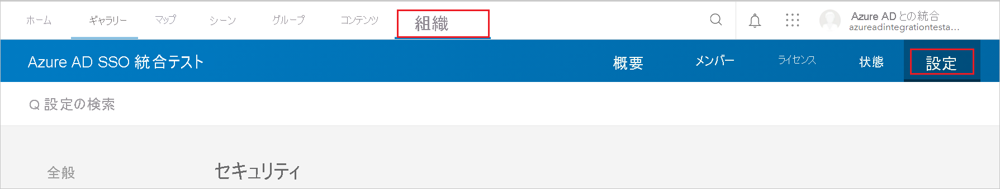
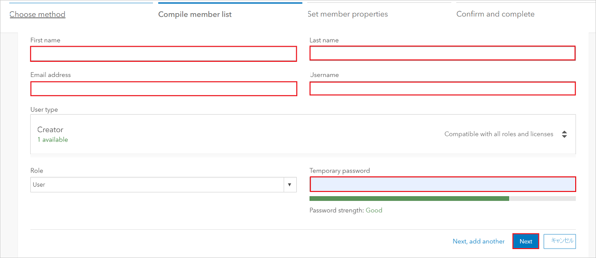
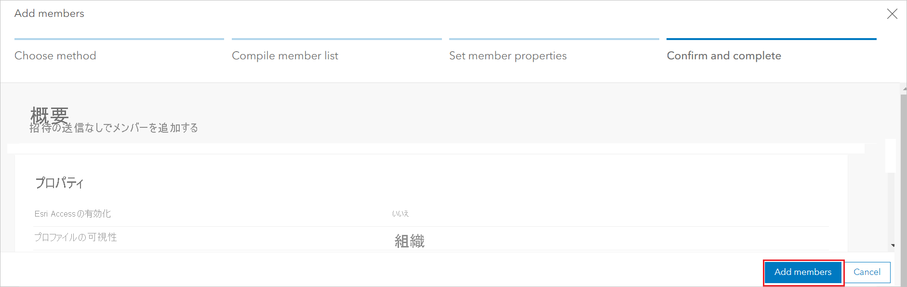

# チュートリアル: Azure Active Directory と ArcGIS Online の統合

このチュートリアルでは、ArcGIS Online と Azure Active Directory (Azure AD) を統合する方法について説明します。 Azure AD と ArcGIS Online を統合すると、次のことができます。

* ArcGIS Online にアクセスできるユーザーを Azure AD で制御できます。
* ユーザーが自分の Azure AD アカウントを使用して ArcGIS Online に自動的にサインインできるように設定できます。
* 1 つの中央サイト (Azure Portal) で自分のアカウントを管理します。

## 前提条件

開始するには、次が必要です。

* Azure AD サブスクリプション。 サブスクリプションがない場合は、[無料アカウント](https://azure.microsoft.com/free/)を取得できます。
* ArcGIS Online でのシングル サインオン (SSO) が有効なサブスクリプション。

> [!NOTE]
> この統合は、Azure AD 米国政府クラウド環境から利用することもできます。 このアプリケーションは、Azure AD 米国政府クラウドのアプリケーション ギャラリーにあります。パブリック クラウドの場合と同じように構成してください。

## シナリオの説明

このチュートリアルでは、テスト環境で Azure AD のシングル サインオンを構成してテストします。

* ArcGIS Online では、**SP** Initiated SSO がサポートされます。

## ギャラリーからの ArcGIS Online の追加

ArcGIS Online の Azure AD への統合を構成するには、ArcGIS Online をギャラリーから管理対象 SaaS アプリの一覧に追加する必要があります。

1. 職場または学校アカウントか、個人の Microsoft アカウントを使用して、Azure portal にサインインします。
1. 左のナビゲーション ウィンドウで **[Azure Active Directory]** サービスを選択します。
1. **[エンタープライズ アプリケーション]** に移動し、 **[すべてのアプリケーション]** を選択します。
1. 新しいアプリケーションを追加するには、 **[新しいアプリケーション]** を選択します。
1. **[ギャラリーから追加する]** セクションで、検索ボックスに「**ArcGIS Online**」と入力します。
1. 結果パネルで **[ArcGIS Online]** を選択し、アプリを追加します。 お使いのテナントにアプリが追加されるのを数秒待機します。

## ArcGIS Online の Azure AD SSO の構成とテスト

**B.Simon** というテスト ユーザーを使用して、ArcGIS Online に対する Azure AD SSO を構成してテストします。 SSO が機能するためには、Azure AD ユーザーと ArcGIS Online の関連ユーザーとの間にリンク関係を確立する必要があります。

ArcGIS Online で Azure AD SSO を構成してテストするには、次の手順を行います。

1. **[Azure AD SSO の構成](#configure-azure-ad-sso)** - ユーザーがこの機能を使用できるようにします。
    1. **[Azure AD のテスト ユーザーの作成](#create-an-azure-ad-test-user)** - B.Simon で Azure AD のシングル サインオンをテストします。
    1. **[Azure AD テスト ユーザーの割り当て](#assign-the-azure-ad-test-user)** - B.Simon が Azure AD シングル サインオンを使用できるようにします。
1. **[ArcGIS Online の SSO の構成](#configure-arcgis-online-sso)** - アプリケーション側でシングル サインオン設定を構成します。
    1. **[ArcGIS Online のテスト ユーザーの作成](#create-arcgis-online-test-user)** - ArcGIS Online で B.Simon に対応するユーザーを作成し、Azure AD の B.Simon にリンクさせます。
1. **[SSO のテスト](#test-sso)** - 構成が機能するかどうかを確認します。

## Azure AD SSO の構成

これらの手順に従って、Azure portal で Azure AD SSO を有効にします。

1. Azure portal の **ArcGIS Online** アプリケーション統合ページで、 **[管理]** セクションを見つけて、 **[シングル サインオン]** を選択します。
1. **[シングル サインオン方式の選択]** ページで、 **[SAML]** を選択します。
1. **[SAML によるシングル サインオンのセットアップ]** ページで、 **[基本的な SAML 構成]** の鉛筆アイコンをクリックして設定を編集します。

   

4. **[基本的な SAML 構成]** セクションで、次の手順を実行します。

    a. **[サインオン URL]** ボックスに、次のパターンを使用して URL を入力します。`https://<companyname>.maps.arcgis.com`

    b. **[識別子 (エンティティ ID)]** ボックスに、次のパターンを使用して URL を入力します。`<companyname>.maps.arcgis.com`

    > [!NOTE]
    > これらは実際の値ではありません。 実際のサインオン URL と識別子でこれらの値を更新します。 これらの値を取得するには、[ArcGIS Online クライアント サポート チーム](https://support.esri.com/en/)に問い合わせてください。 Azure portal の **[基本的な SAML 構成]** セクションに示されているパターンを参照することもできます。

5. **[SAML でシングル サインオンをセットアップします]** ページの **[SAML 署名証明書]** セクションで、 **[ダウンロード]** をクリックして、要件のとおりに指定したオプションから **フェデレーション メタデータ XML** をダウンロードして、お使いのコンピューターに保存します。

    

6. **ArcGIS Online** 内での構成を自動化するには、 **[拡張機能のインストール]** をクリックして **マイアプリによるセキュリティで保護されたサインイン拡張機能** をインストールする必要があります。

    

7. ブラウザーに拡張機能を追加した後、 **[setup ArcGIS Online]\(ArcGIS Online のセットアップ)** をクリックすると、ArcGIS Online アプリケーションに移動します。 そこから、管理者資格情報を提供して ArcGIS Online にサインインします。 ブラウザー拡張機能によりアプリケーションが自動的に構成され、「**ArcGIS Online シングル サインオンの構成**」セクションの手順が自動化されます。

### Azure AD のテスト ユーザーの作成 

このセクションでは、Azure portal 内で B.Simon というテスト ユーザーを作成します。

1. Azure portal の左側のウィンドウから、 **[Azure Active Directory]** 、 **[ユーザー]** 、 **[すべてのユーザー]** の順に選択します。
1. 画面の上部にある **[新しいユーザー]** を選択します。
1. **[ユーザー]** プロパティで、以下の手順を実行します。
   1. **[名前]** フィールドに「`B.Simon`」と入力します。  
   1. **[ユーザー名]** フィールドに「username@companydomain.extension」と入力します。 たとえば、「 `B.Simon@contoso.com` 」のように入力します。
   1. **[パスワードを表示]** チェック ボックスをオンにし、 **[パスワード]** ボックスに表示された値を書き留めます。
   1. **Create** をクリックしてください。

### Azure AD テスト ユーザーの割り当て

このセクションでは、B.Simon に ArcGIS Online へのアクセスを許可することで、このユーザーが Azure シングル サインオンを使用できるようにします。

1. Azure portal で **[エンタープライズ アプリケーション]** を選択し、 **[すべてのアプリケーション]** を選択します。
1. アプリケーションの一覧で、**[ArcGIS Online]** を選択します。
1. アプリの概要ページで、 **[管理]** セクションを見つけて、 **[ユーザーとグループ]** を選択します。
1. **[ユーザーの追加]** を選択し、 **[割り当ての追加]** ダイアログで **[ユーザーとグループ]** を選択します。
1. **[ユーザーとグループ]** ダイアログの [ユーザー] の一覧から **[B.Simon]** を選択し、画面の下部にある **[選択]** ボタンをクリックします。
1. ユーザーにロールが割り当てられることが想定される場合は、 **[ロールの選択]** ドロップダウンからそれを選択できます。 このアプリに対してロールが設定されていない場合は、[既定のアクセス] ロールが選択されていることを確認します。
1. **[割り当ての追加]** ダイアログで、 **[割り当て]** をクリックします。

## ArcGIS Online の SSO の構成

1. ArcGIS Online を手動でセットアップしたい場合は、新しい Web ブラウザー ウィンドウを開き、管理者として ArcGIS Online 企業サイトにログインして、次の手順を実行します。

2. **[EDIT SETTINGS] \(設定の編集)** をクリックします。

    

3. **[セキュリティ]** をクリックします。

    

4. **[Enterprise Logins] [エンタープライズ ログイン]** で、 **[SET IDENTITY PROVIDER] \(ID プロバイダーの設定)** をクリックします。

    

5. **[Set Identity Provider]** 構成ページで、次の手順に従います。

    

    a. **[名前]** テキスト ボックスに組織の名前を入力します。

    b. **[Metadata for the Enterprise Identity Provider will be supplied using]** で、 **[A File]** を選択します。

    c. ダウンロードしたメタデータ ファイルをアップロードするには、 **[Choose file]** をクリックします。

    d. **[SET IDENTITY PROVIDER] \(ID プロバイダーの設定)** をクリックします。

### ArcGIS Online のテスト ユーザーの作成

Azure AD ユーザーが ArcGIS Online にログインできるようにするには、そのユーザーを ArcGIS Online にプロビジョニングする必要があります。  
ArcGIS Online の場合、プロビジョニングは手動のタスクです。

**ユーザー アカウントをプロビジョニングするには、次の手順に従います。**

1. **ArcGIS** テナントにログインします。

2. **[INVITE MEMBERS] \(メンバーの招待)** をクリックします。

    

3. **[Add members automatically without sending an email] \(電子メールを送信せずにメンバーを自動的に追加する)** を選択し、 **[NEXT] \(次へ)** をクリックします。

    

4. **[Members]** ダイアログ ページで、次の手順に従います。

    

     a. プロビジョニングする有効な Azure AD アカウントの **メール**、**名**、**姓** を入力します。

     b. **[ADD AND REVIEW] \(追加とレビュー)** をクリックします。
5. 入力したデータを確認してから、 **[ADD MEMBERS] \(メンバーの追加)** をクリックします。

    

    > [!NOTE]
    > Azure Active Directory アカウント所有者がメールを受信し、リンクに従ってアカウントを確認するとそのアカウントがアクティブになります。

## SSO のテスト

このセクションでは、次のオプションを使用して Azure AD のシングル サインオン構成をテストします。 

* Azure portal で **[このアプリケーションをテストします]** をクリックします。 これにより、ログイン フローを開始できる ArcGIS Online のサインオン URL にリダイレクトされます。 

* ArcGIS Online のサインオン URL に直接移動し、そこからログイン フローを開始します。

* Microsoft マイ アプリを使用することができます。 マイ アプリで [ArcGIS Online] タイルをクリックすると、ArcGIS Online のサインオン URL にリダイレクトされます。 マイ アプリの詳細については、[マイ アプリの概要](../user-help/my-apps-portal-end-user-access.md)に関するページを参照してください。

## 次のステップ

ArcGIS Online を構成したら、組織の機密データを流出と侵入からリアルタイムで保護するセッション制御を適用することができます。 セッション制御は、条件付きアクセスを拡張したものです。 [Microsoft Cloud App Security でセッション制御を強制する方法](/cloud-app-security/proxy-deployment-any-app)をご覧ください。