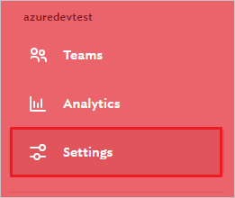
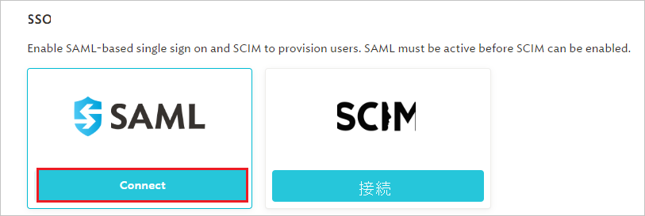

# チュートリアル:Azure Active Directory シングル サインオン (SSO) と askSpoke の統合

このチュートリアルでは、askSpoke と Azure Active Directory (Azure AD) を統合する方法について説明します。 Azure AD と askSpoke を統合すると、次のことができます。

* askSpoke にアクセスできるユーザーを Azure AD で制御できます。
* ご自分のユーザーが自分の Azure AD アカウントを使用して askSpoke に自動的にサインインするようにできます。
* 1 つの中央サイト (Azure Portal) で自分のアカウントを管理します。

## 前提条件

開始するには、次が必要です。

* Azure AD サブスクリプション。 サブスクリプションがない場合は、[無料アカウント](https://azure.microsoft.com/free/)を取得できます。
* askSpoke でのシングル サインオン (SSO) が有効なサブスクリプション。

## シナリオの説明

このチュートリアルでは、テスト環境で Azure AD の SSO を構成してテストします。

* askSpoke では、**SP と IDP** によって開始される SSO がサポートされます。
* askSpoke では、**Just-In-Time** ユーザー プロビジョニングがサポートされます。
* askSpoke では、[自動化されたユーザー プロビジョニング](askspoke-provisioning-tutorial.md)がサポートされます。

> [!NOTE]
> このアプリケーションの識別子は固定文字列値であるため、1 つのテナントで構成できるインスタンスは 1 つだけです。

## ギャラリーからの askSpoke の追加

Azure AD に askSpoke を統合するには、ギャラリーからご自分の管理対象 SaaS アプリの一覧に askSpoke を追加構成する必要があります。

1. 職場または学校アカウントか、個人の Microsoft アカウントを使用して、Azure portal にサインインします。
1. 左のナビゲーション ウィンドウで **[Azure Active Directory]** サービスを選択します。
1. **[エンタープライズ アプリケーション]** に移動し、 **[すべてのアプリケーション]** を選択します。
1. 新しいアプリケーションを追加するには、 **[新しいアプリケーション]** を選択します。
1. **[ギャラリーから追加する]** セクションで、検索ボックスに「**askSpoke**」と入力します。
1. 結果のパネルから **[askSpoke]** を選択し、アプリを追加します。 お使いのテナントにアプリが追加されるのを数秒待機します。

## askSpoke の Azure AD SSO の構成とテスト

**B.Simon** というテスト ユーザーを使用して、askSpoke に Azure AD SSO を構成してテストします。 SSO が機能するには、Azure AD ユーザーと askSpoke のその関連ユーザーとの間にリンク関係を確立する必要があります。

askSpoke 用に Azure AD SSO を構成してテストするには、次の手順を実行します。

1. **[Azure AD SSO の構成](#configure-azure-ad-sso)** - ユーザーがこの機能を使用できるようにします。
    1. **[Azure AD のテスト ユーザーの作成](#create-an-azure-ad-test-user)** - B.Simon で Azure AD のシングル サインオンをテストします。
    1. **[Azure AD テスト ユーザーの割り当て](#assign-the-azure-ad-test-user)** - B.Simon が Azure AD シングル サインオンを使用できるようにします。
1. **[askSpoke SSO の構成](#configure-askspoke-sso)** - アプリケーション側でシングル サインオン設定を構成します。
    1. **[askSpoke テスト ユーザーの作成](#create-askspoke-test-user)** - Azure AD の B.Simon にリンクさせるために、対応するユーザーを askSpoke で作成します。
1. **[SSO のテスト](#test-sso)** - 構成が機能するかどうかを確認します。

## Azure AD SSO の構成

これらの手順に従って、Azure portal で Azure AD SSO を有効にします。

1. Azure portal の **askSpoke** アプリケーション統合ページで、 **[管理]** セクションを見つけて、 **[シングル サインオン]** を選択します。
1. **[シングル サインオン方式の選択]** ページで、 **[SAML]** を選択します。
1. **[SAML によるシングル サインオンのセットアップ]** ページで、 **[基本的な SAML 構成]** の鉛筆アイコンをクリックして設定を編集します。

   

1. **[基本的な SAML 構成]** セクションで、アプリケーションを **IDP** 開始モードで構成する場合は、次のフィールドの値を入力します。

    **[応答 URL]** ボックスに、`https://<SUBDOMAIN>.askspoke.com/saml/callback` のパターンを使用して URL を入力します

    > [!NOTE]
    > 応答 URL 値は、実際の値ではありません。 実際の応答 URL でこの値を更新します。 この値は、[askSpoke のクライアント サポート チーム](mailto:support@askspoke.com)に問い合わせて取得してください。 Azure portal の **[基本的な SAML 構成]** セクションに示されているパターンを参照することもできます。

1. アプリケーションを **SP** 開始モードで構成する場合は、 **[追加の URL を設定します]** をクリックして次の手順を実行します。

    **[サインオン URL]** テキスト ボックスに、URL として「`https://askspoke.com/login`」と入力します。

1. askSpoke アプリケーションは、特定の形式の SAML アサーションを使用するため、カスタム属性のマッピングをお使いの SAML トークンの属性の構成に追加する必要があります。 次のスクリーンショットには、既定の属性一覧が示されています。

    

1. その他に、askSpoke アプリケーションでは、いくつかの属性が SAML 応答で返されることを想定しています。それらの属性を次に示します。 これらの属性も値が事前に設定されますが、要件に従ってそれらの値を確認することができます。

    | 名前 |  ソース属性|
    | ---------------| --------- |
    | firstName | User.givenname |
    | lastName | User.surname |

1. **[SAML でシングル サインオンをセットアップします]** ページの **[SAML 署名証明書]** セクションで、 **[証明書 (Base64)]** を見つけて、 **[ダウンロード]** を選択し、証明書をダウンロードして、お使いのコンピューターに保存します。

    

1. **[askSpoke の設定]** セクションで、ご自分の要件に基づいて適切な URL をコピーします。

    

### Azure AD のテスト ユーザーの作成

このセクションでは、Azure portal 内で B.Simon というテスト ユーザーを作成します。

1. Azure portal の左側のウィンドウから、 **[Azure Active Directory]** 、 **[ユーザー]** 、 **[すべてのユーザー]** の順に選択します。
1. 画面の上部にある **[新しいユーザー]** を選択します。
1. **[ユーザー]** プロパティで、以下の手順を実行します。
   1. **[名前]** フィールドに「`B.Simon`」と入力します。  
   1. **[ユーザー名]** フィールドに「username@companydomain.extension」と入力します。 たとえば、「 `B.Simon@contoso.com` 」のように入力します。
   1. **[パスワードを表示]** チェック ボックスをオンにし、 **[パスワード]** ボックスに表示された値を書き留めます。
   1. **Create** をクリックしてください。

### Azure AD テスト ユーザーの割り当て

このセクションでは、B.Simon に askSpoke へのアクセスを許可することで、このユーザーが Azure シングル サインオンを使用できるようにします。

1. Azure portal で **[エンタープライズ アプリケーション]** を選択し、 **[すべてのアプリケーション]** を選択します。
1. アプリケーションの一覧で **[askSpoke]** を選択します。
1. アプリの概要ページで、 **[管理]** セクションを見つけて、 **[ユーザーとグループ]** を選択します。
1. **[ユーザーの追加]** を選択し、 **[割り当ての追加]** ダイアログで **[ユーザーとグループ]** を選択します。
1. **[ユーザーとグループ]** ダイアログの [ユーザー] の一覧から **[B.Simon]** を選択し、画面の下部にある **[選択]** ボタンをクリックします。
1. ユーザーにロールが割り当てられることが想定される場合は、 **[ロールの選択]** ドロップダウンからそれを選択できます。 このアプリに対してロールが設定されていない場合は、[既定のアクセス] ロールが選択されていることを確認します。
1. **[割り当ての追加]** ダイアログで、 **[割り当て]** をクリックします。

## askSpoke SSO の構成

1. 別の Web ブラウザー ウィンドウで、管理者として askSpoke Web サイトにサインインします。

1. 左側のナビゲーション ウィンドウで **[設定]** タブをクリックします。

    

1. **[SSO]** までスクロールダウンし、 **[接続]** をクリックします。

    

1. **[Enable SAML & SCIM]** \(SAML および SCIM の有効化\) セクションで、次の手順を実行します。

    ![askSpoke の [Enable SAML & SCIM]\(SAML および SCIM の有効化\) セクション](./media/askspoke-tutorial/configure-3.png)

    1. **[シングル サインオン URL]** テキストボックスに、Azure portal からコピーした **ログイン URL** の値を貼り付けます。

    1. **[発行者]** テキストボックスに、Azure portal からコピーした、**Azure AD ID** の値を貼り付けます。

    1. Azure portal からダウンロードした **証明書 (Base64)** ファイルをメモ帳で開き、証明書ファイルの内容をコピーして **[公開証明書]** テキストボックスに貼り付けます。

    1. **[ACS URL]** \(ACS URL\) の値をコピーして、Azure portal の **[基本的な SAML 構成]** セクションの **[応答 URL]** ボックスに貼り付けます。

    1. **[Test SAML connection]** \(SAML 接続のテスト\) をクリックします。

### askSpoke テスト ユーザーの作成

このセクションでは、B.Simon というユーザーを askSpoke に作成します。 askSpoke では、Just-In-Time プロビジョニングがサポートされており、これは既定で有効になっています。 このセクションでは、ユーザー側で必要な操作はありません。 ユーザーがまだ askSpoke に存在しない場合は、askSpoke にアクセスしたときに新しいユーザーが作成されます。

askSpoke では、自動ユーザー プロビジョニングもサポートされます。自動ユーザー プロビジョニングの構成方法について詳しくは、[こちら](./askspoke-provisioning-tutorial.md)をご覧ください。

## SSO のテスト

このセクションでは、次のオプションを使用して Azure AD のシングル サインオン構成をテストします。 

#### SP Initiated:

* Azure portal で **[このアプリケーションをテストします]** をクリックします。 これにより、ログイン フローを開始できる askspoke のサインオン URL にリダイレクトされます。  

* askspoke のサインオン URL に直接移動し、そこからログイン フローを開始します。

#### IDP Initiated:

* Azure portal で **[このアプリケーションをテストします]** をクリックすると、SSO を設定した askspoke に自動的にサインインされます。 

また、Microsoft マイ アプリを使用して、任意のモードでアプリケーションをテストすることもできます。 マイ アプリで [askspoke] タイルをクリックすると、SP モードで構成されている場合は、ログイン フローを開始するためのアプリケーション サインオン ページにリダイレクトされます。IDP モードで構成されている場合は、SSO を設定した askspoke に自動的にサインインされます。 マイ アプリの詳細については、[マイ アプリの概要](../user-help/my-apps-portal-end-user-access.md)に関するページを参照してください。

## 次のステップ

askspoke を構成したら、ご自分の組織の機密データの流出と侵入をリアルタイムで保護するセッション制御を適用することができます。 セッション制御は、条件付きアクセスを拡張したものです。 [Microsoft Defender for Cloud Apps でセッション制御を適用する方法をご覧ください](/cloud-app-security/proxy-deployment-aad)。
