# チュートリアル:Atlassian Cloud と Azure Active Directory の統合

このチュートリアルでは、Atlassian Cloud と Azure Active Directory (Azure AD) を統合する方法について説明します。 Atlassian Cloud と Azure AD を統合すると、次のことができます。

* Atlassian Cloud にアクセスする Azure AD ユーザーを制御する。
* ユーザーが自分の Azure AD アカウントを使用して Atlassian Cloud に自動的にサインインするように設定できます。
* 1 つの中央サイト (Azure Portal) で自分のアカウントを管理します。

## 前提条件

開始するには、次が必要です。

* Azure AD サブスクリプション。 サブスクリプションがない場合は、[無料アカウント](https://azure.microsoft.com/free/)を取得できます。
* Atlassian Cloud でのシングル サインオン (SSO) が有効なサブスクリプション
* Atlassian Cloud 製品の Security Assertion Markup Language (SAML) シングル サインオンを有効にするには、Atlassian Access を設定する必要があります。 詳細については、「[Atlassian Access]( https://www.atlassian.com/enterprise/cloud/identity-manager)」を参照してください。

> [!NOTE]
> この統合は、Azure AD 米国政府クラウド環境から利用することもできます。 このアプリケーションは、Azure AD 米国政府クラウドのアプリケーション ギャラリーにあります。パブリック クラウドの場合と同じように構成してください。

## シナリオの説明

このチュートリアルでは、テスト環境で Azure AD の SSO を構成してテストします。 

* Atlassian Cloud では、**SP Initiated SSO と IDP Initiated SSO** がサポートされます。
* Atlassian Cloud では、[自動化されたユーザー プロビジョニングとプロビジョニング解除](atlassian-cloud-provisioning-tutorial.md)がサポートされます。

## ギャラリーからの Atlassian Cloud の追加

Azure AD への Atlassian Cloud の統合を構成するには、ギャラリーから管理対象 SaaS アプリの一覧に Atlassian Cloud を追加する必要があります。

1. 職場または学校アカウントか、個人の Microsoft アカウントを使用して、Azure portal にサインインします。
1. 左のナビゲーション ウィンドウで **[Azure Active Directory]** サービスを選択します。
1. **[エンタープライズ アプリケーション]** に移動し、 **[すべてのアプリケーション]** を選択します。
1. 新しいアプリケーションを追加するには、 **[新しいアプリケーション]** を選択します。
1. **[ギャラリーから追加する]** セクションで、検索ボックスに、「**Atlassian Cloud**」と入力します。
1. 結果のパネルから **[Atlassian Cloud]** を選択し、アプリを追加します。 お使いのテナントにアプリが追加されるのを数秒待機します。

## Azure AD SSO の構成とテスト

**B.Simon** というテスト ユーザーを使用して、Atlassian Cloud に対する Azure AD SSO を構成してテストします。 SSO を機能させるために、Azure AD ユーザーと Atlassian Cloud の関連ユーザーとの間にリンク関係を確立する必要があります。

Atlassian Cloud に対して Azure AD SSO を構成してテストするには、次の手順を行います。

1. **[Azure AD と Atlassian Cloud の SSO の構成](#configure-azure-ad-with-atlassian-cloud-sso)** - ユーザーが Atlassian Cloud に対して Azure AD ベースの SAML SSO を使用できるようにします。
    1. **[Azure AD のテスト ユーザーの作成](#create-an-azure-ad-test-user)** - B.Simon で Azure AD のシングル サインオンをテストします。
    1. **[Azure AD テスト ユーザーの割り当て](#assign-the-azure-ad-test-user)** - B.Simon が Azure AD シングル サインオンを使用できるようにします。
1. **[Atlassian Cloud のテスト ユーザーの作成](#create-atlassian-cloud-test-user)** - Atlassian Cloud で B.Simon に対応するユーザーを作成し、Azure AD のこのユーザーにリンクさせます。
1. **[SSO のテスト](#test-sso)** - 構成が機能するかどうかを確認します。

## Atlassian Cloud SSO で Azure AD を構成する

これらの手順に従って、Azure portal で Azure AD SSO を有効にします。

1. Atlassian Cloud 内での構成を自動化するには、 **[拡張機能のインストール]** をクリックして **マイ アプリによるセキュリティで保護されたサインイン拡張機能** をインストールする必要があります。

    

1. ブラウザーに拡張機能を追加した後、 **[Setup Atlassian Cloud]\(Atlassian Cloud のセットアップ\)** をクリックすると、Atlassian Cloud アプリケーションに移動します。 そこから、管理者資格情報を提供して Atlassian Cloud にサインインします。 ブラウザー拡張機能により、アプリケーションが自動的に構成されます。

    

1. Atlassian Cloud を手動でセットアップする場合は、管理者として Atlassian Cloud 企業サイトにサインインし、次の手順を実行します。

1. まず、Atlassian 製品インスタンスに移動して、インスタンス URL をコピー、保存します。
   > [!NOTE]
   > URL は `https://<INSTANCE>.atlassian.com` という形式になっている必要があります。

   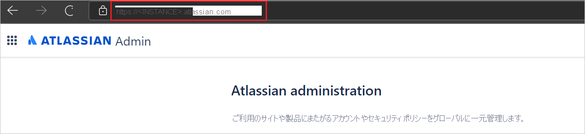

1. [Atlassian Admin Portal](https://admin.atlassian.com/) を開いて自分の組織名をクリックします。

   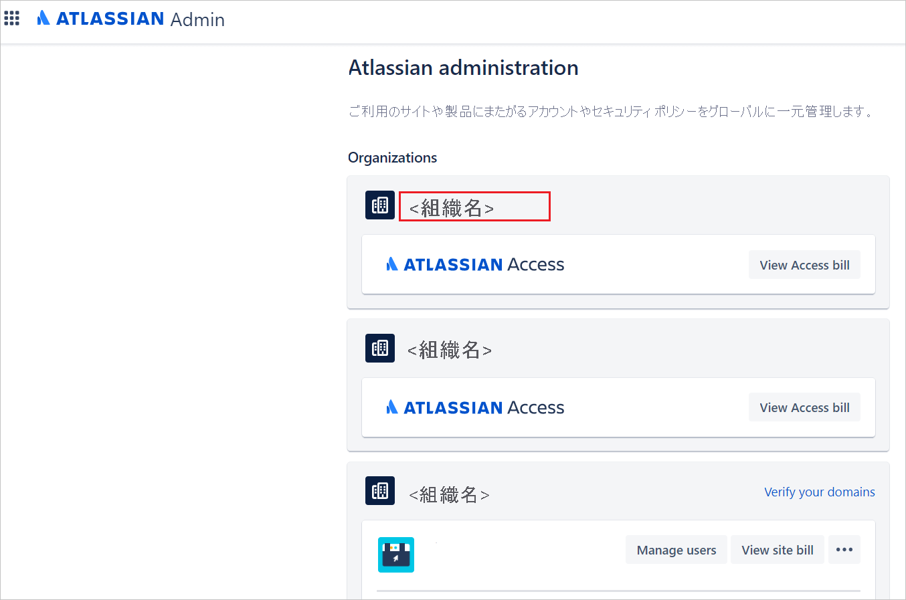

1. シングル サインオンを構成する前に、ドメインを確認する必要があります。 詳細については、[Atlassian の「Domain verification」(ドメインの確認)](https://confluence.atlassian.com/cloud/domain-verification-873871234.html) ドキュメントを参照してください。

1. **ATLASSIAN Admin** portal の **[Security]\(セキュリティ\)** タブに移動し、 **[SAML single sign on]\(SAML シングル サインオン\)** を選択し、 **[Add SAML configuration]\(SAML 構成の追加\)** をクリックします。

   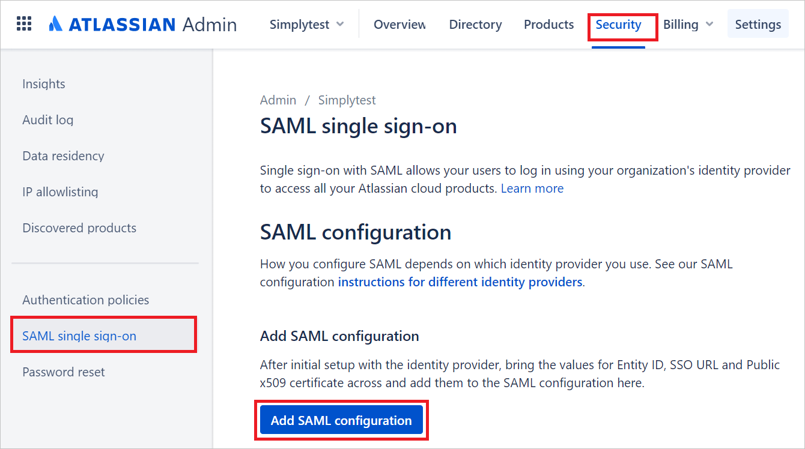

1. Azure portal の **Atlassian Cloud** アプリケーション統合ページで、 **[管理]** セクションを探して、 **[Set up single sign-on]\(シングル サインオンの設定\)** を選択します。

   

1. **[シングル サインオン方式の選択]** ページで、 **[SAML]** を選択します。

   

1. **[SAML によるシングル サインオンのセットアップ]** ページで、下へスクロールして **[Atlassian Cloud のセットアップ]** に移動します。
   
   a。 **[構成 URL]** をクリックします。

   ![[Single Sign-On]](./media/atlassian-cloud-tutorial/configure.png)
   
   b. Azure portal から **[Azure AD 識別子]** の値をコピーして、Atlassian の **[Identity Provider Entity ID]\(ID プロバイダーのエンティティ ID\)** テキストボックスに貼り付けます。
   
   c. Azure portal から **[ログイン URL]** の値をコピーし、Atlassian の **[Identity Provider SSO URL]\(ID プロバイダーの SSO URL\)** テキストボックスに貼り付けます。

   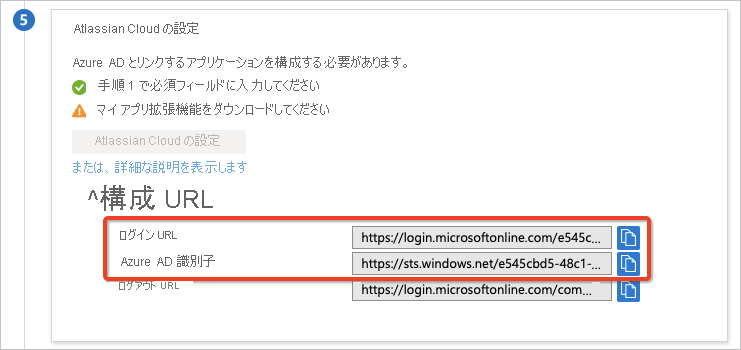

   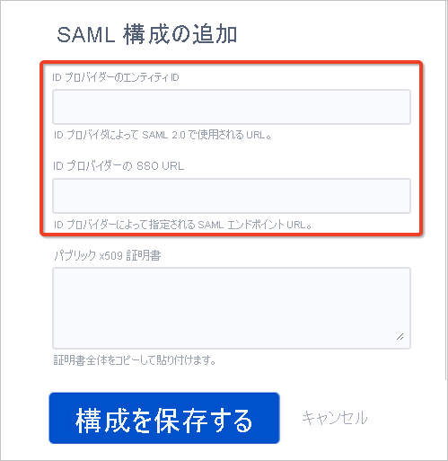

1. **[SAML でシングル サインオンをセットアップします]** ページの **[SAML 署名証明書]** セクションで、 **[証明書 (Base64)]** を見つけて、 **[ダウンロード]** を選択し、証明書をダウンロードして、お使いのコンピューターに保存します。

   

   

1. Atlassian に SAML 構成を **追加** して **保存** します。

1. **[基本的な SAML 構成]** セクションで、次の手順を行います。

   a。 Atlassian から **[SP Entity ID]\(SP エンティティ ID\)** の値をコピーして Azure の **[識別子 (エンティティ ID)]** ボックスに貼り付け、既定として設定します。
   
   b. Atlassian から **[SP Assertion Consumer Service URL]\(SP アサーション利用者サービス URL\)** の値をコピーして Azure の **[応答 URL (Assertion Consumer Service URL)]** ボックスに貼り付け、既定値として設定します。
   
   c. 手順 4. でコピーした **[インスタンス URL]** の値をコピーし、Azure の **[リレー状態]** ボックスに貼り付けます。

   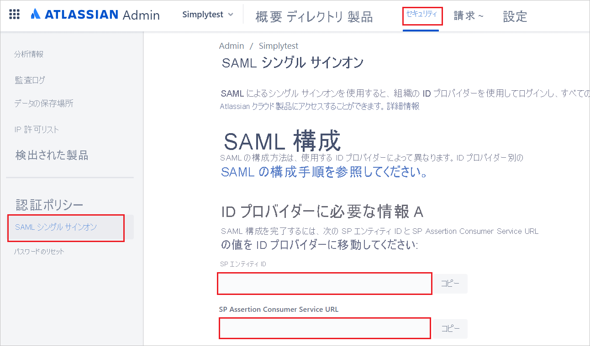

   

   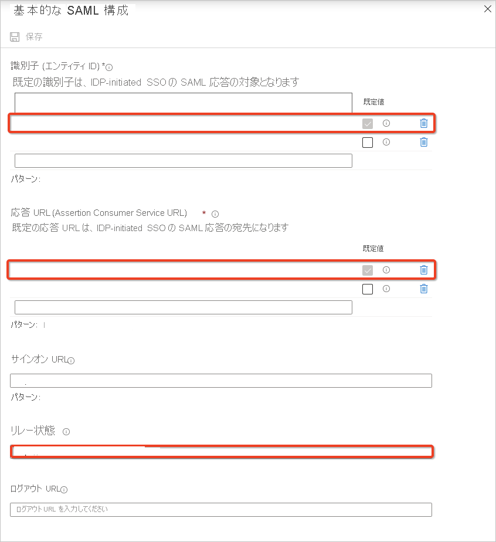
   
1. Atlassian Cloud アプリケーションでは、特定の形式の SAML アサーションを受け取るため、SAML トークン属性の構成にカスタム属性マッピングを追加する必要があります。 属性マッピングは、 **[編集]** アイコンをクリックして編集できます。 

   
   
   1. Azure AD テナントの属性マッピング (Microsoft 365 ライセンスあり)。
      
      a。 **[一意のユーザー識別子 (名前 ID)]** 要求をクリックします。

      
      
      b. Atlassian Cloud では、**nameidentifier** (**一意のユーザー ID**) がユーザーのメール (**user.email**) にマップされると想定されています。 **[ソース属性]** を編集して、「**user.mail**」に変更してください。 要求に対する変更を保存します。

      
      
      c. 最終的な属性マッピングは、次のようになります。

      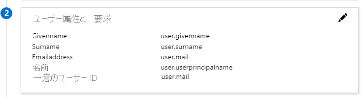
      
   1. Azure AD テナントの属性マッピング (Microsoft 365 ライセンスなし) 

      a. `http://schemas.xmlsoap.org/ws/2005/05/identity/claims/emailaddress` 要求をクリックします。

      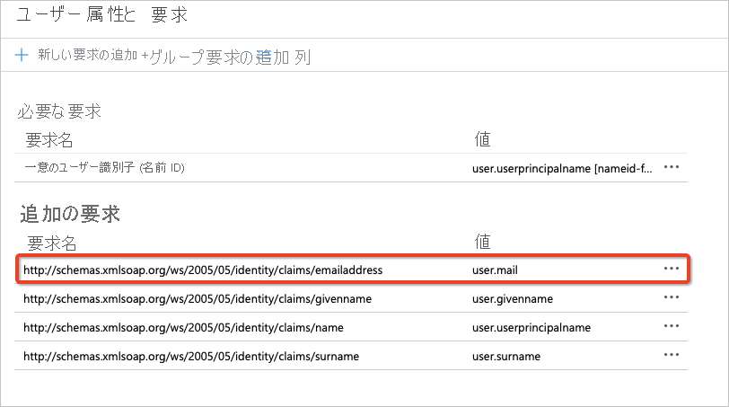
         
      b. Microsoft 365 ライセンスのない Azure AD テナントに作成されたユーザーについては、**user.mail** 属性が Azure によって事前設定されません。そのようなユーザーのメールは、**userprincipalname** 属性に格納されます。 Atlassian Cloud では、**nameidentifier** (**一意のユーザー ID**) がユーザーのメール (**user.userprincipalname**) にマップされると想定されています。  **[ソース属性]** を編集して、「**user.userprincipalname**」に変更してください。 要求に対する変更を保存します。

      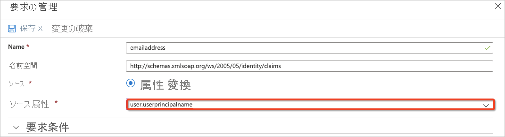
         
      c. 最終的な属性マッピングは、次のようになります。

      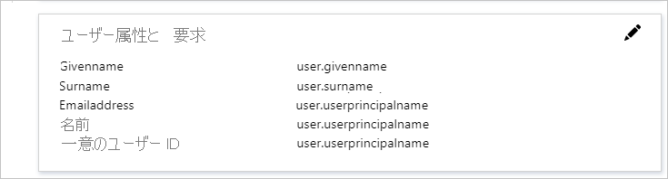

1. 認証ポリシーに SAML シングル サインオンを適用するには、次の手順を行います。

   a。   **Atlassian Admin** Portal から **[Security]\(セキュリティ\)** タブを選択し、 **[Authentication policies]\(認証ポリシー\)** をクリックします。

   b.   適用するポリシーに対して **[編集]** を選択します。 

   c.   **[設定]** で、管理対象ユーザーに対する **[Enforce single sign-on]\(シングルサインオンの適用\)** を有効にして、SAML リダイレクトが正常に行われるようにします。 

   d.   **[Update]** をクリックします。 

      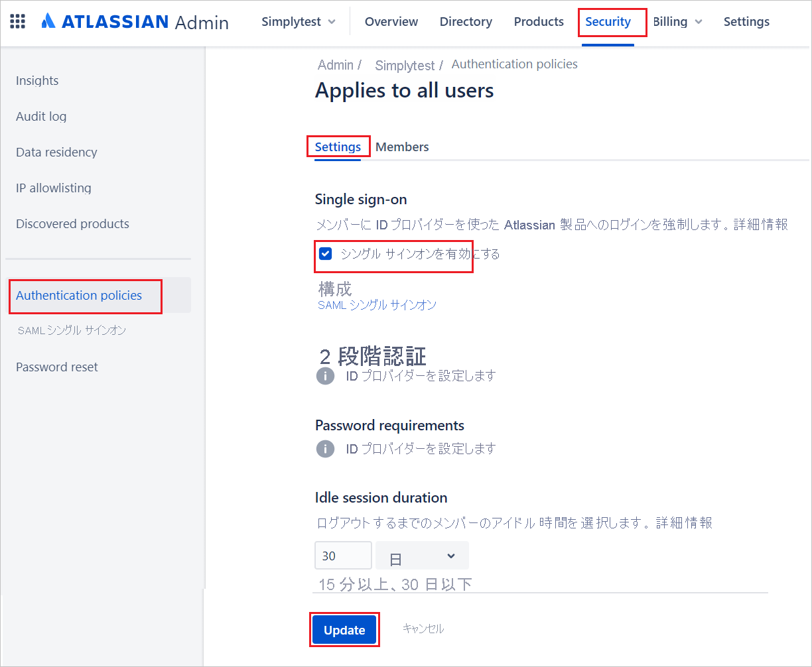 

   > [!NOTE]
   > 管理者は SAML 構成をテストすることができます。それには、最初に個別の認証ポリシーでユーザーのサブセットに対して SSO の適用を有効にするだけとし、それで問題がなければ、すべてのユーザーに対してポリシーを有効にします。

### Azure AD のテスト ユーザーの作成

このセクションでは、Azure portal 内で B.Simon というテスト ユーザーを作成します。

1. Azure portal の左側のウィンドウから、 **[Azure Active Directory]** 、 **[ユーザー]** 、 **[すべてのユーザー]** の順に選択します。
1. 画面の上部にある **[新しいユーザー]** を選択します。
1. **[ユーザー]** プロパティで、以下の手順を実行します。
   1. **[名前]** フィールドに「`B.Simon`」と入力します。  
   1. **[ユーザー名]** フィールドに「username@companydomain.extension」と入力します。 たとえば、「 `B.Simon@contoso.com` 」のように入力します。
   1. **[パスワードを表示]** チェック ボックスをオンにし、 **[パスワード]** ボックスに表示された値を書き留めます。
   1. **Create** をクリックしてください。

### Azure AD テスト ユーザーの割り当て

このセクションでは、B.Simon に Atlassian Cloud へのアクセスを許可することで、このユーザーが Azure シングル サインオンを使用できるようにします。

1. Azure portal で **[エンタープライズ アプリケーション]** を選択し、 **[すべてのアプリケーション]** を選択します。
1. アプリケーションの一覧で **[Atlassian Cloud]** を選択します。
1. アプリの概要ページで、 **[管理]** セクションを見つけて、 **[ユーザーとグループ]** を選択します。
1. **[ユーザーの追加]** を選択し、 **[割り当ての追加]** ダイアログで **[ユーザーとグループ]** を選択します。
1. **[ユーザーとグループ]** ダイアログの [ユーザー] の一覧から **[B.Simon]** を選択し、画面の下部にある **[選択]** ボタンをクリックします。
1. ユーザーにロールが割り当てられることが想定される場合は、 **[ロールの選択]** ドロップダウンからそれを選択できます。 このアプリに対してロールが設定されていない場合は、[既定のアクセス] ロールが選択されていることを確認します。
1. **[割り当ての追加]** ダイアログで、 **[割り当て]** をクリックします。

### Atlassian Cloud のテスト ユーザーの作成

Azure AD ユーザーが Atlassian Cloud にサインインできるようにするには、Atlassian Cloud で次の手順を行って、手動でユーザー アカウントをプロビジョニングします。

1. **[Products]\(製品\)** タブに進み、 **[Users]\(ユーザー\)** を選択し、 **[Invite users]\(ユーザーの招待\)** をクリックします。

    ![Atlassian Cloud の [Users]\(ユーザー\) リンク](./media/atlassian-cloud-tutorial/users.png)

1. **[Email address]\(メールアドレス\)** テキストボックスにユーザーのメール アドレスを入力してから、 **[Invite users]\(ユーザーの招待\)** をクリックします。

    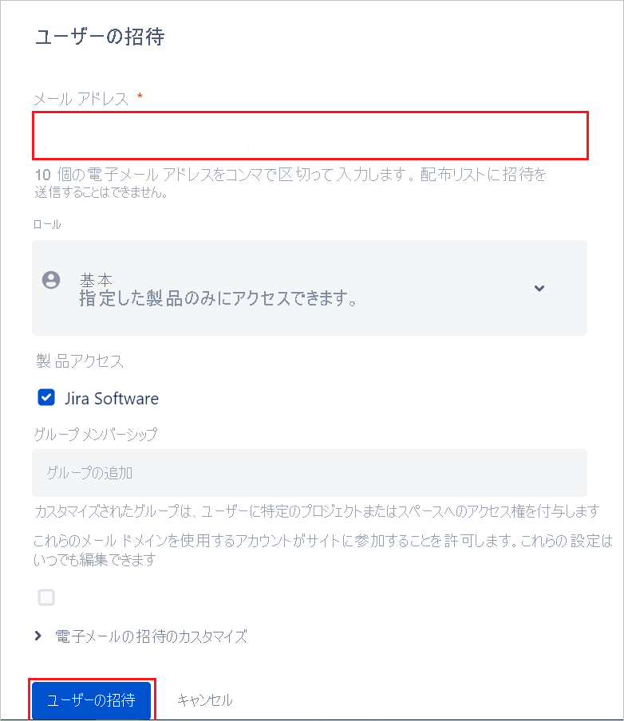

### SSO のテスト

このセクションでは、次のオプションを使用して Azure AD のシングル サインオン構成をテストします。 

#### SP Initiated:

* Azure portal で **[このアプリケーションをテストします]** をクリックします。 これにより、ログイン フローを開始できる Atlassian Cloud のサインオン URL にリダイレクトされます。  

* Atlassian Cloud のサインオン URL に直接移動し、そこからログイン フローを開始します。

#### IDP Initiated:

* Azure portal で **[このアプリケーションをテストします]** をクリックすると、SSO を設定した Atlassian Cloud に自動的にサインインされるはずです。 

また、Microsoft マイ アプリを使用して、任意のモードでアプリケーションをテストすることもできます。 マイ アプリで [Atlassian Cloud] タイルをクリックすると、SP モードで構成されている場合は、ログイン フローを開始するためのアプリケーション サインオン ページにリダイレクトされます。IDP モードで構成されている場合は、SSO を設定した Atlassian Cloud に自動的にサインインされるはずです。 マイ アプリの詳細については、[マイ アプリの概要](https://support.microsoft.com/account-billing/sign-in-and-start-apps-from-the-my-apps-portal-2f3b1bae-0e5a-4a86-a33e-876fbd2a4510)に関するページを参照してください。

## 次のステップ

Atlassian Cloud を構成したら、組織の機密データを流出と侵入からリアルタイムで保護するセッション制御を適用することができます。 セッション制御は、条件付きアクセスを拡張したものです。 [Microsoft Defender for Cloud Apps でセッション制御を適用する方法をご覧ください](/cloud-app-security/proxy-deployment-any-app)。
