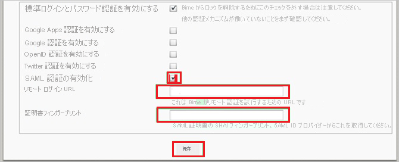
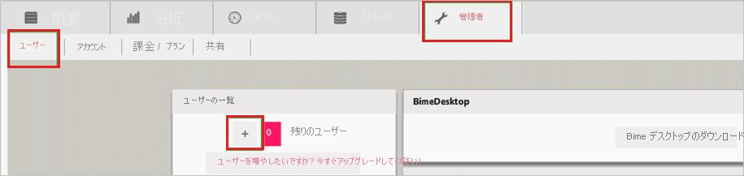
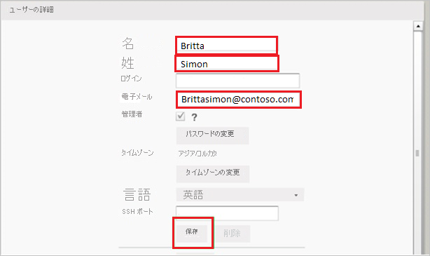

# チュートリアル: Azure AD SSO と Bime の統合

このチュートリアルでは、Bime と Azure Active Directory (Azure AD) を統合する方法について説明します。 Azure AD と Bime を統合すると、次のことができます。

* Bime にアクセスできるユーザーを Azure AD で制御できます。
* ユーザーが自分の Azure AD アカウントを使用して Bime に自動的にサインインできるように設定できます。
* 1 つの中央サイト (Azure Portal) で自分のアカウントを管理します。

## 前提条件

開始するには、次が必要です。

* Azure AD サブスクリプション。 サブスクリプションがない場合は、[無料アカウント](https://azure.microsoft.com/free/)を取得できます。
* Bime でのシングル サインオン (SSO) が有効なサブスクリプション。

## シナリオの説明

このチュートリアルでは、テスト環境で Azure AD のシングル サインオンを構成してテストします。

* Bime では、**SP** Initiated SSO がサポートされます。

## ギャラリーから Bime を追加する

Azure AD への Bime の統合を構成するには、ギャラリーから管理対象 SaaS アプリの一覧に Bime を追加する必要があります。

1. 職場または学校アカウントか、個人の Microsoft アカウントを使用して、Azure portal にサインインします。
1. 左のナビゲーション ウィンドウで **[Azure Active Directory]** サービスを選択します。
1. **[エンタープライズ アプリケーション]** に移動し、 **[すべてのアプリケーション]** を選択します。
1. 新しいアプリケーションを追加するには、 **[新しいアプリケーション]** を選択します。
1. **[ギャラリーから追加する]** セクションで、検索ボックスに「**Bime**」と入力します。
1. 結果のパネルから **[Bime]** を選択し、アプリを追加します。 お使いのテナントにアプリが追加されるのを数秒待機します。

## Bime に対する Azure AD SSO の構成とテスト

**B.Simon** というテスト ユーザーを使用して、Bime に対する Azure AD SSO を構成してテストします。 SSO を機能させるためには、Azure AD ユーザーと Bime の関連ユーザーとの間にリンク関係を確立する必要があります。

Bime に対して Azure AD SSO を構成してテストするには、次の手順を実行します。

1. **[Azure AD SSO の構成](#configure-azure-ad-sso)** - ユーザーがこの機能を使用できるようにします。
    1. **[Azure AD のテスト ユーザーの作成](#create-an-azure-ad-test-user)** - B.Simon で Azure AD のシングル サインオンをテストします。
    1. **[Azure AD テスト ユーザーの割り当て](#assign-the-azure-ad-test-user)** - B.Simon が Azure AD シングル サインオンを使用できるようにします。
1. **[Bime SSO の構成](#configure-bime-sso)** - アプリケーション側でシングル サインオン設定を構成します。
    1. **[Bime テスト ユーザーの作成](#create-bime-test-user)** - Bime で B.Simon に対応するユーザーを作成し、Azure AD のそのユーザーにリンクさせます。
1. **[SSO のテスト](#test-sso)** - 構成が機能するかどうかを確認します。

## Azure AD SSO の構成

これらの手順に従って、Azure portal で Azure AD SSO を有効にします。

1. Azure portal の **Bime** アプリケーション統合ページで、 **[管理]** セクションを見つけて、 **[シングル サインオン]** を選択します。
1. **[シングル サインオン方式の選択]** ページで、 **[SAML]** を選択します。
1. **[SAML によるシングル サインオンのセットアップ]** ページで、 **[基本的な SAML 構成]** の鉛筆アイコンをクリックして設定を編集します。

   

4. **[基本的な SAML 構成]** セクションで、次の手順を実行します。

    a. **[識別子 (エンティティ ID)]** ボックスに、次のパターンを使用して URL を入力します。`https://<tenant-name>.Bimeapp.com`

    b. **[サインオン URL]** ボックスに、次のパターンを使用して URL を入力します。`https://<tenant-name>.Bimeapp.com`

    > [!NOTE]
    > これらは実際の値ではありません。 これらの値を実際の識別子とサインオン URL で更新してください。 この値を取得するには、[Bime クライアント サポート チーム](https://bime.zendesk.com/hc/categories/202604307-Support-tech-notes-and-tips-)にお問い合わせください。 Azure portal の **[基本的な SAML 構成]** セクションに示されているパターンを参照することもできます。

5. **[SAML 署名証明書]** セクションで **[編集]** ボタンをクリックして、 **[SAML 署名証明書]** ダイアログを開きます。

    

6. **[SAML 署名証明書]** セクションで **[THUMBPRINT]\(拇印\)** をコピーし、お使いのコンピューターに保存します。

    ![[Thumbprint]\(拇印\) の値をコピーする](common/copy-thumbprint.png)

7. **[Bime の設定]** セクションで、要件に従って適切な URL をコピーします。

    

### Azure AD のテスト ユーザーの作成

このセクションでは、Azure portal 内で B.Simon というテスト ユーザーを作成します。

1. Azure portal の左側のウィンドウから、 **[Azure Active Directory]** 、 **[ユーザー]** 、 **[すべてのユーザー]** の順に選択します。
1. 画面の上部にある **[新しいユーザー]** を選択します。
1. **[ユーザー]** プロパティで、以下の手順を実行します。
   1. **[名前]** フィールドに「`B.Simon`」と入力します。  
   1. **[ユーザー名]** フィールドに「username@companydomain.extension」と入力します。 たとえば、「 `B.Simon@contoso.com` 」のように入力します。
   1. **[パスワードを表示]** チェック ボックスをオンにし、 **[パスワード]** ボックスに表示された値を書き留めます。
   1. **Create** をクリックしてください。

### Azure AD テスト ユーザーの割り当て

このセクションでは、Bime へのアクセスを許可して、B.Simon が Azure シングル サインオンを使用できるようにします。

1. Azure portal で **[エンタープライズ アプリケーション]** を選択し、 **[すべてのアプリケーション]** を選択します。
1. アプリケーションの一覧で **[Bime]** を選択します。
1. アプリの概要ページで、 **[管理]** セクションを見つけて、 **[ユーザーとグループ]** を選択します。
1. **[ユーザーの追加]** を選択し、 **[割り当ての追加]** ダイアログで **[ユーザーとグループ]** を選択します。
1. **[ユーザーとグループ]** ダイアログの [ユーザー] の一覧から **[B.Simon]** を選択し、画面の下部にある **[選択]** ボタンをクリックします。
1. ユーザーにロールが割り当てられることが想定される場合は、 **[ロールの選択]** ドロップダウンからそれを選択できます。 このアプリに対してロールが設定されていない場合は、[既定のアクセス] ロールが選択されていることを確認します。
1. **[割り当ての追加]** ダイアログで、 **[割り当て]** をクリックします。

## Bime SSO を構成する

1. 別の Web ブラウザー ウィンドウで、Bime 企業サイトに管理者としてログインします。

2. ツールバーで、 **[管理者]** 、 **[アカウント]** の順にクリックします。

    ![スクリーンショットは、[管理者] および [アカウント] が選択されていることを示しています。](./media/bime-tutorial/account.png "[Admin]")

3. アカウント構成ページで、次の手順に従います。

    

    a. **[SAML 認証を有効にする]** を選択します。

    b. **[リモート ログイン URL]** ボックスに、Azure portal からコピーした **ログイン URL** の値を貼り付けます。

    c. **[Certificate Fingerprint]\(証明書のフィンガープリント\)** ボックスに、Azure portal からコピーした **THUMBPRINT (拇印)** 値を貼り付けます。

    d. **[保存]** をクリックします。

### Bime テスト ユーザーの作成

Azure AD ユーザーが Bime にログインできるようにするには、ユーザーを Bime にプロビジョニングする必要があります。 Bime の場合、プロビジョニングは手動で行います。

**ユーザー プロビジョニングを構成するには、次の手順に従います。**

1. **Bime** テナントにログインします。

2. ツールバーで、 **[管理者]** 、 **[ユーザー]** の順にクリックします。

    ![スクリーンショットは、[管理者] および [ユーザー] が選択されていることを示しています。](./media/bime-tutorial/user.png "[Admin]")

3. **[ユーザー リスト]** で、 **[新しいユーザーの追加]** ("+") をクリックします。

    

4. **[ユーザーの詳細]** ダイアログ ページで、次の手順を実行します。

    

    a. **[First name]\(名\)** ボックスに、ユーザーの名前を入力します (この例では **Britta**)。

    b. **[Last name]\(姓\)** ボックスに、ユーザーの姓を入力します (この例では **Simon**)。

    c. **[Email]\(電子メール\)** テキスト ボックスに、ユーザーのメール アドレス (**brittasimon\@contoso.com** など) を入力します。

    d. **[保存]** をクリックします。

> [!NOTE]
> 他の Bime ユーザー アカウント作成ツールや、Bime から提供されている API を使用して、Azure AD ユーザー アカウントをプロビジョニングできます。

## SSO のテスト

このセクションでは、次のオプションを使用して Azure AD のシングル サインオン構成をテストします。 

* Azure portal で **[このアプリケーションをテストします]** をクリックします。 これにより、ログイン フローを開始できる Bime のサインオン URL にリダイレクトされます。 

* Bime のサインオン URL に直接移動し、そこからログイン フローを開始します。

* Microsoft マイ アプリを使用することができます。 マイ アプリで [Bime] タイルをクリックすると、Bime のサインオン URL にリダイレクトされます。 マイ アプリの詳細については、[マイ アプリの概要](../user-help/my-apps-portal-end-user-access.md)に関するページを参照してください。

## 次のステップ

Bime を構成したら、組織の機密データを流出と侵入からリアルタイムで保護するセッション制御を適用できます。 セッション制御は、条件付きアクセスを拡張したものです。 [Microsoft Defender for Cloud Apps でセッション制御を強制する方法](/cloud-app-security/proxy-deployment-aad)をご覧ください。
