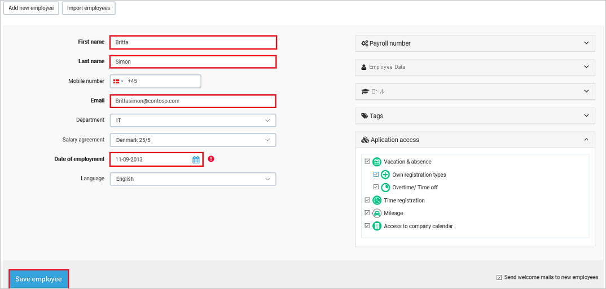

# チュートリアル: Azure Active Directory と BitaBIZ の統合

このチュートリアルでは、BitaBIZ と Azure Active Directory (Azure AD) を統合する方法について説明します。 Azure AD と BitaBIZ を統合すると、次のことが可能になります。

* BitaBIZ にアクセスできる Azure AD ユーザーを制御する。
* ユーザーが自分の Azure AD アカウントを使用して BitaBIZ に自動的にサインインできるようにする。
* 1 つの中央サイト (Azure Portal) で自分のアカウントを管理します。

## 前提条件

BitaBIZ と Azure AD の統合を構成するには、次のものが必要です。

* Azure AD サブスクリプション。 Azure AD の環境がない場合は、[無料アカウント](https://azure.microsoft.com/free/)を取得できます。
* BitaBIZ でのシングル サインオンが有効なサブスクリプション。

## シナリオの説明

このチュートリアルでは、テスト環境で Azure AD のシングル サインオンを構成してテストします。

* BitaBIZ では、**SP と IDP** によって開始される SSO がサポートされます。
* BitaBIZ では、[自動化されたユーザー プロビジョニング](bitabiz-provisioning-tutorial.md)がサポートされます。

## ギャラリーから BitaBIZ を追加する

Azure AD への BitaBIZ の統合を構成するには、ギャラリーから管理対象 SaaS アプリの一覧に BitaBIZ を追加する必要があります。

1. 職場または学校アカウントか、個人の Microsoft アカウントを使用して、Azure portal にサインインします。
1. 左のナビゲーション ウィンドウで **[Azure Active Directory]** サービスを選択します。
1. **[エンタープライズ アプリケーション]** に移動し、 **[すべてのアプリケーション]** を選択します。
1. 新しいアプリケーションを追加するには、 **[新しいアプリケーション]** を選択します。
1. **[ギャラリーから追加する]** セクションで、検索ボックスに「**BitaBIZ**」と入力します。
1. 結果のパネルから **[BitaBIZ]** を選択し、アプリを追加します。 お使いのテナントにアプリが追加されるのを数秒待機します。

## BitaBIZ のための Azure AD SSO の構成とテスト

**B.Simon** というテスト ユーザーを使用して、BitaBIZ 用に Azure AD SSO を構成してテストします。 SSO が機能するためには、Azure AD ユーザーと BitaBIZ の関連ユーザーとの間にリンク関係を確立する必要があります。

BitaBIZ 用に Azure AD SSO を構成してテストするには、次の手順に従います。

1. **[Azure AD SSO の構成](#configure-azure-ad-sso)** - ユーザーがこの機能を使用できるようにします。
    1. **[Azure AD のテスト ユーザーの作成](#create-an-azure-ad-test-user)** - Britta Simon で Azure AD のシングル サインオンをテストします。
    1. **[Azure AD テスト ユーザーの割り当て](#assign-the-azure-ad-test-user)** - Britta Simon が Azure AD シングル サインオンを使用できるようにします。
2. **[BitaBIZ SSO の構成](#configure-bitabiz-sso)** - アプリケーション側でシングル サインオン設定を構成します。
    1. **[BitaBIZ テスト ユーザーの作成](#create-bitabiz-test-user)** - BitaBIZ で Britta Simon に対応するユーザーを作成し、Azure AD の Britta Simon にリンクさせます。
1. **[SSO のテスト](#test-sso)** - 構成が機能するかどうかを確認します。

## Azure AD SSO の構成

これらの手順に従って、Azure portal で Azure AD SSO を有効にします。

1. Azure portal の **BitaBIZ** アプリケーション統合ページで、 **[管理]** セクションを見つけて、 **[シングル サインオン]** を選択します。
1. **[シングル サインオン方式の選択]** ページで、 **[SAML]** を選択します。
1. **[SAML によるシングル サインオンのセットアップ]** ページで、 **[基本的な SAML 構成]** の鉛筆アイコンをクリックして設定を編集します。

   

4. **[基本的な SAML 構成]** セクションで、アプリケーションを **IDP 開始** モードで構成する場合は、次の手順を実行します。

    **[識別子]** ボックスに、`https://www.bitabiz.com/<INSTANCE_ID>` の形式で URL を入力します。

    > [!NOTE]
    > 上記の URL の値は、単なる例です。 この値は、実際の識別子に置き換えてください。これについては後で説明します。

5. アプリケーションを **SP** 開始モードで構成する場合は、 **[追加の URL を設定します]** をクリックして次の手順を実行します。

    **[サインオン URL]** テキスト ボックスに、URL として「`https://www.bitabiz.com/dashboard`」と入力します。

6. **[SAML でシングル サインオンをセットアップします]** ページの **[SAML 署名証明書]** セクションで、 **[ダウンロード]** をクリックして要件のとおりに指定したオプションからの **証明書 (Base64)** をダウンロードして、お使いのコンピューターに保存します。

    

7. **[BitaBIZ のセットアップ]** セクションで、要件に従って適切な URL をコピーします。

    

### Azure AD のテスト ユーザーの作成

このセクションでは、Azure portal 内で B.Simon というテスト ユーザーを作成します。

1. Azure portal の左側のウィンドウから、 **[Azure Active Directory]** 、 **[ユーザー]** 、 **[すべてのユーザー]** の順に選択します。
1. 画面の上部にある **[新しいユーザー]** を選択します。
1. **[ユーザー]** プロパティで、以下の手順を実行します。
   1. **[名前]** フィールドに「`B.Simon`」と入力します。  
   1. **[ユーザー名]** フィールドに「username@companydomain.extension」と入力します。 たとえば、「 `B.Simon@contoso.com` 」のように入力します。
   1. **[パスワードを表示]** チェック ボックスをオンにし、 **[パスワード]** ボックスに表示された値を書き留めます。
   1. **Create** をクリックしてください。

### Azure AD テスト ユーザーの割り当て

このセクションでは、B.Simon に BitaBIZ へのアクセスを許可することで、Azure シングル サインオンを使用できるようにします。

1. Azure portal で **[エンタープライズ アプリケーション]** を選択し、 **[すべてのアプリケーション]** を選択します。
1. アプリケーションの一覧で **[BitaBIZ]** を選択します。
1. アプリの概要ページで、 **[管理]** セクションを見つけて、 **[ユーザーとグループ]** を選択します。
1. **[ユーザーの追加]** を選択し、 **[割り当ての追加]** ダイアログで **[ユーザーとグループ]** を選択します。
1. **[ユーザーとグループ]** ダイアログの [ユーザー] の一覧から **[B.Simon]** を選択し、画面の下部にある **[選択]** ボタンをクリックします。
1. ユーザーにロールが割り当てられることが想定される場合は、 **[ロールの選択]** ドロップダウンからそれを選択できます。 このアプリに対してロールが設定されていない場合は、[既定のアクセス] ロールが選択されていることを確認します。
1. **[割り当ての追加]** ダイアログで、 **[割り当て]** をクリックします。

## BitaBIZ SSO の構成

1. 別の Web ブラウザーのウィンドウで、管理者として BitaBIZ テナントにサインオンします。

2. **[SETUP ADMIN]\(管理設定\)** をクリックします。

    ![スクリーンショットは、[Setup Admin]\(管理設定\) が選択されているブラウザー ウィンドウの一部を示します。](./media/bitabiz-tutorial/setup-admin.png)

3. **[値の追加]** セクションで **[Microsoft integrations]\(Microsoft 統合\)** をクリックします。

    ![スクリーンショットは、[Microsoft integrations]\(Microsoft 統合\) が選択されている [値の追加] を示します。](./media/bitabiz-tutorial/integrations.png)

4. 下にスクロールして、 **[Microsoft Azure AD (シングル サインオンを有効にする)]** セクションに移動し、次の手順を実行します。

    ![スクリーンショットは、この手順で説明されている情報を入力する [Microsoft Azure AD] セクションを示します。](./media/bitabiz-tutorial/configuration.png)

    a. **[Entity ID]\(エンティティ ID\) (Azure AD では "識別子")** ボックスの値をコピーし、Azure portal の **[基本的な SAML 構成]** セクションの **[識別子]** ボックスに貼り付けます。 

    b. **[Azure AD Single Sign-On Service URL]\(Azure AD のシングル サインオンのサービス URL\)** ボックスに、Azure portal からコピーした **[ログイン URL]** を貼り付けます。

    c. **[Azure AD SAML Entity ID]\(Azure AD SAML エンティティ ID\)** ボックスに、Azure portal からコピーした **[Azure AD 識別子]** を貼り付けます。

    d. ダウンロードした **証明書 (Base64)** ファイルをメモ帳で開き、その内容をクリップボードにコピーし、 **[Azure AD Signing Certificate (Base64 encoded)]\(Azure AD 署名証明書 (Base64 でエンコード済み)\)** ボックスに貼り付けます。

    e. ビジネス メール ドメイン名 (mycompany.com) を **[ドメイン名]** ボックスに追加して、SSO を、このメール ドメインと共に (必須ではありません) 会社のユーザーに割り当てます。

    f. BitaBIZ アカウントの **[SSO enabled]\(SSO 有効\)** をオンします。

    g. **[Save Azure AD configuration]\(Azure AD 構成を保存する\)** をクリックして、SSO 構成をアクティブ化します。

### BitaBIZ テスト ユーザーの作成

Azure AD ユーザーが BitaBIZ にログインできるようにするには、そのユーザーを BitaBIZ にプロビジョニングする必要があります。  
BitaBIZ の場合、プロビジョニングは手動で行います。

**ユーザー アカウントをプロビジョニングするには、次の手順に従います。**

1. BitaBIZ の企業サイトに管理者としてログインします。

2. **[SETUP ADMIN]\(管理設定\)** をクリックします。

    ![スクリーンショットは、[Setup Admin]\(管理設定\) が選択されているブラウザー ウィンドウの一部を示します。](./media/bitabiz-tutorial/setup-admin.png)

3. **[組織]** セクションの **[ユーザーの追加]** をクリックします。

    ![スクリーンショットは、[ユーザーの追加] が選択されている [組織] セクションを示します。](./media/bitabiz-tutorial/add-user.png)

4. **[Add new employee]\(新しい従業員の追加\)** をクリックします。

    ![スクリーンショットは、[Add new employee]\(新しい従業員の追加\) が選択されている [ユーザーの追加] を示します。](./media/bitabiz-tutorial/new-employee.png)

5. **[Add new employee]\(新しい従業員の追加\)** ダイアログ ページで、次の手順に従います。

    

    a. **[名]** ボックスに、ユーザーの名を入力します (この例では Britta)。

    b. **[姓]** ボックスに、ユーザーの姓を入力します (この例では Simon)。

    c. **[Email]\(メール\)** ボックスに、ユーザーのメール アドレス (Brittasimon@contoso.com など) を入力します。

    d. **[Date of employment]\(雇用日\)** で日付を選択します。

    e. ユーザーに対して設定できる他の任意のユーザー属性があります。 詳細については、[従業員の設定ドキュメント](https://help.bitabiz.dk/manage-or-set-up-your-account/on-boarding-employees/new-employee)を参照してください。

    f. **[Save employee]\(従業員を保存\)** をクリックします。

    > [!NOTE]
    > Azure Active Directory アカウント所有者が電子メールを受信し、リンクに従ってアカウントを確認すると、そのアカウントがアクティブになります。

> [!NOTE]
>BitaBIZ では、自動ユーザー プロビジョニングもサポートされます。自動ユーザー プロビジョニングの構成方法について詳しくは、[こちら](./bitabiz-provisioning-tutorial.md)をご覧ください。

## SSO のテスト

このセクションでは、次のオプションを使用して Azure AD のシングル サインオン構成をテストします。 

#### SP Initiated:

* Azure portal で **[このアプリケーションをテストします]** をクリックします。 これにより、ログイン フローを開始できる BitaBIZ のサインオン URL にリダイレクトされます。  

* BitaBIZ のサインオン URL に直接移動し、そこからログイン フローを開始します。

#### IDP Initiated:

* Azure portal で **[このアプリケーションをテストします]** をクリックすると、SSO を設定した BitaBIZ に自動的にサインインされます。 

また、Microsoft マイ アプリを使用して、任意のモードでアプリケーションをテストすることもできます。 マイ アプリで [BitaBIZ] タイルをクリックすると、SP モードで構成されている場合は、ログイン フローを開始するためのアプリケーション サインオン ページにリダイレクトされます。IDP モードで構成されている場合は、SSO を設定した BitaBIZ に自動的にサインインされます。 マイ アプリの詳細については、[マイ アプリの概要](../user-help/my-apps-portal-end-user-access.md)に関するページを参照してください。

## 次のステップ

BitaBIZ を構成したら、組織の機密データを流出と侵入からリアルタイムで保護するセッション制御を適用できます。 セッション制御は、条件付きアクセスを拡張したものです。 [Microsoft Defender for Cloud Apps でセッション制御を適用する方法をご覧ください](/cloud-app-security/proxy-deployment-aad)。
