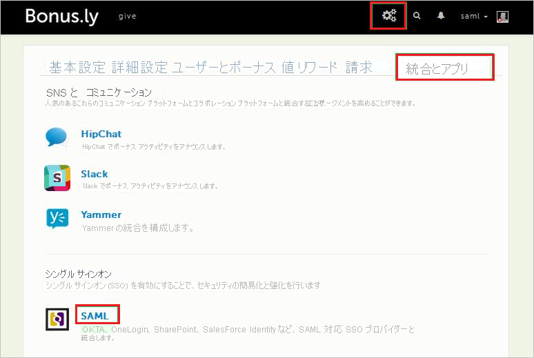
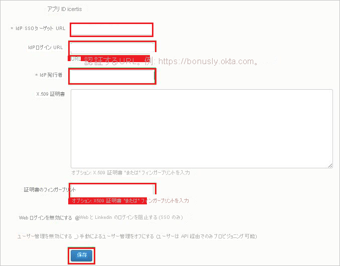
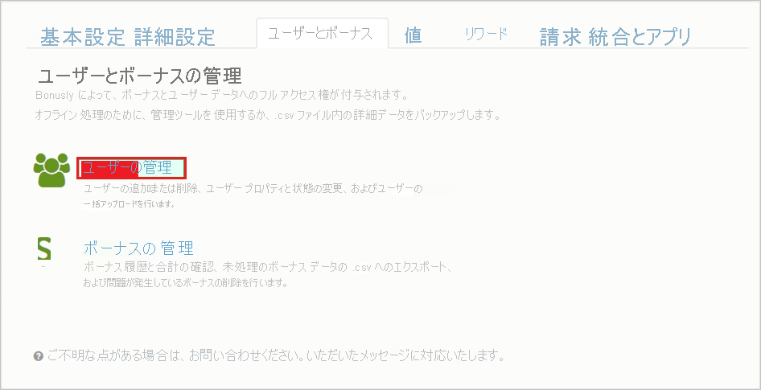

# チュートリアル: Azure Active Directory と Bonusly の統合

このチュートリアルでは、Bonusly と Azure Active Directory (Azure AD) を統合する方法について説明します。 Azure AD と Bonusly を統合すると、次のことができます。

* Bonusly にアクセスできるユーザーを Azure AD で制御します。
* ユーザーが自分の Azure AD アカウントを使用して Bonusly に自動的にサインインできるようにします。
* 1 つの中央サイト (Azure Portal) で自分のアカウントを管理します。

## 前提条件

Bonusly と Azure AD の統合を構成するには、次のものが必要です。

* Azure AD サブスクリプション。 Azure AD の環境がない場合は、[無料アカウント](https://azure.microsoft.com/free/)を取得できます。
* Bonusly でのシングル サインオンが有効なサブスクリプション。

## シナリオの説明

このチュートリアルでは、テスト環境で Azure AD のシングル サインオンを構成してテストします。

* Bonusly では、**IDP** によって開始される SSO がサポートされます。
* Bonusly では、[自動化されたユーザー プロビジョニング](bonusly-provisioning-tutorial.md)がサポートされます。

> [!NOTE]
> このアプリケーションの識別子は固定文字列値であるため、1 つのテナントで構成できるインスタンスは 1 つだけです。

## ギャラリーからの Bonusly の追加

Azure AD への Bonusly の統合を構成するには、ギャラリーから管理対象 SaaS アプリの一覧に Bonusly を追加する必要があります。

1. 職場または学校アカウントか、個人の Microsoft アカウントを使用して、Azure portal にサインインします。
1. 左のナビゲーション ウィンドウで **[Azure Active Directory]** サービスを選択します。
1. **[エンタープライズ アプリケーション]** に移動し、 **[すべてのアプリケーション]** を選択します。
1. 新しいアプリケーションを追加するには、 **[新しいアプリケーション]** を選択します。
1. **[ギャラリーから追加する]** セクションで、検索ボックスに「**Bonusly**」と入力します。
1. 結果のパネルから **[Bonusly]** を選択し、アプリを追加します。 お使いのテナントにアプリが追加されるのを数秒待機します。

## Bonusly の Azure AD SSO の構成とテスト

**B.Simon** というテスト ユーザーを使用して、Bonusly に対する Azure AD SSO を構成してテストします。 SSO が機能するためには、Azure AD ユーザーと Bonusly の関連ユーザーとの間にリンク関係を確立する必要があります。

Bonusly に対して Azure AD SSO を構成してテストするには、次の手順を行います。

1. **[Azure AD SSO の構成](#configure-azure-ad-sso)** - ユーザーがこの機能を使用できるようにします。
    1. **[Azure AD のテスト ユーザーの作成](#create-an-azure-ad-test-user)** - B.Simon で Azure AD のシングル サインオンをテストします。
    1. **[Azure AD テスト ユーザーの割り当て](#assign-the-azure-ad-test-user)** - B.Simon が Azure AD シングル サインオンを使用できるようにします。
1. **[Bonusly SSO の構成](#configure-bonusly-sso)** - アプリケーション側でシングル サインオン設定を構成します。
    1. **[Bonusly のテスト ユーザーの作成](#create-bonusly-test-user)** - Bonusly で B.Simon に対応するユーザーを作成し、Azure AD の Britta Simon にリンクさせます。
1. **[SSO のテスト](#test-sso)** - 構成が機能するかどうかを確認します。

## Azure AD SSO の構成

これらの手順に従って、Azure portal で Azure AD SSO を有効にします。

1. Azure portal の **Bonusly** アプリケーション統合ページで、 **[管理]** セクションを見つけて、 **[シングル サインオン]** を選択します。
1. **[シングル サインオン方式の選択]** ページで、 **[SAML]** を選択します。
1. **[SAML によるシングル サインオンのセットアップ]** ページで、 **[基本的な SAML 構成]** の鉛筆アイコンをクリックして設定を編集します。

   

4. **[基本的な SAML 構成]** セクションで、次の手順を実行します。

    **[応答 URL]** ボックスに、`https://Bonus.ly/saml/<TENANT_NAME>` のパターンを使用して URL を入力します

    > [!NOTE]
    > この値は実際のものではありません。 実際の応答 URL でこの値を更新します。 この値を取得するには、[Bonusly クライアント サポート チーム](https://bonus.ly/contact)に問い合わせてください。 Azure portal の **[基本的な SAML 構成]** セクションに示されているパターンを参照することもできます。

5. **[SAML 署名証明書]** セクションで **[編集]** ボタンをクリックして、 **[SAML 署名証明書]** ダイアログを開きます。

    

6. **[SAML 署名証明書]** セクションで **[THUMBPRINT]\(拇印\)** をコピーし、お使いのコンピューターに保存します。

    ![[Thumbprint]\(拇印\) の値をコピーする](common/copy-thumbprint.png)

7. **[Bonusly のセットアップ]** セクションで、要件に従って適切な URL をコピーします。

    

### Azure AD のテスト ユーザーの作成

このセクションでは、Azure portal 内で B.Simon というテスト ユーザーを作成します。

1. Azure portal の左側のウィンドウから、 **[Azure Active Directory]** 、 **[ユーザー]** 、 **[すべてのユーザー]** の順に選択します。
1. 画面の上部にある **[新しいユーザー]** を選択します。
1. **[ユーザー]** プロパティで、以下の手順を実行します。
   1. **[名前]** フィールドに「`B.Simon`」と入力します。  
   1. **[ユーザー名]** フィールドに「username@companydomain.extension」と入力します。 たとえば、「 `B.Simon@contoso.com` 」のように入力します。
   1. **[パスワードを表示]** チェック ボックスをオンにし、 **[パスワード]** ボックスに表示された値を書き留めます。
   1. **Create** をクリックしてください。

### Azure AD テスト ユーザーの割り当て

このセクションでは、B.Simon に Bonusly へのアクセスを許可して、このユーザーが Azure シングル サインオンを使用できるようにします。

1. Azure portal で **[エンタープライズ アプリケーション]** を選択し、 **[すべてのアプリケーション]** を選択します。
1. アプリケーションの一覧で **[Bonusly]** を選択します。
1. アプリの概要ページで、 **[管理]** セクションを見つけて、 **[ユーザーとグループ]** を選択します。
1. **[ユーザーの追加]** を選択し、 **[割り当ての追加]** ダイアログで **[ユーザーとグループ]** を選択します。
1. **[ユーザーとグループ]** ダイアログの [ユーザー] の一覧から **[B.Simon]** を選択し、画面の下部にある **[選択]** ボタンをクリックします。
1. ユーザーにロールが割り当てられることが想定される場合は、 **[ロールの選択]** ドロップダウンからそれを選択できます。 このアプリに対してロールが設定されていない場合は、[既定のアクセス] ロールが選択されていることを確認します。
1. **[割り当ての追加]** ダイアログで、 **[割り当て]** をクリックします。

## Bonusly SSO の構成

1. 別のブラウザー ウィンドウで、**Bonusly** テナントにサインインします。

1. 上部のツール バーの **[Settings]\(設定\)** をクリックし、 **[Integrations and apps]\(統合とアプリ\)** を選択します。

    
1. **[Single Sign-On]** の **[SAML]** を選択します。

1. **[SAML]** ダイアログ ページで、次の手順を実行します。

    

    a. **[IdP SSO target URL]\(IdP SSO ターゲット URL\)** ボックスに、Azure portal からコピーした **[ログイン URL]** の値を貼り付けます。

    b. **[IdP Login URL]\(IdP ログイン URL\)** ボックスに、Azure portal からコピーした **[ログイン URL]** の値を貼り付けます。

    c. **[IdP Issuer]\(IdP 発行者\)** ボックスに、Azure portal からコピーした **[Azure AD 識別子]** の値を貼り付けます。
    
    d. Azure Portal からコピーした **拇印** の値を、 **[Cert Fingerprint]\(証明書の指紋\)** ボックスに貼り付けます。
    
    e. **[保存]** をクリックします。

### Bonusly のテスト ユーザーの作成

Azure AD ユーザーが Bonusly にサインインできるようにするには、そのユーザーを Bonusly にプロビジョニングする必要があります。 Bonusly の場合、プロビジョニングは手動で行います。

> [!NOTE]
> 他の Bonusly ユーザー アカウント作成ツールや、Bonusly から提供されている API を使用して、Azure AD ユーザー アカウントをプロビジョニングできます。 

**ユーザー プロビジョニングを構成するには、次の手順に従います。**

1. Web ブラウザー ウィンドウで、Bonusly テナントにサインインします。

1. **[設定]** をクリックします。

    ![[設定]](./media/bonus-tutorial/users.png "設定")

1. **[Users and bonuses]** タブをクリックします。

    ![[Users and bonuses]\(ユーザーとボーナス\)](./media/bonus-tutorial/manage-user.png "[Users and bonuses]")

1. **[Manage Users]** をクリックします。

    

1. **[ユーザーの追加]** をクリックします。

    ![スクリーンショットは、[Add User]\(ユーザーの追加\) を選択できる [Manage Users]\(ユーザーの管理\) を示しています。](./media/bonus-tutorial/add-tab.png "ユーザーの追加")

1. **[Add User]** ダイアログで、次の手順を実行します。

    ![スクリーンショットは、この情報を入力できる [Add User]\(ユーザーの追加\) ダイアログ ボックスを示しています。](./media/bonus-tutorial/select-user.png "ユーザーの追加")  

    a. **[First name]\(名\)** ボックスに、ユーザーの名前を入力します (この例では **Britta**)。

    b. **[Last name]\(姓\)** ボックスに、ユーザーの姓を入力します (この例では **Simon**)。

    c. **[メール]** ボックスに、ユーザーのメール (`brittasimon@contoso.com` など) を入力します。

    d. **[保存]** をクリックします。

    > [!NOTE]
    > アカウントがアクティブになる前に、Azure AD アカウント所有者に、アカウント確認用のリンクを含む電子メールが送信されます。

> [!NOTE]
>Bonusly では、自動ユーザー プロビジョニングもサポートされます。自動ユーザー プロビジョニングの構成方法について詳しくは、[こちら](./bonusly-provisioning-tutorial.md)をご覧ください。

## SSO のテスト

このセクションでは、次のオプションを使用して Azure AD のシングル サインオン構成をテストします。

* Azure portal で [このアプリケーションをテストします] をクリックすると、SSO を設定した Bonusly に自動的にサインインされます。

* Microsoft マイ アプリを使用することができます。 マイ アプリで [Bonusly] タイルをクリックすると、SSO を設定した Bonusly に自動的にサインインします。 マイ アプリの詳細については、[マイ アプリの概要](https://support.microsoft.com/account-billing/sign-in-and-start-apps-from-the-my-apps-portal-2f3b1bae-0e5a-4a86-a33e-876fbd2a4510)に関するページを参照してください。

## 次のステップ

Bonusly を構成したら、組織の機密データを流出と侵入からリアルタイムで保護するセッション制御を適用できます。 セッション制御は、条件付きアクセスを拡張したものです。 [Microsoft Defender for Cloud Apps でセッション制御を適用する方法をご覧ください](/cloud-app-security/proxy-deployment-aad)。
