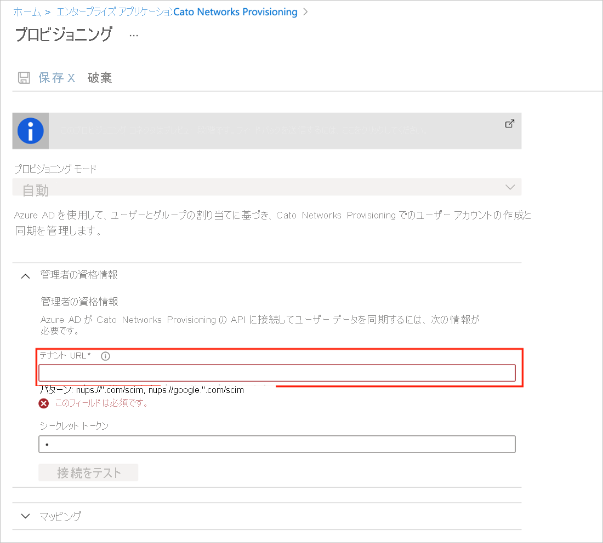
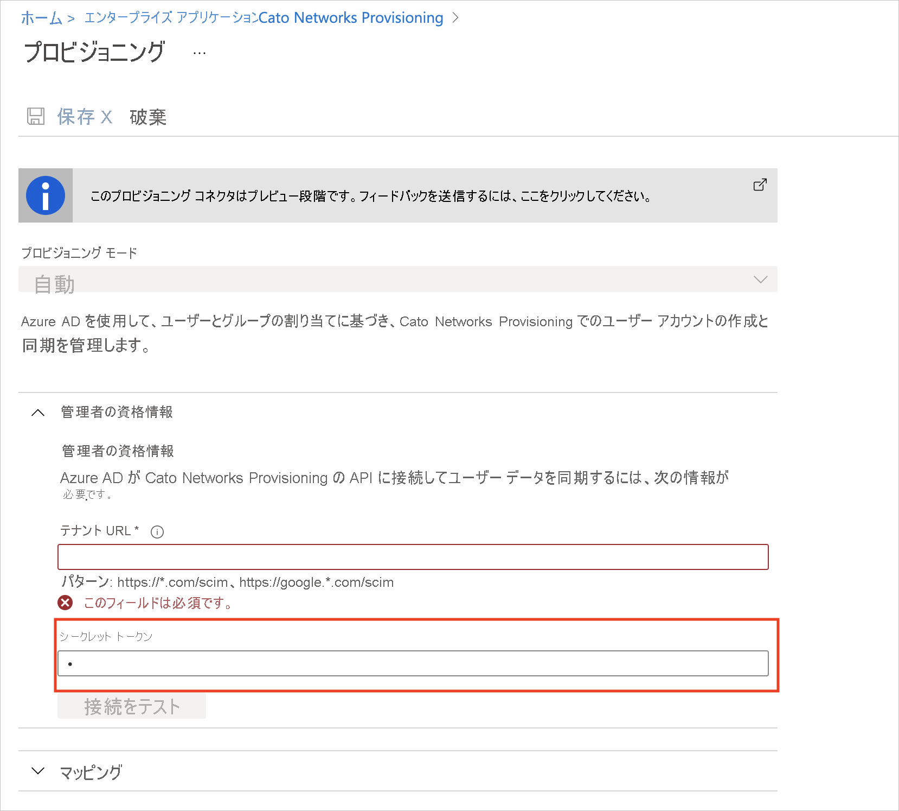

# チュートリアル: Cato Networks を構成し、自動ユーザー プロビジョニングに対応させる

このチュートリアルでは、自動ユーザー プロビジョニングを構成するために Cato Networks と Azure Active Directory (Azure AD) の両方で行う必要がある手順について説明します。 構成すると、Azure AD による Azure AD プロビジョニング サービスを使用した [Cato Networks](https://www.catonetworks.com/) へのユーザーとグループのプロビジョニングとプロビジョニング解除が自動的に行われます。 このサービスが実行する内容、しくみ、よく寄せられる質問の重要な詳細については、「[Azure Active Directory による SaaS アプリへのユーザー プロビジョニングとプロビジョニング解除の自動化](../app-provisioning/user-provisioning.md)」を参照してください。 

## サポートされる機能
> [!div class="checklist"]
> * Cato Networks でユーザーを作成する
> * アクセスが不要になった場合に Cato Networks のユーザーを削除する
> * Azure AD と Cato Networks の間でのユーザー属性の同期を維持する
> * Cato Networks でグループとグループ メンバーシップをプロビジョニングする

## 前提条件

このチュートリアルで説明するシナリオでは、次の前提条件目があることを前提としています。

* [Azure AD テナント](../develop/quickstart-create-new-tenant.md) 
* プロビジョニングを構成するための[アクセス許可](../roles/permissions-reference.md)を持つ Azure AD のユーザー アカウント (アプリケーション管理者、クラウド アプリケーション管理者、アプリケーション所有者、グローバル管理者など)。 
* [Cato Networks](https://www.catonetworks.com/) のアカウント。
* 管理者アクセス許可を持つ Cato Networks の管理者アカウント。
* 十分な数のユーザーのライセンス。

## 手順 1. プロビジョニングのデプロイを計画する
1. [プロビジョニング サービスのしくみ](../app-provisioning/user-provisioning.md)を確認します。
1. [プロビジョニングの対象](../app-provisioning/define-conditional-rules-for-provisioning-user-accounts.md)となるユーザーを決定します。
1. [Azure AD と Cato Networks の間でマップする](../app-provisioning/customize-application-attributes.md)データを決定します。 

## 手順 2. Azure AD によるプロビジョニングをサポートするように Cato Networks を構成する

1. [Cato Management Application](https://cc2.catonetworks.com) でアカウントにログインします。
1. ナビゲーション メニューで、 **[Configuration]\(構成\) > [Global Settings]\(グローバル設定\)** を選択して、 **[VPN Settings]\(VPN 設定\)** セクションを展開します。
        ![[VPN Settings]\(VPN 設定\) セクション](media/cato-networks-provisioning-tutorial/vpn-settings.png)
1. **[SCIM Provisioning]\(SCIM プロビジョニング\)** セクションを展開し、 **[Enable SCIM Provisioning]\(SCIM プロビジョニングを有効にする\)** をクリックして、SCIM プロビジョニングを有効にします。
         
1. Cato Management Application から Azure portal の SCIM アプリに、ベース URL とベアラー トークンをコピーします。
   1. Cato Management Application で ( **[SCIM Provisioning]\(SCIM プロビジョニング\)** セクションから)、ベース URL をコピーします。
   1. Azure portal の Cato Networks SCIM アプリの **[プロビジョニング]** タブで、 **[テナント URL]** フィールドにベース URL を貼り付けます。
        
   1. Cato Management Application で ( **[SCIM Provisioning]\(SCIM プロビジョニング\)** セクションから)、 **[Generate Token]\(トークンの生成\)** をクリックしてベアラー トークンをコピーします。
   1. Azure portal の Cato Networks SCIM アプリで、 **[シークレット トークン]** フィールドにベアラー トークンを貼り付けます。
        
1. Cato Management Application で ( **[SCIM Provisioning]\(SCIM プロビジョニング\)** セクションから)、 **[Save]\(保存\)** をクリックします。 Cato アカウントと Azure AD の間の SCIM プロビジョニングが構成されます。 
        
1. Azure SCIM アプリと Cato クラウドの間の接続をテストします。 Azure portal の Cato Networks SCIM アプリの **[プロビジョニング]** タブで、 **[テスト接続]** をクリックします。         
                                  

## 手順 3. Azure AD アプリケーション ギャラリーから Cato Networks を追加する

Azure AD アプリケーション ギャラリーから Cato Networks を追加して、Cato Networks へのプロビジョニングの管理を開始します。 ギャラリーからアプリケーションを追加する方法の詳細については、[こちら](../manage-apps/add-application-portal.md)を参照してください。 

## 手順 4. プロビジョニングの対象となるユーザーを定義する 

Azure AD プロビジョニング サービスを使用すると、アプリケーションへの割り当て、ユーザーまたはグループの属性に基づいてプロビジョニングされるユーザーのスコープを設定できます。 割り当てに基づいてアプリにプロビジョニングされるユーザーのスコープを設定する場合、以下の[手順](../manage-apps/assign-user-or-group-access-portal.md)を使用して、ユーザーとグループをアプリケーションに割り当てることができます。 ユーザーまたはグループの属性のみに基づいてプロビジョニングされるユーザーのスコープを設定する場合、[こちら](../app-provisioning/define-conditional-rules-for-provisioning-user-accounts.md)で説明されているスコープ フィルターを使用できます。 

* Cato Networks にユーザーとグループを割り当てるときは、**既定のアクセス** 以外のロールを選択する必要があります。 既定のアクセス ロールを持つユーザーは、プロビジョニングから除外され、プロビジョニング ログで実質的に資格がないとマークされます。 アプリケーションで使用できる唯一のロールが既定のアクセス ロールである場合は、[アプリケーション マニフェストを更新](../develop/howto-add-app-roles-in-azure-ad-apps.md)してロールを追加することができます。 

* 小さいところから始めましょう。 全員にロールアウトする前に、少数のユーザーとグループでテストします。 プロビジョニングのスコープが割り当てられているユーザーとグループに設定されているときは、1 つまたは 2 つのユーザーまたはグループをアプリに割り当てることで、プロビジョニングを制御できます。 スコープがすべてのユーザーとグループに設定されている場合は、[属性ベースのスコープ フィルター](../app-provisioning/define-conditional-rules-for-provisioning-user-accounts.md)を指定できます。 

## 手順 5. Cato Networks への自動ユーザー プロビジョニングを構成する 

このセクションでは、Azure AD でのユーザーやグループの割り当てに基づいて Cato Networks のユーザーやグループを作成、更新、無効化するように Azure AD プロビジョニング サービスを構成する手順について説明します。

### Azure AD で Cato Networks の自動ユーザー プロビジョニングを構成するには:

1. [Azure portal](https://portal.azure.com) にサインインします。 **[エンタープライズ アプリケーション]** を選択し、 **[すべてのアプリケーション]** を選択します。

    ![[エンタープライズ アプリケーション] ブレード](common/enterprise-applications.png)

1. アプリケーションの一覧で **[Cato Networks]** を選択します。

    

1. **[プロビジョニング]** タブを選択します。

    ![[プロビジョニング] タブ](common/provisioning.png)

1. **[プロビジョニング モード]** を **[自動]** に設定します。

    ![[プロビジョニング] タブの [自動]](common/provisioning-automatic.png)

1. **[管理者資格情報]** セクションで、Cato Networks のテナント URL とシークレット トークンを入力します。 **[テスト接続]** をクリックして、Azure AD から Cato Networks に接続できることを確認します。 接続できない場合は、使用している Cato Networks アカウントに管理者アクセス許可があることを確実にしてから、もう一度試します。

    

1. **[通知用メール]** フィールドに、プロビジョニングのエラー通知を受け取るユーザーまたはグループの電子メール アドレスを入力して、 **[エラーが発生したときにメール通知を送信します]** チェック ボックスをオンにします。

    

1. **[保存]** を選択します。

1. **[マッピング]** セクションの **[Synchronize Azure Active Directory Users to Cato Networks]\(Azure Active Directory ユーザーを Cato Networks に同期する\)** を選択します。

1. **[属性マッピング]** セクションで、Azure AD から Cato Networks に同期されるユーザー属性を確認します。 **[照合]** プロパティとして選択されている属性は、更新処理で Cato Networks のユーザー アカウントとの照合に使用されます。 [一致する対象の属性](../app-provisioning/customize-application-attributes.md)を変更する場合は、その属性に基づいたユーザーのフィルター処理が確実に Cato Networks API でサポートされているようにする必要があります。 **[保存]** ボタンをクリックして変更をコミットします。

   |属性|Type|フィルター処理のサポート|
   |---|---|---|
   |userName|String|&check;
   |emails[type eq "work"].value|String|
   |active|Boolean|
   |externalId|String|
   |name.givenName|String|
   |name.familyName|String|
   |phoneNumbers[type eq "work"].value|String|

1. **[マッピング]** セクションの **[Synchronize Azure Active Directory Groups to Cato Networks]\(Azure Active Directory グループを Cato Networks に同期する\)** を選択します。

1. **[属性マッピング]** セクションで、Azure AD から Cato Networks に同期されるグループ属性を確認します。 **[照合]** プロパティとして選択されている属性は、更新処理で Cato Networks のグループとの照合に使用されます。 **[保存]** ボタンをクリックして変更をコミットします。

      |属性|Type|フィルター処理のサポート|
      |---|---|---|
      |displayName|String|&check;
      |externalId|String|
      |members|リファレンス|

1. スコープ フィルターを構成するには、[スコープ フィルターのチュートリアル](../app-provisioning/define-conditional-rules-for-provisioning-user-accounts.md)の次の手順を参照してください。

1. Cato Networks に対して Azure AD プロビジョニング サービスを有効にするには、 **[設定]** セクションで **[プロビジョニングの状態]** を **[オン]** に変更します。

    ![プロビジョニングの状態を [オン] に切り替える](common/provisioning-toggle-on.png)

1. **[設定]** セクションの **[スコープ]** で目的の値を選択して、Cato Networks にプロビジョニングするユーザー、グループ、またはこれらの両方を定義します。

    

1. プロビジョニングの準備ができたら、 **[保存]** をクリックします。

    

この操作により、 **[設定]** セクションの **[スコープ]** で定義したすべてのユーザーとグループの初期同期サイクルが開始されます。 初期サイクルは次からのサイクルよりも完了に時間がかかります。後続のサイクルは、Azure AD のプロビジョニング サービスが実行されている限り約 40 分ごとに実行されます。 

## 手順 6. デプロイを監視する
プロビジョニングを構成したら、次のリソースを使用してデプロイを監視します。

* [プロビジョニング ログ](../reports-monitoring/concept-provisioning-logs.md)を使用して、正常にプロビジョニングされたユーザーと失敗したユーザーを特定します。
* [進行状況バー](../app-provisioning/application-provisioning-when-will-provisioning-finish-specific-user.md)を確認して、プロビジョニング サイクルの状態と完了までの時間を確認します
* プロビジョニング構成が異常な状態になったと考えられる場合、アプリケーションは検疫されます。 検疫状態の詳細については、[こちら](../app-provisioning/application-provisioning-quarantine-status.md)を参照してください。  

## その他のリソース

* [エンタープライズ アプリのユーザー アカウント プロビジョニングの管理](../app-provisioning/configure-automatic-user-provisioning-portal.md)
* [Azure Active Directory のアプリケーション アクセスとシングル サインオンとは](../manage-apps/what-is-single-sign-on.md)

## 次のステップ

* [プロビジョニング アクティビティのログの確認方法およびレポートの取得方法](../app-provisioning/check-status-user-account-provisioning.md)