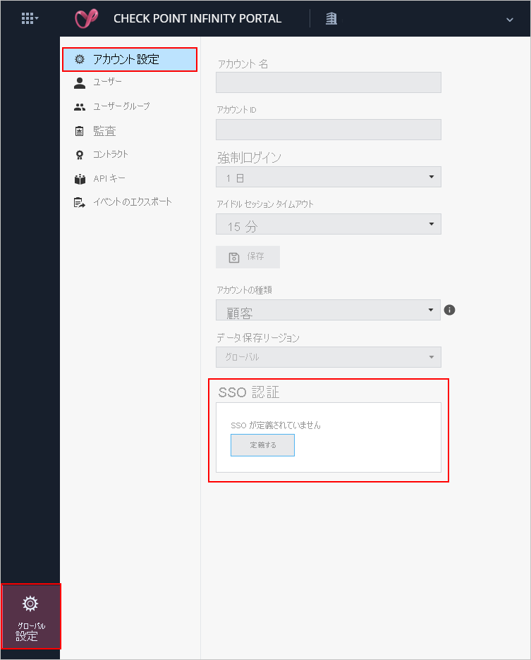
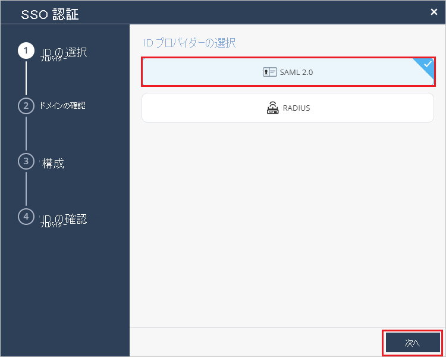
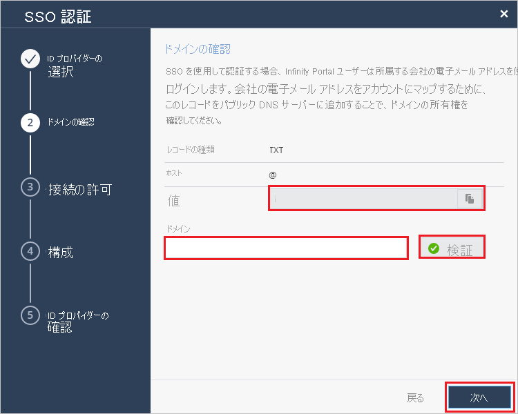
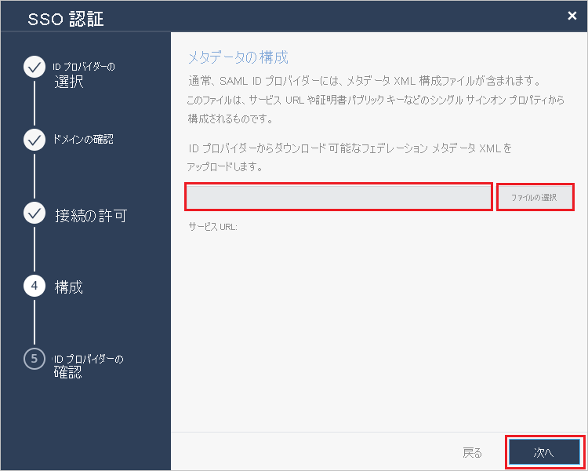
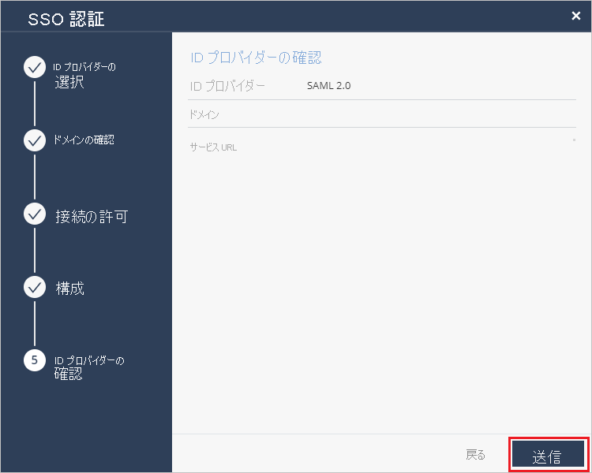

# チュートリアル: Azure AD SSO と Check Point Infinity Portal の統合

このチュートリアルでは、Check Point Infinity Portal と Azure Active Directory (Azure AD) を統合する方法について説明します。 Azure AD と Check Point Infinity Portal を統合すると、次のことができます。

* Check Point Infinity Portal にアクセスできるユーザーを Azure AD で制御できます。
* ユーザーが自分の Azure AD アカウントを使用して Check Point Infinity Portal に自動的にサインインできるように設定できます。
* 1 つの中央サイト (Azure Portal) で自分のアカウントを管理します。

## 前提条件

開始するには、次が必要です。

* Azure AD サブスクリプション。 サブスクリプションがない場合は、[無料アカウント](https://azure.microsoft.com/free/)を取得できます。
* Check Point Infinity Portal でのシングル サインオン (SSO) が有効なサブスクリプション。

## シナリオの説明

このチュートリアルでは、テスト環境で Azure AD の SSO を構成してテストします。

* Check Point Infinity Portal では、**SP** によって開始される SSO がサポートされます。

* Check Point Infinity Portal では、**Just In Time** ユーザー プロビジョニングがサポートされます。

> [!NOTE]
> このアプリケーションの識別子は固定文字列値であるため、1 つのテナントで構成できるインスタンスは 1 つだけです。

## ギャラリー から Check Point Infinity Portal を追加する

Azure AD への Check Point Infinity Portal の統合を構成するには、ギャラリーからマネージド SaaS アプリの一覧に Check Point Infinity Portal を追加する必要があります。

1. 職場または学校アカウントか、個人の Microsoft アカウントを使用して、Azure portal にサインインします。
1. 左のナビゲーション ウィンドウで **[Azure Active Directory]** サービスを選択します。
1. **[エンタープライズ アプリケーション]** に移動し、 **[すべてのアプリケーション]** を選択します。
1. 新しいアプリケーションを追加するには、 **[新しいアプリケーション]** を選択します。
1. **[ギャラリーから追加する]** セクションで、検索ボックスに「**Check Point Infinity Portal**」と入力します。
1. 結果のパネルから **[Check Point Infinity Portal]** を選択し、アプリを追加します。 お使いのテナントにアプリが追加されるのを数秒待機します。

## Check Point Infinity Portal の Azure AD SSO の構成とテスト

**B. Simon** というテスト ユーザーを使用して、Check Point Infinity Portal に対する Azure AD SSO を構成してテストします。 SSO を機能させるためには、Azure AD ユーザーと Check Point Infinity Portal の関連ユーザーとの間にリンク関係を確立する必要があります。

Check Point Infinity Portal に対して Azure AD SSO を構成してテストするには、次の手順を実行します。

1. **[Azure AD SSO の構成](#configure-azure-ad-sso)** - ユーザーがこの機能を使用できるようにします。
    1. **[Azure AD のテスト ユーザーの作成](#create-an-azure-ad-test-user)** - B.Simon で Azure AD のシングル サインオンをテストします。
    1. **[Azure AD テスト ユーザーの割り当て](#assign-the-azure-ad-test-user)** - B.Simon が Azure AD シングル サインオンを使用できるようにします。
1. **[Check Point Infinity Portal の SSO の構成](#configure-check-point-infinity-portal-sso)** - アプリケーション側でシングル サインオン設定を構成します。
    1. **[Check Point Infinity Portal のテスト ユーザーの作成](#create-check-point-infinity-portal-test-user)** - Check Point Infinity Portal で B.Simon に対応するユーザーを作成し、Azure AD の B.Simon にリンクさせます。
1. **[SSO のテスト](#test-sso)** - 構成が機能するかどうかを確認します。

## Azure AD SSO の構成

これらの手順に従って、Azure portal で Azure AD SSO を有効にします。

1. Azure portal の **Check Point Infinity Portal** アプリケーション統合ページで、 **[管理]** セクションを見つけて、 **[シングル サインオン]** を選択します。
1. **[シングル サインオン方式の選択]** ページで、 **[SAML]** を選択します。
1. **[SAML によるシングル サインオンのセットアップ]** ページで、 **[基本的な SAML 構成]** の鉛筆アイコンをクリックして設定を編集します。

   

1. **[基本的な SAML 構成]** セクションで、次の手順を実行します。

    a. **[識別子]** ボックスに、次のいずれかの値を入力します。

    | 環境 | 識別子 |
    |-------------| -------------|
    | ヨーロッパまたは米国 | `cloudinfra.checkpoint.com` |
    | AP | `ap.portal.checkpoint.com` |
    |

    b. **[応答 URL]** ボックスに、次のいずれかの URL を入力します。

    | 環境 | [応答 URL] |
    |-------------| -------------|
    | ヨーロッパまたは米国 | `https://portal.checkpoint.com/` |
    | AP | `https://ap.portal.checkpoint.com/` |
    |

    c. **[サインオン URL]** ボックスに、次のいずれかの URL を入力します。

    | 環境 | サインオン URL |
    |-------------| -------------|
    | ヨーロッパまたは米国 | `https://portal.checkpoint.com/` |
    | AP | `https://ap.portal.checkpoint.com/` |
    |

1. **[SAML でシングル サインオンをセットアップします]** ページの **[SAML 署名証明書]** セクションで、 **[フェデレーション メタデータ XML]** を探して **[ダウンロード]** を選択し、証明書をダウンロードして、お使いのコンピューターに保存します。

    

1. **[Check Point Infinity Portal のセットアップ]** セクションで、要件に基づいて適切な URL をコピーします。

    

ユーザーを認証するには、2 つの方法があります。

* Azure AD ポータルで Check Point Infinity Portal アプリケーションのユーザー ロールを構成する

* Check Point Infinity Portal で Check Point Infinity Portal アプリケーションのユーザー ロールを構成する

#### Azure AD ポータルで Check Point Infinity Portal アプリケーションのユーザー ロールを構成する

このセクションでは、Azure portal で管理者と読み取り専用ロールを作成します。

1. Azure portal の左ペインから **[App Registration]\(アプリの登録\)** を選択し、 **[すべてのアプリケーション]** を選択してから、 **[Check Point Infinity Portal]** アプリケーションを選択します。

2. 左ペインから **[App roles]\(アプリ ロール\)** を選択し、 **[Create app role]\(アプリ ロールの作成\)** をクリックし、次の手順に従います。

   a. **[表示名]** フィールドに、「**管理者**」と入力します。

   b. **[Allowed member types]\(許可されるメンバーの種類\)** で、 **[ユーザー/グループ]** を選択します。
   
   c. **[値]** フィールドに、「**admin**」と入力します。

   d. **[説明]** フィールドに、「**Check Point Infinity Portal の管理者ロール**」と入力します。

   e. **[enable this app role]\(このアプリ ロールを有効にする\)** オプションが選択されていることを確認します。

   f. **[Apply]** をクリックします。

   g. **[Create app role] \(アプリ ロールの作成\)** をもう一度クリックします。

   h. **[Display name]\(表示名\)** フィールドに、「**読み取り専用**」と入力します。

   i. **[Allowed member types]\(許可されるメンバーの種類\)** で、 **[ユーザー/グループ]** を選択します。

   j. **[値]** フィールドに「**readonly**」と入力します。

   k. **[説明]** フィールドに、「**Check Point Infinity Portal の管理者ロール**」と入力します。

   l. **[enable this app role]\(このアプリ ロールを有効にする\)** オプションが選択されていることを確認します。

   m. **[Apply]** をクリックします。

#### Check Point Infinity Portal で Check Point Infinity Portal アプリケーションのユーザー ロールを構成する

この構成は、Azure AD で Check Point Infinity Portal アプリケーションに割り当てられたグループにのみ適用されます。

このセクションでは、関連する Azure AD グループのグローバルとサービス ロールを保持する 1 つ以上のユーザー グループを作成します。

* Check Point Infinity Portal ユーザー グループで使用するために割り当てられたグループの ID をコピーします。
* ユーザー グループの構成については、[Infinity Portal 管理ガイド](https://sc1.checkpoint.com/documents/Infinity_Portal/WebAdminGuides/EN/Infinity-Portal-Admin-Guide/Default.htm#cshid=user_groups)のページを参照してください。

### Azure AD のテスト ユーザーの作成

このセクションでは、Azure portal 内で B.Simon というテスト ユーザーを作成します。

1. Azure portal の左側のウィンドウから、 **[Azure Active Directory]** 、 **[ユーザー]** 、 **[すべてのユーザー]** の順に選択します。
1. 画面の上部にある **[新しいユーザー]** を選択します。
1. **[ユーザー]** プロパティで、以下の手順を実行します。
   1. **[名前]** フィールドに「`B.Simon`」と入力します。  
   1. **[ユーザー名]** フィールドに「username@companydomain.extension」と入力します。 たとえば、「 `B.Simon@contoso.com` 」のように入力します。
   1. **[パスワードを表示]** チェック ボックスをオンにし、 **[パスワード]** ボックスに表示された値を書き留めます。
   1. **Create** をクリックしてください。

### Azure AD テスト ユーザーの割り当て

このセクションでは、B.Simon に Check Point Infinity Portal へのアクセスを許可することで、このユーザーが Azure シングル サインオンを使用できるようにします。

1. Azure portal で **[エンタープライズ アプリケーション]** を選択し、 **[すべてのアプリケーション]** を選択します。
1. アプリケーションの一覧で **[Check Point Infinity Portal]** を選択します。
1. アプリの概要ページで、 **[管理]** セクションを見つけて、 **[ユーザーとグループ]** を選択します。
1. **[ユーザーの追加]** を選択し、 **[割り当ての追加]** ダイアログで **[ユーザーとグループ]** を選択します。
1. **[ユーザーとグループ]** ダイアログの [ユーザー] の一覧から **[B.Simon]** を選択し、画面の下部にある **[選択]** ボタンをクリックします。
1. ユーザーにロールが割り当てられることが想定される場合は、 **[ロールの選択]** ドロップダウンからそれを選択できます。 このアプリに対してロールが設定されていない場合は、[既定のアクセス] ロールが選択されていることを確認します。
1. **[割り当ての追加]** ダイアログで、 **[割り当て]** をクリックします。

## Check Point Infinity Portal の SSO の構成

1. Check Point Infinity Portal 企業サイトに管理者としてログインします。

2. **[グローバル設定]**  >  **[アカウント設定]** に移動し、SSO 認証の下の **[定義]** をクリックします。
   
    

3. **[SSO 認証]** ページで、 **[SAML 2.0]** を **[ID プロバイダー]** として選択肢、 **[次へ]** をクリックします。
     
   

4. **[ドメインの検証]** セクションで、次の手順を実行します。

   
 
   a。 DNS レコードの値をコピーし、会社の DNS サーバーの DNS 値に追加します。 

   b. **[ドメイン]** フィールドに会社の名称を入力し、 **[検証]** をクリックします。 

   c. Check Point により DNS レコード更新が承認されるまで待ちます。最大 30 分かかる場合があります。 

   d. ドメイン名が検証された後、 **[次へ]** をクリックします。 

5. **[接続の許可]** セクションで、次の手順を実行します。
    
    

   a。 **[Entity ID]\(エンティティ ID\)** の値をコピーし、Azure portal の [基本的な SAML 構成] セクションの **[Azure AD Identifier]\(Azure AD 識別子\)** ボックスに貼り付けます。

   b. **[Reply URL]\(応答 URL\)** の値をコピーし、Azure portal の [基本的な SAML 構成] セクションの **[応答 URL]** テキスト ボックスにこの値を貼り付けます。

   c. **[サインオン URL]** の値をコピーして、Azure portal の [基本的な SAML 構成] セクションの **[サインオン URL]** テキスト ボックスに貼り付けます。
      
   d. **[NEXT]\(次へ\)** をクリックします。

6. **[構成]** セクションで **[ファイルの選択]** をクリックし、Azure portal からダウンロードした **フェデレーション メタデータ XML** ファイルをアップロードし、 **[次へ]** をクリックします。 

    

7. **[ID プロバイダーの確認]** ページで、構成をレビューし、 **[追加]** をクリックします。
     
    

### Check Point Infinity Portal テスト ユーザーの作成

このセクションでは、Britta Simon というユーザーを Check Point Infinity Portal に作成します。 Check Point Infinity Portal では、Just-In-Time ユーザー プロビジョニングがサポートされています。この設定は既定で有効になっています。 このセクションでは、ユーザー側で必要な操作はありません。 Check Point Infinity Portal にユーザーがまだ存在していない場合は、認証後に新規に作成されます。

## SSO のテスト 

このセクションでは、次のオプションを使用して Azure AD のシングル サインオン構成をテストします。 

* Azure portal で **[このアプリケーションをテストします]** をクリックします。 これにより、ログイン フローを開始できる Check Point Infinity Portal のサインオン URL にリダイレクトされます。 

* Check Point Infinity Portal のサインオン URL に直接移動し、そこからログイン フローを開始します。

* Microsoft マイ アプリを使用することができます。 マイ アプリで [Check Point Infinity Portal] タイルをクリックすると、Check Point Infinity Portal のサインオン URL にリダイレクトされます。 マイ アプリの詳細については、[マイ アプリの概要](https://support.microsoft.com/account-billing/sign-in-and-start-apps-from-the-my-apps-portal-2f3b1bae-0e5a-4a86-a33e-876fbd2a4510)に関するページを参照してください。

## 次のステップ

Check Point Infinity Portal を構成したら、組織の機密データを流出と侵入からリアルタイムで保護するセッション制御を適用できます。 セッション制御は、条件付きアクセスを拡張したものです。 [Microsoft Defender for Cloud Apps でセッション制御を適用する方法をご覧ください](/cloud-app-security/proxy-deployment-any-app)。
